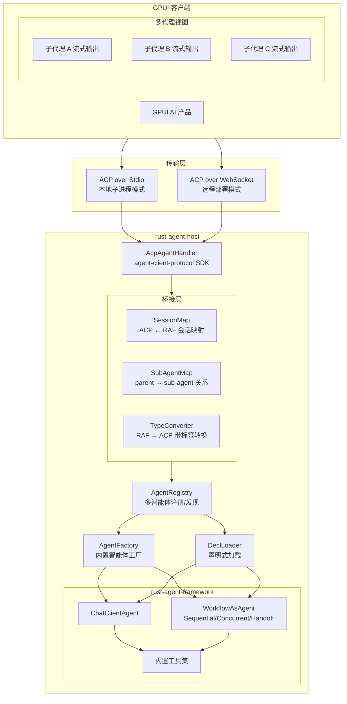

# Rust Agent Host — 基于官方 ACP 协议的智能体主机

## 架构概述

使用官方 `agent-client-protocol` v0.14 Rust SDK，在 RAF 智能体框架之上构建符合 ACP 标准的 Agent 服务端，通过 JSON-RPC 2.0 向客户端提供多智能体服务，包括**子代理发现、独立流式执行和多代理实时输出视图**。

### 系统架构




### 多智能体编排：ACP 对接模型

RAF 的核心多智能体能力通过 `get_subagent(agent_id)` 暴露。ACP 对接设计为三层模型：

```
┌─────────────────────────────────────────────────────────────────┐
│                     多智能体 ACP 对接三层模型                      │
├─────────────────────────────────────────────────────────────────┤
│                                                                 │
│  第 1 层：发现 (Discovery)                                       │
│  ┌─────────────────────────────────────────────────────────┐   │
│  │ _raf/agent_list   → 获取所有顶级智能体列表                  │   │
│  │ _raf/subagent_list → 获取指定智能体的子代理列表             │   │
│  │                         (递归: get_subagent 遍历)         │   │
│  └─────────────────────────────────────────────────────────┘   │
│                           ↓                                     │
│  第 2 层：独立执行 (Direct Sessions)                             │
│  ┌─────────────────────────────────────────────────────────┐   │
│  │ session/new {_meta: {raf.agent_id}} → 创建子代理专属会话   │   │
│  │ session/prompt → 子代理独立流式输出                        │   │
│  │ 客户端可同时持有多个子代理会话，每个独立产生 session/update │   │
│  └─────────────────────────────────────────────────────────┘   │
│                           ↓                                     │
│  第 3 层：编排执行 (Orchestrated Sessions with Tagged Streaming) │
│  ┌─────────────────────────────────────────────────────────┐   │
│  │ session/new → 创建编排智能体会话                          │   │
│  │ session/prompt → 父代理执行，子代理自动调用               │   │
│  │ session/update {_meta: {raf.agent_id, raf.status}}       │   │
│  │ 每个更新标记来源子代理，客户端可分组展示                   │   │
│  └─────────────────────────────────────────────────────────┘   │
│                                                                 │
└─────────────────────────────────────────────────────────────────┘
```

### 完整协议交互流程（含多智能体）

```mermaid
sequenceDiagram
    participant C as GPUI Client
    participant H as rust-agent-host
    participant P as Parent Agent (Workflow)
    participant SA as Sub-Agent A
    participant SB as Sub-Agent B

    Note over C,H: 0. 初始化 & 发现
    C->>H: initialize
    H-->>C: capabilities + _meta.raf.agents[]
    C->>H: _raf/subagent_list(parent_id)
    H-->>C: [sub-agent A, sub-agent B] 元数据

    Note over C,H,SA,SB: 模式 A: 独立子代理会话（并行流式 + 多视图）
    
    C->>H: session/new {_meta: {"raf.agent_id":"sub-A"}}
    H-->>C: sessionId_sessA
    C->>H: session/new {_meta: {"raf.agent_id":"sub-B"}}
    H-->>C: sessionId_sessB

    par 两个子代理并行执行
        C->>H: session/prompt(sessA, "分析代码性能")
        H->>SA: IAgent::run()
        loop 流式输出 A
            SA-->>H: Content::Text / ToolCallStart / ToolCalled
            H-->>C: session/update(sessA, content, _meta:{agent_id:"sub-A"})
        end
        H-->>C: session/prompt response(sessA, end_turn)
    and
        C->>H: session/prompt(sessB, "生成测试用例")
        H->>SB: IAgent::run()
        loop 流式输出 B
            SB-->>H: Content::Text / ToolCallStart / ToolCalled
            H-->>C: session/update(sessB, content, _meta:{agent_id:"sub-B"})
        end
        H-->>C: session/prompt response(sessB, end_turn)
    end

    Note over C: 客户端同时渲染两个子代理视图<br/>每个视图独立展示各自流式输出

    Note over C,H,P: 模式 B: 编排会话（带标签流式 + 父代理统一管理）
    
    C->>H: session/new {_meta: {"raf.agent_id":"parent"}}
    H-->>C: sessionId_parent
    C->>H: session/prompt(parent, "写一个 Web 服务器")

    loop 编排执行
        P->>SA: 子代理 A 执行
        SA-->>P: 流式输出
        H-->>C: session/update(parent, content, _meta:{agent_id:"sub-A", status:"executing"})

        P->>SB: 子代理 B 执行（接收 A 的输出）
        SB-->>P: 流式输出
        H-->>C: session/update(parent, content, _meta:{agent_id:"sub-B", status:"executing"})
    end

    H-->>C: session/prompt response(parent, end_turn)
```


## 协议扩展方法设计

### 子代理发现与执行


| ACP 方法               | 方向  | 参数                     | 返回                                                     | 说明                                                                                             |
| -------------------- | --- | ---------------------- | ------------------------------------------------------ | ---------------------------------------------------------------------------------------------- |
| `_raf/subagent_list` | C→A | `{ agent_id: string }` | `{ agents: SubAgentInfo[] }`                           | 递归获取子代理列表（`get_subagent` 遍历），每个条目含 `id`、`name`、`description`、`capability_tags`、`has_subagents` |
| `_raf/subagent_tree` | C→A | `{ agent_id: string }` | `{ tree: SubAgentNode }`                               | 获取完整子代理树结构，客户端可据此构建导航视图                                                                        |
| `_raf/workflow_info` | C→A | `{ agent_id: string }` | `{ workflow_type, triage_agent, specialist_agents[] }` | 获取编排智能体（Handoff/Sequential/Concurrent）的内部结构                                                    |


### 子代理会话创建

在标准 `session/new` 中通过 `_meta` 指定目标智能体：

```json
{
  "jsonrpc": "2.0",
  "id": 1,
  "method": "session/new",
  "params": {
    "_meta": {
      "raf.agent_id": "code-expert"
    }
  }
}
```

如果 `_meta.raf.agent_id` 不存在，使用默认智能体（`initialize` 响应中标记的 `default`）；如果指定的 `agent_id` 不存在，返回 `-32602 Invalid params` 错误。

### 带标签流式更新

每个 `session/update` 通知的 `_meta` 字段携带来源信息：

```json
{
  "jsonrpc": "2.0",
  "method": "session/update",
  "params": {
    "sessionId": "sess_parent_001",
    "update": {
      "sessionUpdate": "agent_message_chunk",
      "content": { "type": "text", "text": "这是子代理 code-expert 的输出..." }
    },
    "_meta": {
      "raf.agent_id": "code-expert",
      "raf.agent_type": "ChatClientAgent",
      "raf.status": "executing"
    }
  }
}
```

`_meta` 字段说明：


| 字段               | 类型     | 说明                                         |
| ---------------- | ------ | ------------------------------------------ |
| `raf.agent_id`   | string | 产生此内容的智能体 ID                               |
| `raf.agent_type` | string | 智能体类型（`ChatClientAgent`、`WorkflowAgent` 等） |
| `raf.status`     | string | 子代理状态：`executing`、`completed`、`error`      |


### 子代理状态变化通知

当编排流程中某个子代理开始或完成时，发送状态变化通知：

```json
{
  "jsonrpc": "2.0",
  "method": "session/update",
  "params": {
    "sessionId": "sess_parent_001",
    "update": {
      "sessionUpdate": "agent_message_chunk",
      "content": {
        "type": "text",
        "text": ""
      }
    },
    "_meta": {
      "raf.agent_id": "code-expert",
      "raf.status": "completed",
      "raf.elapsed_ms": 3420
    }
  }
}
```

## 流式输出映射（RAF → ACP SessionUpdate，含子代理标签）


| RAF Content/Event                       | ACP SessionUpdate                                 | `_meta.raf` 标签                               | 说明       |
| --------------------------------------- | ------------------------------------------------- | -------------------------------------------- | -------- |
| `Content::Text`                         | `SessionUpdate::AgentMessageChunk`                | `{agent_id, status:"executing"}`             | 文本增量     |
| `Content::Reasoning`                    | `SessionUpdate::AgentMessageChunk`（role=thought）  | `{agent_id}`                                 | 思维链      |
| `Content::ToolCallStart`                | `SessionUpdate::ToolCall`（status=pending）         | `{agent_id}`                                 | 工具调用开始   |
| `Content::ToolCallArgs` / `ToolCalling` | `SessionUpdate::ToolCallUpdate`                   | `{agent_id}`                                 | 参数流      |
| `Content::ToolCalled`                   | `SessionUpdate::ToolCallUpdate`（status=completed） | `{agent_id}`                                 | 工具完成     |
| `Content::Usage`                        | `SessionUpdate::UsageUpdate`                      | `{agent_id}`                                 | Token 用量 |
| 子代理启动                                   | `SessionUpdate::AgentMessageChunk`（空内容）           | `{agent_id, status:"executing"}`             | 状态信号     |
| 子代理完成                                   | `SessionUpdate::AgentMessageChunk`（空内容）           | `{agent_id, status:"completed", elapsed_ms}` | 状态信号     |
| 子代理错误                                   | `SessionUpdate::AgentMessageChunk`（错误内容）          | `{agent_id, status:"error"}`                 | 错误信号     |


## 客户端如何实现多代理视图

### 工作流程

1. **连接后**：调用 `initialize` → 获取 `_meta.raf.agents[]`
2. **探索**：对感兴趣的智能体调用 `_raf/subagent_list` → 递归获取子代理树
3. **选择模式**：
  - **直接模式**：对每个想要观看的子代理调用 `session/new {_meta: {raf.agent_id}}` → 各自 `session/prompt` → 独立消费 `session/update`
  - **编排模式**：对编排智能体调用 `session/new {_meta: {raf.agent_id:"workflow"}}` → `session/prompt` → 按 `_meta.raf.agent_id` 分组展示

### GPUI 客户端渲染示意

```
┌─────────────────────────────────────────────────────┐
│  RAF Agent Host — 多智能体视图                        │
├───────────────┬─────────────────┬───────────────────┤
│  父代理视角    │  代码专家 (executing) │  测试专家 (pending)  │
│               │                 │                   │
│  任务：构建    │  def fibonacci  │  [等待代码专家      │
│  Web 服务器   │  (n):          │   完成...]         │
│               │      if n <= 1 │                   │
│  → 分配任务   │      return n  │                   │
│  → 代码专家   │  ...           │                   │
│  → 测试专家   │                 │                   │
│               │  [流式输出中...] │                   │
└───────────────┴─────────────────┴───────────────────┘
```

## 核心代码骨架

### AgentRegistry 扩展（子代理发现）

```rust
impl AgentRegistry {
    /// 递归获取子代理列表
    pub fn get_subagent_list(&self, agent_id: &AgentId) -> Vec<SubAgentInfo> {
        let agent = match self.get(agent_id) {
            Some(a) => a,
            None => return vec![],
        };

        let mut result = vec![];
        // 遍历 RAF 的 get_subagent 树
        // 对每个子代理递归调用
        self.collect_subagents(agent, &mut result, 0);
        result
    }

    fn collect_subagents(
        &self, agent: &Arc<dyn IAgent>, out: &mut Vec<SubAgentInfo>, depth: usize
    ) {
        let meta = agent.metadata();
        // 从 registry 中获取该 agent 的子代理
        // 对于 WorkflowAsAgent，内部 agents 通过 get_subagent 暴露
        let mut has_sub = false;
        // 遍历 registry 中所有智能体，检查是否是当前 agent 的子代理
        for (id, candidate) in self.agents.iter() {
            if agent.get_subagent(id).is_some() {
                has_sub = true;
                out.push(SubAgentInfo {
                    id: id.to_string(),
                    name: candidate.metadata().key.clone(),
                    agent_type: candidate.metadata().agent_type.clone(),
                    description: candidate.metadata().description.clone(),
                    capability_tags: candidate.metadata().capability_tags.clone(),
                    depth,
                    has_subagents: false, // 后续递归填充
                });
                self.collect_subagents(candidate, out, depth + 1);
            }
        }
    }
}
```

### Tagged Streaming（带标签流式输出）

```rust
/// 将 RAF 流转换为带子代理标签的 ACP 通知流
async fn stream_raf_to_acp_tagged(
    mut raf_stream: BoxStream<'static, Result<AgentResponseResult>>,
    session_id: SessionId,
    conn: ConnectionTo<Client>,
    // 跟踪当前活跃的子代理
    sub_agent_tracker: Arc<SubAgentStatusTracker>,
) -> (StopReason, Option<Usage>) {
    let mut stop_reason = StopReason::EndTurn;
    let mut final_usage: Option<Usage> = None;

    while let Some(chunk_result) = raf_stream.next().await {
        let chunk = match chunk_result {
            Ok(c) => c,
            Err(e) => {
                let meta = serde_json::json!({
                    "raf.agent_id": "host",
                    "raf.status": "error"
                });
                conn.send_notification(SessionNotification {
                    session_id: session_id.clone(),
                    update: SessionUpdate::AgentMessageChunk(/* error content */),
                    meta: Some(meta),
                }).ok();
                continue;
            }
        };

        // 从 chunk 的 metadata 中提取来源 agent_id
        // RAF 的 ResponseMetadata 包含 agent_id 字段
        let source_agent_id = extract_agent_id_from_chunk(&chunk);

        // 检测子代理状态变化
        if let Some(ref aid) = source_agent_id {
            sub_agent_tracker.ensure_active(aid);
        }

        for content in chunk.contents {
            let update = raf_content_to_acp_update(content);
            let meta = build_raf_meta(source_agent_id.as_deref(), "executing");
            
            conn.send_notification(SessionNotification {
                session_id: session_id.clone(),
                update,
                meta: Some(meta),
            }).ok();
        }

        // 检查 finish_reason
        if let Some(ref fr) = chunk.finish_reason {
            match fr {
                FinishReason::Stop => stop_reason = StopReason::EndTurn,
                FinishReason::AwaitingApproval => {
                    // 需要暂停并向客户端请求权限
                    // 发送 session/request_permission
                }
                _ => {}
            }
        }
    }

    // 标记所有子代理为 completed
    sub_agent_tracker.mark_all_completed();

    (stop_reason, final_usage)
}

/// 从 chunk 中提取来源 agent_id
fn extract_agent_id_from_chunk(chunk: &AgentResponseResult) -> Option<String> {
    chunk.contents.first()
        .and_then(|c| c.meta().agent_id.as_ref())
        .map(|id| id.to_string())
}

/// 构建 _meta 标签
fn build_raf_meta(agent_id: Option<&str>, status: &str) -> Option<serde_json::Value> {
    let mut meta = serde_json::Map::new();
    if let Some(id) = agent_id {
        meta.insert("raf.agent_id".into(), id.into());
    }
    meta.insert("raf.status".into(), status.into());
    Some(serde_json::Value::Object(meta))
}
```

### handle_prompt 多智能体增强版

```rust
async fn handle_prompt(
    req: PromptRequest, responder: Responder<PromptResponse>,
    conn: ConnectionTo<Client>, registry: &AgentRegistry, bridge: &SessionBridge,
) -> Result<()> {
    let session_id = req.session_id.clone();
    let session_ctx = bridge.get_session_context(&session_id)?;

    // 1. 解析目标智能体
    let target_agent_id = req._meta.as_ref()
        .and_then(|m| m.get("raf.agent_id"))
        .and_then(|v| v.as_str())
        .unwrap_or(session_ctx.default_agent_id());

    let agent = registry.get(&AgentId::new(target_agent_id))
        .ok_or_else(|| AgentError::AgentNotFound(target_agent_id.to_string()))?;

    // 2. 获取或创建 RAF 会话
    let raf_session = bridge.get_or_create_raf_session(&session_id, &agent)?;

    // 3. 转换消息
    let messages = bridge.convert_prompt_to_messages(&req);

    // 4. 取消令牌
    let cancelled = Arc::new(AtomicBool::new(false));
    bridge.register_cancel_token(&session_id, cancelled.clone());

    let opts = AgentRunOptions::new().with_cancelled(cancelled);

    // 5. 调用 RAF 智能体
    let raf_stream = agent.run(messages, Some(raf_session), Some(opts)).await?;

    // 6. 子代理状态追踪器
    let tracker = SubAgentStatusTracker::new();
    
    // 如果是编排智能体，预注册所有子代理
    if let Some(sub_list) = registry.get_subagent_list(&AgentId::new(target_agent_id)) {
        for sub in &sub_list {
            tracker.register(&sub.id, &sub.agent_type);
        }
    }

    // 7. 后台任务：流式转换 + 通知
    tokio::spawn(async move {
        let (stop_reason, _usage) = stream_raf_to_acp_tagged(
            raf_stream,
            session_id.clone(),
            conn,
            Arc::new(tracker),
        ).await;

        // 8. 最终响应
        responder.respond(PromptResponse::new(stop_reason))
    });

    Ok(())
}
```

### SubAgentStatusTracker

```rust
/// 追踪所有子代理的运行状态，用于向客户端发送状态变化通知
struct SubAgentStatusTracker {
    agents: Mutex<HashMap<String, SubAgentState>>,
}

struct SubAgentState {
    agent_type: String,
    status: SubAgentStatus,
    started_at: Instant,
    completed_at: Option<Instant>,
}

#[derive(Clone, Copy, PartialEq)]
enum SubAgentStatus { Pending, Executing, Completed, Error }

impl SubAgentStatusTracker {
    fn register(&self, id: &str, agent_type: &str) { /* ... */ }
    fn ensure_active(&self, id: &str) { /* 标记为 Executing */ }
    fn mark_completed(&self, id: &str) { /* 标记为 Completed */ }
    fn mark_error(&self, id: &str) { /* 标记为 Error */ }
    fn mark_all_completed(&self) { /* 所有 running → completed */ }
    
    /// 生成状态快照，通过 session/update 发送
    fn build_status_meta(&self) -> serde_json::Value {
        // 包含所有子代理的当前状态
    }
}
```

## 关键设计决策


| 决策                                         | 理由                                                                |
| ------------------------------------------ | ----------------------------------------------------------------- |
| 使用官方 `agent-client-protocol` 而非自建协议        | ACP 是开源标准，Rust SDK 已被 Zed 编辑器验证；自建协议会导致互操作性问题                     |
| Stdio 作为主传输，WebSocket 作为备选                 | 符合 ACP v1 标准——本地代理通过子进程 stdio 通信；WebSocket 用于远程部署                 |
| 通过 `_meta` 标签承载子代理来源信息                     | ACP 官方扩展机制，所有类型皆有 `_meta` 字段，无需自定义协议；客户端按 `agent_id` 分组即可实现多视图    |
| 子代理通过独立 session 直接调用                       | ACP 的 session 模型天然支持多会话并行；客户端可创建 N 个 session 同时运行 N 个子代理，每个独立流式输出 |
| `_raf/subagent_list` 递归遍历 `get_subagent()` | 利用 RAF 原生的子代理发现机制，支持任意深度的代理树                                      |
| `SubAgentStatusTracker` 发送状态变化信号           | 编排模式下子代理可能不产生任何文本内容（如中间代理），通过状态信号让客户端知道每个子代理的执行进度                 |
| `AgentRegistry` 独立于 ACP 连接                 | 多个客户端连接共享同一组智能体实例                                                 |
| figment 分层配置                               | 支持 TOML 文件 + 环境变量 + CLI 参数，生产部署友好                                 |
| 内置三个预设智能体 + 声明式加载                          | 兼顾开箱即用和灵活扩展                                                       |


## 默认智能体工厂


| 智能体               | ID         | 系统指令                        | 注册工具                                                                                               | 上下文提供器                   |
| ----------------- | ---------- | --------------------------- | -------------------------------------------------------------------------------------------------- | ------------------------ |
| **CodingAgent**   | `coding`   | 代码专家：生成、审查、调试、重构。用中文回复。     | `ReadFile, WriteFile, EditFile, ListFiles, SearchFile, FindFiles, RunCommand, WebSearch, WebFetch` | InMemoryHistory          |
| **GeneralAgent**  | `general`  | 通用 AI 助手：回答问题、写作、分析。用中文回复。  | `WebSearch, WebFetch`                                                                              | InMemoryHistory + Skills |
| **AnalysisAgent** | `analysis` | 数据分析师：深度研究、多源对比、趋势分析。用中文回复。 | `WebSearch, WebFetch, ReadFile`                                                                    | InMemoryHistory + RAG    |


此外，支持通过声明式文件加载任意 `WorkflowAsAgent`（Sequential、Concurrent、Handoff），其子代理自动通过 `get_subagent` 暴露。

---

## 输入目录结构

```
crates/host/
├── Cargo.toml
├── src/
│   ├── main.rs                        # 二进制入口：解析 CLI、初始化、启动
│   ├── lib.rs                         # 库入口：模块声明 + 公共 API re-export
│   ├── config.rs                      # 配置定义 + figment 加载（HostConfig）
│   ├── handler/
│   │   ├── mod.rs
│   │   ├── acp_agent.rs               # ACP Agent 处理器：Agent.builder() 组装
│   │   ├── prompt.rs                  # handle_prompt 核心逻辑（含 tagged streaming）
│   │   └── ext.rs                     # _raf/* 扩展方法路由
│   ├── registry/
│   │   ├── mod.rs
│   │   └── agent_registry.rs          # 多智能体注册中心 + subagent_list 遍历
│   ├── bridge/
│   │   ├── mod.rs
│   │   ├── types.rs                   # RAF 类型 → ACP SessionUpdate + _meta 标签
│   │   ├── session.rs                 # ACP SessionId ↭ RAF AgentSession 桥接
│   │   └── tracker.rs                 # SubAgentStatusTracker 子代理状态追踪
│   ├── agents/
│   │   ├── mod.rs
│   │   ├── factory.rs                 # 内置智能体构造器
│   │   └── loader.rs                  # AgentDecl 文件加载器
│   └── transport/
│       ├── mod.rs
│       ├── stdio.rs                   # Stdio 模式入口
│       └── websocket.rs              # WebSocket (axum) 模式入口
└── agents/                            # 默认智能体声明文件
    ├── coding.json
    ├── general.json
    └── analysis.json
```

## 实施步骤

### 步骤 1：创建 Crate 骨架

- 创建 `crates/host/Cargo.toml`，包名 `rust-agent-host`
- 依赖：`agent-client-protocol = "0.14"`、`agent-client-protocol-cookbook = "0.14"`、`axum`（features: ws）、`figment`、`clap`（features: derive）、`serde`、`serde_json`、`tokio`（features: full）、`tracing`、`tracing-subscriber`
- RAF 依赖：`rust-agent-core`、`rust-agent-framework`、`rust-agent-client`、`rust-agent-decl`、`rust-agent-workflow`
- 创建 `lib.rs` 模块声明和 `main.rs` 入口
- 在 workspace `Cargo.toml` 添加 `"crates/host"` 到 members，添加 workspace dependency

### 步骤 2：实现配置管理

- 定义 `HostConfig`、`TransportMode`、`ProviderConfig`、`AgentPresetsConfig` 结构体
- 定义 `CliArgs`（clap derive）用于 CLI 参数
- 实现 `load_config()`：figment 分层合并（TOML → RAF_ 环境变量 → CLI）

### 步骤 3：实现 AgentRegistry（含子代理发现）

- 存储 `HashMap<AgentId, Arc<dyn IAgent>>` + `HashMap<AgentId, AgentMetadata>`
- 方法：`register()`、`get()`、`list_all()`、`get_default()`
- `get_subagent_list(agent_id)`：递归遍历 `agent.get_subagent(id)`，返回 `Vec<SubAgentInfo>`
- `get_subagent_tree(agent_id)`：构建完整子代理树
- `build_agent_list_meta()`：生成 `_meta` 中的智能体列表

### 步骤 4：实现 RAF ↔ ACP 会话桥接层

- `SessionBridge`：管理 `HashMap<SessionId, SessionContext>`
- `SessionContext`：包含 `Arc<AgentSession>`、`target_agent_id`、`cancel_token`
- `raf_to_acp_update()`：`Content` → `SessionUpdate` 转换
- `build_raf_meta()`：为每条 `session/update` 生成 `_meta` 标签

### 步骤 5：实现 SubAgentStatusTracker

- 追踪所有子代理的 `Pending → Executing → Completed/Error` 状态
- 状态变化时生成 `session/update` 通知（`_meta.raf.status` 变化）
- `mark_all_completed()`：编排结束时批量完成

### 步骤 6：实现 AcpAgentHandler

- `RafAgentHost` 结构体，持有 `AgentRegistry` + `SessionBridge`
- `run()` 方法使用 `Agent.builder()` 组装 7 个处理器
- `handle_prompt`：解析目标智能体 → 调用 RAF → tagged streaming
- 扩展方法路由：`_raf/agent_list`、`_raf/subagent_list`、`_raf/subagent_tree`、`_raf/workflow_info`

### 步骤 7：实现智能体工厂 + 声明式加载器

- `AgentFactory`：三个内置智能体（CodingAgent、GeneralAgent、AnalysisAgent）
- `DeclLoader`：扫描 `agents_dir` → `AgentDecl` → `IAgent`
- 支持 `WorkflowAsAgent` 类型（子代理自动注册到 Registry 的 subagent 映射）

### 步骤 8：实现传输层

- `transport/stdio.rs`：`Stdio` transport + `RafAgentHost.run()`
- `transport/websocket.rs`：axum WebSocket → 字节流适配为 `ConnectTo`

### 步骤 9：串联 main.rs

- 初始化 tracing → 加载配置 → 创建 Registry → 注册内置 + 声明式智能体 → 创建 SessionBridge → 启动传输 → 优雅关闭

## 启动方式

```bash
# Stdio 模式（标准 ACP，客户端作为子进程 spawn）
cargo run -p rust-agent-host -- --mode stdio

# WebSocket 模式（远程部署/独立服务）
cargo run -p rust-agent-host -- --mode ws --bind 127.0.0.1:9876

# 指定配置文件和智能体目录
cargo run -p rust-agent-host -- --mode ws --config host.toml --agents-dir ./agents
```

