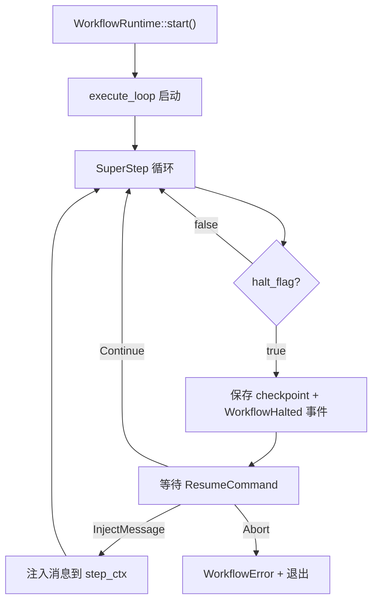

# crates/workflow 通用流程引擎化迭代计划

## 当前架构回顾

```
WorkflowEngine (SuperStep 模型)
  ├── execute_loop: while step_ctx.has_messages() { ... }
  │   ├── 对每个活跃节点 spawn 异步任务
  │   ├── 收集 HandlerResult 消息
  │   ├── 通过 edge_runners 路由消息到下游节点
  │   └── 每步 checkpoint
  ├── IWorkflowContext: 节点 ↔ 引擎通信接口
  │   ├── send_message / yield_output / emit_event
  │   ├── request_halt / read_state / write_state
  │   └── current_node_id / session
  ├── IExecutor: 节点抽象
  └── CheckpointManager: 增量/全量状态持久化
```

## Phase 1: 流程变量系统 + 错误处理基础（P0 必备）

### 1.1 流程变量系统 `FlowVariables`

**现状缺陷**: 节点间数据传递依赖 `Arc<dyn Any>` + `downcast`，类型不安全，业务编排极不友好。BPMN 引擎的标准模式是 name → value 映射。

**设计**: 在 `IWorkflowContext` 中新增流程变量 API，底层复用已有的 `state_map` 存储。

```rust
// engine/work_context.rs - IWorkflowContext 新增方法
pub trait IWorkflowContext: Send + Sync {
    // --- 已有方法 ---
    // --- 新增: 流程变量 ---

    /// 设置流程变量（类型安全，自动序列化）
    async fn set_variable<T: Serialize + Send + Sync>(
        &self, name: &str, value: &T
    ) -> Result<()>;

    /// 获取流程变量（自动反序列化）
    async fn get_variable<T: DeserializeOwned + Send + Sync>(
        &self, name: &str
    ) -> Result<Option<T>>;

    /// 获取所有流程变量名
    async fn variable_names(&self) -> Vec<String>;
}
```

`EngineWorkContext` 中的实现委托给 `state_map`，已有 `read_state`/`write_state` 作为基础。

**影响文件**:

- `engine/work_context.rs` — trait 新增 3 个方法
- `engine/engine.rs` — `EngineWorkContext` 实现
- `executor/function_executor.rs` — 可选便捷方法从 ctx 取变量

### 1.2 pending_messages 持久化

**现状缺陷**: `engine.rs:406` 每次 checkpoint commit 传 `Vec::new()`，引擎在 SuperStep 中间崩溃后下步消息全部丢失。

**修改**: 在 checkpoint commit 前将 `next_step_ctx` 中的消息序列化。

```rust
// engine/engine.rs - checkpoint commit 部分
let serializable_pending: Vec<SerializableMessageEnvelope> =
    next_step_ctx.serialize_pending();  // StepContext 新增方法

cp.commit(
    &session_id, &graph_fingerprint,
    scope_state, edge_states,
    serializable_pending,  // 不再传 Vec::new()
    current_step_number,
).await;
```

`StepContext` 需要新增 `serialize_pending()` 方法，将 `VecDeque<MessageEnvelope>` 转为 `Vec<SerializableMessageEnvelope>`。`CheckpointManager::load_full_state` 也需要能还原 pending_messages 并重建 StepContext。

**影响文件**:

- `engine/engine.rs` — 传递实际 pending_messages
- `engine/step_context.rs` — 新增 serialization 方法
- `checkpoint/manager.rs` — load_full_state 返回 pending_messages

### 1.3 节点重试策略 `NodeRetryPolicy`

**现状缺陷**: `engine.rs:288` 节点失败立即 `return Err(e)` 终止整个工作流。

**设计**: 在 Node 上挂载重试配置，引擎在节点执行外围 wrap retry loop。

```rust
// engine/retry.rs (新文件)
pub struct RetryOptions {
    pub max_retries: u32,           // 默认 0（不重试）
    pub backoff: RetryBackoff,      // Fixed / Exponential / None
    pub retry_on: RetryCondition,   // AllErrors / SpecificErrors
    pub on_exhausted: ExhaustedAction, // Fail / Skip / FallbackNode(id)
}

// graph/node.rs - Node 新增字段
pub struct Node {
    pub id: String,
    pub executor: Arc<dyn IExecutor>,
    pub is_output: bool,
    pub retry: Option<RetryOptions>,     // 新增
    pub timeout: Option<Duration>,      // 为 Phase 3 预留
}
```

引擎在 `for env in messages` 循环外围包装重试逻辑，失败时递增计数器、执行 backoff 等待、达到上限后按 `on_exhausted` 策略处理。

**影响文件**:

- `engine/retry.rs` — 新增 RetryOptions + retry loop 工具函数
- `graph/node.rs` — Node 新增 retry 字段
- `builder/workflow_builder.rs` — Builder 新增 `with_retry()` 方法
- `engine/engine.rs` — 节点执行包装 retry loop

---

## Phase 2: 人工任务闭环（P0 必备）

### 2.1 暂停后的 Resume 机制

**现状缺陷**: `request_halt()` 设置 `AtomicBool` 标志后引擎 break，但 `WorkflowEngine::run()` 返回的流已经建立，无法从外部重新注入消息后继续。

**设计: 引入 `WorkflowRuntime` — 有状态的执行句柄**

```rust
// engine/runtime.rs (新文件)
pub struct WorkflowRuntime {
    engine: Arc<WorkflowEngine>,
    state_tx: mpsc::UnboundedSender<ResumeCommand>,
    event_rx: Mutex<Option<BoxStream<'static, WorkflowEvent>>>,
    output_rx: Mutex<Option<BoxStream<'static, Result<WorkflowOutput>>>>,
}

pub enum ResumeCommand {
    /// 向指定节点注入消息并恢复执行
    InjectMessage { target_node_id: String, message: Arc<dyn Any + Send + Sync> },
    /// 继续执行（不注入新消息）
    Continue,
    /// 中止执行
    Abort,
}

impl WorkflowRuntime {
    /// 启动工作流，返回可交互的 runtime 句柄
    pub async fn start(graph: WorkflowGraph, initial: Arc<dyn Any + Send + Sync>, session: Option<Arc<dyn ISession>>)
        -> Result<Self>;

    /// 获取事件流（可观测性）
    pub fn events(&mut self) -> BoxStream<'static, WorkflowEvent>;

    /// 获取输出流
    pub fn outputs(&mut self) -> BoxStream<'static, Result<WorkflowOutput>>;

    /// 向暂停的工作流注入外部消息（如审批结果）
    pub fn resume(&self, cmd: ResumeCommand);

    /// 等待工作流完成（阻塞式）
    pub async fn wait(self) -> Result<()>;
}
```

**引擎改造**: `execute_loop` 不再在 `while step_ctx.has_messages()` 中 break 后直接结束。当 `halt_flag` 为真时：

1. 保存完整 checkpoint（含 pending_messages）
2. 发送 `WorkflowEvent::WorkflowHalted` 事件
3. 进入等待循环，监听 `state_tx` channel
4. 收到 `ResumeCommand::InjectMessage` 后将消息注入 `step_ctx`，重置 `halt_flag`，继续循环
5. 收到 `ResumeCommand::Abort` 时发送 `WorkflowError` 并退出




### 2.2 HumanTaskExecutor

```rust
// executor/human_task.rs (新文件)
pub struct HumanTaskExecutor {
    id: String,
    /// 在 request_halt 前构造并 yield 给外部的审批表单描述
    task_builder: Arc<dyn Fn(&dyn IWorkflowContext) -> serde_json::Value + Send + Sync>,
}
```

HumanTaskExecutor 在 `handle()` 中：

1. 读取上游数据，构造审批表单 JSON
2. 通过 `ctx.yield_output(form_json)` 输出给外部
3. 调用 `ctx.request_halt()` 暂停引擎
4. 外部展示表单，用户审批后通过 `WorkflowRuntime::resume(InjectMessage { ... })` 注入审批结果
5. 引擎继续执行，HumanTaskExecutor 收到注入消息，返回审批结果

**影响文件**:

- `engine/runtime.rs` — 新增 WorkflowRuntime
- `engine/engine.rs` — execute_loop 支持暂停→恢复
- `engine/event.rs` — 新增 WorkflowHalted / WorkflowResumed 事件
- `executor/human_task.rs` — 新增 HumanTaskExecutor
- `engine/work_context.rs` — IWorkflowContext 新增 `request_halt_with_payload`

---

## Phase 3: 弹性与并发控制（P1 重要）

### 3.1 工作流整体超时

```rust
// engine/config.rs (新文件)
pub struct WorkflowConfig {
    /// 整体超时，过期后强制终止
    pub global_timeout: Option<Duration>,
    /// 单节点超时
    pub default_node_timeout: Option<Duration>,
    /// SuperStep 最大并发数
    pub max_parallel_nodes: usize,  // 默认 0 = 不限制
}
```

引擎在 `execute_loop` 入口 `tokio::time::timeout(global_timeout, ...)` 包装整个循环。超时时发送 `WorkflowEvent::WorkflowTimeout` 并退出。

### 3.2 节点超时

在 node 的 `tokio::spawn` 外包装 `tokio::time::timeout(node.timeout, ...)`。超时时取消任务，按重试策略处理。

### 3.3 SuperStep 并发限流

当前 SuperStep 中所有活跃节点的 `tokio::spawn` 是无限制的。引入 `tokio::sync::Semaphore`：

```rust
let semaphore = Arc::new(Semaphore::new(config.max_parallel_nodes));
// ...
let permit = semaphore.clone().acquire_owned().await?;
tokio::spawn(async move {
    let _permit = permit;
    // ... 节点执行逻辑 ...
});
```

### 3.4 定时器事件（Timer Event）

在 `IExecutor` 生命周期钩子中新增 `on_timer`，引擎在 SuperStep 循环中检查是否有节点注册了定时器并到期：

```rust
// engine/event.rs - 新增
WorkflowEvent::TimerFired { node_id: String, timer_name: String },
```

定时器通过 `IWorkflowContext::schedule_timer(name, delay)` 注册，引擎维护 `Vec<(node_id, Instant)>` 并在每轮 SuperStep 前检查。

**影响文件**:

- `engine/config.rs` — 新增 WorkflowConfig
- `engine/engine.rs` — 集成 timeout/semaphore/timer
- `engine/event.rs` — 新增超时/定时器相关事件
- `graph/node.rs` — Node 新增 timeout 字段

---

## Phase 4: 高级编排模式（P2 进阶）

### 4.1 补偿事务 / Saga

```rust
// executor/compensation.rs (新文件)
pub trait ICompensable: IExecutor {
    /// 返回补偿函数 — 当后续节点失败时调用
    fn compensate(
        &self,
        ctx: &dyn IWorkflowContext,
    ) -> Option<Pin<Box<dyn Future<Output = Result<()>> + Send>>>;
}
```

引擎在节点失败时沿已执行链反向调用每个节点的 `compensate()`。需要引擎维护一个 `execution_log: Vec<node_id>` 已执行节点列表。

### 4.2 DSL 表达式条件

在 `IEdgeCondition` 基础上提供开箱即用的实现：

```rust
// graph/condition.rs (新文件)
pub struct ExpressionCondition {
    expression: String,  // e.g. "amount > 1000 && approved == true"
}

impl IEdgeCondition for ExpressionCondition {
    async fn evaluate(&self, envelope: &MessageEnvelope) -> Result<bool> {
        // 从 envelope 的 ctx/state 中取变量，执行表达式求值
    }
}

pub struct VariableCondition {
    variable: String,
    operator: ComparisonOp,
    value: serde_json::Value,
}
```

### 4.3 动态子流程

允许节点在运行时创建子 WorkflowGraph 并作为子引擎执行：

```rust
// executor/subflow.rs (新文件)
pub struct SubFlowExecutor {
    id: String,
    /// 动态构造子图的工厂
    flow_factory: Arc<dyn Fn(&dyn IWorkflowContext) -> WorkflowGraph + Send + Sync>,
}
```

**影响文件**:

- `executor/compensation.rs` — 新增补偿 trait
- `graph/condition.rs` — 新增内置条件实现
- `executor/subflow.rs` — 新增动态子流程
- `engine/engine.rs` — execution_log + compensate 调用

---

## 实施优先级总览

```
Phase 1 (P0): ████████████  工作量 ~3天
  ├── 流程变量系统          60min
  ├── pending_messages 持久化  45min
  └── 节点重试策略          90min

Phase 2 (P0): ████████████  工作量 ~4天
  ├── execute_loop 暂停→恢复  120min
  ├── WorkflowRuntime        90min
  ├── WorkflowHalted/Resumed 事件  30min
  └── HumanTaskExecutor      60min

Phase 3 (P1): ██████████    工作量 ~3天
  ├── WorkflowConfig + 整体超时  60min
  ├── 节点超时               45min
  ├── Semaphore 并发限流      30min
  └── 定时器事件             90min

Phase 4 (P2): ████████      工作量 ~5天
  ├── Saga/补偿事务          150min
  ├── DSL 表达式条件          90min
  ├── 动态子流程             120min
  └── Node 字段扩展 (retry/timeout) 已覆盖
```

### 新增文件清单


| 文件                         | Phase | 说明                                                                  |
| -------------------------- | ----- | ------------------------------------------------------------------- |
| `engine/config.rs`         | P3    | WorkflowConfig (global_timeout, max_parallel, default_node_timeout) |
| `engine/runtime.rs`        | P2    | WorkflowRuntime (start/resume/wait/events/outputs)                  |
| `engine/retry.rs`          | P1    | RetryOptions + retry_loop helper                                     |
| `executor/human_task.rs`   | P2    | HumanTaskExecutor (halt + 外部输入恢复)                                   |
| `graph/condition.rs`       | P4    | ExpressionCondition / VariableCondition 内置实现                        |
| `executor/compensation.rs` | P4    | ICompensable trait + CompensableExecutor wrapper                    |
| `executor/subflow.rs`      | P4    | SubFlowExecutor 动态子图执行                                              |


### 修改文件清单


| 文件                            | Phase    | 变更                                                                    |
| ----------------------------- | -------- | --------------------------------------------------------------------- |
| `engine/engine.rs`            | P1/P2/P3 | pending_messages 持久化、retry loop、halt→resume、timeout、semaphore         |
| `engine/work_context.rs`      | P1/P2    | 新增 set_variable/get_variable/variable_names、request_halt_with_payload |
| `engine/step_context.rs`      | P1       | serialize_pending / from_pending                                      |
| `engine/event.rs`             | P2/P3    | 新增 WorkflowHalted/Resumed/Timeout/TimerFired                          |
| `graph/node.rs`               | P1/P3    | 新增 retry + timeout 字段                                                 |
| `builder/workflow_builder.rs` | P1       | 新增 with_retry / with_timeout                                          |
| `checkpoint/manager.rs`       | P1       | load_full_state 返回 pending_messages                                   |
| `executor/base.rs`            | P4       | IExecutor 新增 compensate 默认实现                                          |
| `executor/agent_executor.rs`  | P1       | 从 ctx 读取流程变量的便捷方法                                                     |


### 关键架构决策

1. **流程变量 vs 类型化消息**: 不替代 `Arc<dyn Any>` 路由机制，流程变量作为补充——节点可以从变量池中读取共享上下文，同时通过消息路由接收上游输出。两者互补。
2. **WorkflowRuntime vs WorkflowEngine**: Engine 保持无状态（可多次 run），Runtime 是单次执行的有状态句柄，管理生命周期（start/resume/wait）。Engine 的 `run()` 仍然可用作简单场景。
3. **补偿 vs 重试**: 重试是"再试一次同样的操作"，补偿是"执行逆操作回滚"。两者独立：节点可以同时配置重试策略和补偿函数，引擎先重试，耗尽重试后执行补偿。
4. **定时器实现**: 不走独立的 async task，而是在 SuperStep 循环中 poll 定时器状态。这样 checkpoint 可以包含定时器状态，崩溃恢复后定时器不会丢失。

