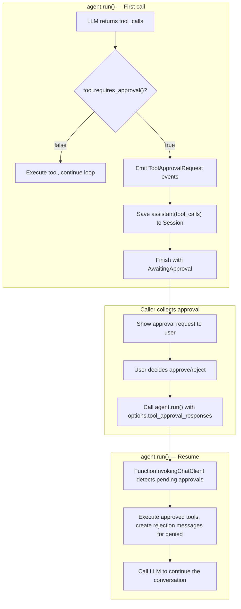

# rust-agent-framework

A modular, async-native Rust framework for building LLM-powered AI agents with streaming, tool-calling, human-in-the-loop approval, and multi-agent orchestration — inspired by [Microsoft Agent Framework](https://github.com/microsoft/agent-framework) (MAF).

## Table of Contents

- [Architecture](#architecture)
- [Quick Start](#quick-start)
- [Defining Custom Tools](#defining-custom-tools)
- [Human-in-the-Loop Tool Approval](#human-in-the-loop-tool-approval)
- [Streaming Output](#streaming-output)
- [Session Management](#session-management)
- [Agent Run Options](#agent-run-options)
- [Context Providers](#context-providers)
- [Multi-Agent Workflows](#multi-agent-workflows)
- [Declarative Agent Configuration](#declarative-agent-configuration)
- [Built-in Tools](#built-in-tools)
- [Interrupt and Resume](#interrupt-and-resume)
- [API Reference](#api-reference)
- [Crate Map](#crate-map)
- [Requirements](#requirements)
- [License](#license)

## Architecture

```
                            user input
                                 |
                    ┌─────────────────────────┐
                    │    rust-agent-decl       │  Load from JSON/YAML/TOML
                    │  (Declarative Config)    │
                    └──────────┬──────────────┘
                               │
         ┌─────────────────────┼─────────────────────┐
         │                     │                     │
┌────────▼───────┐   ┌────────▼───────┐   ┌────────▼───────┐
│ rust-agent-    │   │ rust-agent-    │   │ rust-agent-    │
│ workflow       │   │ framework      │   │ rhai           │
│ (Orchestration)│   │ (Agent Runtime)│   │ (Scripting)    │
└────────┬───────┘   └────────┬───────┘   └────────┬───────┘
         │                    │                     │
         │          ┌─────────┼─────────┐           │
         │          │         │         │           │
         │   ┌──────▼──┐ ┌────▼───┐ ┌───▼──────┐   │
         │   │websearch│ │  rag   │ │  wiki    │   │
         │   │-ai      │ │(Vector)│ │(Doc Mgmt)│   │
         │   └──────┬──┘ └────┬───┘ └───┬──────┘   │
         │          │         │         │           │
┌────────▼──────────▼─────────▼─────────▼───────────▼──┐
│                  rust-agent-client                     │
│          (OpenAI / DeepSeek / HTTP+SSE)                │
├───────────────────────────────────────────────────────┤
│                  rust-agent-macros                     │
│          (#[tool] proc-macro)                          │
├───────────────────────────────────────────────────────┤
│                  rust-agent-core                       │
│   (Traits, Types, Streaming, Approval Infrastructure)  │
└───────────────────────────────────────────────────────┘
```

### Design Principles

- **Streaming-first** — every interface uses `BoxStream` for real-time token-by-token output
- **Provider-agnostic** — OpenAI and DeepSeek supported out of the box; extendable via `IChatClient`
- **Pipeline architecture** — `ChatClientBuilder` composes decorators (function-invoking, persistence, etc.) around a leaf LLM client
- **Discrete invocation** — each `agent.run()` is independent; state lives in the `Session`, enabling stateless API deployments
- **Session persistence** — `InMemoryHistoryProvider` built in; pluggable via `IContextProvider` and `ISession`
- **Approval at construction time** — tools are wrapped with `ApprovalRequiredTool` at agent creation, not at call time

---

## Quick Start

Add dependencies to your `Cargo.toml`:

```toml
[dependencies]
rust-agent-core = "0.1"
rust-agent-client = "0.1"
rust-agent-framework = "0.1"
rust-agent-macros = "0.1"
tokio = { version = "1", features = ["full"] }
anyhow = "1"
```

### Basic Agent

```rust
use rust_agent_client::{ChatClientOptions, DeepSeekChatClient};
use rust_agent_core::{AgentRunOptions, AgentSession, ChatMessage, Content, ISession};
use rust_agent_framework::{tool, AgentBuilder};
use std::sync::Arc;

// Define a custom tool with the #[tool] macro
#[tool(description = "Echoes back the input text")]
async fn echo(#[param(desc = "Text to echo")] text: String) -> String {
    text
}

#[tokio::main]
async fn main() -> anyhow::Result<()> {
    // Step 1: Create the LLM client
    let client = DeepSeekChatClient::new(
        ChatClientOptions::deepseek("deepseek-chat", "your-api-key")
    )?;

    // Step 2: Build the agent
    let agent = AgentBuilder::new("my-assistant")
        .chat_client(client)
        .instructions("You are a helpful assistant. Use the echo tool when asked to repeat.")
        .with_tool(Echo)
        .build()?;

    // Step 3: Create a session (holds conversation history)
    let session: Arc<dyn ISession> = Arc::new(AgentSession::new());

    // Step 4: Run the agent with a user message
    let messages = vec![ChatMessage::user("Hello! Echo this: hello world")];
    let mut stream = agent.run(messages, Some(session), None).await?;

    // Step 5: Consume the streaming response
    use futures_util::StreamExt;
    while let Some(Ok(chunk)) = stream.next().await {
        for content in &chunk.contents {
            match content {
                Content::Text(t) => print!("{}", t.delta),
                Content::ToolCalling(tc) => {
                    println!("\n[Calling: {}]", tc.name);
                }
                Content::ToolCalled(tc) => {
                    println!("[Result: {}]", tc.result.as_deref().unwrap_or("error"));
                }
                _ => {}
            }
        }
        if let Some(fr) = &chunk.finish_reason {
            println!("\n[Done: {:?}]", fr);
        }
    }

    Ok(())
}
```

### Using OpenAI

```rust
use rust_agent_client::{ChatClientOptions, OpenAIChatClient};

let client = OpenAIChatClient::new(
    ChatClientOptions::openai("gpt-4o", "your-api-key")
)?;
// Build agent exactly the same way — provider is transparent to the framework
```

---

## Defining Custom Tools

Tools are defined with the `#[tool]` attribute macro. It auto-generates the `ITool` trait implementation, including JSON Schema from Rust type annotations.

### Async Function Pattern

```rust
use rust_agent_framework::tool;

#[tool(description = "Get the current temperature for a city")]
async fn get_weather(
    #[param(desc = "City name")] city: String,
    #[param(desc = "Unit: celsius or fahrenheit")] unit: Option<String>,
) -> String {
    let unit = unit.as_deref().unwrap_or("celsius");
    format!("Temperature in {}: 22°{}", city, unit)
}
```

The macro generates a `GetWeather` struct implementing `ITool`. Use it with `AgentBuilder`:

```rust
AgentBuilder::new("weather-agent")
    .chat_client(client)
    .with_tool(GetWeather)
    .build()?;
```

### Type to JSON Schema Mapping

| Rust Type | Generated JSON Schema |
|---|---|
| `String`, `&str` | `{"type": "string"}` |
| `i32`, `i64`, `u32`, `u64` | `{"type": "integer"}` |
| `f32`, `f64` | `{"type": "number"}` |
| `bool` | `{"type": "boolean"}` |
| `Option<T>` | same as `T`, not required |
| `Vec<T>` | `{"type": "array", "items": {...}}` |

### Manual `ITool` Implementation

For complex tools, implement `ITool` directly:

```rust
use async_trait::async_trait;
use rust_agent_core::{ITool, Result};
use serde_json::json;

struct MyDatabaseTool;

#[async_trait]
impl ITool for MyDatabaseTool {
    fn name(&self) -> &str { "db_query" }
    fn description(&self) -> &str { "Execute a parameterized SQL query" }
    fn parameters(&self) -> serde_json::Value {
        json!({
            "type": "object",
            "properties": {
                "sql": { "type": "string", "description": "SQL query" }
            },
            "required": ["sql"]
        })
    }
    async fn execute(&self, arguments: serde_json::Value) -> Result<String> {
        let sql = arguments["sql"].as_str().unwrap_or("");
        // ... execute query ...
        Ok("Query result".into())
    }
}
```

---

## Human-in-the-Loop Tool Approval

The framework supports human-in-the-loop (HITL) approval for sensitive tool calls — inspired by MAF's `ApprovalRequiredAIFunction`. When a tool requires approval, the agent pauses and emits `ToolApprovalRequest` events instead of executing the tool. The caller collects the user's decision and resumes execution.

### Architecture



### Marking a Tool for Approval

Wrap any `ITool` with `ApprovalRequiredTool` at agent construction time:

```rust
use rust_agent_core::ApprovalRequiredTool;
use std::sync::Arc;

// Agent A: development — auto-execute everything
let dev_agent = AgentBuilder::new("dev-assistant")
    .chat_client(client.clone())
    .with_tool(RunCommand)
    .with_tool(ReadFile)
    .build()?;

// Agent B: production — sensitive tools require human approval
let prod_agent = AgentBuilder::new("prod-assistant")
    .chat_client(client.clone())
    .with_tool(ApprovalRequiredTool::new(Arc::new(RunCommand))) // requires approval
    .with_tool(ReadFile)                                         // auto-execute
    .build()?;
```

### Full Approval Loop

```rust
use rust_agent_core::{
    AgentResponseUpdate, FinishReason, ToolApprovalResponse,
};
use futures_util::StreamExt;
use std::sync::Arc;

async fn interactive_loop(
    agent: &Arc<dyn IAgent>,
    session: Arc<dyn ISession>,
) -> anyhow::Result<()> {
    let mut messages = vec![ChatMessage::user("Deploy the latest build to production")];

    loop {
        let mut stream = agent.run(messages, Some(session.clone()), None).await?;

        let mut approval_requests = Vec::new();
        let mut finish_reason = None;

        // Consume stream, capturing approval requests
        while let Some(Ok(chunk)) = stream.next().await {
            for content in &chunk.contents {
                match content {
                    Content::Text(t) => print!("{}", t.delta),
                    _ => {}
                }
            }
            if let Some(fr) = &chunk.finish_reason {
                finish_reason = Some(fr.clone());
            }
        }

        if finish_reason == Some(FinishReason::AwaitingApproval) {
            // The agent paused — collect user decisions
            // (approval_requests were consumed from the stream as ToolApprovalRequest events)
            let responses = collect_approvals_from_user(&approval_requests).await?;

            // Resume with approval responses — no messages needed, Session has context
            let resume_options = AgentRunOptions::new()
                .with_tool_approval_responses(responses);
            messages = vec![]; // empty messages for resume
            continue; // loop back to run() with the approval responses
        } else {
            break; // conversation complete
        }
    }
    Ok(())
}

async fn collect_approvals_from_user(
    requests: &[ToolApprovalRequest],
) -> anyhow::Result<Vec<ToolApprovalResponse>> {
    let mut responses = Vec::new();
    for req in requests {
        println!("\n--- Approval Required ---");
        println!("Tool: {}", req.name);
        println!("Arguments: {}", req.arguments);
        println!("Description: {}", req.description);
        println!("Approve? (y/n): ");

        let mut input = String::new();
        std::io::stdin().read_line(&mut input)?;
        let approved = input.trim().to_lowercase() == "y";

        responses.push(ToolApprovalResponse {
            call_id: req.call_id.clone(),
            approved,
            reason: if approved { None } else { Some("User denied".into()) },
        });
    }
    Ok(responses)
}
```

### Key Design Points

- **Approval is per-tool, decided at construction time** — the same `RunCommand` can be auto-execute in one agent and require approval in another, without modifying the tool definition
- **Single-response all-or-nothing** — if any tool in an LLM response requires approval, all tools in that response are held (matching MAF behavior)
- **Resume via Session** — the `assistant(tool_calls)` message is persisted to the Session on pause. On the next `run()`, `FunctionInvokingChatClient` detects `options.tool_approval_responses` and resolves them before calling the LLM
- **Rejection feedback** — when a tool is denied, the reason is passed back to the LLM so it can adapt

---

## Streaming Output

Every `IAgent::run()` returns a `BoxStream<AgentResponseResult>`. Each `AgentResponseResult` contains:

| Field | Type | Description |
|---|---|---|
| `contents` | `Vec<Content>` | Content items emitted in this chunk |
| `events` | `Vec<Event>` | Lifecycle events |
| `finish_reason` | `Option<FinishReason>` | Non-null on the final chunk |

### Content Variants

| Variant | Description |
|---|---|
| `Content::Text(TextContent)` | Text token from the LLM |
| `Content::Reasoning(ReasoningContent)` | Thinking/reasoning content (DeepSeek R1) |
| `Content::ToolCallStart(ToolCallStartContent)` | A tool call begins (name + call_id) |
| `Content::ToolCallArgs(ToolCallArgsContent)` | Streaming argument fragment |
| `Content::ToolCallArgsParsed(ToolCallArgsParsedContent)` | A complete key-value pair parsed from args |
| `Content::ToolCallArgsProgress(ToolCallArgsProgressContent)` | A long string arg is still arriving |
| `Content::ToolCallEnd(ToolCallEndContent)` | Tool call arguments complete |
| `Content::ToolCalling(ToolCallingContent)` | Complete tool call (parsed arguments) |
| `Content::ToolCalled(ToolCalledContent)` | Tool execution result or error |
| `Content::Uri(UriContent)` | A URI emitted by the agent |
| `Content::Error(ErrorContent)` | An error in the stream |

### Tool Call Lifecycle (5 Stages)

```
ToolCallStart → ToolCallArgs(×N) → ToolCallEnd → ToolCalling → ToolCalled
    ①              ②                 ③             ④             ⑤
  begins          streaming          args        complete       execution
                  fragments          done        invocation      result
```

### Finish Reasons

| Variant | Meaning |
|---|---|
| `FinishReason::Stop` | Normal completion |
| `FinishReason::Length` | Hit max_tokens limit |
| `FinishReason::ToolCalls` | Internal — filtered from consumer output |
| `FinishReason::ContentFilter` | Content filtered by provider |
| `FinishReason::AwaitingApproval` | Paused waiting for human tool approval |
| `FinishReason::Other(String)` | Provider-specific reason |

---

## Session Management

A `Session` holds the conversation history and agent state across multiple `run()` calls.

### Default: In-Memory Session

```rust
use rust_agent_core::{AgentSession, ISession};
use std::sync::Arc;

let session: Arc<dyn ISession> = Arc::new(AgentSession::new());

// First call
agent.run(vec![ChatMessage::user("Hello")], Some(session.clone()), None).await?;

// Second call — empty messages, history is pulled from session
agent.run(vec![ChatMessage::user("What's my name?")], Some(session.clone()), None).await?;
```

### Session Persistence

The framework includes `FileSystemSessionStore` for persisting sessions to disk, and `InMemoryHistoryProvider` (injected by `AgentBuilder` by default) that automatically injects history messages into each run.

### Custom Session Stores

Implement `ISessionStore` for database-backed persistence:

```rust
#[async_trait]
pub trait ISessionStore: Send + Sync {
    async fn save(&self, session_id: &str, data: &str) -> Result<()>;
    async fn load(&self, session_id: &str) -> Result<Option<String>>;
    async fn delete(&self, session_id: &str) -> Result<()>;
    async fn list(&self) -> Result<Vec<String>>;
}
```

---

## Agent Run Options

`IAgent::run()` accepts `AgentRunOptions` for per-call overrides without mutating the agent:

```rust
use rust_agent_core::AgentRunOptions;

let options = AgentRunOptions::new()
    .with_instructions("Act as a senior Rust developer.")
    .with_temperature(0.3)
    .with_max_tokens(4096)
    .with_thinking(true); // DeepSeek reasoning mode

agent.run(messages, Some(session), Some(options)).await?;
```

### Full Option Set

| Field | Type | Description |
|---|---|---|
| `instructions` | `Option<String>` | Override system instructions |
| `max_tokens` | `Option<u32>` | Max output tokens |
| `temperature` | `Option<f32>` | Sampling temperature |
| `top_p` | `Option<f32>` | Nucleus sampling |
| `stop` | `Option<Vec<String>>` | Stop sequences |
| `extra_body` | `HashMap<String, Value>` | Extra JSON fields in the request body |
| `properties` | `HashMap<String, Value>` | Arbitrary passthrough properties |
| `parallel_tool_calls` | `Option<bool>` | Allow parallel tool calls |
| `tool_approval_responses` | `Vec<ToolApprovalResponse>` | Approval decisions for resuming |
| `cancelled` | `Option<Arc<AtomicBool>>` | Cancel flag for interruption |

---

## Context Providers

Context providers are composable hooks that run before and after each `agent.run()` invocation. They can inject instructions, messages, and dynamic tools into the conversation context.

### Built-in Providers

| Provider | Description |
|---|---|
| `InMemoryHistoryProvider` | Injects chat history from the session (default, auto-registered) |
| `SkillsProvider` | Loads and injects skill instructions from markdown files |
| `AgentSkillContextProvider` | Agent-aware skill loading with progressive disclosure |
| `ScriptRunnerProvider` | Executes scripts referenced in skills |

### Adding Custom Providers

```rust
use rust_agent_framework::AgentBuilder;

let agent = AgentBuilder::new("rag-agent")
    .chat_client(client)
    .add_context_provider(MyRagProvider::new("docs/"))
    .add_context_provider(MyAuditProvider::new())
    .build()?;
```

Providers execute in registration order. The last provider can set `ContextInjection::replace_messages = true` to implement compression (truncation/sliding-window strategies).

### Implementing a Custom Provider

```rust
use async_trait::async_trait;
use rust_agent_core::{ContextInjection, IAgent, IContextProvider, ISession, ChatMessage, AgentRunOptions};

struct MyRagProvider { docs_dir: String }

#[async_trait]
impl IContextProvider for MyRagProvider {
    fn name(&self) -> &str { "MyRagProvider" }

    async fn on_invoking(
        &self,
        _agent: &dyn IAgent,
        _session: &dyn ISession,
        messages: &[ChatMessage],
        _options: &AgentRunOptions,
    ) -> rust_agent_core::Result<ContextInjection> {
        let query = messages.last().map(|m| &m.content).unwrap_or(&String::new());
        let relevant_docs = self.search(query); // your retrieval logic

        Ok(ContextInjection {
            instructions: Some("Use the provided documents to answer.".into()),
            messages: vec![ChatMessage::user(format!("Relevant docs:\n{}", relevant_docs))],
            tools: vec![],
            replace_messages: false,
        })
    }
}
```

---

## Multi-Agent Workflows

The `rust-agent-workflow` crate provides graph-based orchestration for multi-agent scenarios.

### Built-in Orchestration Patterns

**Sequential** — chain agents in order:

```rust
use rust_agent_workflow::{WorkflowBuilder, sequential};

let workflow = WorkflowBuilder::new()
    .node("classifier", Arc::new(classifier_agent))
    .node("coder", Arc::new(coder_agent))
    .node("reviewer", Arc::new(reviewer_agent))
    .connect("classifier", "coder")
    .connect("coder", "reviewer")
    .build_sequential("classifier", "reviewer")?;
```

**Concurrent** — run agents in parallel (fan-out/fan-in):

```rust
use rust_agent_workflow::concurrent;

let workflow = WorkflowBuilder::new()
    .node("security", Arc::new(security_agent))
    .node("performance", Arc::new(perf_agent))
    .node("style", Arc::new(style_agent))
    .build_concurrent(vec!["security", "performance", "style"])?;
```

**Handoff** — triage agent routes to specialists:

```rust
use rust_agent_workflow::handoff;

let workflow = WorkflowBuilder::new()
    .node("triage", Arc::new(triage_agent))
    .node("billing", Arc::new(billing_specialist))
    .node("support", Arc::new(support_specialist))
    .build_handoff("triage", vec!["billing", "support"])?;
```

### Workflow as Agent

Any workflow can be wrapped as an `IAgent` for uniform consumption:

```rust
let workflow_agent: Arc<dyn IAgent> = workflow.as_agent();

// Use exactly like any other agent — transparent to the caller
let stream = workflow_agent.run(messages, Some(session), None).await?;
```

### Sub-Agent Discovery

Frontends can inspect the agent tree for interactive visualization:

```rust
if let Some(sub) = agent.get_subagent(&AgentId::new("reviewer")) {
    println!("Sub-agent: {} ({})", sub.id(), sub.metadata().description);
}
```

---

## Declarative Agent Configuration

The `rust-agent-decl` crate enables defining agents and workflows entirely in JSON, YAML, or TOML — no Rust code required.

### JSON Configuration

```json
{
  "agents": {
    "my-agent": {
      "model": {
        "provider": "deepseek",
        "name": "deepseek-chat",
        "api_key_env": "DEEPSEEK_API_KEY"
      },
      "instructions": "You are a helpful assistant.",
      "tools": [
        { "type": "builtin", "name": "read_file" },
        { "type": "builtin", "name": "run_command", "require_approval": true },
        { "type": "rhai", "name": "calculate", "script": "args.x + args.y" }
      ],
      "context_providers": [
        { "type": "history" },
        { "type": "skills", "root_dir": "./skills" }
      ]
    }
  }
}
```

### Loading Declarations

```rust
use rust_agent_decl::{AgentDecl, load_from_file};

let decl: AgentDecl = load_from_file("agent-config.json")?;
let agent: Arc<dyn IAgent> = decl.resolve()?;

// Use the agent normally
let stream = agent.run(messages, Some(session), None).await?;
```

Supported formats: JSON (`.json`), YAML (`.yaml`/`.yml`), TOML (`.toml`).

---

## Built-in Tools

All tools are defined with the `#[tool]` macro and located in `crates/framework/src/tools/`.

### File Operations

| Tool | Description |
|---|---|
| `read_file` | Read file contents with optional line range (max 512KB) |
| `write_file` | Create or overwrite a file |
| `edit_file` | Exact string replacement in a file |
| `list_files` | List directory contents |
| `inspect_file` | Inspect file metadata (type, size, permissions) |
| `make_directory` | Create directories recursively |
| `remove_path` | Remove files or directories |
| `move_file` | Move or rename a file |
| `find_files` | Find files by glob pattern |
| `search_file` | Search file contents with regex |

### Shell & Web

| Tool | Description |
|---|---|
| `run_command` | Execute a shell command (100KB output cap) |
| `web_search` | Perform web searches (DuckDuckGo, Bing, SearXNG) |
| `web_fetch` | Fetch and convert web page content to Markdown |

### Registering Built-in Tools

```rust
use rust_agent_framework::{AgentBuilder, tools::{ReadFile, WriteFile, RunCommand}};
use rust_agent_core::ApprovalRequiredTool;
use std::sync::Arc;

let agent = AgentBuilder::new("cli-agent")
    .chat_client(client)
    .with_tool(ReadFile)                                      // auto-execute
    .with_tool(WriteFile)                                     // auto-execute
    .with_tool(ApprovalRequiredTool::new(Arc::new(RunCommand))) // require approval
    .build()?;
```

---

## Interrupt and Resume

The framework supports cooperative cancellation of agent runs via `Arc<AtomicBool>`.

```rust
use std::sync::atomic::AtomicBool;
use std::sync::Arc;

// Create a cancel flag shared with the agent
let cancelled = Arc::new(AtomicBool::new(false));
let cancel_flag = cancelled.clone();

// Run the agent with the cancel flag
let options = AgentRunOptions::new()
    .with_cancelled(cancelled);
let stream = agent.run(messages, Some(session.clone()), Some(options)).await?;

// Cancel from another task or thread
tokio::spawn(async move {
    tokio::time::sleep(Duration::from_secs(10)).await;
    cancel_flag.store(true, std::sync::atomic::Ordering::Relaxed);
});
```

The agent checks the flag before each tool-loop iteration. When cancelled, the stream ends with an error message and the session retains all accumulated state. You can resume by calling `run()` again with the same session.

---

## API Reference

### Core Traits

| Trait | Crate | Description |
|---|---|---|
| `IAgent` | `core` | Agent interface: `run()`, `reset()`, `get_subagent()`, `create_session()` |
| `IChatClient` | `core` | LLM provider client: streaming `run()` with options |
| `ITool` | `core` | Tool interface: `name()`, `description()`, `parameters()`, `execute()`, `requires_approval()` |
| `ISession` | `core` | Conversation session: add/get messages, metadata, serialization |
| `IContextProvider` | `core` | Pre/post-invocation hooks: inject instructions, messages, tools |
| `ICompressionStrategy` | `core` | Message compression for context window management |
| `ITokenCounter` | `core` | Token counting for budget enforcement |
| `ISessionStore` | `core` | Session persistence to disk/database |

### Core Types

| Type | Crate | Description |
|---|---|---|
| `ChatMessage` | `core` | Message with role, content, tool_calls, tool_call_id, source |
| `Content` | `core` | 12 variants: Text, Reasoning, ToolCallStart, ToolCallArgs, ToolCallEnd, ToolCalling, ToolCalled, Uri, Error, etc. |
| `AgentResponseResult` | `core` | Stream chunk: contents, events, finish_reason |
| `AgentResponseUpdate` | `core` | SSE-level event (internal pipeline type) |
| `FinishReason` | `core` | Stop, Length, ToolCalls, ContentFilter, AwaitingApproval, Other |
| `AgentRunOptions` | `core` | Per-call overrides |
| `ToolApprovalResponse` | `core` | Human approval decision (call_id, approved, reason) |
| `ApprovalRequiredTool` | `core` | Wraps an `ITool` to require human approval |
| `ToolCall` | `core` | Tool call descriptor (id, name, arguments) |
| `AgentResponse` | `core` | Aggregated final response (text, tool_calls, finish_reason) |
| `ContextInjection` | `core` | Context provider output (instructions, messages, tools) |
| `ToolRegistry` | `core` | HashMap-backed tool registry |
| `ChatClientBuilder` | `core` | Pipeline builder for composing chat client decorators |
| `ChatClientRunOptions` | `core` | Options passed to `IChatClient::run()` |
| `AgentSession` | `core` | Default in-memory session implementation |

### Framework Components

| Component | Crate | Description |
|---|---|---|
| `AgentBuilder` | `framework` | Fluent builder for `ChatClientAgent` |
| `ChatClientAgent` | `framework` | Main `IAgent` implementation (3-phase pipeline) |
| `FunctionInvokingChatClient` | `framework` | `IChatClient` decorator — auto tool-calling loop (max 10 rounds) |
| `AgentResponseConverter` | `framework` | Converts SSE deltas to public `AgentResponseResult` |
| `InMemoryHistoryProvider` | `framework` | Default context provider for session history |
| `SkillsProvider` | `framework` | Context provider for skill-based instructions |
| `#[tool]` | `macros` | Proc-macro for ergonomic tool definitions |

### Workflow Components

| Component | Crate | Description |
|---|---|---|
| `WorkflowBuilder` | `workflow` | Build workflow graphs |
| `WorkflowEngine` | `workflow` | Execute workflow graphs with event streaming |
| `sequential()` | `workflow` | Chain agents in order |
| `concurrent()` | `workflow` | Run agents in parallel (fan-out/fan-in) |
| `handoff()` | `workflow` | Triage agent routes to specialists |

---

## Crate Map

| Crate | Package | Lines | Role |
|---|---|---|---|
| [core](crates/core/) | `rust-agent-core` | ~800 | Traits, types, streaming, approval infrastructure |
| [client](crates/client/) | `rust-agent-client` | ~600 | OpenAI, DeepSeek clients, SSE transport |
| [framework](crates/framework/) | `rust-agent-framework` | ~3500 | Agent runtime, 13 built-in tools, context providers, memory |
| [macros](crates/macros/) | `rust-agent-macros` | ~330 | `#[tool]` proc-macro |
| [workflow](crates/workflow/) | `rust-agent-workflow` | ~2500 | Graph engine, orchestration patterns, checkpoints |
| [decl](crates/decl/) | `rust-agent-decl` | ~1500 | JSON/YAML/TOML agent declarations |
| [websearch](crates/websearch/) | `rust-websearch` | ~1200 | Pure Rust search: DuckDuckGo, Bing, SearXNG |
| [websearch-ai](crates/websearch-ai/) | `rust-agent-websearch` | ~600 | AI-enhanced search: context provider, auto-search |
| [rag](crates/rag/) | `rust-agent-rag` | ~800 | Embedding, indexing, vector retrieval |
| [rhai](crates/rhai/) | `rust-agent-rhai` | ~600 | Rhai scripting: `RhaiTool`, `RhaiExecutor` |
| [wiki](crates/wiki/) | `rust-agent-wiki` | ~2000 | Wiki/document management: CRUD, graph, search, lint |
| [cli](crates/cli/) | `rust-agent-cli` | ~500 | Interactive CLI binary |
| [workflow-cli](crates/workflow-cli/) | `rust-agent-workflow-cli` | ~300 | Workflow pipeline verification CLI |
| (*root*) | `rust-agent-framework` | — | Workspace root (this README) |

---

## Requirements

- Rust 1.80+
- Tokio async runtime

## License

MIT
