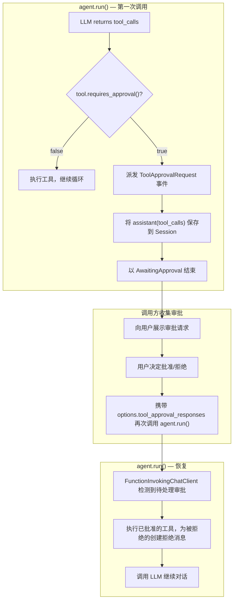

# rust-agent-framework

[English](README.md) | **简体中文**

一个模块化、异步原生的 Rust 框架，用于构建基于 LLM 的 AI 智能体，支持流式输出、工具调用、人工在环审批与多智能体编排——参考了 [Microsoft Agent Framework](https://github.com/microsoft/agent-framework)（MAF）的设计。

## 目录

- [架构](#架构)
- [快速开始](#快速开始)
- [定义自定义工具](#定义自定义工具)
- [人工在环工具审批](#人工在环工具审批)
- [流式输出](#流式输出)
- [会话管理](#会话管理)
- [智能体运行选项](#智能体运行选项)
- [上下文提供器](#上下文提供器)
- [多智能体工作流](#多智能体工作流)
- [声明式智能体配置](#声明式智能体配置)
- [内建工具](#内建工具)
- [中断与恢复](#中断与恢复)
- [API 参考](#api-参考)
- [Crate 一览](#crate-一览)
- [环境要求](#环境要求)
- [许可协议](#许可协议)

## 架构

```
                            user input
                                 |
                    ┌─────────────────────────┐
                    │    rust-agent-decl       │   Load from JSON/YAML/TOML
                    │  (Declarative Config)    │
                    └──────────┬──────────────┘
                               │
         ┌─────────────────────┼─────────────────────┐
         │                     │                     │
┌────────▼───────┐   ┌────────▼───────┐   ┌────────▼───────┐
│ rust-agent-    │   │ rust-agent-    │   │ rust-agent-    │
│ workflow       │   │ framework      │   │ rhai           │
│ (Orchestration)│   │ (Agent Runtime)│   │ (Scripting)    │
└────────┬───────┘   └────────┬───────┘   └────────┬───────┘
         │                    │                     │
         │          ┌─────────┼─────────┐           │
         │          │         │         │           │
         │   ┌──────▼──┐ ┌────▼───┐ ┌───▼──────┐   │
         │   │websearch│ │  rag   │ │  wiki    │   │
         │   │-ai      │ │(Vector)│ │(Doc Mgmt)│   │
         │   └──────┬──┘ └────┬───┘ └───┬──────┘   │
         │          │         │         │           │
┌────────▼──────────▼─────────▼─────────▼───────────▼──┐
│                  rust-agent-client                     │
│          (OpenAI / DeepSeek / HTTP+SSE)                │
├───────────────────────────────────────────────────────┤
│                  rust-agent-macros                     │
│          (#[tool] proc-macro)                          │
├───────────────────────────────────────────────────────┤
│                  rust-agent-core                       │
│   (Traits, Types, Streaming, Approval Infrastructure)  │
└───────────────────────────────────────────────────────┘
```

### 设计原则

- **流式优先** —— 所有接口均使用 `BoxStream` 实现逐 token 的实时输出
- **提供器无关** —— 开箱即用地支持 OpenAI 与 DeepSeek，可通过 `IChatClient` 进行扩展
- **管道式架构** —— `ChatClientBuilder` 在叶子 LLM 客户端周围组合装饰器（函数调用、持久化等）
- **离散调用** —— 每次 `agent.run()` 相互独立；状态保存在 `Session` 中，从而支持无状态 API 部署
- **会话持久化** —— 内建 `InMemoryHistoryProvider`；可通过 `IContextProvider` 与 `ISession` 进行插拔
- **构造期审批** —— 工具在创建智能体时（而非调用时）即被包装为 `ApprovalRequiredTool`

---

## 快速开始

向你的 `Cargo.toml` 添加依赖：

```toml
[dependencies]
rust-agent-core = "0.1"
rust-agent-client = "0.1"
rust-agent-framework = "0.1"
rust-agent-macros = "0.1"
tokio = { version = "1", features = ["full"] }
anyhow = "1"
```

### 基础智能体

```rust
use rust_agent_client::{ChatClientOptions, DeepSeekChatClient};
use rust_agent_core::{AgentRunOptions, AgentSession, ChatMessage, Content, ISession};
use rust_agent_framework::{tool, AgentBuilder};
use std::sync::Arc;

// 使用 #[tool] 宏定义一个自定义工具
#[tool(description = "Echoes back the input text", kind = "function")]
async fn echo(#[param(desc = "Text to echo")] text: String) -> rust_agent_core::ToolResult {
    rust_agent_core::ToolResult::success(serde_json::json!({"echo": text}))
}

#[tokio::main]
async fn main() -> anyhow::Result<()> {
    // 第 1 步：创建 LLM 客户端
    let client = DeepSeekChatClient::new(
        ChatClientOptions::deepseek("deepseek-chat", "your-api-key")
    )?;

    // 第 2 步：构建智能体
    let agent = AgentBuilder::new("my-assistant")
        .chat_client(client)
        .instructions("You are a helpful assistant. Use the echo tool when asked to repeat.")
        .with_tool(Echo)
        .build()?;

    // 第 3 步：创建会话（保存对话历史）
    let session: Arc<dyn ISession> = Arc::new(AgentSession::new());

    // 第 4 步：使用用户消息运行智能体
    let messages = vec![ChatMessage::user("Hello! Echo this: hello world")];
    let mut stream = agent.run(messages, Some(session), None).await?;

    // 第 5 步：消费流式响应
    use futures_util::StreamExt;
    while let Some(Ok(chunk)) = stream.next().await {
        for content in &chunk.contents {
            match content {
                Content::Text(t) => print!("{}", t.delta),
                Content::ToolCalling(tc) => {
                    println!("\n[Calling: {}]", tc.name);
                }
                Content::ToolCalled(tc) => {
                    println!("[Result: {}]", tc.result.as_deref().unwrap_or("error"));
                }
                _ => {}
            }
        }
        if let Some(fr) = &chunk.finish_reason {
            println!("\n[Done: {:?}]", fr);
        }
    }

    Ok(())
}
```

### 使用 OpenAI

```rust
use rust_agent_client::{ChatClientOptions, OpenAIChatClient};

let client = OpenAIChatClient::new(
    ChatClientOptions::openai("gpt-4o", "your-api-key")
)?;
// 构建智能体的方式完全相同——提供器对框架是透明的
```

---

## 定义自定义工具

工具通过 `#[tool]` 属性宏定义。它会自动生成 `ITool` trait 的实现，包括由 Rust 类型注解生成的 JSON Schema。

### 异步函数模式

```rust
use rust_agent_framework::tool;

#[tool(description = "Get the current temperature for a city", kind = "function")]
async fn get_weather(
    #[param(desc = "City name")] city: String,
    #[param(desc = "Unit: celsius or fahrenheit")] unit: Option<String>,
) -> rust_agent_core::ToolResult {
    let unit = unit.as_deref().unwrap_or("celsius");
    rust_agent_core::ToolResult::success(serde_json::json!({
        "city": city,
        "temperature": 22,
        "unit": unit,
    }))
}
```

宏会生成一个实现 `ITool` 的 `GetWeather` 结构体。配合 `AgentBuilder` 使用：

```rust
AgentBuilder::new("weather-agent")
    .chat_client(client)
    .with_tool(GetWeather)
    .build()?;
```

### 类型到 JSON Schema 的映射

| Rust 类型 | 生成的 JSON Schema |
|---|---|
| `String`, `&str` | `{"type": "string"}` |
| `i32`, `i64`, `u32`, `u64` | `{"type": "integer"}` |
| `f32`, `f64` | `{"type": "number"}` |
| `bool` | `{"type": "boolean"}` |
| `Option<T>` | 同 `T`，非必需字段 |
| `Vec<T>` | `{"type": "array", "items": {...}}` |

### 手动实现 `ITool`

对于复杂工具，可直接实现 `ITool`：

```rust
use async_trait::async_trait;
use rust_agent_core::{ITool, Result};
use serde_json::json;

struct MyDatabaseTool;

#[async_trait]
impl ITool for MyDatabaseTool {
    fn name(&self) -> &str { "db_query" }
    fn description(&self) -> &str { "Execute a parameterized SQL query" }
    fn kind(&self) -> &str { "function" }
    fn parameters(&self) -> serde_json::Value {
        json!({
            "type": "object",
            "properties": {
                "sql": { "type": "string", "description": "SQL query" }
            },
            "required": ["sql"]
        })
    }
    async fn execute(&self, arguments: serde_json::Value) -> Result<ToolResult> {
        let sql = arguments["sql"].as_str().unwrap_or("");
        // ... 执行查询 ...
        Ok(ToolResult::success(json!({"result": "Query executed"})))
    }
}
```

---

## 人工在环工具审批

框架支持对敏感工具调用进行人工在环（HITL, human-in-the-loop）审批——参考 MAF 的 `ApprovalRequiredAIFunction` 设计。当某个工具需要审批时，智能体会暂停，转而派发 `ToolApprovalRequest` 事件而不是执行工具。调用方收集用户的决策后恢复执行。

### 架构



### 将工具标记为需要审批

在智能体构造时将任何 `ITool` 包装为 `ApprovalRequiredTool`：

```rust
use rust_agent_core::ApprovalRequiredTool;
use std::sync::Arc;

// 智能体 A：开发环境——自动执行一切
let dev_agent = AgentBuilder::new("dev-assistant")
    .chat_client(client.clone())
    .with_tool(RunCommand)
    .with_tool(ReadFile)
    .build()?;

// 智能体 B：生产环境——敏感工具需要人工审批
let prod_agent = AgentBuilder::new("prod-assistant")
    .chat_client(client.clone())
    .with_tool(ApprovalRequiredTool::new(Arc::new(RunCommand))) // 需要审批
    .with_tool(ReadFile)                                         // 自动执行
    .build()?;
```

### 完整审批循环

```rust
use rust_agent_core::{
    AgentResponseUpdate, FinishReason, ToolApprovalResponse,
};
use futures_util::StreamExt;
use std::sync::Arc;

async fn interactive_loop(
    agent: &Arc<dyn IAgent>,
    session: Arc<dyn ISession>,
) -> anyhow::Result<()> {
    let mut messages = vec![ChatMessage::user("Deploy the latest build to production")];

    loop {
        let mut stream = agent.run(messages, Some(session.clone()), None).await?;

        let mut approval_requests = Vec::new();
        let mut finish_reason = None;

        // 消费流，捕获审批请求
        while let Some(Ok(chunk)) = stream.next().await {
            for content in &chunk.contents {
                match content {
                    Content::Text(t) => print!("{}", t.delta),
                    _ => {}
                }
            }
            if let Some(fr) = &chunk.finish_reason {
                finish_reason = Some(fr.clone());
            }
        }

        if finish_reason == Some(FinishReason::AwaitingApproval) {
            // 智能体暂停——收集用户决策
            // (approval_requests 以 ToolApprovalRequest 事件形式从流中消费)
            let responses = collect_approvals_from_user(&approval_requests).await?;

            // 携带审批响应恢复——无需消息，Session 已包含上下文
            let resume_options = AgentRunOptions::new()
                .with_tool_approval_responses(responses);
            messages = vec![]; // 为空消息以执行恢复
            continue; // 携带审批响应重新执行 run()
        } else {
            break; // 对话完成
        }
    }
    Ok(())
}

async fn collect_approvals_from_user(
    requests: &[ToolApprovalRequest],
) -> anyhow::Result<Vec<ToolApprovalResponse>> {
    let mut responses = Vec::new();
    for req in requests {
        println!("\n--- Approval Required ---");
        println!("Tool: {}", req.name);
        println!("Arguments: {}", req.arguments);
        println!("Description: {}", req.description);
        println!("Approve? (y/n): ");

        let mut input = String::new();
        std::io::stdin().read_line(&mut input)?;
        let approved = input.trim().to_lowercase() == "y";

        responses.push(ToolApprovalResponse {
            call_id: req.call_id.clone(),
            approved,
            reason: if approved { None } else { Some("User denied".into()) },
        });
    }
    Ok(responses)
}
```

### 关键设计要点

- **审批按工具、在构造期决定** —— 同一个 `RunCommand` 可在一个智能体中自动执行、在另一个智能体中要求审批，无需修改工具定义
- **单次响应全有或全无** —— 若一次 LLM 响应中的任意工具需要审批，则该响应中的所有工具都会被挂起（与 MAF 行为一致）
- **通过 Session 恢复** —— `assistant(tool_calls)` 消息在暂停时被持久化到 Session。在下一次 `run()` 中，`FunctionInvokingChatClient` 检测到 `options.tool_approval_responses`，并在调用 LLM 之前将其解决
- **拒绝的反馈** —— 当工具被拒绝时，理由会回传给 LLM，以便它进行适配

---

## 流式输出

每个 `IAgent::run()` 都返回一个 `BoxStream<AgentResponseResult>`。每个 `AgentResponseResult` 包含：

| 字段 | 类型 | 描述 |
|---|---|---|
| `contents` | `Vec<Content>` | 本数据块中派发的内容项 |
| `events` | `Vec<Event>` | 生命周期事件 |
| `finish_reason` | `Option<FinishReason>` | 仅在最终数据块中非空 |

### Content 变体

| 变体 | 描述 |
|---|---|
| `Content::Text(TextContent)` | 来自 LLM 的文本 token |
| `Content::Reasoning(ReasoningContent)` | 思考/推理内容（DeepSeek R1） |
| `Content::ToolCallStart(ToolCallStartContent)` | 一次工具调用开始（名称 + call_id） |
| `Content::ToolCallArgs(ToolCallArgsContent)` | 流式参数片段 |
| `Content::ToolCallArgsParsed(ToolCallArgsParsedContent)` | 从参数解析出的完整键值对 |
| `Content::ToolCallArgsProgress(ToolCallArgsProgressContent)` | 较长字符串参数仍在到达 |
| `Content::ToolCallEnd(ToolCallEndContent)` | 工具调用参数传输完成 |
| `Content::ToolCalling(ToolCallingContent)` | 完整的工具调用（已解析参数） |
| `Content::ToolCalled(ToolCalledContent)` | 工具执行结果或错误 |
| `Content::Uri(UriContent)` | 智能体派发的 URI |
| `Content::Error(ErrorContent)` | 流中的错误 |

### 工具调用生命周期（5 个阶段）

```
ToolCallStart → ToolCallArgs(×N) → ToolCallEnd → ToolCalling → ToolCalled
    ①              ②                 ③             ④             ⑤
   开始           流式参数           参数完成        完整调用        执行结果
```

### 结束原因（Finish Reasons）

| 变体 | 含义 |
|---|---|
| `FinishReason::Stop` | 正常完成 |
| `FinishReason::Length` | 达到 max_tokens 限制 |
| `FinishReason::ToolCalls` | 内部使用——从消费者输出中过滤 |
| `FinishReason::ContentFilter` | 内容被提供器过滤 |
| `FinishReason::AwaitingApproval` | 暂停等待人工工具审批 |
| `FinishReason::Other(String)` | 提供器特定的原因 |

---

## 会话管理

`Session` 在多次 `run()` 调用之间保存对话历史与智能体状态。

### 默认：内存会话

```rust
use rust_agent_core::{AgentSession, ISession};
use std::sync::Arc;

let session: Arc<dyn ISession> = Arc::new(AgentSession::new());

// 第一次调用
agent.run(vec![ChatMessage::user("Hello")], Some(session.clone()), None).await?;

// 第二次调用——消息为空，历史从 session 中取出
agent.run(vec![ChatMessage::user("What's my name?")], Some(session.clone()), None).await?;
```

### 会话持久化

框架包含用于将会话持久化到磁盘的 `FileSystemSessionStore`，以及 `InMemoryHistoryProvider`（默认由 `AgentBuilder` 注入），后者会自动将历史消息注入到每次运行中。

### 自定义会话存储

实现 `ISessionStore` 以支持基于数据库的持久化：

```rust
#[async_trait]
pub trait ISessionStore: Send + Sync {
    async fn save(&self, session_id: &str, data: &str) -> Result<()>;
    async fn load(&self, session_id: &str) -> Result<Option<String>>;
    async fn delete(&self, session_id: &str) -> Result<()>;
    async fn list(&self) -> Result<Vec<String>>;
}
```

---

## 智能体运行选项

`IAgent::run()` 接受 `AgentRunOptions`，用于按次调用进行覆盖，而无需修改智能体：

```rust
use rust_agent_core::AgentRunOptions;

let options = AgentRunOptions::new()
    .with_instructions("Act as a senior Rust developer.")
    .with_temperature(0.3)
    .with_max_tokens(4096)
    .with_thinking(true); // DeepSeek 推理模式

agent.run(messages, Some(session), Some(options)).await?;
```

### 完整选项集

| 字段 | 类型 | 描述 |
|---|---|---|
| `instructions` | `Option<String>` | 覆盖系统指令 |
| `max_tokens` | `Option<u32>` | 最大输出 token 数 |
| `temperature` | `Option<f32>` | 采样温度 |
| `top_p` | `Option<f32>` | 核采样 |
| `stop` | `Option<Vec<String>>` | 停止序列 |
| `extra_body` | `HashMap<String, Value>` | 请求体中额外的 JSON 字段 |
| `properties` | `HashMap<String, Value>` | 任意透传属性 |
| `parallel_tool_calls` | `Option<bool>` | 允许并行工具调用 |
| `tool_approval_responses` | `Vec<ToolApprovalResponse>` | 用于恢复的审批决策 |
| `cancelled` | `Option<Arc<AtomicBool>>` | 用于中断的取消标志 |

---

## 上下文提供器

上下文提供器是组合式的钩子，在每次 `agent.run()` 调用前、后运行。它们可以向对话上下文注入指令、消息与动态工具。

### 内建提供器

| 提供器 | 描述 |
|---|---|
| `InMemoryHistoryProvider` | 从会话注入聊天历史（默认，自动注册） |
| `SkillsProvider` | 从 markdown 文件加载并注入技能指令 |
| `AgentSkillContextProvider` | 支持渐进披露的、感知智能体的技能加载 |
| `ScriptRunnerProvider` | 执行技能中引用的脚本 |

### 添加自定义提供器

```rust
use rust_agent_framework::AgentBuilder;

let agent = AgentBuilder::new("rag-agent")
    .chat_client(client)
    .add_context_provider(MyRagProvider::new("docs/"))
    .add_context_provider(MyAuditProvider::new())
    .build()?;
```

提供器按注册顺序执行。最后一个提供器可设置 `ContextResult::replace_messages = true` 以实现压缩（截断/滑动窗口策略）。

### 实现自定义提供器

```rust
use async_trait::async_trait;
use rust_agent_core::{ContextResult, IAgent, IContextProvider, ISession, ChatMessage, AgentRunOptions};

struct MyRagProvider { docs_dir: String }

#[async_trait]
impl IContextProvider for MyRagProvider {
    fn name(&self) -> &str { "MyRagProvider" }
    fn kind(&self) -> &str { "knowledge" }

    async fn on_invoking(
        &self,
        _agent: &dyn IAgent,
        _session: &dyn ISession,
        messages: &[ChatMessage],
        _options: &AgentRunOptions,
    ) -> rust_agent_core::Result<ContextResult> {
        let query = messages.last().map(|m| &m.content).unwrap_or(&String::new());
        let relevant_docs = self.search(query); // 你的检索逻辑

        Ok(ContextResult {
            instructions: Some("Use the provided documents to answer.".into()),
            messages: vec![ChatMessage::user(format!("Relevant docs:\n{}", relevant_docs))],
            tools: vec![],
            replace_messages: false,
        })
    }
}
```

---

## 多智能体工作流

`rust-agent-workflow` crate 提供了面向多智能体场景的基于图（graph）的编排能力。

### 内建编排模式

**顺序（Sequential）** —— 按顺序串联智能体：

```rust
use rust_agent_workflow::{WorkflowBuilder, sequential};

let workflow = WorkflowBuilder::new()
    .node("classifier", Arc::new(classifier_agent))
    .node("coder", Arc::new(coder_agent))
    .node("reviewer", Arc::new(reviewer_agent))
    .connect("classifier", "coder")
    .connect("coder", "reviewer")
    .build_sequential("classifier", "reviewer")?;
```

**并发（Concurrent）** —— 并行运行智能体（扇出/扇入）：

```rust
use rust_agent_workflow::concurrent;

let workflow = WorkflowBuilder::new()
    .node("security", Arc::new(security_agent))
    .node("performance", Arc::new(perf_agent))
    .node("style", Arc::new(style_agent))
    .build_concurrent(vec!["security", "performance", "style"])?;
```

**转交（Handoff）** —— 分诊智能体将任务路由给各专家：

```rust
use rust_agent_workflow::handoff;

let workflow = WorkflowBuilder::new()
    .node("triage", Arc::new(triage_agent))
    .node("billing", Arc::new(billing_specialist))
    .node("support", Arc::new(support_specialist))
    .build_handoff("triage", vec!["billing", "support"])?;
```

### 工作流即智能体

任意工作流都可以包装为 `IAgent` 以便统一消费：

```rust
let workflow_agent: Arc<dyn IAgent> = workflow.as_agent();

// 使用方法与任何其他智能体完全相同——对调用方透明
let stream = workflow_agent.run(messages, Some(session), None).await?;
```

### 子智能体发现

前端可以检查智能体树以进行交互式可视化：

```rust
if let Some(sub) = agent.get_subagent(&AgentId::new("reviewer")) {
    println!("Sub-agent: {} ({})", sub.id(), sub.metadata().description);
}
```

---

## 声明式智能体配置

`rust-agent-decl` crate 允许你完全用 JSON、YAML 或 TOML 定义智能体与工作流——无需编写 Rust 代码。

### YAML 配置（CLI）

CLI 使用 MAF AgentSchema v1.0 YAML 实现完全声明式的智能体构建：

```yaml
kind: prompt
name: cli-agent
displayName: CLI Assistant
model:
  id: agnes-2.0-flash
  provider: deepseek
  connection:
    kind: key
    api_key: $AGNES_API_KEY   # 支持环境变量语法
instructions: |
  You are a helpful assistant.

contexts:                         # 声明式上下文提供器
  - kind: memory
    name: skill-memory
    config:
      directory: logs/memory
      consolidationInterval: 1

tools:
  - kind: web                    # 无名称 → 注册全部 web 工具
  - kind: file                   # 无名称 → 注册全部 11 个文件工具
  - kind: function
    name: echo
    description: Echoes back the input text

max_tool_rounds: 8
```

### 加载声明

```rust
use rust_agent_decl::DeclAgentBuilder;
use std::sync::Arc;

// 完全从 YAML 构建智能体——模型、API key、工具、上下文全部声明式
let agent: Arc<dyn IAgent> = DeclAgentBuilder::new()
    .from_yaml_file("cli-agent.yaml")
    .with_tool("echo", |_| Ok(Arc::new(Echo)))
    .build()
    .await?;

// 正常使用智能体
let stream = agent.run(messages, Some(session), None).await?;
```

支持的格式：JSON（`.json`）、YAML（`.yaml`/`.yml`）、TOML（`.toml`）。

---

## 内建工具

所有工具均使用 `#[tool]` 宏定义，位于 `crates/framework/src/tools/`。

### 文件操作

| 工具 | 类型 | 描述 |
|------|------|-------------|
| `read_file` | `file` | 读取文件内容，支持可选的行范围（上限 512KB） |
| `write_file` | `file` | 创建或覆盖文件 |
| `edit_file` | `file` | 在文件中进行精确字符串替换 |
| `list_files` | `file` | 列出目录内容 |
| `inspect_file` | `file` | 检查文件元数据（类型、大小、权限） |
| `make_directory` | `file` | 递归创建目录 |
| `remove_path` | `file` | 删除文件或目录 |
| `move_file` | `file` | 移动或重命名文件 |
| `find_files` | `file` | 按 glob 模式查找文件 |
| `search_file` | `file` | 使用正则搜索文件内容 |

### 外壳、Web 与技能

| 工具 | 类型 | 描述 |
|------|------|-------------|
| `run_command` | `shell` | 执行外壳命令（输出上限 100KB，感知平台） |
| `web_search` | `web` | 执行网络搜索（DuckDuckGo、Bing、SearXNG） |
| `web_fetch` | `web` | 抓取网页内容并转换为 Markdown |
| `load_skill` | `skills` | 从 SKILL.md 加载技能的完整指令 |
| `read_skill_resource` | `skills` | 从已加载技能中读取资源文件 |

### 注册内建工具

全部 15 个内建工具可以逐个注册，也可以按类别注册：

```rust
// 通过 YAML 按类别注册（无名称 = 该类别下所有工具）
// tools:
//   - kind: web       → 注册 web_search + web_fetch
//   - kind: file      → 注册全部 10 个文件工具
//   - kind: skills    → 注册 load_skill + read_skill_resource

// 在代码中逐个注册
use rust_agent_framework::{AgentBuilder, tools::{ReadFile, WriteFile, RunCommand}};
use rust_agent_core::ApprovalRequiredTool;
use std::sync::Arc;

let agent = AgentBuilder::new("cli-agent")
    .chat_client(client)
    .with_tool(ReadFile)                                      // 自动执行
    .with_tool(WriteFile)                                     // 自动执行
    .with_tool(ApprovalRequiredTool::new(Arc::new(RunCommand))) // 需要审批
    .build()?;
```

---

## 中断与恢复

框架支持通过 `Arc<AtomicBool>` 对智能体运行进行协作式取消。

```rust
use std::sync::atomic::AtomicBool;
use std::sync::Arc;

// 创建一个与智能体共享的取消标志
let cancelled = Arc::new(AtomicBool::new(false));
let cancel_flag = cancelled.clone();

// 使用取消标志运行智能体
let options = AgentRunOptions::new()
    .with_cancelled(cancelled);
let stream = agent.run(messages, Some(session.clone()), Some(options)).await?;

// 从另一个任务或线程取消
tokio::spawn(async move {
    tokio::time::sleep(Duration::from_secs(10)).await;
    cancel_flag.store(true, std::sync::atomic::Ordering::Relaxed);
});
```

智能体在每次工具循环迭代前检查该标志。取消时，流会以一条错误消息结束，session 保留所有已累积的状态。你可以使用同一个 session 再次调用 `run()` 来恢复执行。

---

## API 参考

### 核心 Traits

| Trait | Crate | 描述 |
|---|---|---|
| `IAgent` | `core` | 智能体接口：`run()`、`reset()`、`get_subagent()`、`create_session()` |
| `IChatClient` | `core` | LLM 提供器客户端：带选项的流式 `run()` |
| `ITool` | `core` | 工具接口：`name()`、`description()`、`parameters()`、`execute()`、`requires_approval()`、`kind()` |
| `ISession` | `core` | 对话会话：添加/获取消息、元数据、序列化 |
| `IContextProvider` | `core` | 调用前/后钩子：注入指令、消息、工具；`name()`、`kind()` |
| `ICompressionStrategy` | `core` | 用于上下文窗口管理的消息压缩 |
| `ITokenCounter` | `core` | 用于预算执行的 token 计数 |
| `ISessionStore` | `core` | 会话到磁盘/数据库的持久化 |

### 核心类型

| 类型 | Crate | 描述 |
|---|---|---|
| `ChatMessage` | `core` | 带有 role、content、tool_calls、tool_call_id、source 的消息 |
| `Content` | `core` | 12 种变体：Text、Reasoning、ToolCallStart、ToolCallArgs、ToolCallEnd、ToolCalling、ToolCalled、Uri、Error 等 |
| `AgentResponseResult` | `core` | 流数据块：contents、events、finish_reason |
| `AgentResponseUpdate` | `core` | SSE 级别事件（内部管道类型） |
| `FinishReason` | `core` | Stop、Length、ToolCalls、ContentFilter、AwaitingApproval、Other |
| `AgentRunOptions` | `core` | 按次调用覆盖 |
| `ToolApprovalResponse` | `core` | 人工审批决策（call_id、approved、reason） |
| `ApprovalRequiredTool` | `core` | 包装 `ITool` 以要求人工审批 |
| `ToolCall` | `core` | 工具调用描述符（id、name、arguments） |
| `AgentResponse` | `core` | 聚合后的最终响应（text、tool_calls、finish_reason） |
| `ContextResult` | `core` | 上下文提供器输出（instructions、messages、tools） |
| `ToolRegistry` | `core` | 基于 HashMap 的工具注册表 |
| `ChatClientBuilder` | `core` | 用于组合聊天客户端装饰器的管道构建器 |
| `ChatClientRunOptions` | `core` | 传给 `IChatClient::run()` 的选项 |
| `AgentSession` | `core` | 默认的内存会话实现 |

### 框架组件

| 组件 | Crate | 描述 |
|---|---|---|
| `AgentBuilder` | `framework` | 用于构建 `ChatClientAgent` 的流式构建器 |
| `ChatClientAgent` | `framework` | 主要的 `IAgent` 实现（3 阶段管道） |
| `FunctionInvokingChatClient` | `framework` | `IChatClient` 装饰器——自动工具调用循环（最多 10 轮） |
| `AgentResponseConverter` | `framework` | 将 SSE 增量转换为公开的 `AgentResponseResult` |
| `InMemoryHistoryProvider` | `framework` | 用于会话历史的默认上下文提供器 |
| `SkillsProvider` | `framework` | 面向基于技能指令的上下文提供器 |
| `#[tool]` | `macros` | 用于轻松定义工具的过程宏 |

### 工作流组件

| 组件 | Crate | 描述 |
|---|---|---|
| `WorkflowBuilder` | `workflow` | 构建工作流图 |
| `WorkflowEngine` | `workflow` | 以事件流方式执行工作流图 |
| `sequential()` | `workflow` | 按顺序串联智能体 |
| `concurrent()` | `workflow` | 并行运行智能体（扇出/扇入） |
| `handoff()` | `workflow` | 分诊智能体将任务路由给各专家 |

---

## Crate 一览

| Crate | 包名 | 代码量 | 作用 |
|---|---|---|---|
| [core](crates/core/) | `rust-agent-core` | ~800 | Traits、类型、流式、审批基础设施 |
| [client](crates/client/) | `rust-agent-client` | ~600 | OpenAI、DeepSeek 客户端，SSE 传输 |
| [framework](crates/framework/) | `rust-agent-framework` | ~3500 | 智能体运行时，13 个内建工具、上下文提供器、内存 |
| [macros](crates/macros/) | `rust-agent-macros` | ~330 | `#[tool]` 过程宏 |
| [workflow](crates/workflow/) | `rust-agent-workflow` | ~2500 | 图引擎、编排模式、检查点 |
| [decl](crates/decl/) | `rust-agent-decl` | ~1500 | JSON/YAML/TOML 智能体声明 |
| [websearch](crates/websearch/) | `rust-websearch` | ~1200 | 纯 Rust 搜索：DuckDuckGo、Bing、SearXNG |
| [websearch-ai](crates/websearch-ai/) | `rust-agent-websearch` | ~600 | AI 增强搜索：上下文提供器、自动搜索 |
| [rag](crates/rag/) | `rust-agent-rag` | ~800 | 嵌入、索引、向量检索 |
| [rhai](crates/rhai/) | `rust-agent-rhai` | ~600 | Rhai 脚本：`RhaiTool`、`RhaiExecutor` |
| [wiki](crates/wiki/) | `rust-agent-wiki` | ~2000 | Wiki/文档管理：CRUD、图、搜索、lint |
| [cli](crates/cli/) | `rust-agent-cli` | ~500 | 交互式 CLI 二进制 |
| (*根*) | `rust-agent-framework` | — | 工作区根（即本 README） |

---

## 环境要求

- Rust 1.80+
- Tokio 异步运行时

## 许可协议

MIT