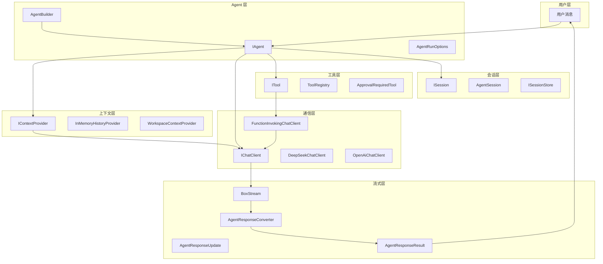
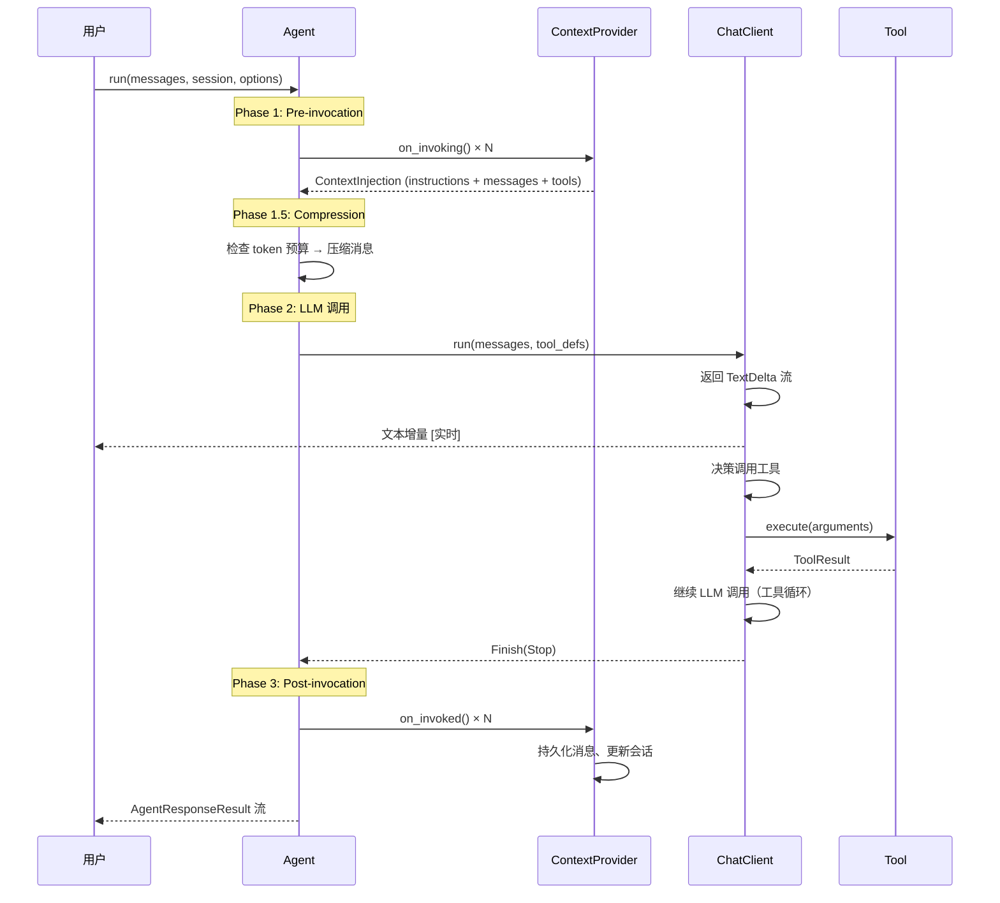

# 核心概念

本文档梳理 RAF 七大核心概念的职责、接口和协作关系。理解这些概念是深入使用框架的基础。

## 概念全景图



## 七大核心概念

### 1. Agent（智能体）

**接口**：`IAgent`（定义在 `rust_agent_core::agent`）

Agent 是框架的核心抽象，代表一个可自主执行任务的 AI 实体。它：

- 持有系统指令（`instructions`）
- 管理工具注册表（`ToolRegistry`）
- 维护上下文提供器链（`Vec<Arc<dyn IContextProvider>>`）
- 通过 `run(messages, session, options)` 方法执行推理

关键方法：

```rust
#[async_trait]
pub trait IAgent: Send + Sync {
    fn id(&self) -> &AgentId;
    fn metadata(&self) -> &AgentMetadata;
    async fn run(
        &self,
        messages: Vec<ChatMessage>,
        session: Option<Arc<dyn ISession>>,
        options: Option<AgentRunOptions>,
    ) -> Result<BoxStream<'static, Result<AgentResponseResult>>>;
    async fn reset(&self) -> Result<()>;
    fn create_session(&self) -> Arc<dyn ISession>;
    fn chat_client(&self) -> Option<&Arc<dyn IChatClient>>;
}
```

**实现**：`ChatClientAgent`（定义在 `rust_agent_framework::chat_client_agent`）

### 2. Tool（工具）

**接口**：`ITool`（定义在 `rust_agent_core::tool`）

工具是 Agent 与外部世界交互的手段。每个工具需要提供：

```rust
#[async_trait]
pub trait ITool: AsAny + Send + Sync {
    fn name(&self) -> &str;                    // 工具名称，LLM 据此调用
    fn description(&self) -> &str;             // 工具描述，注入 LLM prompt
    fn parameters(&self) -> serde_json::Value; // JSON Schema 参数定义
    async fn execute(&self, arguments: serde_json::Value) -> Result<ToolResult>;
    fn requires_approval(&self) -> bool;       // 是否需要人工审批
}
```

**ToolResult** 结构体：

```rust
pub struct ToolResult {
    pub ok: bool,
    pub data: Option<serde_json::Value>,
    pub error: Option<String>,
}
```

- 成功：`ToolResult::success(data)`
- 工具级错误：`ToolResult::error("file not found")`
- 框架级错误：直接返回 `Err(AgentError)`

**注册方式**：通过 `ToolRegistry`（HashMap 存储），支持 `register()` 和 `register_arc()`。

### 3. ChatClient（LLM 客户端）

**接口**：`IChatClient`（定义在 `rust_agent_core::chat_client`）

负责与 LLM API 通信的核心抽象。设计采用**管道装饰器模式**：

```rust
#[async_trait]
pub trait IChatClient: Send + Sync {
    async fn run(
        &self,
        messages: &[ChatMessage],
        options: ChatClientRunOptions,
    ) -> Result<BoxStream<'static, Result<AgentResponseUpdate>>>;
    fn model_id(&self) -> &str;
    fn model_metadata(&self) -> Option<&ModelMetadata>;
    fn inner_client(&self) -> Option<&Arc<dyn IChatClient>>;
}
```

**管道示例**：

```
DeepSeekChatClient (叶子，HTTP/SSE 传输)
    └── FunctionInvokingChatClient (装饰器，拦截工具调用并执行)
```

`AgentBuilder` 在注册工具时自动用 `FunctionInvokingChatClient` 包裹叶子客户端，实现**透明工具调用循环**——Agent 无需感知工具执行逻辑。

### 4. Session（会话）

**接口**：`ISession`（定义在 `rust_agent_core::session`）

Session 维护多轮对话的消息历史，支持跨请求上下文保持。

```rust
#[async_trait]
pub trait ISession: Send + Sync {
    fn session_id(&self) -> &str;
    async fn add_message(&self, message: ChatMessage) -> Result<()>;
    async fn get_messages(&self) -> Result<Vec<ChatMessage>>;
    async fn clear(&self) -> Result<()>;
    fn serialize(&self) -> Result<String>;
    fn deserialize(data: &str) -> Result<Self> where Self: Sized;

    // Provider 状态存储
    fn get_provider_state(&self, provider_name: &str) -> Result<serde_json::Value>;
    fn set_provider_state(&self, provider_name: &str, state: serde_json::Value) -> Result<()>;

    // KV 缓存追踪
    fn touch_request_hash(&self, messages: &[ChatMessage]);
    fn get_last_request_hash(&self) -> Option<u64>;
}
```

**持久化**：通过 `ISessionStore` 接口支持内存存储（`InMemorySessionStore`）和文件系统存储（`FileSystemSessionStore`）。

### 5. ContextProvider（上下文提供器）

**接口**：`IContextProvider`（定义在 `rust_agent_core::context_provider`）

ContextProvider 是框架的核心扩展点，在 Agent 调用生命周期的两个阶段插入自定义逻辑：

```rust
#[async_trait]
pub trait IContextProvider: Send + Sync {
    fn name(&self) -> &str;

    // Pre-invocation：注入指令、消息、工具
    async fn on_invoking(
        &self, agent: &dyn IAgent, session: &dyn ISession,
        messages: &[ChatMessage], options: &AgentRunOptions,
    ) -> Result<ContextInjection>;

    // Post-invocation：持久化、通知、审计
    async fn on_invoked(
        &self, agent: &dyn IAgent, session: &dyn ISession,
        request_messages: &[ChatMessage], response: Option<&AgentResponse>,
        error: Option<&AgentError>,
    ) -> Result<()>;
}
```

**ContextInjection** 载体：

```rust
pub struct ContextInjection {
    pub instructions: Option<String>,       // 追加 System Prompt
    pub messages: Vec<ChatMessage>,        // 注入消息
    pub tools: Vec<Arc<dyn ITool>>,        // 动态工具
    pub replace_messages: bool,            // 是否替换前置消息（用于压缩）
}
```

**Provider 链执行顺序**：按注册顺序依次执行，后续 Provider 可设置 `replace_messages = true` 覆盖之前累积的消息——这天然支持压缩策略。

**内置 Provider**：

- `InMemoryHistoryProvider`：默认注入，将 Session 历史注入消息列表
- `WorkspaceContextProvider`：管理工作区工具和路径范围
- `AgentSkillsProvider`：加载 Agent Skills 并提供给 Agent

### 6. Message（消息）

**结构体**：`ChatMessage`（定义在 `rust_agent_core::message`）

遵循 OpenAI 兼容的消息模型，支持四种角色：

```rust
pub struct ChatMessage {
    pub role: MessageRole,              // System / User / Assistant / Tool
    pub content: String,
    pub name: Option<String>,           // 可选的名称标签
    pub tool_calls: Option<Vec<ToolCall>>,    // 助手消息的工具调用
    pub tool_call_id: Option<String>,         // 工具消息的调用 ID
    pub source: Option<MessageSource>,        // 消息来源标记
}
```

**便捷构造方法**：

```rust
ChatMessage::system("你是一个助手")
ChatMessage::user("你好")
ChatMessage::assistant("你好！有什么可以帮你？")
ChatMessage::assistant_with_tools("好的，我来调用工具", tool_calls)
ChatMessage::tool("执行结果", "call_123")
```

### 7. Streaming（流式输出）

**类型**：`BoxStream<'a, T>` = `Pin<Box<dyn Stream<Item = T> + Send + 'a>>`

RAF **仅支持流式输出**——这是设计决策，因为流式输出更适合实时交互场景。

**流式管道**：

```
LLM API (SSE) → AgentResponseUpdate(内部格式) → AgentResponseConverter → AgentResponseResult(公开 API)
```

- `AgentResponseUpdate`：内部类型，对应 SSE 事件粒度（`TextDelta`、`ToolCallStart`、`ToolCallArgs` 等共 13 个变体）
- `AgentResponseResult`：公开 API 类型，聚合为 `Vec<Content>` + `Vec<Event>`
- `Content`：12 个变体，覆盖文本、推理、工具调用全生命周期
- `AgentResponseConverter`：负责将增量更新转换为结构化内容，管理并行工具调用的状态累加

## 协作流程总览

一次完整的 Agent 调用经历三个主要阶段：



## 下一步

掌握核心概念后，请阅读 **[内置工具概览](./builtin-tools-intro.md)** 了解框架提供的 14 个开箱即用工具。
