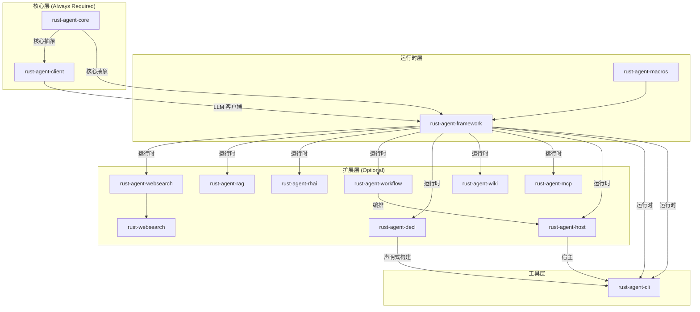

# Crate 地图

RAF workspace 包含 16 个 crate，按职责分为三层：核心层（必选）、运行时层（常用）和扩展层（可选）。本章提供完整的依赖关系图和各 crate 的详细说明。

## 全部 16 个 Crate

| Crate 名称 | 路径 | 职责 | 分类 |
|-----------|------|------|------|
| `rust-agent-core` | `crates/core` | 核心 trait 和类型定义 | **核心层** |
| `rust-agent-client` | `crates/client` | LLM 客户端实现（DeepSeek/OpenAI） | **核心层** |
| `rust-agent-framework` | `crates/framework` | Agent 运行时、工具集、压缩策略 | **核心层** |
| `rust-agent-macros` | `crates/macros` | `#[tool]` 过程宏 | **运行时层** |
| `rust-agent-workflow` | `crates/workflow` | 工作流编排引擎 | 扩展层 |
| `rust-agent-websearch` | `crates/websearch-ai` | Web 搜索 AI Agent | 扩展层 |
| `rust-websearch` | `crates/websearch` | Web 搜索底层库 | 扩展层 |
| `rust-agent-rag` | `crates/rag` | RAG（检索增强生成） | 扩展层 |
| `rust-agent-rhai` | `crates/rhai` | Rhai 脚本引擎工具 | 扩展层 |
| `rust-agent-decl` | `crates/decl` | 声明式 Agent DSL | 扩展层 |
| `rust-agent-wiki` | `crates/wiki` | Wiki 知识检索 | 扩展层 |
| `rust-agent-mcp` | `crates/mcp` | MCP 协议客户端与工具适配 | 扩展层 |
| `rust-agent-cli` | `crates/cli` | CLI 交互界面 + ReplRunner 组件 | 工具 |
| `rust-agent-host` | `crates/host` | Agent 宿主运行环境 | 工具 |
| `rust-agent-workflow-pro` | `crates/workflow-pro` | 业务流程基础设施、Agent 管理、SAGA、审计 | 扩展层 |

> **注意**：虽然 `default-members` 包含了 14 个 crate（排除 `host`），但 `rust-agent-core`、`rust-agent-client`、`rust-agent-framework` 三个是必选的"核心三件套"。

## 依赖关系图



## 核心三件套

这三个 crate 是任何 RAF 项目都需要的：

### rust-agent-core

```toml
[dependencies]
rust-agent-core = { git = "...", package = "rust-agent-core" }
```

**外部依赖**（最简）：`futures-core`, `tokio (sync)`, `serde`, `serde_json`, `async-trait`, `thiserror`, `anyhow`, `chrono`, `uuid`

**不依赖**：`reqwest`、任何 LLM SDK

**导出**：

```rust
pub use agent::IAgent;
pub use chat_client::{IChatClient, ChatClientBuilder, DelegatingChatClient, ChatClientRunOptions};
pub use compression::ICompressionStrategy;
pub use context_provider::{ContextResult, IContextProvider};
pub use error::{AgentError, Result};
pub use message::{
    AgentResponse, AgentResponseResult, AgentResponseUpdate, ChatMessage, Content,
    MessageRole, MessageSource, // 等等
};
pub use session::{AgentSession, ISession, ProviderState, SessionMetadata, SessionSnapshot};
pub use session_store::ISessionStore;
pub use stream::{BoxStream, collect_agent_response};
pub use token_counter::ITokenCounter;
pub use tool::{ITool, ToolRegistry, ToolResult, ApprovalRequiredTool, ToolApprovalResponse};
pub use types::{AgentId, AgentMetadata, FinishReason, ResponseMetadata, ToolCall, Usage};
pub use workspace::{WorkspaceScope, ScopePolicy, IScopeTool};
```

### rust-agent-client

```toml
[dependencies]
rust-agent-client = { git = "...", package = "rust-agent-client" }
```

**外部依赖**：`reqwest`, `bytes`（均 workspace 管理）

**导出**：

```rust
pub use chat_client::ChatClient;          // 通用 HTTP+SSE 客户端
pub use deepseek_client::DeepSeekChatClient;  // DeepSeek 适配
pub use openai_client::OpenAiChatClient;  // OpenAI 适配
pub use options::ChatClientOptions;
pub use types::ModelListEntry;
```

### rust-agent-framework

```toml
[dependencies]
rust-agent-framework = { git = "...", package = "rust-agent-framework" }
```

**外部依赖**：`tracing`, `regex`, `glob`, `walkdir`, `dirs-next`（工具实现所需）

**可选 Feature**：`tiktoken` → 精确 Token 计数

**导出**：

```rust
// Agent
pub use builder::AgentBuilder;
pub use chat_client_agent::ChatClientAgent;

// Context Providers
pub use context_providers::history_provider::InMemoryHistoryProvider;
pub use context_providers::workspace::WorkspaceContextProvider;
pub use context_providers::agent_skill::{AgentSkill, SkillMetadata};
pub use context_providers::skills_provider::AgentSkillsProvider;

// Compression
pub use compression::{SlidingWindowStrategy, TokenBudgetStrategy, CompressionPipeline};

// Session
pub use session_store::{InMemorySessionStore, FileSystemSessionStore, IsolationScopedSessionStore};

// Token Counter
pub use token_counter::EstimateCounter;

// Converter
pub use converter::AgentResponseConverter;

// ChatClient Decorators
pub use chat_client_decorators::{FunctionInvokingChatClient, PerServiceCallPersistingChatClient};

// Tools (14 built-in)
pub use tools::{
    ReadFile, WriteFile, EditFile, ListFiles, InspectFile,
    MakeDirectory, RemovePath, MoveFile, FindFiles, SearchFile,
    RunCommand, LoadSkillTool, ReadSkillResourceTool, RunSkillScriptTool,
};

// Re-export macros
pub use rust_agent_macros::tool;
```

## 扩展层 Crate 详解

### rust-agent-workflow

工作流编排引擎，支持序列和并行 Agent 组合。

```toml
rust-agent-workflow = { git = "...", package = "rust-agent-workflow" }
```

### rust-agent-websearch

Web 搜索 AI Agent，让 Agent 能够搜索互联网。

```toml
rust-agent-websearch = { git = "...", package = "rust-agent-websearch" }
```

依赖 `rust-websearch`（底层 Web 搜索库）。

### rust-agent-rag

检索增强生成（RAG），支持向量检索和文档注入。

```toml
rust-agent-rag = { git = "...", package = "rust-agent-rag" }
```

### rust-agent-rhai

Rhai 脚本引擎集成，允许 Agent 执行用户定义的 Rhai 脚本。

```toml
rust-agent-rhai = { git = "...", package = "rust-agent-rhai" }
```

提供 `rhai::executor::RhaiExecutor` 和 `rhai::tool::RhaiTool`。

### rust-agent-decl

声明式 Agent DSL，支持用 YAML/TOML 定义 Agent 行为。

```toml
rust-agent-decl = { git = "...", package = "rust-agent-decl" }
```

### rust-agent-wiki

Wiki 知识检索，支持从 MediaWiki 等源获取结构化知识。

```toml
rust-agent-wiki = { git = "...", package = "rust-agent-wiki" }
```

### rust-agent-mcp

MCP (Model Context Protocol) 协议客户端和工具适配器，支持连接外部 MCP 工具服务器。

```toml
rust-agent-mcp = { git = "...", package = "rust-agent-mcp" }
```

**外部依赖**：`tokio (process)`, `reqwest`, `serde`, `serde_json`（协议和传输实现所需）

**导出**：

```rust
pub use client::{McpClient, McpConnectionOptions, McpError};
pub use tool_adapter::{McpTool, McpServerClient, discover_mcp_tools};
pub use context_provider::McpContextProvider;
pub use transport::{Transport, TransportConfig, TransportError, create_transport};
```

### rust-agent-macros

`#[tool]` 过程宏，框架运行时层的辅助，简化 `ITool` 实现。

```toml
rust-agent-macros = { git = "...", package = "rust-agent-macros" }
```

依赖 `syn`、`quote`、`proc-macro2`（仅编译时）。

### rust-agent-workflow-pro

业务流程基础设施层，在 workflow 引擎之上提供可序列化流程定义、标准活动节点、Agent 管理、SAGA 补偿、审计追踪和 SLA 监控。

```toml
rust-agent-workflow-pro = { git = "...", package = "rust-agent-workflow-pro" }
```

**外部依赖**：`tokio`、`serde_yaml`（流程定义序列化）

**导出**：

```rust
pub use ProcessDefinition;   // 流程定义 DSL（YAML/JSON → WorkflowGraph）
pub use ProcessInstance;     // 流程实例生命周期状态机
pub use IProcessRepository;  // 流程存储抽象
pub use ServiceTask, UserTask, ScriptTask, SendTask, ReceiveTask, BusinessRuleTask, CallActivity, NoneTask;  // 标准活动节点
pub use SagaOrchestrator;    // SAGA 事务编排器
pub use AgentTeam, AgentPool, DynamicRouter;  // Agent 管理与路由
pub use BusinessVariables;   // 类型化业务变量
pub use AuditTrail;          // 审计追踪
pub use ProcessMetricsCollector, SlaTracker;  // 可观测性
pub use IMessageBroker;      // 消息代理抽象
```

## 工具层 Crate

### rust-agent-cli

命令行交互界面，提供 `ReplRunner` 开箱即用组件和声明式 `DeclAgentBuilder` 集成。用于快速测试和交互式 Agent 会话。

| 导出 | 说明 |
|------|------|
| `ReplRunner` | 开箱即用的 REPL 运行器，支持 `/help` `/clear` `/think` `/model` `/restart` `/quit` 命令 |

### rust-agent-decl + rust-agent-cli（声明式全栈）

用 YAML 定义 Agent，通过 `DeclAgentBuilder` 加载，配合 `ReplRunner` 零代码交互：

```toml
[dependencies]
rust-agent-decl = { version = "...", features = ["yaml"] }
rust-agent-cli = "..."
```

### rust-agent-host

Agent 宿主运行环境，提供长期运行的 Agent 服务和 HTTP API。

## 选择依赖的策略

### 最小依赖

如果你只需要调用 LLM API 而不需要 Agent 运行时：

```toml
[dependencies]
rust-agent-core = "..."  # 类型定义
rust-agent-client = "..." # LLM 客户端
```

### 标准 Agent

构建一个带工具和上下文的 Agent：

```toml
[dependencies]
rust-agent-core = "..."
rust-agent-client = "..."
rust-agent-framework = "..."  # AgentBuilder、工具、压缩
```

### 全功能 Agent

集成工作流、Web 搜索、RAG：

```toml
[dependencies]
rust-agent-core = "..."
rust-agent-client = "..."
rust-agent-framework = "..."
rust-agent-workflow = "..."
rust-agent-websearch = "..."
rust-agent-rag = "..."
```

### 声明式定义

用 YAML 定义 Agent，无需编写 Rust 代码：

```toml
[dependencies]
rust-agent-decl = "..."
rust-agent-cli = "..."
```

## 依赖方向规则

```
核心层 → 无内部依赖
客户端层 → 核心层
框架运行时层 → 核心层 + 客户端层（通过 IChatClient trait）
扩展层 → 框架运行时层（通过 IAgent trait 和 ContextProvider trait）
业务层 → 扩展层（通过 IExecutor、IWorkflowContext 等已有 trait）
工具层 → 扩展层 + 框架运行时层
```

**关键约束**：核心层 (`rust-agent-core`) 永远不依赖其他 RAF crate——这确保了它的稳定性和可替换性。

## 下一步

了解 crate 地图后，请进入 **[第 3 章：Agent 引擎](../03-agent-engine/INDEX.md)**，深入了解 `ChatClientAgent` 的内部机制。
