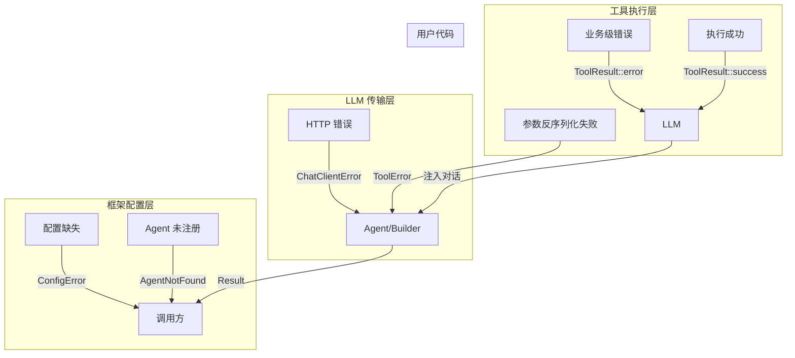

# 错误处理

RAF 采用分层错误处理策略——区分框架级错误、工具级错误和 LLM 传输错误，确保错误在正确的层级被捕获和处理。

## 错误体系总览

```
AgentError (框架级)
├── ChatClientError    — LLM 通信失败
├── ToolError          — 工具执行/反序列化失败
├── WorkflowError      — 工作流编排错误
├── ConfigError        — 配置错误（缺少 chat_client 等）
├── AgentNotFound      — Agent 未注册
├── StreamError        — 流式处理错误
├── Serialize          — 序列化/反序列化错误
└── Other(anyhow)      — 未分类错误

ToolResult (工具级)
├── ok: true, data: Some(Value)   — 成功
├── ok: false, error: Some(String) — 预期错误（文件不存在等）
```

## AgentError 枚举

```rust
pub enum AgentError {
    ChatClientError(String),    // LLM 客户端错误
    ToolError(String),          // 工具执行或参数反序列化失败
    WorkflowError(String),      // 工作流编排错误
    ConfigError(String),        // 配置错误
    AgentNotFound(String),      // Agent 未注册
    StreamError(String),        // 流式处理错误
    Serialize(String),          // 序列化/反序列化错误
    Other(#[from] anyhow::Error), // 未分类（透明透传）
}
```

每个变体都通过 `#[error("...")]` 提供人类可读的消息模板。

## Result 类型别名

```rust
pub type Result<T> = std::result::Result<T, AgentError>;
```

框架中几乎所有的异步方法都返回 `Result<T>`，统一错误类型。这使得调用方可以用 `?` 轻松传播错误。

```rust
// Agent 运行
async fn run(&self, messages: Vec<ChatMessage>, ...)
    -> Result<BoxStream<'static, Result<AgentResponseResult>>>;

// 工具执行（返回框架级错误或工具级错误）
async fn execute(&self, arguments: Value)
    -> Result<ToolResult>;
```

## 错误的三个层级

### 层级 1：框架级错误 (`AgentError`)

当框架基础设施出现问题时抛出，如：

- `ConfigError`：`AgentBuilder::build()` 未设置 `chat_client`
- `AgentNotFound`：`AgentRegistry` 找不到指定 ID 的 Agent
- `StreamError`：SSE 流解析异常
- `Serialize`：消息序列化失败

```rust
// AgentBuilder 中的典型错误
let agent = AgentBuilder::new("agent")
    // 忘记设置 chat_client
    .build()?;
// 返回：Err(AgentError::ConfigError("chat_client is required"))
```

### 层级 2：工具级错误 (`ToolResult`)

当工具执行过程中遇到预期错误时，**不应**返回 `Err(AgentError)`，而应返回 `ToolResult::error()`。

这样 LLM 可以看到错误信息并调整行为：

```rust
// ❌ 错误做法：遇到文件不存在就 panic 或返回框架错误
if !path.exists() {
    return Err(AgentError::ToolError("file not found".into()));
}

// ✅ 正确做法：返回工具级错误，LLM 可以看到并重试
if !path.exists() {
    return Ok(ToolResult::error("文件不存在: src/missing.rs"));
}
```

**两种错误的区别**：

| 类型 | 何时使用 | LLM 可见？ | 示例 |
|------|----------|-----------|------|
| `Err(AgentError::ToolError)` | 参数反序列化失败、工具执行崩溃 | 否（框架拦截） | `serde_json::from_value()` 失败 |
| `Ok(ToolResult::error(msg))` | 业务级错误（文件不存在、权限不足） | 是（注入消息历史） | 文件不存在、路径越界 |

### 层级 3：LLM 传输层错误

`AgentError::ChatClientError` 用于包装 API 通信失败，如：

- 网络超时
- API 返回 4xx/5xx 状态码
- SSE 流断开
- API Key 无效

```rust
// deepseek_client.rs 中的典型模式
let resp = client.get(&url)
    .header("Authorization", format!("Bearer {}", api_key))
    .send()
    .await
    .map_err(|e| AgentError::ChatClientError(format!(
        "deepseek list_models failed: {}", e
    )))?;
```

## ToolResult 结构体

```rust
pub struct ToolResult {
    pub ok: bool,                       // 成功标记
    pub data: Option<serde_json::Value>, // 结构化结果
    pub error: Option<String>,          // 错误描述
}
```

### 构造方法

```rust
// 成功
ToolResult::success(serde_json::json!({
    "path": "src/main.rs",
    "content": "...",
    "bytes_read": 1024,
}))

// 简单错误
ToolResult::error("文件不存在: src/missing.rs")

// 带结构化数据的错误（如校验失败的字段详情）
ToolResult::error_with_data(
    "参数校验失败",
    serde_json::json!({"invalid_fields": ["path"]}),
)
```

### 框架对 ToolResult 的处理

`FunctionInvokingChatClient` 将 `ToolResult` 序列化为 JSON 字符串，作为 `ChatMessage::tool()` 注入 LLM 对话：

```rust
// 框架内部处理逻辑（简化版）
let tool_result = tool.execute(arguments).await?;
let content = serde_json::to_string(&tool_result)?;
let message = ChatMessage::tool(content, tool_call_id);
messages.push(message);
```

## 错误传播路径



## 错误处理最佳实践

### 1. 使用 `?` 传播框架错误

```rust
async fn handle_request(agent: &dyn IAgent) -> Result<()> {
    let stream = agent.run(messages, Some(session), None).await?;
    //                   ↑ 如果 LLM 调用失败，自动返回错误
    // 处理流...
    Ok(())
}
```

### 2. 工具中用 ToolResult 处理业务错误

```rust
impl MyTool {
    async fn call(&self, arguments: Value) -> Result<ToolResult> {
        let args: Args = serde_json::from_value(arguments)
            .map_err(|e| AgentError::ToolError(format!("反序列化失败: {}", e)))?;
        //      ↑ 框架级错误：参数格式不对

        match std::fs::read_to_string(&args.path) {
            Ok(content) => Ok(ToolResult::success(json!({"content": content}))),
            Err(e) => Ok(ToolResult::error(format!("读取文件失败: {}", e))),
            //                ↑ 工具级错误：LLM 能看到并重试
        }
    }
}
```

### 3. 流式错误的处理

`agent.run()` 返回的流中，每个 item 都是 `Result<AgentResponseResult>`。需要区分流级错误和块级错误：

```rust
let mut stream = agent.run(messages, Some(session), None).await?;  // 流级错误
while let Some(item) = stream.next().await {
    match item {
        Ok(chunk) => { /* 正常处理 */ }
        Err(e) => {
            // 块级错误：可能是单个 SSE 事件解析失败
            eprintln!("流块错误: {}", e);
            // 根据业务决定是否继续
        }
    }
}
```

### 4. anyhow 透明透传

`AgentError::Other` 使用 `#[from] anyhow::Error` 实现了 `From` trait，任何 `anyhow::Error` 可自动转换。这允许在框架内部和扩展中使用 `anyhow` 而无需手动封装。

## 下一步

了解错误处理机制后，请阅读 **[Crate 地图](./crate-map.md)**，了解全部 15 个 crate 的职责和依赖关系。
