# 分层设计

RAF 采用四层"洋葱"架构，从内到外逐层封装，确保核心抽象稳定、运行时功能可替换、扩展能力按需加载。

## 四层架构总览

```mermaid
graph TB
    subgraph "第 4 层：扩展层 (Extension Layer)"
        WebSearch[rust-agent-websearch]
        RAG[rust-agent-rag]
        Rhai[rust-agent-rhai]
        Workflow[rust-agent-workflow]
        Decl[rust-agent-decl]
        Wiki[rust-agent-wiki]
        Host[rust-agent-host]
    end

    subgraph "第 3 层：框架运行时层 (Framework Runtime)"
        AgentB[AgentBuilder]
        CCA[ChatClientAgent]
        Builtin[内置工具 14个]
        Compress[压缩策略]
        Converter[AgentResponseConverter]
        CSVStore[SessionStore 实现]
    end

    subgraph "第 2 层：LLM 客户端层 (Client Layer)"
        DeepSeek[DeepSeekChatClient]
        OpenAI[OpenAiChatClient]
        Transport[SSE Transport / ChatClient]
    end

    subgraph "第 1 层：核心抽象层 (Core Abstractions)"
        IAgent[IAgent trait]
        IChatClient[IChatClient trait]
        ITool[ITool trait]
        ISession[ISession trait]
        IContextProvider[IContextProvider trait]
        ICompressionStrategy[ICompressionStrategy trait]
        ITokenCounter[ITokenCounter trait]
        ISessionStore[ISessionStore trait]
        Types[核心类型：Types / Message / Error]
    end

    %% 依赖关系
    DeepSeek --> IAgent
    OpenAI --> IAgent
    AgentB --> IAgent
    Builtin --> ITool
    Converter --> Types
    WebSearch --> IAgent
    RAG --> IAgent
    Rhai --> ITool
    Workflow --> IAgent
```



## 第 1 层：核心抽象层 (`rust-agent-core`)

**crate**: `rust-agent-core`  
**依赖**: `futures-core`, `tokio`, `serde`, `async-trait`

这是框架的基石，定义了所有核心 trait 和类型，**不包含任何具体实现**。

### 核心 Trait

| Trait | 职责 |
|-------|------|
| `IAgent` | 智能体接口：`run(messages, session, options) → BoxStream` |
| `IChatClient` | LLM 通信接口：`run(messages, options) → BoxStream` |
| `ITool` | 工具接口：`execute(arguments) → ToolResult` |
| `ISession` | 会话接口：消息历史管理和序列化 |
| `IContextProvider` | 上下文扩展点：`on_invoking()` / `on_invoked()` |
| `ICompressionStrategy` | 压缩策略：`compress(messages, budget, counter) → messages` |
| `ITokenCounter` | Token 计数：`count_tokens(messages)` |
| `ISessionStore` | 会话持久化：`save_session()` / `get_session()` |

### 核心类型

| 类型 | 文件 | 说明 |
|------|------|------|
| `AgentId` | `types.rs` | 智能体唯一标识符 |
| `AgentMetadata` | `types.rs` | 发现用的静态元数据 |
| `FinishReason` | `types.rs` | 响应结束原因枚举 |
| `ResponseMetadata` | `types.rs` | 每个 Content/Event 的元数据 |
| `ToolCall` | `types.rs` | LLM 请求的工具调用 |
| `Usage` | `types.rs` | 用量统计（含 KV 缓存） |
| `ChatMessage` | `message.rs` | 扩展消息结构 |
| `Content` | `message.rs` | 12 变体内容枚举 |
| `AgentResponseUpdate` | `message.rs` | SSE 级更新（13 变体） |
| `AgentResponseResult` | `message.rs` | 聚合响应结果 |
| `AgentResponse` | `message.rs` | 最终响应（非流式） |
| `AgentError` | `error.rs` | 统一错误类型（8 变体） |
| `ToolResult` | `tool.rs` | 工具执行结果 |
| `ToolRegistry` | `tool.rs` | 工具注册表 |
| `ModelMetadata` | `model_metadata.rs` | 模型能力边界 |
| `AgentRunOptions` | `run_options.rs` | 单次运行覆盖参数 |
| `ChatClientRunOptions` | `chat_client.rs` | 聊天客户端运行选项 |
| `WorkspaceScope` | `workspace.rs` | 工作区范围定义 |
| `ContextInjection` | `context_provider.rs` | Provider 注入载体 |
| `BoxStream` | `stream.rs` | 流类型别名 |

### 为什么这一层如此重要？

1. **稳定性保证**：所有上层代码通过 trait 编程，具体实现可随时替换。
2. **可测试性**：可以 mock `IChatClient`，编写不依赖真实 API 的单元测试。
3. **生态兼容**：第三方 crate 只需依赖 `rust-agent-core`，无需引入整个框架。
4. **版本安全**：trait 变更受 Semantic Versioning 约束，接口演化可控。

## 第 2 层：LLM 客户端层 (`rust-agent-client`)

**crate**: `rust-agent-client`  
**依赖**: `rust-agent-core`, `reqwest`, `bytes`

实现 `IChatClient` trait，提供具体 LLM API 的 HTTP/SSE 传输能力。

### 组件

| 组件 | 说明 |
|------|------|
| `ChatClient` | 通用 HTTP 客户端，处理请求构建和 SSE 流解析 |
| `DeepSeekChatClient` | DeepSeek 适配（thinking 模式、缓存追踪） |
| `OpenAiChatClient` | OpenAI 适配 |
| `ChatClientOptions` | 客户端配置（api_base、api_key、timeout） |
| `SseStream` | SSE 事件流解析器 |
| `UsageFormat` | 用量统计格式定义 |

### 设计要点

- **组合而非继承**：`DeepSeekChatClient` 包含一个 `ChatClient`（组合模式），通过 `inner()` 暴露。
- **透明传输**：HTTP 层对上层完全透明，Agent 不知道也不关心底层使用哪个提供商。
- **流式优先**：SSE 解析器将 HTTP 流式响应转换为 `futures_core::Stream`。

## 第 3 层：框架运行时层 (`rust-agent-framework`)

**crate**: `rust-agent-framework`  
**依赖**: `rust-agent-core`, `rust-agent-macros`

提供 Agent 运行时实现和开发工具。

### 组件

| 组件 | 文件 | 说明 |
|------|------|------|
| `AgentBuilder` | `builder.rs` | 流畅构建器，生成 `Arc<dyn IAgent>` |
| `ChatClientAgent` | `chat_client_agent.rs` | `IAgent` 核心实现，三阶段生命周期 |
| `FunctionInvokingChatClient` | `chat_client_decorators/` | `IChatClient` 装饰器，透明工具调用循环 |
| `PerServiceCallPersistingChatClient` | `chat_client_decorators/` | 每次 LLM 调用后自动持久化 |
| `AgentResponseConverter` | `converter.rs` | 将 SSE 增量转换为结构化内容 |
| `InMemoryHistoryProvider` | `context_providers/` | 默认会话历史注入器 |
| `WorkspaceContextProvider` | `context_providers/` | 工作区工具和路径管理 |
| `AgentSkillsProvider` | `context_providers/` | Agent Skills 加载器 |
| `SlidingWindowStrategy` | `compression/` | 滑动窗口压缩 |
| `TokenBudgetStrategy` | `compression/` | Token 预算压缩（含工具结果淘汰） |
| `CompressionPipeline` | `compression/` | 压缩策略链式组合 |
| `EstimateCounter` | `token_counter.rs` | 估算 Token 计数器 |
| `InMemorySessionStore` | `session_store/` | 内存会话存储 |
| `FileSystemSessionStore` | `session_store/` | 文件系统会话存储 |
| `IsolationScopedSessionStore` | `session_store/` | 隔离域会话存储 |
| 14 个内置工具 | `tools/` | 文件操作和命令执行工具集 |

### 设计要点

- **构建器模式**：`AgentBuilder` 封装了 `ChatClientAgent` 的复杂构造逻辑（管道组装、默认 Provider 注入）。
- **管道装饰器**：`FunctionInvokingChatClient` 包裹叶子客户端，透明处理工具调用循环——Agent 无需感知。
- **压缩管道**：`CompressionPipeline` 支持多策略链式组合，提供灵活的上下文窗口管理。
- **扩展点集成**：`ContextProvider` 链在 Agent 生命周期中插入自定义逻辑，是框架最重要的扩展机制。

## 第 4 层：扩展层

可选的独立 crate，按需引用。

| Crate | 说明 |
|-------|------|
| `rust-agent-macros` | `#[tool]` 过程宏，简化工具定义 |
| `rust-agent-websearch` | Web 搜索集成 |
| `rust-agent-rag` | 检索增强生成 |
| `rust-agent-rhai` | Rhai 脚本引擎集成 |
| `rust-agent-workflow` | 工作流编排引擎 |
| `rust-agent-decl` | 声明式 Agent DSL |
| `rust-agent-wiki` | Wiki 知识检索 |
| `rust-agent-host` | Agent 宿主运行环境 |

## 为什么这样分层？

### 关注点分离

```
┌─────────────────────────────────────────────┐
│  扩展层      → 按需加载，不污染核心           │
├─────────────────────────────────────────────┤
│  框架运行时   → 通用能力，可替换具体实现       │
├─────────────────────────────────────────────┤
│  LLM 客户端   → 传输层，对上层透明             │
├─────────────────────────────────────────────┤
│  核心抽象     → 稳定接口，Semantic Versioning  │
└─────────────────────────────────────────────┘
```

### 实际好处

1. **编译速度**：Extension crate 不被默认编译，减少了 compile time。
2. **二进制大小**：不需要的扩展不会链接到最终可执行文件。
3. **依赖解耦**：核心 crate 不依赖任何具体 LLM 提供商库（如 reqwest），仅依赖 `futures-core`、`tokio`、`serde`。
4. **版本管理**：核心抽象按 SemVer 演化，运行时实现可独立迭代。

### 增加新 LLM 提供商

只需实现第 2 层：

```rust
// 1. 实现 IChatClient
struct NewClient { /* ... */ }

#[async_trait]
impl IChatClient for NewClient {
    async fn run(&self, messages: &[ChatMessage], options: ChatClientRunOptions) -> Result<BoxStream<'static, Result<AgentResponseUpdate>>> {
        // 调用新 API，返回 SSE 流
    }
    fn model_id(&self) -> &str { "new-model" }
}

// 2. 注册到 AgentBuilder
let agent = AgentBuilder::new("agent")
    .chat_client(NewClient::new())
    .build()?;
```

不需要修改任何上层代码。

## 下一步

理解分层架构后，请继续阅读 **[类型系统](./type-system.md)**，了解框架核心类型的设计和用途。
