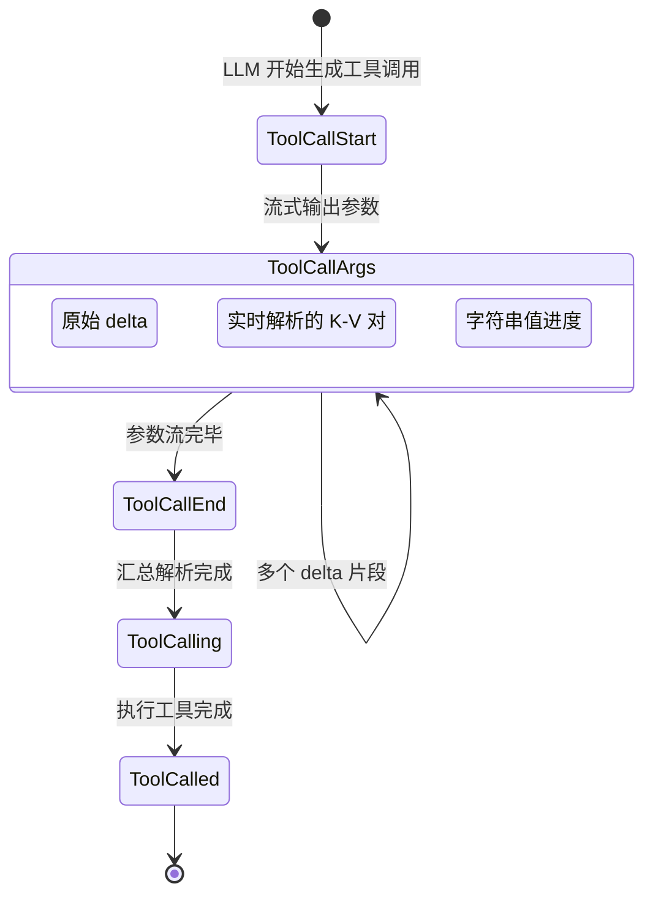
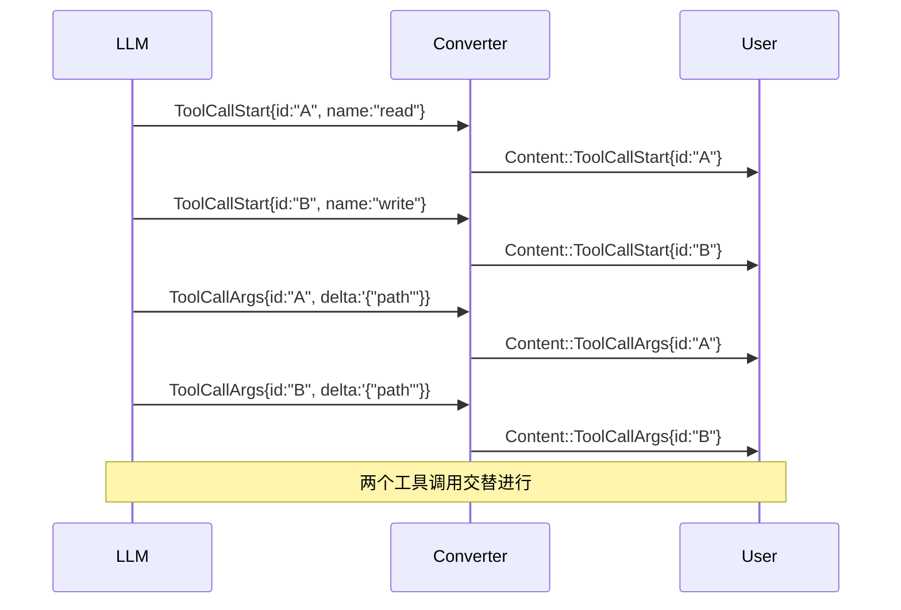

# 消息模型

RAF 的消息模型是框架数据流的核心——从用户输入到 LLM 流式输出，再到结构化的最终响应，所有数据都通过消息模型承载。

## 消息体系总览

```mermaid
flowchart LR
    subgraph "输入层"
        CM[ChatMessage]
        MR[MessageRole: System | User | Assistant | Tool]
        MS[MessageSource: External | ChatHistory | ContextProvider | ToolResult]
    end

    subgraph "传输层"
        ARU[AgentResponseUpdate<br/>13 变体]
    end

    subgraph "输出层"
        Content[Content<br/>12 变体]
        Event[Event<br/>3 变体]
        ARR[AgentResponseResult]
        AR[AgentResponse]
    end

    CM --> ARU
    ARU --> Content
    ARU --> Event
    Content --> ARR
    Event --> ARR
    ARR --> AR
```

## ChatMessage

扩展的聊天消息结构，兼容 OpenAI 的 `tool_calls` 和 `tool_call_id`。

```rust
pub struct ChatMessage {
    pub role: MessageRole,              // 消息角色
    pub content: String,                // 消息内容
    pub name: Option<String>,           // 可选名称标签
    pub tool_calls: Option<Vec<ToolCall>>,    // 助手消息的工具调用列表
    pub tool_call_id: Option<String>,         // 工具消息的关联 ID
    pub source: Option<MessageSource>,        // 消息来源标记
}
```

### MessageRole

```rust
pub enum MessageRole {
    System,     // 系统指令，设定 Agent 行为
    User,       // 用户输入
    Assistant,  // Agent 回复
    Tool,       // 工具执行结果
}
```

### 便捷构造方法

```rust
// 系统指令
let sys = ChatMessage::system("你是一个代码助手，可以使用文件工具。");

// 用户消息
let user = ChatMessage::user("请读取 src/main.rs 的内容");

// 助手回复（纯文本）
let reply = ChatMessage::assistant("好的，我来读取文件。");

// 助手回复（含工具调用）
let tool_calls = vec![ToolCall {
    id: "call_001".into(),
    name: "read_file".into(),
    arguments: json!({"path": "src/main.rs"}),
}];
let with_call = ChatMessage::assistant_with_tools("正在读取文件...", tool_calls);

// 工具执行结果
let result = ChatMessage::tool("文件内容: fn main() {} ...", "call_001");
```

### MessageSource

用于追踪消息起源，防止重复持久化。

```rust
pub enum MessageSource {
    External,         // 外部用户输入
    ChatHistory,      // 从聊天历史加载
    ContextProvider,  // 由 ContextProvider 注入
    ToolResult,       // 工具执行结果
}
```

`InMemoryHistoryProvider` 使用此标记过滤消息，避免在保存时重复存储历史消息。

## Content 枚举：12 个变体

`Content` 是公开 API 的内容载体，通过 `AgentResponseConverter` 从 `AgentResponseUpdate` 转换而来。

```rust
pub enum Content {
    Text(TextContent),                          // 文本增量
    Reasoning(ReasoningContent),                // 推理文本增量 (DeepSeek thinking)
    Uri(UriContent),                            // URI 引用
    // ── 工具调用生命周期 ──
    ToolCallStart(ToolCallStartContent),        // ① 开始
    ToolCallArgs(ToolCallArgsContent),          // ② 参数流式到达
    ToolCallArgsParsed(ToolCallArgsParsedContent),  // ②b 参数已解析
    ToolCallArgsProgress(ToolCallArgsProgressContent), // ②c 参数接收中
    ToolCallEnd(ToolCallEndContent),            // ③ 参数完毕
    ToolCalling(ToolCallingContent),            // ④ 完整调用（汇总）
    ToolCalled(ToolCalledContent),              // ⑤ 执行结果
    Usage(UsageContent),                        // 用量统计
    Error(ErrorContent),                        // 错误信息
}
```

### 工具调用生命周期

工具调用从 LLM 到执行完成经历完整的 5 阶段生命周期：



各阶段详解：

#### ① `ToolCallStart` — 开始

```rust
pub struct ToolCallStartContent {
    pub meta: ResponseMetadata,
    pub call_id: String,   // 工具调用唯一 ID
    pub name: String,       // 工具名称
}
```

LLM 刚开始生成新的工具调用时发出，不携带参数。UI 可显示"正在调用 XX 工具"。

#### ② `ToolCallArgs` — 参数流式到达

```rust
pub struct ToolCallArgsContent {
    pub meta: ResponseMetadata,
    pub call_id: String,
    pub args_delta: String,  // JSON 参数片段
}
```

SSE 流中每个 JSON delta 对应一次事件。消费方需自行拼接。

#### ②b `ToolCallArgsParsed` — 参数实时解析

```rust
pub struct ToolCallArgsParsedContent {
    pub meta: ResponseMetadata,
    pub call_id: String,
    pub name: String,        // 参数名
    pub value: serde_json::Value,  // 参数值
}
```

`StreamingArgsParser` 在 JSON 参数流中检测到完整的键值对时立即发出，无需等待整个 JSON 对象。UI 可据此展示已完成的参数。

#### ②c `ToolCallArgsProgress` — 参数接收进度

```rust
pub struct ToolCallArgsProgressContent {
    pub meta: ResponseMetadata,
    pub call_id: String,
    pub name: String,
    pub received: usize,      // 已接收字节数
    pub value: serde_json::Value,  // 当前值片段
}
```

当 LLM 正在生成长文本参数（如代码内容）时，此事件持续发出，携带接收进度和内容预览。

#### ③ `ToolCallEnd` — 参数完毕

```rust
pub struct ToolCallEndContent {
    pub meta: ResponseMetadata,
    pub call_id: String,
}
```

参数流式传输完成，但尚未被解析为结构化 JSON。消费方可标记"参数接收完成，准备执行"。

#### ④ `ToolCalling` — 完整调用

```rust
pub struct ToolCallingContent {
    pub meta: ResponseMetadata,
    pub call_id: String,
    pub name: String,
    pub arguments: serde_json::Value,  // 已解析的完整参数
}
```

流结束后由 `AgentResponseConverter::flush_tool_calls()` 生成，是所有流式阶段的汇总，**可直接传给工具执行**。

#### ⑤ `ToolCalled` — 执行结果

```rust
pub struct ToolCalledContent {
    pub meta: ResponseMetadata,
    pub call_id: String,
    pub result: Option<String>,  // 成功结果
    pub error: Option<String>,   // 错误信息
}
```

工具执行完成后发出。`result` 和 `error` 互斥。

## AgentResponseUpdate：13 个变体

内部格式，对应 SSE 事件粒度。`Converter` 将其转换为 `Content` 和 `Event`。

```rust
pub enum AgentResponseUpdate {
    TextDelta { delta: String },
    ReasoningDelta { delta: String },
    ToolCallDelta { index: usize, id: Option<String>, name: Option<String>, arguments_delta: String },
    ToolCallStart { id: String, name: String },
    ToolCallArgs { id: String, args_delta: String },
    ToolCallEnd { id: String },
    ToolCalled { id: String, result: Option<String>, error: Option<String> },
    ToolApprovalRequest { call_id: String, name: String, arguments: Value, description: String },
    Usage { usage: Usage },
    Finish { finish_reason: FinishReason, usage: Option<Usage> },
    Error { message: String },
    ResponseMetadata { id: Option<String>, model: Option<String> },
}
```

**注意**：`ToolCallDelta` 是旧版格式（flat tool call delta），当 SSE 格式不区分 start/args/end 时使用。`Converter` 会将其分解为 `ToolCallStart`、`ToolCallArgs`、`ToolCallEnd` 序列。

## AgentResponseResult

公开 API 的流式块类型，每个 yield 产生一个结果。

```rust
pub struct AgentResponseResult {
    pub id: Option<String>,
    pub model: Option<String>,
    pub finish_reason: Option<FinishReason>,
    pub contents: Vec<Content>,
    pub events: Vec<Event>,
}
```

## AgentResponse

非流式的聚合响应，通过 `collect_agent_response()` 收集。

```rust
pub struct AgentResponse {
    pub id: Option<String>,
    pub model: Option<String>,
    pub text: String,                        // 完整文本回复
    pub reasoning_text: Option<String>,      // 推理文本（thinking 模式）
    pub tool_calls: Vec<ToolCall>,           // 工具调用列表
    pub tool_messages: Vec<ChatMessage>,     // 工具结果消息（用于持久化）
    pub turn_transcript: Vec<ChatMessage>,   // 本轮完整对话记录
    pub finish_reason: Option<FinishReason>,
    pub usage: Option<Usage>,
    pub source_agent_id: Option<AgentId>,
}
```

## 流式管道全景

```
┌────────────────────────────┐
│  LLM API (SSE Stream)      │
│  data: {"choices":[{"delta"│  HTTP SSE
│  :{"content":"Hello"}}]}   │
└──────────┬─────────────────┘
           │ SseStream 解析
           ▼
┌────────────────────────────┐
│  AgentResponseUpdate       │  13 个变体，内部格式
│  TextDelta{delta:"Hello"}  │
└──────────┬─────────────────┘
           │ AgentResponseConverter
           ▼
┌────────────────────────────┐
│  Content + Event           │  12 + 3 个变体
│  Text(TextContent{...})    │  公开 API
│  ToolCallStart{...}        │
│  ToolCalling{...}          │
│  ...                       │
└──────────┬─────────────────┘
           │ StreamExt::fold / inspect
           ▼
┌────────────────────────────┐
│  用户代码                   │
│  while let Some(chunk) ...  │
└────────────────────────────┘
```

## 并行工具调用支持

`AgentResponseConverter` 使用 `HashMap<String, ToolCallAccumulator>` 按 `call_id` 管理状态，天然支持并行工具调用。每个 `call_id` 独立跟踪：

- `name`：工具名称
- `args`：累积的参数字符串
- `start_emitted`：防止重复发出 `ToolCallStart`



## 下一步

掌握消息模型后，请阅读 **[错误处理](./error-handling.md)**，了解框架的错误类型和传播机制。
