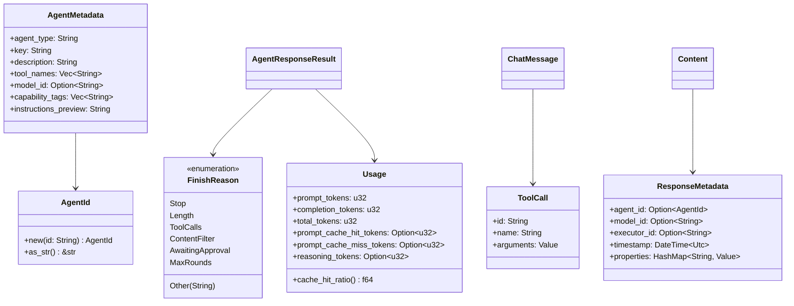
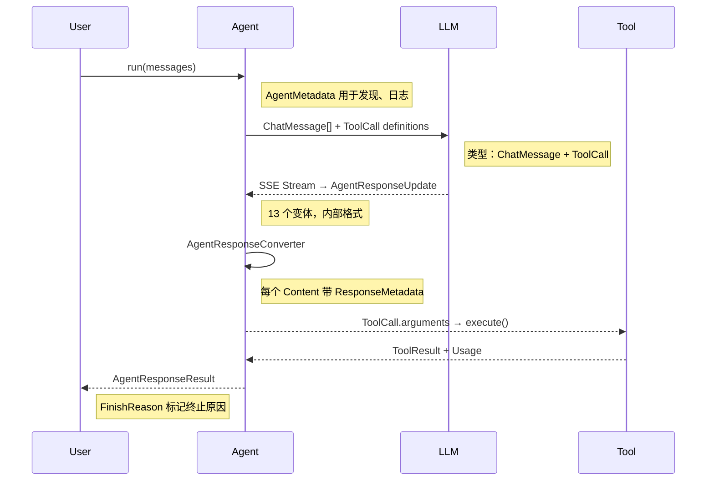

# 类型系统

本章详解 RAF 中六个核心类型的设计、相互关系和在整个框架数据流中的角色。

## 类型关系图



## AgentId

智能体的全局唯一标识符，是一个 newtype wrapper。

```rust
pub struct AgentId(String);

impl AgentId {
    pub fn new(id: impl Into<String>) -> Self;
    pub fn as_str(&self) -> &str;
}
```

**使用场景**：

- Agent 注册和发现：`AgentRegistry` 通过 `AgentId` 索引 Agent
- 响应追踪：`ResponseMetadata.agent_id` 标记每条消息的来源 Agent
- 日志和调试：`AgentId` 实现了 `Display` 和 `AsRef<str>`

```rust
let id = AgentId::new("file-agent");
assert_eq!(id.as_str(), "file-agent");
assert_eq!(format!("{}", id), "file-agent");
```

## AgentMetadata

描述 Agent 身份和能力的静态元数据，用于**动态发现**——前端和编排引擎可在不调用 Agent 的情况下查询完整的能力矩阵。

```rust
pub struct AgentMetadata {
    pub agent_type: String,           // 类名，如 "ChatClientAgent"
    pub key: String,                  // 短标识符
    pub description: String,         // 人类可读描述
    pub tool_names: Vec<String>,     // 已注册工具列表，如 ["read_file", "web_search"]
    pub model_id: Option<String>,    // LLM 模型标识符，如 "deepseek-chat"
    pub capability_tags: Vec<String>, // 能力标签，如 ["file_operations", "code"]
    pub instructions_preview: String, // 系统指令前 200 字符预览
}
```

**使用场景**：

- **前端 UI**：展示 Agent 能力列表和说明
- **编排引擎**：根据 `capability_tags` 路由任务到合适的 Agent
- **工具发现**：`tool_names` 告知调用方该 Agent 能调用哪些工具

```rust
let meta = agent.metadata();
println!("Agent: {}", meta.key);
println!("Tools: {:?}", meta.tool_names);
println!("Model: {:?}", meta.model_id);
```

## FinishReason

描述 LLM 响应结束的原因，由 Agent 返回。

```rust
pub enum FinishReason {
    Stop,              // 正常完成，生成了完整回复
    Length,            // 因 max_tokens 限制被截断
    ToolCalls,         // LLM 请求调用工具，等待工具结果
    ContentFilter,     // 被内容安全过滤器拦截
    AwaitingApproval,  // 工具需要人工审批，暂停等待
    MaxRounds,         // 工具调用循环达到最大轮次限制
    Other(String),     // 其他自定义原因（`#[serde(untagged)]`）
}
```

**流程中的角色**：

1. `Stop`：Agent 完成推理，最终响应
2. `ToolCalls`：触发工具执行循环，`FunctionInvokingChatClient` 执行工具后重新调用 LLM
3. `AwaitingApproval`：触发审批等待，调用方收集审批决定后通过 `AgentRunOptions.tool_approval_responses` 恢复
4. `MaxRounds`：防止无限工具循环的安全阀

```rust
match finish_reason {
    FinishReason::Stop => println!("正常完成"),
    FinishReason::ToolCalls => println!("正在调用工具..."),
    FinishReason::MaxRounds => eprintln!("工具循环超限！"),
    _ => {}
}
```

## ResponseMetadata

每个 `Content` 和 `Event` 变体都携带的元数据，用于追踪消息来源和时序。

```rust
pub struct ResponseMetadata {
    pub agent_id: Option<AgentId>,        // 产生此内容的 Agent
    pub model_id: Option<String>,         // 使用的 LLM 模型
    pub executor_id: Option<String>,      // 执行器 ID（通常等于 AgentId）
    pub timestamp: DateTime<Utc>,         // 生成时间戳
    pub properties: HashMap<String, serde_json::Value>,  // 扩展属性
}
```

**作用**：在多 Agent 编排场景中，`ResponseMetadata` 使得下游消费者能区分消息来源。例如，Workflow 编排中的 child Agent 响应通过 `agent_id` 标记。

## ToolCall

LLM 请求的工具调用，由框架解析并执行。

```rust
pub struct ToolCall {
    pub id: String,              // 调用唯一 ID（LLM 生成）
    pub name: String,            // 工具名称
    pub arguments: serde_json::Value,  // 工具参数（JSON）
}
```

**生命周期**：

```
LLM 生成 ToolCall JSON chunk → 框架反序列化 → ToolRegistry 查找 → execute(arguments) → ToolResult
```

**在 ChatMessage 中的位置**：

```rust
// 助手消息携带 ToolCall
let msg = ChatMessage {
    role: MessageRole::Assistant,
    tool_calls: Some(vec![ToolCall {
        id: "call_123".into(),
        name: "read_file".into(),
        arguments: serde_json::json!({"path": "src/main.rs"}),
    }]),
    ..
};

// 工具结果消息通过 tool_call_id 关联
let result = ChatMessage {
    role: MessageRole::Tool,
    tool_call_id: Some("call_123".into()),
    content: "文件内容...".into(),
    ..
};
```

## Usage

描述每次 LLM 调用的 Token 消耗，包含 KV 缓存统计。

```rust
pub struct Usage {
    pub prompt_tokens: u32,               // 输入 Token 数
    pub completion_tokens: u32,           // 输出 Token 数
    pub total_tokens: u32,                // 总 Token 数
    pub prompt_cache_hit_tokens: Option<u32>,  // KV 缓存命中
    pub prompt_cache_miss_tokens: Option<u32>, // KV 缓存未命中
    pub reasoning_tokens: Option<u32>,    // 推理 Token（thinking 模式）
}
```

**`cache_hit_ratio()` 方法**：智能计算缓存命中率，兼容两种计算方式：

- DeepSeek 返回 `prompt_cache_miss_tokens`：`hit / (hit + miss)`
- OpenAI 不返回 miss：`hit / prompt_tokens`

```rust
let usage = response.usage.unwrap_or_default();
println!("总 Token: {}", usage.total_tokens);
println!("缓存命中率: {:.1}%", usage.cache_hit_ratio() * 100.0);
```

## 类型之间的数据流



## 下一步

理解类型系统后，请阅读 **[消息模型](./message-model.md)**，深入了解 `Content` 枚举的 12 个变体和流式管道。
