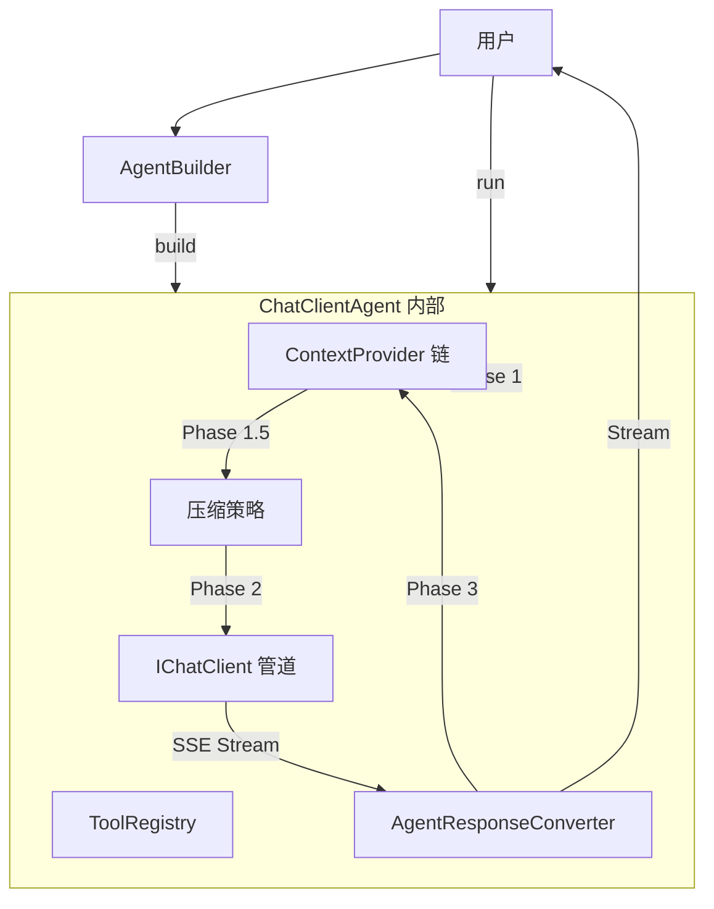

# 第 3 章：Agent 引擎

本章深入 `ChatClientAgent` 内部机制——从构建、运行生命周期、流式管道到压缩策略，详解 Agent 运行时引擎的每个环节。

## 章节导航

1. **[ChatClientAgent](./chat-client-agent.md)** — 结构体字段、构造方法、关键配置方法。它如何持有 `IChatClient`、`ToolRegistry` 和 `ContextProvider` 链。
2. **[AgentBuilder 构建器](./agent-builder.md)** — 流畅构建器模式。`chat_client()`、`instructions()`、`with_tool()`、`add_context_provider()`、`max_tool_rounds()`、`build()` 的完整使用指南。
3. **[Run 生命周期](./run-lifecycle.md)** — 三阶段生命周期：Phase 1（Pre-invocation：ContextProvider）、Phase 1.5（Compression）、Phase 2（LLM 调用 + 工具循环）、Phase 3（Post-invocation：持久化、通知）。完整 Mermaid 序列图。
4. **[流式管道](./streaming.md)** — `BoxStream` 类型详解，响应如何从 LLM 流经 `AgentResponseConverter` 到最终 `AgentResponseResult`。`StreamExt::collect` 或 `inspect` 的消费模式。
5. **[压缩策略](./compression-strategies.md)** — `ICompressionStrategy`、`TokenBudgetStrategy`、`SlidingWindowStrategy`、`CompressionPipeline`、`ITokenCounter`、`EstimateCounter`。它们如何集成到生命周期中。

## 阅读建议

- **构建章节（ChatClientAgent、AgentBuilder）**：先读 `AgentBuilder` 再读 `ChatClientAgent`——Builder 是你日常使用的接口，而 `ChatClientAgent` 是内部实现。
- **运行时章节（Run 生命周期、流式管道）**：需要理解 Agent 内部机制或编写自定义 ContextProvider 时必读。
- **压缩策略**：当你遇到上下文窗口溢出问题或需要优化 Token 消耗时查阅。

## 核心架构概览

## 关键数据流

一次 `run()` 调用的核心数据经过：

1. **用户消息** → `run(messages, session, options)`
2. **ContextProvider 链** 依次执行 `on_invoking()`，注入 `ContextResult`
3. **消息合并**：[system + instructions] + [provider_messages] + [user_messages]
4. **压缩检查**：若配置了策略且 token 超预算，压缩消息列表
5. **LLM 调用**：`IChatClient::run(messages, tool_defs)` → SSE Stream
6. **Converter**：`AgentResponseUpdate` → `AgentResponseResult` + `Content` + `Event`
7. **输出流**：通过 channel 分叉，非阻塞执行 Phase 3

每一步都将在后续章节详述。

---

## 上一步

← [第 2 章：核心架构](../02-core-architecture/INDEX.md)

## 下一步

阅读完本章后，建议继续阅读 **[工具系统](../04-tool-system/itool-trait.md)** 以学习 Agent 如何通过工具与外部世界交互，掌握 ITool trait、ToolRegistry 和内置工具。
