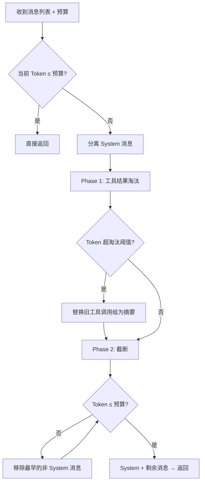

# 压缩策略

当对话历史增长到超过模型上下文窗口时，RAF 通过压缩策略自动裁剪消息列表。本章详解三种内置策略的工作原理、使用方式和扩展方法。

## 压缩在生命周期中的位置

```
Phase 1: Pre-invocation → 组装完整消息列表
Phase 1.5: Compression → 检查 token 预算 → 压缩消息 ← 本章重点
Phase 2: LLM 调用 → 使用压缩后的消息
```

## ICompressionStrategy trait

```rust
pub trait ICompressionStrategy: Send + Sync {
    fn name(&self) -> &str;

    fn compress(
        &self,
        messages: Vec<ChatMessage>,
        budget: usize,              // 目标 token 预算
        counter: &dyn ITokenCounter, // token 计数器
    ) -> Result<Vec<ChatMessage>>;
}
```

## 基于 Token 预算的压缩准备

压缩机制的触发条件十分严格——只有同时配置了压缩策略和 Token 计数器才会启用。这一设计确保了只有当开发者明确需要压缩能力时，消息列表才会被修改。

触发压缩需要满足以下条件：压缩策略已设置、Token 计数器已配置、当前消息的 Token 数超过了模型元数据提供的 `input_budget()`。`ModelMetadata.input_budget()` 的计算方式为 `context_window_tokens - max_output_tokens`，即上下文窗口扣除最大输出后剩余的输入预算。具体的 `IChatClient` 实现（如 `ChatClient`）负责提供准确的 `model_metadata()`。

如果压缩失败，框架不会中断流程——而是使用原始消息继续执行，并通过 tracing 记录警告日志。这确保了压缩策略的 bug 不会导致 Agent 完全不可用。

## SlidingWindowStrategy（滑动窗口）

最简单的压缩策略——仅保留最近的 N 条消息，丢弃更早的消息。

```rust
pub struct SlidingWindowStrategy {
    pub max_messages: usize,  // 保留的非系统消息最大数量
}
```

### 工作原理

1. 分离系统消息（始终保留）和非系统消息
2. 如果非系统消息 ≤ `max_messages`，不做任何操作
3. 否则，只保留最近的 `max_messages` 条非系统消息

```rust
impl ICompressionStrategy for SlidingWindowStrategy {
    fn compress(
        &self,
        messages: Vec<ChatMessage>,
        _budget: usize,      // 不关心 token 预算
        _counter: &dyn ITokenCounter,  // 不进行 token 计数
    ) -> Result<Vec<ChatMessage>> {
        // 分离 system/non-system
        // 保留最近 max_messages 条
        // system + recent → 返回
    }
}
```

### 使用方式

```rust
use rust_agent_framework::compression::SlidingWindowStrategy;

let agent = AgentBuilder::new("agent")
    .chat_client(client)
    .with_compression_strategy(Arc::new(SlidingWindowStrategy::new(20)))
    .build()?;
```

**适用场景**：简单交互、不需要复杂预算计算的场景。

**局限**：不关心实际 token 数。如果单条消息很大（如注入的代码上下文），仍可能超出预算。

## TokenBudgetStrategy（Token 预算）

更精细的策略——基于实际 token 数量进行压缩。遵循两层淘汰机制：

1. 先尝试淘汰旧的工具调用组（替换为摘要）
2. 如果仍超预算，从最早的消息开始逐个移除

```rust
pub struct TokenBudgetStrategy {
    /// 工具结果淘汰阈值比例
    /// 默认 0.5：当 token 使用达到预算的 50% 时开始淘汰工具结果组
    pub tool_result_eviction_threshold: f64,
}
```

### 工作原理



### Phase 1: 工具结果淘汰

将旧的 `Assistant(tool_calls) + Tool(result)` 消息组替换为摘要消息：

```rust
// 原始消息组：
// Assistant("好的，我来读取文件", tool_calls=[read_file("main.rs")])
// Tool("文件内容: fn main() {}")

// 替换为摘要：
// Assistant("[Earlier tool calls: 1 call(s) were made and completed]")
```

这大大减少了 token 消耗，同时保留了"曾经调用过工具"的语义信息。

### Phase 2: 逐条截断

从最早的非 System 消息开始移除，直到总 token 数符合预算。

### 使用方式

```rust
use rust_agent_framework::compression::TokenBudgetStrategy;

let agent = AgentBuilder::new("agent")
    .chat_client(client)
    .with_compression_strategy(Arc::new(
        TokenBudgetStrategy::new()
            .with_eviction_threshold(0.6)  // 达到 60% 预算时开始淘汰工具结果
    ))
    .with_token_counter(Arc::new(EstimateCounter::new()))
    .build()?;
```

**适用场景**：需要精确控制 token 消耗、对话历史较长的场景。

**局限**：依赖 `ITokenCounter` 的计数的准确性；截断可能丢失重要的上下文信息。

## CompressionPipeline（压缩管道）

链式组合多个压缩策略，按顺序应用：

```rust
pub struct CompressionPipeline {
    strategies: Vec<Box<dyn ICompressionStrategy>>,
}
```

### 工作原理

```rust
impl ICompressionStrategy for CompressionPipeline {
    fn compress(&self, mut messages: Vec<ChatMessage>, budget: usize, counter: &dyn ITokenCounter)
        -> Result<Vec<ChatMessage>>
    {
        for strategy in &self.strategies {
            // 如果已符合预算，跳过后续策略
            if counter.count_tokens(&messages) <= budget {
                break;
            }
            messages = strategy.compress(messages, budget, counter)?;
        }
        Ok(messages)
    }
}
```

### 推荐组合

```rust
use rust_agent_framework::compression::{CompressionPipeline, SlidingWindowStrategy, TokenBudgetStrategy};

let pipeline = CompressionPipeline::new()
    .add_strategy(Box::new(SlidingWindowStrategy::new(100)))  // 粗粒度：消息数量限制
    .add_strategy(Box::new(TokenBudgetStrategy::new()));      // 细粒度：精确 token 控制

let agent = AgentBuilder::new("agent")
    .chat_client(client)
    .with_compression_strategy(Arc::new(pipeline))
    .with_token_counter(Arc::new(EstimateCounter::new()))
    .build()?;
```

**执行顺序**：`SlidingWindow` 先做粗粒度裁剪，`TokenBudget` 再做精确的 token 级控制。如果 `SlidingWindow` 后已符合预算，`TokenBudget` 被跳过。

## ITokenCounter trait

压缩策略需要准确的 Token 计数。`ITokenCounter` 提供两种计数方法：

```rust
pub trait ITokenCounter: Send + Sync {
    fn count_tokens(&self, messages: &[ChatMessage]) -> usize;
    fn count_text_tokens(&self, text: &str) -> usize;
}
```

### EstimateCounter（估算计数器）

默认实现，不需要额外依赖。基于启发式规则：

- 每 token ≈ 4 个字符
- 每条消息格式开销 ≈ 4 tokens（角色标签、分隔符）
- 工具调用额外开销（名称、参数）
- 助手响应引导 token ≈ 3

```rust
impl ITokenCounter for EstimateCounter {
    fn count_tokens(&self, messages: &[ChatMessage]) -> usize {
        let mut total = 0;
        for msg in messages {
            total += 4;  // 格式开销
            total += self.estimate(&msg.content);  // 内容
            // ... 工具调用开销 ...
        }
        total += 3;  // assistant priming
        total
    }

    fn estimate(&self, text: &str) -> usize {
        (text.len() as f32 / self.chars_per_token).ceil() as usize
    }
}
```

**特点**：快速、无外部依赖、估算偏保守（略高估），适用于不需要精确控制的场景。

### TiktokenCounter（精确计数器）

需要启用 `tiktoken` feature：

```toml
rust-agent-framework = { git = "...", features = ["tiktoken"] }
```

```rust
#[cfg(feature = "tiktoken")]
pub struct TiktokenCounter {
    encoding: Option<tiktoken_rs::CoreBPE>,
    fallback: EstimateCounter,  // tiktoken 不可用时回退
}
```

TiktokenCounter 使用 OpenAI 的 tiktoken 库进行字节对编码（BPE）级别的 Token 计数，比估算计数器精确得多。当模型编码不可用时自动回退到 `EstimateCounter`，确保计数始终可用。

## 压缩效果验证

```rust
let counter = EstimateCounter::new();
let strategy = TokenBudgetStrategy::new();

let original = vec![
    ChatMessage::system("你是一个助手"),
    ChatMessage::user("问题 1"), ChatMessage::assistant("回答 1"),
    ChatMessage::user("问题 2"), ChatMessage::assistant("回答 2"),
    // ... 50 条历史消息 ...
];

let budget = 500;  // 目标预算
let before = counter.count_tokens(&original);
let compressed = strategy.compress(original.clone(), budget, &counter)?;
let after = counter.count_tokens(&compressed);

println!("压缩前: {} tokens, {} 条消息", before, original.len());
println!("压缩后: {} tokens, {} 条消息", after, compressed.len());
println!("压缩比: {:.1}%", (1.0 - after as f64 / before as f64) * 100.0);
```

## 自定义压缩策略

实现 `ICompressionStrategy` trait：

```rust
use rust_agent_core::{ICompressionStrategy, ChatMessage, ITokenCounter, Result, MessageRole};

/// 保留最近 N 轮对话（每轮 = user + assistant 对）
pub struct RoundWindowStrategy {
    pub max_rounds: usize,
}

impl ICompressionStrategy for RoundWindowStrategy {
    fn name(&self) -> &str { "RoundWindow" }

    fn compress(
        &self,
        messages: Vec<ChatMessage>,
        _budget: usize,
        _counter: &dyn ITokenCounter,
    ) -> Result<Vec<ChatMessage>> {
        let mut system_msgs = Vec::new();
        let mut rounds: Vec<Vec<ChatMessage>> = Vec::new();
        let mut current_round = Vec::new();

        for msg in messages {
            match msg.role {
                MessageRole::System => system_msgs.push(msg),
                MessageRole::User => {
                    if !current_round.is_empty() {
                        rounds.push(std::mem::take(&mut current_round));
                    }
                    current_round.push(msg);
                }
                _ => current_round.push(msg),
            }
        }
        if !current_round.is_empty() {
            rounds.push(current_round);
        }

        // 只保留最近 max_rounds 轮
        let keep_from = rounds.len().saturating_sub(self.max_rounds);
        let mut result = system_msgs;
        for round in rounds.into_iter().skip(keep_from) {
            result.extend(round);
        }
        Ok(result)
    }
}

// 使用
let agent = AgentBuilder::new("agent")
    .chat_client(client)
    .with_compression_strategy(Arc::new(RoundWindowStrategy { max_rounds: 5 }))
    .with_token_counter(Arc::new(EstimateCounter::new()))
    .build()?;
```

## 声明式配置（YAML / JSON）

`PromptAgentData` 支持直接在 Agent 声明中配置压缩，由 `DeclAgentBuilder` 接入 `AgentBuilder`：

```yaml
kind: prompt
name: long-context-agent
compression:
  kind: sliding_window
  windowSize: 30
tokenCounter:
  kind: estimate
```

支持的 `compression.kind`：

| kind | 对应 Rust 类型 | 主要参数 |
|------|---------------|---------|
| `sliding_window` | `SlidingWindowStrategy` | `windowSize` |
| `token_budget` | `TokenBudgetStrategy` | `toolResultEvictionThreshold`（可选） |

`tokenCounter.kind` 目前仅 `estimate`（`EstimateCounter`）。未配置 `tokenCounter` 但配置了 `compression` 时，自动使用 estimate。

---

## 最佳实践

1. **始终同时配置策略和计数器**：没有计数器的压缩策略会被跳过。
2. **使用估算计数器节省依赖**：大多数场景下 `EstimateCounter` 足够准确。
3. **管道组合**：先粗后细——`SlidingWindow` 控制消息数量，`TokenBudget` 控制精确 token。
4. **保守估算**：`EstimateCounter` 有意略高估，确保不超出上下文窗口。
5. **在生产环境启用精确计数**：使用 `tiktoken` feature 获得精确的 token 计数，避免低估导致的截断。

## 下一步

关于 Agent 引擎的深入内容到此结束。如需了解工作流编排、Web 搜索、RAG 等扩展能力，请参考各扩展 crate 的文档。
