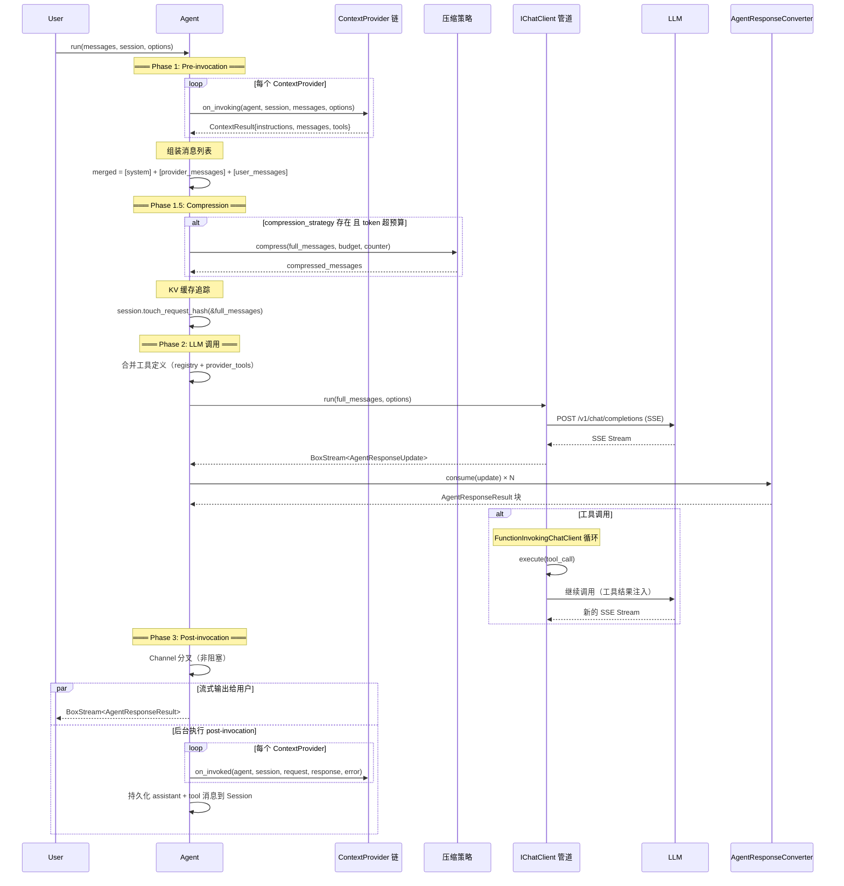

# Run 生命周期

`ChatClientAgent::run()` 是 Agent 的核心执行方法，采用严格的三阶段生命周期。理解每个阶段的触发条件和数据流对于编写 ContextProvider 和调试 Agent 行为至关重要。

## 三阶段全景



## Phase 1: Pre-invocation（预调用）

**时机**：Agent 收到 `run()` 调用后，LLM 调用之前。

**目的**：让 ContextProvider 有机会注入额外的指令、消息和工具。

### 执行流程

```rust
// Phase 1: Pre-invocation
let mut merged_instructions = String::new();
let mut merged_provider_messages = Vec::new();
let mut merged_provider_tools = Vec::new();

if let Some(ref sess) = session {
    for provider in &self.context_providers {
        let injection = provider
            .on_invoking(self, sess.as_ref(), &messages, &run_options)
            .await
            .unwrap_or_default();  // 单个 Provider 失败不影响整体

        // 合并指令
        if let Some(inst) = injection.instructions {
            if !merged_instructions.is_empty() {
                merged_instructions.push_str("\n\n");
            }
            merged_instructions.push_str(&inst);
        }

        // 合并消息（支持替换模式）
        if injection.replace_messages {
            merged_provider_messages = injection.messages;
        } else {
            merged_provider_messages.extend(injection.messages);
        }

        // 合并工具
        merged_provider_tools.extend(injection.tools);
    }
}
```

### 消息组装顺序

```
[system (instructions + merged_instructions)]
  + [provider_messages (过滤 System 角色)]
  + [user_messages (过滤 System 角色)]
```

最终的消息顺序：系统指令在最前，然后是 ContextProvider 注入的上下文，最后是用户消息。这确保用户输入在上下文的末尾，LLM 能直接响应。

### 输入消息处理

- 调用方传入的 `System` 角色消息被过滤掉——Agent 的系统指令由 `instructions` 字段统一管理。
- `user_messages` 部分（非 System）被保留用于构建 turn transcript。

## Phase 1.5: Compression（压缩）

**时机**：消息组装完成后，LLM 调用之前。

**触发条件**（三个条件同时满足）：

1. `compression_strategy` 已配置
2. `token_counter` 已配置
3. 当前消息的 Token 数超过了 `model_metadata.input_budget()`

```rust
// Phase 1.5: Compression
if let (Some(ref strategy), Some(ref counter)) =
    (&self.compression_strategy, &self.token_counter)
{
    if let Some(model_metadata) = self.chat_client.model_metadata() {
        let budget = model_metadata.input_budget();
        let current_tokens = counter.count_tokens(&full_messages);
        if current_tokens > budget {
            // 执行压缩
            match strategy.compress(full_messages.clone(), budget, counter.as_ref()) {
                Ok(compressed) => full_messages = compressed,
                Err(e) => {
                    // 压缩失败不中断流程，使用原始消息
                    tracing::warn!("Compression failed, using original messages");
                }
            }
        }
    }
}
```

**注意事项**：

- 如果 `chat_client.model_metadata()` 返回 `None`，压缩不会触发（因为无法确定预算）
- 压缩失败时使用原始消息继续——防止压缩策略 bug 导致 Agent 不可用
- `model_metadata` 需由具体的 `IChatClient` 实现提供（如 `ChatClient` 的 `model_metadata()` 方法）

## Phase 2: LLM 调用

**目的**：向 LLM 发送消息并处理流式响应。

### 2.1 工具定义合并

```rust
// 从 ToolRegistry 和 Provider 中收集工具定义
let registry = self.tools.read().await;
let mut tool_defs: Vec<serde_json::Value> = Vec::new();

// 1. Agent 注册的工具
for tool in registry.list() {
    tool_defs.push(serde_json::json!({
        "type": "function",
        "function": {
            "name": tool.name(),
            "description": tool.description(),
            "parameters": tool.parameters(),
        }
    }));
}

// 2. Provider 注入的工具（去重）
let mut seen: HashSet<String> = tool_defs.iter()
    .filter_map(|d| d["function"]["name"].as_str().map(String::from))
    .collect();

for tool in &merged_provider_tools {
    let name = tool.name().to_string();
    if seen.insert(name) {
        tool_defs.push(/* ... */);
    }
}

// 注入到 ChatClientRunOptions
client_opts.tools = tool_defs;
client_opts.provider_tools = merged_provider_tools;
```

**去重策略**：Agent 注册的工具优先。如果 Provider 注入了同名工具，会被跳过。

### 2.2 LLM 流式调用

```rust
let stream = self.chat_client.run(&full_messages, client_opts).await?;
```

这里的 `self.chat_client` 已是管道包装后的客户端（如 `FunctionInvokingChatClient` → `DeepSeekChatClient`），所以工具调用循环对 Agent 是透明的。

### 2.3 流转换

`AgentResponseConverter` 将 `AgentResponseUpdate` 流转换为 `AgentResponseResult` 流：

```rust
let converter = AgentResponseConverter::new(agent_id, executor_id, &run_options);

let converted = futures_util::stream::unfold(
    (stream, converter, None::<FinishReason>, None::<Usage>, false),
    |(mut stream, mut converter, mut pf, mut pu, done)| async move {
        if done { return None; }
        loop {
            match stream.next().await {
                Some(Ok(update)) => {
                    // 跟踪 Finish 事件
                    if let AgentResponseUpdate::Finish { ref finish_reason, ref usage } = update {
                        pf = Some(finish_reason.clone());
                        if usage.is_some() { pu = usage.clone(); }
                    }
                    // 消费更新
                    let output = converter.consume(update);
                    if !output.contents.is_empty() || !output.events.is_empty() {
                        return Some((Ok(AgentResponseResult { ... }), ...));
                    }
                }
                Some(Err(e)) => return Some((Err(e), ...)),
                None => {
                    // 流结束：finalize 刷新缓冲
                    let fr = converter.finalize(pf.clone(), pu.clone());
                    return Some((Ok(fr), (stream, converter, pf, pu, true)));
                }
            }
        }
    },
);
```

**关键行为**：

- `converter.consume(update)` 可能返回空（如中间状态被缓存），此时继续循环读取下一个 SSE 事件
- `converter.finalize()` 在流结束时调用，刷新所有缓冲的工具调用（`flush_tool_calls()`）
- `Finish` 事件在流中传递，最终由 `finalize()` 附加到最后的 `AgentResponseResult` 块

## Phase 3: Post-invocation（后调用）

**时机**：Agent 收集完流式响应后，与输出流并行执行。

**目的**：通知 ContextProvider 调用已完成，持久化消息，更新会话。

### 3.1 Channel 分叉

Phase 3 通过 `tokio::sync::mpsc::unbounded_channel` 实现非阻塞执行：

```rust
let (tx, mut rx) = tokio::sync::mpsc::unbounded_channel();

// 后台任务
tokio::spawn(async move {
    let mut collected: Vec<Result<AgentResponseResult>> = Vec::new();
    while let Some(chunk) = rx.recv().await {
        collected.push(chunk);
    }
    if collected.is_empty() { return; }

    // 收集完整响应
    let mut text = String::new();
    let mut tool_calls = Vec::new();
    // ... 处理 collected 中的所有块

    // 构建 AgentResponse + 构建 turn transcript
    let response = AgentResponse { ... };

    // 调用每个 ContextProvider 的 on_invoked
    for provider in providers.iter() {
        if let Err(e) = provider.on_invoked(&proxy, sess.as_ref(), ...).await {
            tracing::warn!(provider = %provider.name(), error = %e, "on_invoked failed");
        }
    }

    // 持久化 assistant + tool 消息到 Session
    if !response.turn_transcript.is_empty() {
        let non_user: Vec<ChatMessage> = response.turn_transcript
            .iter()
            .filter(|m| m.role != MessageRole::User)
            .cloned()
            .collect();
        if let Err(e) = sess.add_messages_batch(&non_user).await {
            tracing::warn!("Failed to persist turn transcript");
        }
    }
    // ... 备选持久化路径
});

// 输出流通过 inspect 分叉数据到 channel
let stream = converted.inspect(move |chunk| {
    if let Ok(ref c) = chunk {
        if tx.send(Ok(c.clone())).is_err() {
            tracing::warn!("Post-invocation channel closed");
        }
    }
});
return Ok(Box::pin(stream));
```

### 3.2 持久化优先级

1. **完整 turn transcript** 非空 → 批量持久化所有非用户消息
2. **有工具调用** → 持久化 `assistant_with_tools` + 逐个 `tool` 消息
3. **纯文本回复** → 持久化 `assistant` 消息

### 3.3 错误隔离

Phase 3 中的所有错误都会被 `tracing::warn!` 记录，但不会中断输出流或传播给调用方。这确保了持久化失败不影响 Agent 响应。

## 生命周期中的关键设计决策

### 为什么 Phase 3 要分叉？

- **响应延迟**：Phase 3 的持久化操作可能是 IO 密集的（尤其是 `FileSystemSessionStore`）
- **用户体验**：用户应在 Agent 完成推理后立即看到响应，而不必等待持久化
- **错误隔离**：持久化失败不影响已生成的响应

### 为什么只过滤 System 消息？

调用方传入的 `System` 消息与 Agent 自身的 `instructions` 冲突。Agent 始终用自己的系统指令覆盖任何外部系统指令。如果需要在单次调用中覆盖指令，应使用 `AgentRunOptions::with_instructions()`。

### 为什么 Provider 失败不中断流程？

每个 Provider 的 `on_invoking()` 错误都会通过 `unwrap_or_default()` 吞没——返回空的 `ContextResult`。这确保单个 Provider 的 bug 不会导致整个 Agent 不可用。

## 下一步

理解生命周期后，请阅读 **[流式管道](./streaming.md)**，深入了解 `BoxStream` 的消费模式和 `AgentResponseConverter` 的工作原理。
