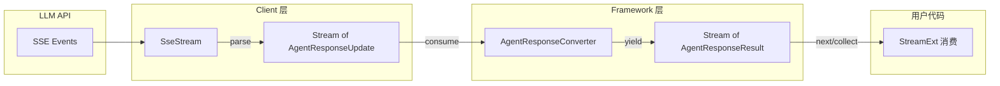
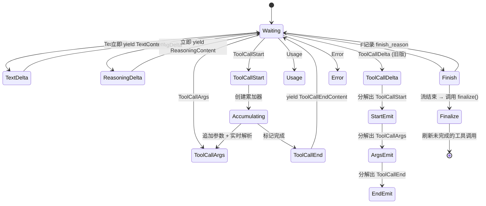

# 流式管道

RAF 从设计上仅支持流式输出。`BoxStream` 类型是整个框架的数据传输载体——从 LLM 的 SSE 事件到最终的结构化响应，全部通过异步流传递。本章详解流式管道的类型系统、消费模式和 `AgentResponseConverter` 的工作原理。

## BoxStream 类型

```rust
pub type BoxStream<'a, T> = Pin<Box<dyn Stream<Item = T> + Send + 'a>>;
```

这是 `Pin<Box<dyn Stream<Item = T> + Send>>` 的类型别名。使用时需要引入 `futures_util::StreamExt` 来获得流的组合能力。

**在框架中的使用**：

```rust
// LLM 客户端返回 SSE 流
pub trait IChatClient {
    async fn run(&self, messages: &[ChatMessage], options: ChatClientRunOptions)
        -> Result<BoxStream<'static, Result<AgentResponseUpdate>>>;
}

// Agent 返回结构化响应流
pub trait IAgent {
    async fn run(&self, messages: Vec<ChatMessage>, ...)
        -> Result<BoxStream<'static, Result<AgentResponseResult>>>;
}
```

注意生命周期 `'static`——流拥有其数据，不借用任何外部引用。

## 流式管道全景



## AgentResponseUpdate → AgentResponseResult 转换

### AgentResponseConverter 内部状态

```rust
pub struct AgentResponseConverter {
    agent_id: AgentId,
    model_id: Option<String>,
    executor_id: String,
    properties: HashMap<String, serde_json::Value>,

    // 并行工具调用状态管理（合并为单一映射）
    tool_states: HashMap<String, ToolCallState>,  // call_id → 累加器 + 结束标记 + 实时解析器
    index_to_call_id: HashMap<usize, String>,      // 旧版 delta 的索引映射

    response_id: Option<String>,
    response_model: Option<String>,
}

/// 每个工具调用的完整状态，将累加器、结束追踪和流式 JSON 解析器合并在一起。
/// 相比旧版使用 4 个独立 HashMap（tool_accumulators、ended_calls、args_parsers、
/// index_to_call_id），合并后减少了状态管理复杂度。
#[derive(Debug, Default)]
struct ToolCallAccumulator {
    name: Option<String>,
    args: String,              // 累积的 JSON 参数字符串
    start_emitted: bool,       // 防止重复发出 ToolCallStart
}

#[derive(Default)]
struct ToolCallState {
    acc: ToolCallAccumulator,
    ended: bool,               // 调用是否已结束（防止重复 ToolCallEnd）
    parser: StreamingArgsParser, // 实时 JSON 解析器
}
```

### AgentResponseConverter 工作流程

```rust
impl AgentResponseConverter {
    pub fn consume(&mut self, update: AgentResponseUpdate) -> AgentResponseResult {
        // 处理每个 SSE 更新，返回即时的 Content 块
    }

    pub fn finalize(&self, finish_reason: Option<FinishReason>, usage: Option<Usage>)
        -> AgentResponseResult {
        // 流结束时刷新缓冲状态
    }
}
```

`consume()` 是核心方法——它接收单个 `AgentResponseUpdate`，根据变体类型更新内部状态，并决定是否立即返回 `AgentResponseResult` 块：



### 旧版 ToolCallDelta 的分解

当 SSE 格式不区分 tool call 生命周期事件时，`Converter` 将 `ToolCallDelta` 分解为三步：

```rust
// 内部逻辑（简化版）
AgentResponseUpdate::ToolCallDelta { index, id, name, arguments_delta } => {
    // Step 1: 首次出现 → 发出 ToolCallStart
    if !accumulator.start_emitted {
        yield Content::ToolCallStart(...);
    }

    // Step 2: 累积参数 → 发出 ToolCallArgs
    accumulator.args.push_str(&arguments_delta);
    yield Content::ToolCallArgs(...);

    // Step 3: Finish 事件后 → finalize() 发出 ToolCallEnd + ToolCalling
}
```

## 流的消费模式

### 模式 1：逐块处理（实时 UI）

```rust
use futures_util::StreamExt;

let mut stream = agent.run(messages, Some(session), None).await?;
while let Some(result) = stream.next().await {
    match result {
        Ok(chunk) => {
            for content in chunk.contents {
                match content {
                    Content::Text(t) => print!("{}", t.delta),          // 实时打印
                    Content::Reasoning(r) => print!("[思考] {}", r.delta),
                    Content::ToolCallStart(s) => print!("[调用] {}", s.name),
                    Content::ToolCalling(c) => {
                        println!("\n[工具] {} args: {}", c.name, c.arguments);
                    }
                    Content::ToolCalled(c) => {
                        println!("[结果] {}", c.result.unwrap_or_default());
                    }
                    _ => {}
                }
            }
        }
        Err(e) => eprintln!("流错误: {}", e),
    }
}
```

### 模式 2：事件驱动的分类处理

```rust
let mut stream = agent.run(messages, Some(session), None).await?;
let mut display = String::new();
let mut tool_requests = Vec::new();

while let Some(result) = stream.next().await {
    let chunk = result?;
    for content in chunk.contents {
        match content {
            Content::Text(t) => {
                display.push_str(&t.delta);
                render_ui(&display);  // 实时渲染 UI
            }
            Content::ToolCalling(c) => {
                tool_requests.push((c.call_id, c.name, c.arguments));
                show_tool_progress(&c.name);
            }
            Content::ToolCalled(c) => {
                show_tool_result(c.result.as_deref().unwrap_or("failed"));
            }
            Content::Usage(u) => {
                update_token_counter(&u.usage);
            }
            _ => {}
        }
    }
    if let Some(reason) = chunk.finish_reason {
        finalize_response(reason);
    }
}
```

### 模式 3：使用 `collect_agent_response` 完整收集

```rust
use rust_agent_core::collect_agent_response;

let stream = agent.run(messages, Some(session), None).await?;
let response = collect_agent_response(stream).await?;

// 此时拥有完整的聚合响应
println!("回复: {}", response.text);
println!("工具调用: {:?}", response.tool_calls);
println!("Token: {:?}", response.usage);
println!("原因: {:?}", response.finish_reason);
```

`collect_agent_response` 内部遍历所有流块，聚合成一个 `AgentResponse`：

```rust
pub async fn collect_agent_response(
    mut stream: BoxStream<'static, Result<AgentResponseResult>>,
) -> Result<AgentResponse> {
    let mut text = String::new();
    let mut reasoning_text = String::new();
    let mut tool_calls: Vec<ToolCall> = Vec::new();
    let mut finish_reason = None;
    let mut usage = None;

    while let Some(result) = stream.next().await {
        let chunk = result?;
        if chunk.finish_reason.is_some() {
            finish_reason = chunk.finish_reason;
        }
        for content in chunk.contents {
            match content {
                Content::Text(c) => text.push_str(&c.delta),
                Content::Reasoning(c) => reasoning_text.push_str(&c.delta),
                Content::ToolCalling(c) => tool_calls.push(ToolCall {
                    id: c.call_id, name: c.name, arguments: c.arguments,
                }),
                Content::Usage(c) => usage = Some(c.usage),
                _ => {}
            }
        }
    }

    Ok(AgentResponse {
        text, reasoning_text: if reasoning_text.is_empty() { None } else { Some(reasoning_text) },
        tool_calls, finish_reason, usage, ...
    })
}
```

### 模式 4：使用 `inspect` 实现副作用

```rust
let stream = agent.run(messages, Some(session), None).await?;
let logged = stream.inspect(|chunk| {
    if let Ok(c) = chunk {
        // 记录到日志但不影响流
        tracing::info!(contents = c.contents.len(), "Agent chunk");
    }
});

// 继续传递给下游消费者
let response = collect_agent_response(logged).await?;
```

### 模式 5：使用 `filter_map` 只关心特定内容

```rust
let tool_calls: Vec<String> = stream
    .filter_map(|result| async move {
        match result {
            Ok(chunk) => {
                let names: Vec<String> = chunk.contents.iter().filter_map(|c| {
                    if let Content::ToolCalling(tc) = c {
                        Some(tc.name.clone())
                    } else { None }
                }).collect();
                if names.is_empty() { None } else { Some(names) }
            }
            Err(_) => None,
        }
    })
    .flat_map(|names| futures_util::stream::iter(names))
    .collect()
    .await;
```

## StreamingArgsParser: 实时 JSON 解析

当 `ToolCallArgs` 流式到达时，`StreamingArgsParser` 尝试实时解析 JSON 键值对，而不是等待整个 JSON 对象完成。

```rust
pub struct StreamingArgsParser;

pub enum ArgsEvent {
    Parsed { name: String, value: Value },   // → ToolCallArgsParsedContent
    Progress { name: String, received: usize, value: Value },  // → ToolCallArgsProgressContent
}
```

**示例**：当 LLM 流式输出 `{"path": "src/main.rs", "content": "fn main..."}` 时：

1. `{"path": "src/main.rs"` → 立即发出 `ToolCallArgsParsed{name:"path", value:"src/main.rs"}`
2. `, "content": "fn main` → 发出 `ToolCallArgsProgress{name:"content", received:10, value:"fn main"}`
3. `(...)` → 发出 `ToolCallArgsProgress{name:"content", received:17, value:"fn main() {\n...}"}`
4. `"}` → 发出 `ToolCallArgsParsed{name:"content", value:"fn main() {\n...}"}`

此机制使 UI 能实时展示工具调用的参数进度，无需等待整个 JSON 完成。

## 错误传播

流中的错误是 per-chunk 的：

- `stream.next().await` 返回 `Result<AgentResponseResult>` 是单个块可能失败
- 创建流时的 `?`（`agent.run(...).await?`）是流级错误（如网络不通）

```rust
// 流级错误：网络断开、API Key 无效
let mut stream = agent.run(messages, Some(session), None).await?;

// 块级错误：单个 SSE 事件解析失败
while let Some(item) = stream.next().await {
    match item {
        Ok(chunk) => { /* 正常 */ }
        Err(e) => {
            // 块错误——决定继续或退出
            if should_continue(&e) { continue; }
            else { break; }
        }
    }
}
```

## 下一步

掌握流式管道后，请阅读 **[压缩策略](./compression-strategies.md)**，了解如何在上下文窗口溢出时自动压缩消息列表。
