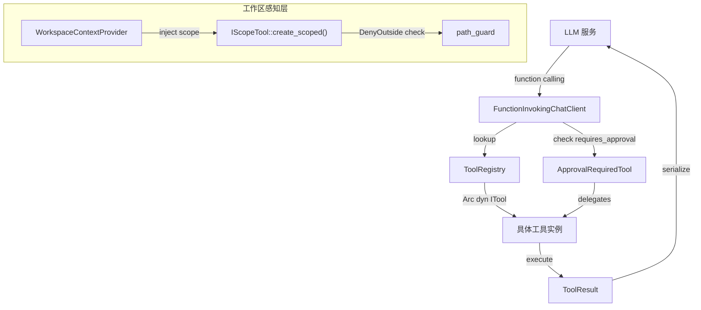

# 第 4 章：工具系统

工具系统是 RAF 中 Agent 与外部世界交互的核心基础设施。Agent 通过工具（Tool）执行文件读写、命令运行、网络请求等操作，LLM 通过 function calling 机制选择并调用工具，框架负责工具的生命周期管理、参数校验、结果序列化和人机协同审批。

## 本章目录

| 小节 | 标题 | 核心内容 |
|------|------|----------|
| [4.1](itool-trait.md) | ITool trait 与 ToolResult | 工具接口定义、AsAny 下转型、ToolResult 统一返回类型、完整 trait 注解 |
| [4.2](tool-registry.md) | ToolRegistry 工具注册表 | HashMap 存储、register/register_arc、按名称查找、工具列表获取 |
| [4.3](approval-required-tool.md) | ApprovalRequiredTool 审批包装器 | 委托模式、requires_approval() 返回 true、与 FunctionInvokingChatClient 的集成 |
| [4.4](builtin-filesystem-tools.md) | 内置文件系统工具 | 10 个文件操作工具的 JSON Schema、能力边界、路径解析、文件大小/行数限制 |
| [4.5](run-command-tool.md) | RunCommand 命令执行工具 | output_level 四级输出粒度、智能尾部截断、truncation_note 被动引导、Scope 边界感知 |
| [4.6](custom-tools.md) | 自定义工具开发指南 | 三种定义方式：手动实现 ITool、异步函数宏、结构体宏 |
| [4.7](scope-tool.md) | IScopeTool 工作区感知 | create_scoped()、DenyOutside 策略检查、scope 标签响应、WorkspaceContextProvider 注入 |

## 架构概览

## 关键设计原则

1. **统一返回类型**：所有工具通过 `ToolResult` 返回执行结果（`ok` / `data` / `error`），框架层统一序列化为 JSON 注入 LLM 对话，避免各工具返回格式不一致。

2. **委托审批**：`ApprovalRequiredTool` 通过装饰器模式包装任意工具，执行前由 `FunctionInvokingChatClient` 检查 `requires_approval()` 并发出审批事件，不影响工具自身逻辑。

3. **工作区感知**：`IScopeTool` 使工具能感知当前工作区边界，`resolve_safe()` 提供目录穿越防护，`ScopePolicy::DenyOutside` 在工具内部直接拦截越界操作。

4. **声明式定义**：`#[tool]` 宏自动生成 `ITool` 实现（name/description/parameters/execute），开发者只需关注业务逻辑。

## 推荐阅读顺序

- **首次接触工具系统**：按 4.1 → 4.2 → 4.6 顺序阅读，理解 trait 定义、注册机制和三种自定义方式
- **使用内置工具**：直接阅读 4.4（文件系统工具）和 4.5（命令执行工具）
- **构建生产系统**：重点阅读 4.3（审批包装）和 4.7（工作区感知）

---

## 上一步

← [第 3 章：Agent 引擎](../03-agent-engine/INDEX.md)

## 下一步

阅读完本章后，建议继续阅读 **[上下文提供器](../05-context-providers/overview.md)** 以探索 ContextProvider 扩展点，理解如何注入系统指令、历史消息和动态工具。
