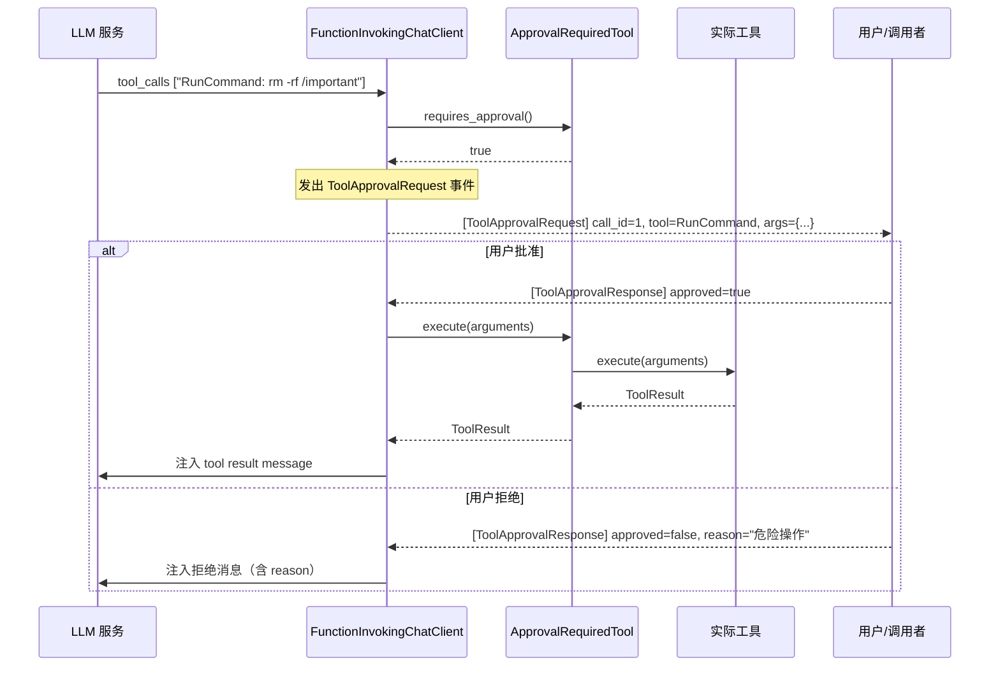

# 4.3 ApprovalRequiredTool 审批包装器

`ApprovalRequiredTool` 是 RAF 工具系统的人机协同（HITL）入口。它通过装饰器模式包装任意 `ITool`，在运行时标记该工具需要人工审批，由 `FunctionInvokingChatClient` 在执行前拦截并发出审批事件。

## 设计动机

在生产环境中，某些操作（如删除文件、执行 shell 命令、修改数据库）不应由 Agent 自动完成。RAF 提供两层审批机制：

1. **工具级审批**：通过 `ApprovalRequiredTool` 包装特定工具，该工具的每次调用都需要审批
2. **策略级审批**：通过 `ScopePolicy::ApproveOutside`，当工具操作超出工作区边界时触发审批

`ApprovalRequiredTool` 是工具级审批的载体，它不改动被包装工具的任何逻辑，仅重写 `requires_approval()`。

## 完整定义

```rust
/// 包装任意 [`ITool`]，标记为需要人工审批才能执行。
///
/// 对应 MAF 的 `ApprovalRequiredAIFunction`。
///
/// `FunctionInvokingChatClient` 在运行时检查 `requires_approval()`，
/// 当返回 `true` 时，发出 [`ToolApprovalRequest`] 事件而非立即执行。
#[derive(Clone)]
pub struct ApprovalRequiredTool {
    pub inner: Arc<dyn ITool>,
}

impl ApprovalRequiredTool {
    pub fn new(tool: Arc<dyn ITool>) -> Self {
        Self { inner: tool }
    }
}
```

## 委托模式

`ApprovalRequiredTool` 实现 `ITool` 时采用完全委托——所有方法都透传到内部工具，仅重写 `requires_approval()`：

```rust
#[async_trait]
impl ITool for ApprovalRequiredTool {
    fn name(&self) -> &str {
        self.inner.name()
    }
    fn description(&self) -> &str {
        self.inner.description()
    }
    fn parameters(&self) -> serde_json::Value {
        self.inner.parameters()
    }
    async fn execute(&self, arguments: serde_json::Value) -> Result<ToolResult> {
        self.inner.execute(arguments).await
    }
    fn requires_approval(&self) -> bool {
        true  // ← 唯一的行为差异
    }
}
```

**设计精妙之处：**

- `name()`、`description()`、`parameters()` 全部透传——LLM 看到的工具签名完全相同
- `execute()` 透传——被批准后，执行逻辑和原始工具完全一致
- **仅 `requires_approval()` 返回 `true`**——这是框架判断是否需要审批的唯一依据

## 审批响应数据结构

当 `FunctionInvokingChatClient` 检测到 `requires_approval() == true` 时，它不立即执行工具，而是发出 `ToolApprovalRequest` 事件。调用者需要回复 `ToolApprovalResponse`：

```rust
/// 调用者对 ToolApprovalRequest 的响应。
#[derive(Debug, Clone, Serialize, Deserialize)]
pub struct ToolApprovalResponse {
    /// 匹配对应 ToolApprovalRequest 中的 call_id
    pub call_id: String,
    /// true = 批准执行，false = 拒绝
    pub approved: bool,
    /// 拒绝原因（可选，会反馈给 LLM）
    pub reason: Option<String>,
}
```

## 审批流程



## 使用场景

### 场景一：生产环境命令执行

```rust
use rust_agent_core::ApprovalRequiredTool;

// Agent A：开发环境，自动执行
AgentBuilder::new().with_tool(RunCommand {
    scope: None,
    timeout_secs: None,
});

// Agent B：生产环境，需要审批
AgentBuilder::new().with_tool(ApprovalRequiredTool::new(Arc::new(RunCommand {
    scope: None,
    timeout_secs: None,
})));
```

### 场景二：结合 WorkspaceContextProvider 策略审批

`WorkspaceContextProvider` 在 `add_tool()` 中检测 `ScopePolicy`，自动为 `ApproveOutside` 策略包裹 `ApprovalRequiredTool`：

```rust
let scope = WorkspaceScope::new("/safe/project", "my-project")
    .with_policy(ScopePolicy::ApproveOutside);

let provider = WorkspaceContextProvider::new(Arc::new(scope))
    .add_tool(WriteFile { scope: None })  // 自动包裹 ApprovalRequiredTool
    .add_tool(RemovePath { scope: None }); // 自动包裹 ApprovalRequiredTool
```

### 场景三：仅特定工具需要审批

```rust
let mut registry = ToolRegistry::new();

// 读取文件：始终自动
registry.register(ReadFile { scope: None });

// 写入文件：需要审批
registry.register_arc(Arc::new(ApprovalRequiredTool::new(Arc::new(WriteFile {
    scope: None,
}))));

// 删除文件：需要审批
registry.register_arc(Arc::new(ApprovalRequiredTool::new(Arc::new(RemovePath {
    scope: None,
}))));
```

## ToolApprovalRequest 事件

当需要审批时，`FunctionInvokingChatClient` 发出的事件结构（定义于 `AgentResponseUpdate`）：

```rust
pub struct ToolApprovalRequest {
    pub call_id: String,       // 唯一调用 ID，必须匹配审批响应
    pub tool_name: String,     // 工具名称
    pub arguments: Value,      // 工具参数（用于用户决策）
}
```

调用者通常监听 `AgentResponseUpdate::ToolApprovalRequest(approval_req)` 变体，向用户展示工具名和参数，收集批准/拒绝决策后发送 `ToolApprovalResponse`。

## 关键要点

1. **装饰器模式，零侵入**——`ApprovalRequiredTool` 不修改被包装工具的任何代码，仅添加审批标记
2. **框架层拦截**——审批检查发生在 `FunctionInvokingChatClient` 的工具调用循环中，工具自身无需感知
3. **call_id 匹配**——`ToolApprovalRequest` 和 `ToolApprovalResponse` 通过 `call_id` 关联，支持并发审批
4. **拒绝原因反馈 LLM**——`reason` 字段注入对话，让模型了解为什么操作被拒绝，持续优化决策
