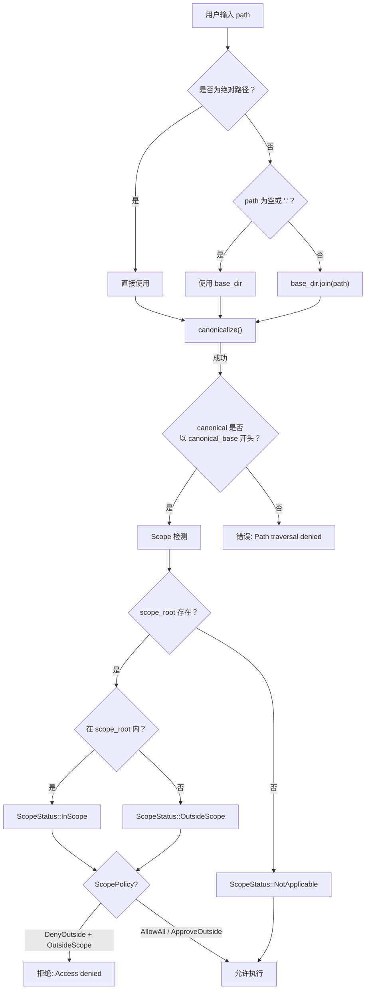

# 4.4 内置文件系统工具

RAF 内置 10 个文件系统操作工具，覆盖文件读写、目录管理、文件搜索、元数据检查等常见场景。所有工具均实现 `IScopeTool`，支持工作区边界感知和目录穿越防护。

## 工具总览

| 工具 | 名称 | 核心功能 | 关键限制 |
|------|------|----------|----------|
| `read_file` | ReadFile | 读取文件内容，支持行范围 | 最大 512KB，单行最大 2000 字符 |
| `write_file` | WriteFile | 创建或覆写文件 | 内容最大 1MB |
| `edit_file` | EditFile | 精确字符串替换 | `old_str` 必须唯一匹配 |
| `list_files` | ListFiles | 列出目录内容 | 按类型排序（目录优先） |
| `inspect_file` | InspectFile | 返回文件元数据 | 类型、大小、修改时间、权限 |
| `make_directory` | MakeDirectory | 递归创建目录（`mkdir -p`） | 自动创建父目录 |
| `remove_path` | RemovePath | 删除文件或目录 | 拒绝删除根/key目录 |
| `move_file` | MoveFile | 移动或重命名 | 源需存在，目标不能已存在 |
| `find_files` | FindFiles | glob 模式匹配文件 | 最大 500 结果 |
| `search_file` | SearchFile | 正则搜索文件内容 | 最大 200 匹配，最大深度 20 |

## 公共架构

所有文件系统工具共享以下模式：

```rust
#[tool(description = "...")]
pub struct XxxTool {
    pub scope: Option<Arc<WorkspaceScope>>,
}

impl IScopeTool for XxxTool {
    fn create_scoped(&self, scope: Arc<WorkspaceScope>) -> Arc<dyn ITool> {
        Arc::new(XxxTool { scope: Some(scope) })
    }
}

impl XxxTool {
    async fn call(&self, arguments: Value) -> Result<ToolResult> {
        // 1. 参数反序列化
        // 2. base_dir 确定（scope.root 或 current_dir）
        // 3. resolve_safe / resolve_safe_new 路径解析 + 目录穿越防护
        // 4. ScopePolicy::DenyOutside 检查
        // 5. 业务逻辑
        // 6. 返回 ToolResult（含 scope 标签）
    }
}
```

### 路径解析与穿越防护

所有工具使用 `path_guard` 模块的两个核心函数：

- `resolve_safe()`：解析已存在的路径，返回 `(规范路径, scope状态)`，存在目录穿越时返回错误
- `resolve_safe_new()`：解析可能不存在的路径（用于写/创建操作），通过组件遍历防止 `../` 逃逸

### Scope 标签

每个工具的 JSON 响应中都包含 `"scope"` 字段：

| 值 | 含义 |
|-----|------|
| `"workspace"` | 操作在工作区范围内 |
| `"outside_workspace"` | 操作在工作区范围外（可能触发审批或拒绝） |
| `"none"` | 未设置 scope，无边界判断 |

## 各工具详解

---

### 4.4.1 read_file — 读取文件

**描述**：读取文件内容，支持通过 `offset` / `limit` 参数指定行范围。

**JSON Schema 参数**：

```json
{
  "type": "object",
  "properties": {
    "path": { "type": "string", "description": "The path to the file to read" },
    "offset": { "type": "integer", "description": "The line number to start reading from (1-indexed)" },
    "limit": { "type": "integer", "description": "The number of lines to read" }
  },
  "required": ["path"]
}
```

**限制**：

| 限制项 | 值 | 说明 |
|--------|-----|------|
| 最大文件大小 | 512KB (`512 * 1024` 字节) | 超过此大小直接返回错误 |
| 单行最大宽度 | 2000 字符 | 超宽行会被截断并标记 `[truncated]` |
| offset 默认值 | 1 | 从第一行开始 |
| 截断标记 | `[truncated — use offset/limit to read more]` | 仅显示部分内容时追加 |

**成功响应示例**：

```json
{
  "path": "src/main.rs",
  "content": "fn main() {\n    println!(\"Hello\");\n}\n",
  "total_lines": 3,
  "start_line": 1,
  "end_line": 3,
  "truncated": false,
  "scope": "workspace"
}
```

**关键实现**：

文件必须存在且为普通文件（非目录）。如果设置了 scope 且策略为 `DenyOutside`，路径在工作区外时返回错误。

---

### 4.4.2 write_file — 写入文件

**描述**：创建新文件或覆写已有文件。自动创建父目录（递归）。

**JSON Schema 参数**：

```json
{
  "type": "object",
  "properties": {
    "path": { "type": "string", "description": "The path to the file to write" },
    "content": { "type": "string", "description": "The content to write to the file" }
  },
  "required": ["path", "content"]
}
```

**限制**：

| 限制项 | 值 |
|--------|-----|
| 最大内容大小 | 1MB (`1_000_000` 字节) |

**成功响应示例**：

```json
{
  "path": "src/new_file.rs",
  "bytes_written": 1024,
  "scope": "workspace"
}
```

**关键实现**：

- 使用 `resolve_safe_new()` 支持路径尚不存在的情况
- 自动 `create_dir_all()` 父目录
- 路径越界时 `DenyOutside` 策略直接拒绝

---

### 4.4.3 edit_file — 编辑文件

**描述**：在已有文件中执行精确字符串替换。`old_str` 必须在文件中唯一匹配一段连续的文本块。

**JSON Schema 参数**：

```json
{
  "type": "object",
  "properties": {
    "path": { "type": "string", "description": "The path to the file to edit" },
    "old_str": { "type": "string", "description": "The exact text to find and replace" },
    "new_str": { "type": "string", "description": "The replacement text" }
  },
  "required": ["path", "old_str", "new_str"]
}
```

**错误条件**：

| 条件 | 错误消息 |
|------|----------|
| `old_str` 为空 | `"old_str must not be empty"` |
| `old_str` 在文件中未找到 | `"old_str not found in the file. Make sure you copied the exact text..."` |
| `old_str` 出现多次 | `"old_str is not unique — found N occurrences (e.g. at byte offset X, ...)"` |

**成功响应示例**：

```json
{
  "path": "src/main.rs",
  "replaced": true,
  "scope": "workspace"
}
```

**核心算法**：使用 `str::match_indices()` 查找所有匹配位置，仅当恰好 1 次匹配时才执行 `replacen()`。

---

### 4.4.4 list_files — 列出目录

**描述**：列出指定目录下的所有文件和子目录，返回名称、类型和大小。结果按类型排序（目录优先），同类型按名称字母顺序。

**JSON Schema 参数**：

```json
{
  "type": "object",
  "properties": {
    "path": { "type": "string", "description": "The path to the directory to list" }
  },
  "required": ["path"]
}
```

**成功响应示例**：

```json
{
  "path": "src/",
  "entries": [
    { "name": "components", "type": "dir", "size": 4096 },
    { "name": "main.rs", "type": "file", "size": 1024 },
    { "name": "link_to_lib", "type": "symlink", "size": 0 }
  ],
  "count": 3,
  "scope": "workspace"
}
```

**条目类型**：`file`、`dir`、`symlink`、`unknown`（元数据读取失败时）。

---

### 4.4.5 inspect_file — 元数据检查

**描述**：返回文件或目录的元数据，包括类型、大小、修改时间、创建时间和只读属性。

**JSON Schema 参数**：

```json
{
  "type": "object",
  "properties": {
    "path": { "type": "string", "description": "The path to the file or directory to inspect" }
  },
  "required": ["path"]
}
```

**成功响应示例**：

```json
{
  "path": "Cargo.toml",
  "type": "file",
  "size": 2048,
  "readonly": false,
  "modified": "2026-06-18T10:30:00Z",
  "created": "2026-06-01T08:00:00Z",
  "scope": "workspace"
}
```

**时间格式**：RFC 3339（`SecondsFormat::Secs`），如 `2026-06-18T10:30:00Z`。

---

### 4.4.6 make_directory — 创建目录

**描述**：递归创建目录（等价于 `mkdir -p`），自动创建所有不存在的父目录。

**JSON Schema 参数**：

```json
{
  "type": "object",
  "properties": {
    "path": { "type": "string", "description": "The path to the directory to create" }
  },
  "required": ["path"]
}
```

**成功响应示例**：

```json
{
  "path": "src/components/buttons",
  "created": true,
  "scope": "workspace"
}
```

**关键实现**：使用 `std::fs::create_dir_all()` 递归创建；路径尚不存在时用 `resolve_safe_new()` 解析。

---

### 4.4.7 remove_path — 删除路径

**描述**：删除文件或目录（递归）。内置危险路径保护，拒绝删除根目录、用户主目录、当前工作区根目录等关键路径。

**JSON Schema 参数**：

```json
{
  "type": "object",
  "properties": {
    "path": { "type": "string", "description": "The path to remove" }
  },
  "required": ["path"]
}
```

**危险路径保护**（拒绝删除）：

| 路径 | 说明 |
|------|------|
| `/` 或 `C:\` | 系统根目录 |
| 用户主目录 | `dirs_next::home_dir()` |
| 当前工作区根目录 | `base_dir` 自身 |
| 工作区根的直接子目录 | 防止误删项目根 |

**危险路径检测逻辑**：

```rust
let dangerous_dirs = vec![
    canonical_base.clone(),
    PathBuf::from("/"),
    PathBuf::from("C:\\"),
    dirs_next::home_dir().unwrap_or_default(),
];
for dangerous in &dangerous_dirs {
    if resolved == *dangerous
        || (resolved.starts_with(dangerous)
            && resolved.components().count() <= max_components)
    {
        return Ok(ToolResult::error("Refusing to delete critical path"));
    }
}
```

**成功响应示例**：

```json
{
  "path": "temp/obsolete_dir",
  "deleted": true,
  "scope": "workspace"
}
```

---

### 4.4.8 move_file — 移动/重命名

**描述**：移动或重命名文件或目录。源路径必须存在，目标路径不能已存在。自动创建目标父目录。

**JSON Schema 参数**：

```json
{
  "type": "object",
  "properties": {
    "from": { "type": "string", "description": "The source path" },
    "to": { "type": "string", "description": "The destination path" }
  },
  "required": ["from", "to"]
}
```

**成功响应示例**：

```json
{
  "from": "old_name.rs",
  "to": "new_name.rs",
  "moved": true,
  "scope": "workspace"
}
```

**关键实现**：

- 源路径用 `resolve_safe()`（必须存在），目标路径用 `resolve_safe_new()`（允许不存在）
- 目标存在时返回 `"Destination already exists"` 错误
- scope 标签取源和目标中较宽的范围

---

### 4.4.9 find_files — glob 搜索文件

**描述**：使用 glob 模式匹配目录下的文件。支持 `*`、`**`、`?` 等标准 glob 通配符。

**JSON Schema 参数**：

```json
{
  "type": "object",
  "properties": {
    "pattern": { "type": "string", "description": "The glob pattern to match (e.g., '**/*.rs', 'src/*.ts')" },
    "directory": { "type": "string", "description": "Optional base directory; defaults to workspace root" }
  },
  "required": ["pattern"]
}
```

**限制**：

| 限制项 | 值 |
|--------|-----|
| 最大结果数 | 500 |

**成功响应示例**：

```json
{
  "pattern": "**/*.rs",
  "directory": "/project/src",
  "results": ["/project/src/main.rs", "/project/src/lib.rs", "/project/src/utils/helper.rs"],
  "count": 3,
  "truncated": false,
  "scope": "workspace"
}
```

**关键实现**：使用 `glob::glob()` 库在指定目录下匹配。

---

### 4.4.10 search_file — 正则搜索文件内容

**描述**：使用正则表达式递归搜索目录下文件的内容，返回匹配行及其文件路径和行号。

**JSON Schema 参数**：

```json
{
  "type": "object",
  "properties": {
    "pattern": { "type": "string", "description": "The regex pattern to search for" },
    "directory": { "type": "string", "description": "The directory to search in" },
    "include": { "type": "string", "description": "Optional glob pattern to filter files (e.g., '*.rs')" },
    "case_insensitive": { "type": "boolean", "description": "Whether to perform case-insensitive search" }
  },
  "required": ["pattern", "directory"]
}
```

**限制**：

| 限制项 | 值 | 说明 |
|--------|-----|------|
| 最大匹配数 | 200 | 超过后截断 |
| 单行最大显示长度 | 300 字符 | 超长行截断 |
| 最大搜索深度 | 20 | `WalkDir::max_depth(20)` |
| 二进制文件跳过 | 前 8192 字节含 `\0` | 跳过二进制文件 |

**成功响应示例**：

```json
{
  "pattern": "fn main",
  "directory": "src",
  "matches": [
    { "file": "src/main.rs", "line": 1, "content": "fn main() {" },
    { "file": "src/bin/cli.rs", "line": 5, "content": "fn main() -> Result<()> {" }
  ],
  "total": 2,
  "truncated": false,
  "scope": "workspace"
}
```

**关键实现**：

- 使用 `walkdir::WalkDir` 递归遍历，`filter_entry` 跳过以 `.` 开头的隐藏目录
- 使用 `regex::bytes::Regex` 进行字节级搜索（支持二进制文件的 NUL 检测）
- 文件内容按行分割后逐行匹配

## 路径解析与防护详解



## 关键要点

1. **所有工具共享路径防护逻辑**——`resolve_safe` / `resolve_safe_new` 提供统一的目录穿越防护和 scope 检测
2. **scope 标签让 LLM 感知操作范围**——`workspace` / `outside_workspace` / `none` 帮助模型理解操作上下文
3. **大小和数量限制保护系统稳定**——512KB 文件、1MB 内容、500 结果、200 匹配等硬限制防止资源耗尽
4. **危险路径保护是最后防线**——`remove_path` 的多层检测防止灾难性删除
