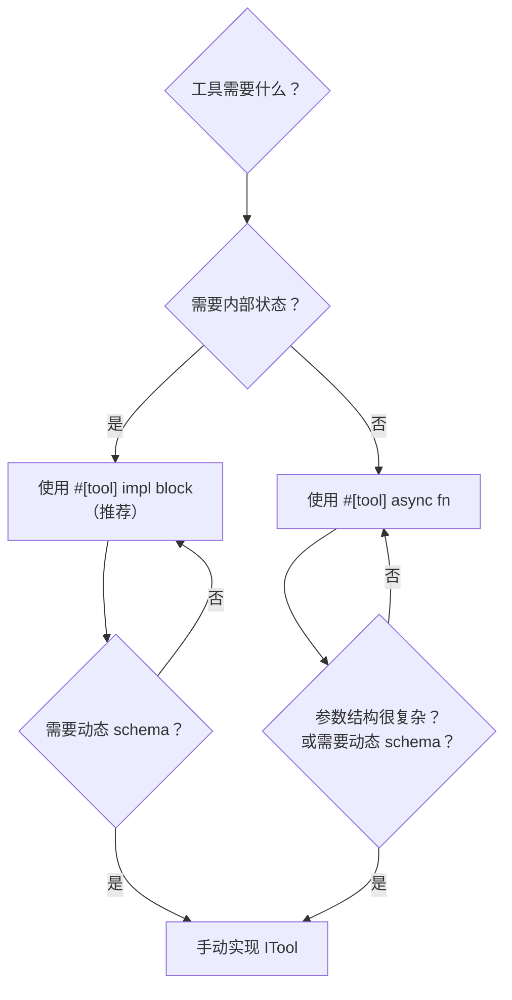

# 4.6 自定义工具开发指南

RAF 提供四种定义工具的方式，从声明式的 `#[tool]` 宏到手动完全控制的 `impl ITool`。本章逐一剖析每种方式的适用场景、完整代码示例和最佳实践。

## 方式对比

| 方式 | 代码量 | JSON Schema | 参数反序列化 | 适用场景 |
|------|--------|-------------|--------------|----------|
| `#[tool]` async fn | 最少 | 自动生成（完整） | 自动 | 简单函数式工具；快速原型 |
| `#[tool]` impl block | 适中 | 自动生成（完整） | 自动 | **有状态工具（推荐）**；需 scope 注入 |
| `#[tool]` struct | 适中 | 返回空 schema | 手动在 call() 中 | 兼容旧代码（不推荐新项目使用） |
| 手动实现 ITool | 最多 | 手动构建 | 手动 | 需完全控制；动态 schema（如 `cfg!()`） |

## 方式一：`#[tool]` async fn（无状态工具）

`#[tool]` 应用到异步函数时，自动生成一个同名的帕斯卡命名结构体，该结构体自动实现 `ITool`。这是最简单的方式，适用于无状态的纯函数工具。

```rust
use rust_agent_macros::tool;
use rust_agent_core::ToolResult;

#[tool(description = "Adds two numbers together", kind = "function")]
async fn add(
    #[param(desc = "First number")] a: f64,
    #[param(desc = "Second number")] b: f64,
) -> ToolResult {
    ToolResult::success(serde_json::json!({"result": a + b}))
}

#[tool(description = "Returns the current date and time", kind = "function")]
async fn get_current_time() -> ToolResult {
    let now = chrono::Utc::now();
    ToolResult::success(serde_json::json!({
        "iso8601": now.to_rfc3339(),
        "timestamp": now.timestamp(),
    }))
}
```

宏自动生成的 JSON Schema：

```json
{
    "type": "object",
    "properties": {
        "a": { "type": "number", "description": "First number" },
        "b": { "type": "number", "description": "Second number" }
    },
    "required": ["a", "b"]
}
```

### 函数模式的局限性

- **不能有状态**：生成的结构体是无字段 unit struct（`pub struct Echo;`）
- **不能实现其他 trait**：生成的结构体不可扩展
- **不支持 scope 注入**：无法实现 `IScopeTool`

## 方式二：`#[tool]` impl block（有状态工具，推荐）

当工具需要持有内部状态（如 `WorkspaceScope`、`Arc<Vec<AgentSkill>>` 等），但又希望获得自动生成的完整 JSON Schema，使用 impl 块模式。

```rust
use std::sync::Arc;
use rust_agent_core::{IScopeTool, ITool, ToolResult, WorkspaceScope};
use rust_agent_macros::tool;

pub struct ReadFile {
    pub scope: Option<Arc<WorkspaceScope>>,
}

// IScopeTool 在独立的 impl 块中手动实现
impl IScopeTool for ReadFile {
    fn create_scoped(&self, scope: Arc<WorkspaceScope>) -> Arc<dyn ITool> {
        Arc::new(ReadFile { scope: Some(scope) })
    }
}

#[tool(
    description = "Reads a file from the local filesystem. Supports line range via offset/limit.",
    kind = "file"
)]
impl ReadFile {
    async fn call(
        &self,
        #[param(desc = "Absolute path to the file")] path: String,
        #[param(desc = "Starting line number (1-based, optional)")] offset: Option<i64>,
        #[param(desc = "Maximum number of lines to read (optional)")] limit: Option<i64>,
    ) -> rust_agent_core::Result<ToolResult> {
        // 直接使用 typed 参数 —— 无需手动反序列化！
        let base_dir = self.scope.as_ref()
            .map(|s| s.root.clone())
            .unwrap_or_else(|| std::env::current_dir().unwrap_or_default());
        // ... 业务逻辑 ...
        Ok(ToolResult::success(serde_json::json!({"content": "..."})))
    }
}
```

**关键优势：**

1. **完整 Schema 自动生成** — `parameters()` 返回包含 `path`、`offset`、`limit` 的完整 JSON Schema，含类型和描述
2. **typed 参数** — `call` 方法直接接收 `path: String`，无需 `#[derive(Deserialize)] struct Args` 和 `serde_json::from_value`
3. **可与 IScopeTool 共存** — 宏生成 `ITool` impl，你需要手动实现 `IScopeTool` impl，两个独立 inherent impl 块互不干扰
4. **消除样板代码** — 每个工具约节省 10 行反序列化样板

### Rust 类型到 JSON Schema 映射

宏自动进行类型映射：

| Rust 类型 | JSON Schema type |
|-----------|------------------|
| `String`, `&str` | `"string"` |
| `i8`, `i16`, `i32`, `i64`, `u8`, `u16`, `u32`, `u64`, `usize` | `"integer"` |
| `f32`, `f64` | `"number"` |
| `bool` | `"boolean"` |
| `Option<T>` | `T` 的 schema（字段从 required 中移除） |
| `Vec<T>` | `{ "type": "array", "items": T_schema }` |
| 其他 | `"string"`（默认回退） |

### `kind` 配置

`kind = "..."` 属性控制 `ITool::kind()` 输出，对应 `ToolDecl` 分类：

| kind | 适用场景 |
|------|---------|
| `"function"` | 用户注册的函数工具（默认） |
| `"web"` | 网络搜索/抓取工具 |
| `"file"` | 文件系统工具 |
| `"shell"` | Shell 命令执行 |
| `"skills"` | 技能加载和资源工具 |
| `"code"` | 代码解释器/沙箱 |
| `"custom"` | 工厂注册的自定义工具 |

### impl 块模式的约束

| 约束 | 说明 |
|------|------|
| 必须是 inherent impl | 不能是 `impl Trait for Struct` |
| 不能是泛型 impl | 不支持 `impl<T> MyTool<T>` |
| 必须包含 `async fn call` | 方法名必须是 `call`，第一个参数必须是 `&self` |
| `#[tool]` 放在 impl 块上 | 而不是放在 struct 定义上 |

## 方式三：`#[tool]` struct（兼容旧写法，不推荐）

将 `#[tool]` 应用在结构体上时，宏生成委托给 `self.call(arguments)` 的 `ITool` impl，但 `parameters()` 返回空 schema。新代码推荐使用方式二（impl block 模式）。

## 方式四：手动实现 ITool

最灵活的方式，需要完整实现 5 个方法。适用于需要精确控制 JSON Schema 格式、自定义错误处理、或需要动态 schema（如 `cfg!(windows)` 平台感知）的高级场景。

### 完整示例：HTTP 请求工具

```rust
use async_trait::async_trait;
use rust_agent_core::{ITool, ToolResult, AgentError, Result};
use serde::Deserialize;

pub struct HttpGetTool {
    pub base_url: Option<String>,
}

#[async_trait]
impl ITool for HttpGetTool {
    fn name(&self) -> &str {
        "http_get"
    }

    fn description(&self) -> &str {
        "Sends an HTTP GET request to the specified URL and returns the response body as text."
    }

    fn kind(&self) -> &str {
        "function"
    }

    fn parameters(&self) -> serde_json::Value {
        serde_json::json!({
            "type": "object",
            "properties": {
                "url": {
                    "type": "string",
                    "description": "The URL to send the GET request to."
                },
                "headers": {
                    "type": "object",
                    "description": "Optional HTTP headers as key-value pairs.",
                    "additionalProperties": { "type": "string" }
                },
                "timeout_secs": {
                    "type": "integer",
                    "description": "Request timeout in seconds (default: 30)."
                }
            },
            "required": ["url"]
        })
    }

    async fn execute(&self, arguments: serde_json::Value) -> Result<ToolResult> {
        #[derive(Deserialize)]
        struct Args {
            url: String,
            headers: Option<std::collections::HashMap<String, String>>,
            timeout_secs: Option<u64>,
        }

        let args: Args = serde_json::from_value(arguments)
            .map_err(|e| AgentError::ToolError(
                format!("Argument deserialization failed: {}", e)
            ))?;

        // ... 业务逻辑 ...
        Ok(ToolResult::success(serde_json::json!({"status": 200})))
    }
}
```

### 手动方式的优缺点

**优点：**
- JSON Schema 完全可控
- 支持动态 schema（`cfg!(windows)` 等运行时分支）
- 支持复杂的泛型参数、自定义生命周期

**缺点：**
- 代码量大（40–60 行样板）
- JSON Schema 与参数定义分离，需手动保持同步
- 参数反序列化结构体与 Schema 之间没有编译期约束

## 注册和使用

四种方式定义的工具注册方式相同：

```rust
use rust_agent_core::ToolRegistry;

let mut registry = ToolRegistry::new();

// 方式一：宏生成的函数工具
registry.register(Add);
registry.register(GetCurrentTime);

// 方式二：impl block 模式
registry.register(ReadFile { scope: None });

// 方式三：struct 模式（兼容旧写法）
registry.register(MyLegacyTool);

// 方式四：手动实现
registry.register(HttpGetTool { base_url: Some("https://api.example.com".into()) });
```

## 选择指南



**推荐的决策路径：**

1. 如果工具只是一个纯函数（无状态、无外部依赖）→ 使用 `#[tool] async fn`
2. 如果工具需要持有状态或外部引用（如 scope）→ 使用 `#[tool] impl block`
3. 如果需要动态 schema（如平台感知描述）→ 手动实现 `ITool`

## 关键要点

1. **`#[tool] async fn` 是最简方式** — 一行宏即可获得完整的 `ITool` 实现 + JSON Schema
2. **`#[tool] impl block` 是有状态工具的标准模式** — 保留扩展性（如 `IScopeTool`），同时享受完整 JSON Schema 自动生成
3. **`#[tool] struct` 已不推荐** — `parameters()` 返回空 schema，新项目应使用 impl block 模式
4. **手动实现是最终手段** — 仅在需要动态 schema 或极致灵活性的场景使用
5. **四种方式的工具注册完全相同** — `registry.register(tool)` 对任何实现了 `ITool` 的类型都适用
