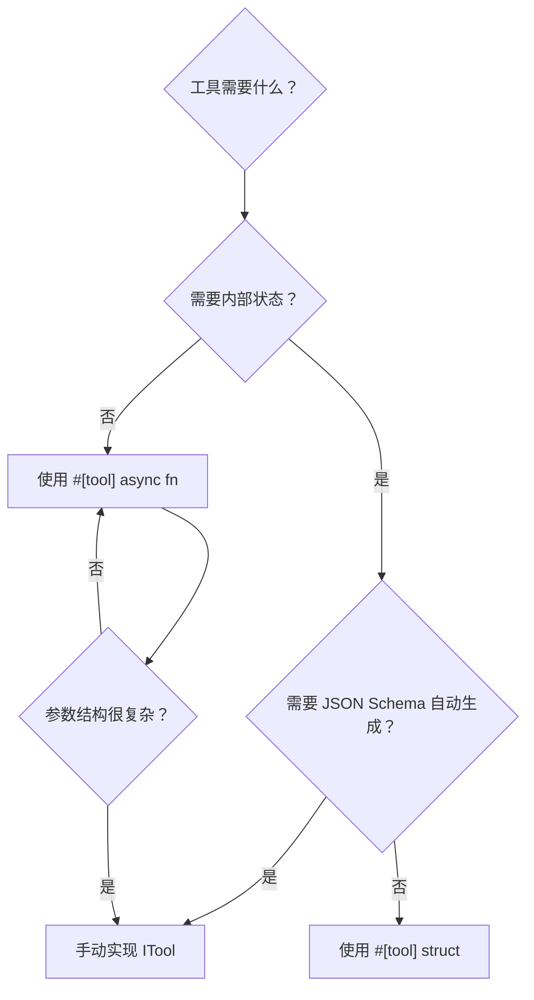

# 4.6 自定义工具开发指南

RAF 提供三种定义工具的方式，从手动完全控制的 `impl ITool`，到声明式的 `#[tool]` 宏。本章逐一剖析每种方式的适用场景、完整代码示例和最佳实践。

## 方式对比

| 方式 | 代码量 | 适用场景 | JSON Schema | 参数反序列化 |
|------|--------|----------|-------------|--------------|
| 手动实现 ITool | 最多 | 需要完全控制的场景；复杂参数结构 | 手动构建 | 手动 |
| `#[tool]` async fn | 最少 | 简单函数式工具；快速原型 | 自动生成 | 自动 |
| `#[tool]` struct | 适中 | 有状态工具；需注入外部依赖（如 scope） | 返回空 schema | 手动在 call() 中 |

## 方式一：手动实现 ITool

最灵活的方式，需要完整实现 5 个方法。适用于需要精确控制 JSON Schema 格式、自定义错误处理、或高级生命周期管理。

### 完整示例：HTTP 请求工具

```rust
use async_trait::async_trait;
use rust_agent_core::{ITool, ToolResult, AgentError, Result};
use serde::Deserialize;

/// 发送 HTTP GET 请求的工具
pub struct HttpGetTool {
    /// 可选的默认 base URL
    pub base_url: Option<String>,
}

#[async_trait]
impl ITool for HttpGetTool {
    fn name(&self) -> &str {
        "http_get"
    }

    fn description(&self) -> &str {
        "Sends an HTTP GET request to the specified URL and returns the response body as text."
    }

    fn parameters(&self) -> serde_json::Value {
        serde_json::json!({
            "type": "object",
            "properties": {
                "url": {
                    "type": "string",
                    "description": "The URL to send the GET request to. If relative, appended to base_url."
                },
                "headers": {
                    "type": "object",
                    "description": "Optional HTTP headers as key-value pairs.",
                    "additionalProperties": { "type": "string" }
                },
                "timeout_secs": {
                    "type": "integer",
                    "description": "Request timeout in seconds (default: 30)."
                }
            },
            "required": ["url"]
        })
    }

    async fn execute(&self, arguments: serde_json::Value) -> Result<ToolResult> {
        // 1. 手动反序列化参数
        #[derive(Deserialize)]
        struct Args {
            url: String,
            headers: Option<std::collections::HashMap<String, String>>,
            timeout_secs: Option<u64>,
        }

        let args: Args = serde_json::from_value(arguments)
            .map_err(|e| AgentError::ToolError(
                format!("Argument deserialization failed: {}", e)
            ))?;

        // 2. 构建完整 URL
        let url = match &self.base_url {
            Some(base) if !args.url.starts_with("http") => format!("{}{}", base, args.url),
            _ => args.url,
        };

        // 3. 发起请求
        let client = reqwest::Client::new();
        let mut request = client.get(&url);

        if let Some(headers) = &args.headers {
            for (key, value) in headers {
                request = request.header(key, value);
            }
        }

        let timeout = std::time::Duration::from_secs(args.timeout_secs.unwrap_or(30));

        match tokio::time::timeout(timeout, request.send()).await {
            Err(_) => Ok(ToolResult::error("Request timed out")),
            Ok(Err(e)) => Ok(ToolResult::error(format!("Request failed: {}", e))),
            Ok(Ok(response)) => {
                let status = response.status().as_u16();
                let body = response.text().await.unwrap_or_default();
                Ok(ToolResult::success(serde_json::json!({
                    "status": status,
                    "body": body,
                    "url": url,
                })))
            }
        }
    }
}
```

### 手动方式的优缺点

**优点：**
- JSON Schema 完全可控——`parameters()` 返回任意合法 JSON Schema
- 错误处理完全自定义——可以返回带结构化数据的错误
- 不受宏限制——支持复杂的泛型参数、自定义生命周期

**缺点：**
- 代码量大——至少 40–60 行样板代码
- JSON Schema 与参数定义分离——需要手动保持同步
- 容易出错——参数反序列化结构体与 Schema 之间没有编译期约束

## 方式二：`#[tool]` async fn

`#[tool]` 应用到异步函数时，自动生成一个同名的帕斯卡命名结构体，该结构体自动实现 `ITool`。

### 宏扩展机制

当你写：

```rust
#[tool(description = "Echoes back the input text")]
async fn echo(
    #[param(desc = "Text to echo")] text: String,
    #[param(desc = "Number of repetitions")] repeat: Option<u32>,
) -> ToolResult {
    let output = text.repeat(repeat.unwrap_or(1) as usize);
    ToolResult::success(serde_json::json!({"echo": output}))
}
```

宏自动生成：

```rust
// 自动生成的参数结构体
#[derive(serde::Deserialize)]
#[allow(non_snake_case)]
struct EchoArgs {
    pub text: String,
    pub repeat: Option<u32>,
}

// 自动生成的结构体（函数名的帕斯卡命名）
pub struct Echo;

impl Echo {
    pub async fn call(&self, text: String, repeat: Option<u32>) -> ToolResult {
        let output = text.repeat(repeat.unwrap_or(1) as usize);
        ToolResult::success(serde_json::json!({"echo": output}))
    }
}

#[async_trait]
impl rust_agent_core::ITool for Echo {
    fn name(&self) -> &str { "echo" }
    fn description(&self) -> &str { "Echoes back the input text" }

    fn parameters(&self) -> serde_json::Value {
        // 自动生成 JSON Schema：
        // {
        //   "type": "object",
        //   "properties": {
        //     "text": { "type": "string", "description": "Text to echo" },
        //     "repeat": { "type": "integer", "description": "Number of repetitions" }
        //   },
        //   "required": ["text"]
        // }
    }

    async fn execute(&self, arguments: serde_json::Value) -> Result<ToolResult> {
        let args: EchoArgs = serde_json::from_value(arguments)
            .map_err(|e| AgentError::ToolError(format!("...")))?;
        Ok(self.call(args.text, args.repeat).await)
    }
}
```

### Rust 类型到 JSON Schema 映射

宏自动进行类型映射：

| Rust 类型 | JSON Schema type |
|-----------|------------------|
| `String`, `&str` | `"string"` |
| `i8`, `i16`, `i32`, `i64`, `u8`, `u16`, `u32`, `u64`, `usize` | `"integer"` |
| `f32`, `f64` | `"number"` |
| `bool` | `"boolean"` |
| `Option<T>` | `T` 的 schema（字段从 required 中移除） |
| `Vec<T>` | `{ "type": "array", "items": T_schema }` |
| 其他 | `"string"`（默认回退） |

### 使用示例：简单工具集

```rust
use rust_agent_macros::tool;
use rust_agent_core::ToolResult;

#[tool(description = "Adds two numbers together")]
async fn add(
    #[param(desc = "First number")] a: f64,
    #[param(desc = "Second number")] b: f64,
) -> ToolResult {
    ToolResult::success(serde_json::json!({"result": a + b}))
}

#[tool(description = "Returns the current date and time in ISO 8601 format")]
async fn get_current_time() -> ToolResult {
    let now = chrono::Utc::now();
    ToolResult::success(serde_json::json!({
        "iso8601": now.to_rfc3339(),
        "timestamp": now.timestamp(),
    }))
}

#[tool(description = "Reads a user profile by ID from the database")]
async fn get_user_profile(
    #[param(desc = "User ID")] user_id: String,
    #[param(desc = "Include sensitive fields")] include_sensitive: Option<bool>,
) -> ToolResult {
    // 查询数据库...
    ToolResult::success(serde_json::json!({"id": user_id, "name": "Alice"}))
}

// 注册使用
let mut registry = ToolRegistry::new();
registry.register(Add);
registry.register(GetCurrentTime);
registry.register(GetUserProfile);
```

### 函数宏的局限性

- **不能有状态**：生成的结构体是无字段 unit struct（`pub struct Echo;`）
- **不能实现其他 trait**：生成的结构体不可扩展
- **参数类型有限**：复杂泛型参数会回退到 `"type": "string"`
- **不支持 scope 注入**：无法实现 `IScopeTool`

## 方式三：`#[tool]` struct

`#[tool]` 应用到结构体时，为该结构体自动实现 `ITool`，并委托 `execute()` 到 `self.call(arguments)`。

### 内置工具的模式

所有内置文件系统工具都使用此模式：

```rust
#[tool(description = "Reads a file from the local filesystem. Supports line range via offset/limit.")]
pub struct ReadFile {
    pub scope: Option<Arc<WorkspaceScope>>,
}

// 宏生成 ITool 实现，execute() 委托给 self.call(arguments)

impl ReadFile {
    async fn call(&self, arguments: serde_json::Value) -> Result<ToolResult> {
        // 手动反序列化 + 业务逻辑
        #[derive(serde::Deserialize)]
        struct Args {
            path: String,
            offset: Option<i64>,
            limit: Option<i64>,
        }
        let args: Args = serde_json::from_value(arguments)?;
        // ...
    }
}

// 额外实现 IScopeTool（宏不处理这个）
impl IScopeTool for ReadFile {
    fn create_scoped(&self, scope: Arc<WorkspaceScope>) -> Arc<dyn ITool> {
        Arc::new(ReadFile { scope: Some(scope) })
    }
}
```

### 宏生成的 ITool 实现

对于 struct 模式，宏生成：

```rust
#[async_trait]
impl ITool for ReadFile {
    fn name(&self) -> &str {
        stringify!(ReadFile)  // 结构体名作为工具名
    }

    fn description(&self) -> &str {
        "Reads a file from the local filesystem..."
    }

    fn parameters(&self) -> serde_json::Value {
        serde_json::json!({"type": "object", "properties": {}})  // 空 schema
    }

    async fn execute(&self, arguments: Value) -> Result<ToolResult> {
        self.call(arguments).await  // 委托给手动实现的 call()
    }
}
```

**注意**：struct 模式下 `parameters()` 返回空的 JSON Schema，因为宏无法从结构体字段推断 JSON Schema。如需有用的 schema，需重写 `parameters()` 或使用方式一（手动实现）。

### 有状态工具示例：计数器

```rust
use std::sync::atomic::{AtomicU64, Ordering};
use rust_agent_macros::tool;
use rust_agent_core::{ITool, ToolResult, Result};

#[tool(description = "Increments and returns a global counter")]
pub struct CounterTool {
    count: AtomicU64,
}

impl CounterTool {
    pub fn new() -> Self {
        Self { count: AtomicU64::new(0) }
    }

    async fn call(&self, _arguments: serde_json::Value) -> Result<ToolResult> {
        let current = self.count.fetch_add(1, Ordering::SeqCst);
        Ok(ToolResult::success(serde_json::json!({
            "count": current + 1,
            "previous": current,
        })))
    }
}
```

## 注册和使用

三种方式定义的工具注册方式相同：

```rust
use rust_agent_core::ToolRegistry;

let mut registry = ToolRegistry::new();

// 方式一：手动实现
registry.register(HttpGetTool { base_url: Some("https://api.example.com".into()) });

// 方式二：宏生成的结构体
registry.register(Echo);
registry.register(Add);

// 方式三：有状态 struct
registry.register(CounterTool::new());
```

## 选择指南



**推荐的决策路径：**

1. 如果工具只是一个纯函数（无状态、无外部依赖）→ 使用 `#[tool] async fn`
2. 如果工具需要持有状态或外部引用（如 scope）→ 使用 `#[tool] struct`
3. 如果需要精确的 JSON Schema 或复杂的泛型参数 → 手动实现 `ITool`

## 关键要点

1. **`#[tool] async fn` 是最简方式**——一行宏即可获得完整的 `ITool` 实现
2. **`#[tool] struct` 是内置工具的标准模式**——保留扩展性（如 `IScopeTool`），同时避免样板代码
3. **手动实现是最终手段**——提供最大的灵活性，但代码量最多
4. **三种方式的工具注册完全相同**——`registry.register(tool)` 对任何实现了 `ITool` 的类型都适用
