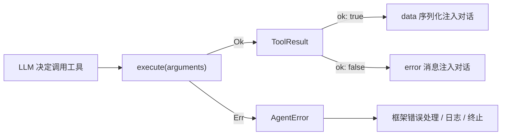
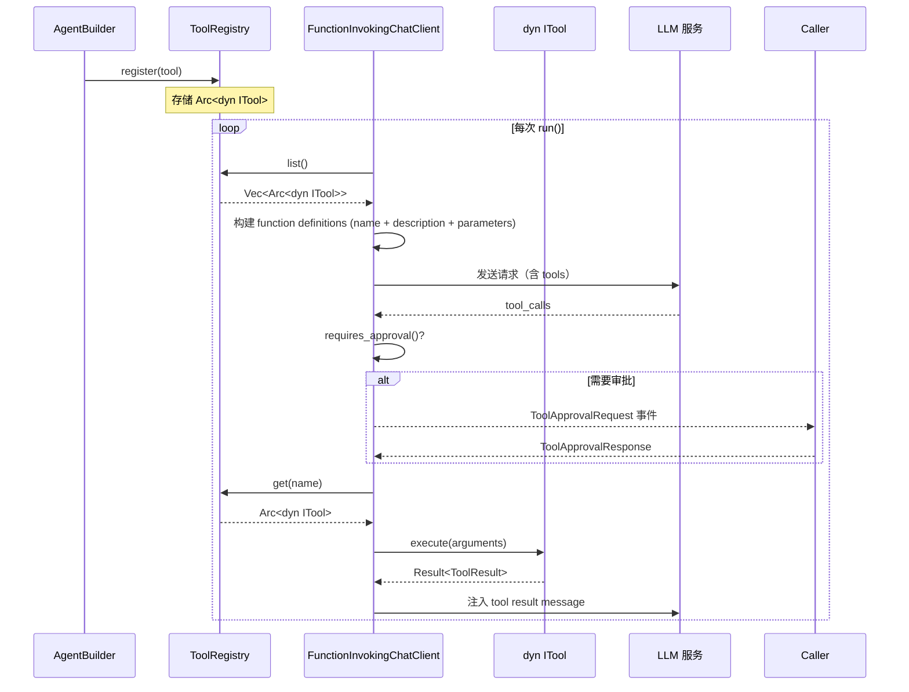

# 4.1 ITool trait 与 ToolResult

`ITool` 是 RAF 工具系统的核心接口。任何希望被 Agent 调用的功能单元都必须实现此 trait。本章逐字段解析 `ITool` 的完整定义，涵盖 `AsAny` 超 trait、`ToolResult` 统一返回类型，以及各方法的职责边界。

## ITool trait 完整定义

`ITool` 定义于 `rust_agent_core::tool` 模块：

```rust
/// 工具接口，遵循 MAF 的工具抽象。
#[async_trait]
pub trait ITool: AsAny + Send + Sync {
    /// 获取工具名称
    fn name(&self) -> &str;
    /// 获取工具描述
    fn description(&self) -> &str;
    /// 获取工具参数 JSON Schema
    fn parameters(&self) -> serde_json::Value;

    /// 执行业务逻辑。
    ///
    /// - `Ok(ToolResult)`：工具执行完成（含成功或工具级预期错误）
    /// - `Err(AgentError)`：框架级错误（参数反序列化失败等）
    ///
    /// 框架层负责将 `ToolResult` 序列化为 JSON 字符串注入 LLM 对话。
    async fn execute(&self, arguments: serde_json::Value) -> Result<ToolResult>;

    /// 运行时标记：返回 `true` 表示需要人工审批才能执行
    ///
    /// 默认返回 `false`（自动执行）。仅 [`ApprovalRequiredTool`] 重写为返回 `true`。
    /// 由 `FunctionInvokingChatClient` 在执行前检查。
    fn requires_approval(&self) -> bool {
        false
    }

    /// 工具分类——与 ToolDecl 的 kind 标签对应。
    ///
    /// 返回: `"web"` | `"file"` | `"code"` | `"function"` | `"custom"` | `"mcp"` | `"openapi"`
    ///
    /// 默认返回 `"unknown"`，内置工具和宏生成的结构体应覆写此方法。
    fn kind(&self) -> &str {
        "unknown"
    }
}
```

### 方法逐字段解析

| 方法 | 返回类型 | 职责 | 调用时机 |
|------|----------|------|----------|
| `name()` | `&str` | 返回工具唯一标识符，也是 LLM function calling 中的函数名 | 注册时、LLM 生成 tool_calls 时 |
| `description()` | `&str` | 返回工具用途的自然语言描述，注入 LLM system prompt 帮助模型选择合适的工具 | 每次 `run()` 构建 system prompt 时 |
| `parameters()` | `serde_json::Value` | 返回工具参数的 JSON Schema 对象，描述参数类型、必填/可选、描述信息 | 每次 `run()` 构建 function definitions 时 |
| `execute()` | `Result<ToolResult>` | 执行工具的核心逻辑，接收 LLM 反序列化后的参数 JSON | LLM 决定调用工具后，由 `FunctionInvokingChatClient` 触发 |
| `requires_approval()` | `bool` | 标记是否需要人工审批；默认 `false` | 每次执行前由框架检查 |
| `kind()` | `&str` | 返回工具分类字符串：`"web"` / `"file"` / `"function"` 等；默认 `"unknown"` | YAML 声明式分类、运行时查询 |

### 方法设计的深层考量

**`execute()` 为什么接收 `serde_json::Value` 而非泛型？**

因为 `ToolRegistry` 存储的是 `Arc<dyn ITool>`，trait object 不支持泛型方法。每个工具在 `execute()` 内部自行反序列化参数，这是 Rust trait object 模式下最灵活的折中方案。

**为什么有两层错误（`ToolResult::error` 和 `Result::Err`）？**

`ToolResult::error("文件不存在")` 是工具正常运行但业务上"失败"的情况——这个错误会被序列化后注入 LLM 对话，模型可以据此调整行为。`Result::Err(AgentError)` 是框架级异常（如参数反序列化失败），通常意味着工具设计有问题，不应让模型看到。



## AsAny 超 trait

`AsAny` 为 trait object 提供运行时下转型（downcasting）能力，使 `Arc<dyn ITool>` 可以安全地转换为具体类型。

```rust
/// 为 trait object 提供运行时下转型能力。
///
/// `ITool` 继承此 trait，使 `Arc<dyn ITool>` 可通过 `as_any()` 下转
/// 到具体类型。`WorkspaceContextProvider` 用此检测 `IScopeTool` 实现。
pub trait AsAny {
    fn as_any(&self) -> &dyn std::any::Any;
}

/// 为所有 `'static` 类型自动实现 `AsAny`。
impl<T: 'static> AsAny for T {
    fn as_any(&self) -> &dyn std::any::Any { self }
}
```

### 为什么需要 AsAny？

`WorkspaceContextProvider` 在 `add_tool()` 时需要检测工具是否实现了 `IScopeTool`：

```rust
fn try_inject_scope(tool: &Arc<dyn ITool>, scope: Arc<WorkspaceScope>) -> Option<Arc<dyn ITool>> {
    let any = tool.as_any();

    if any.downcast_ref::<ReadFile>().is_some() {
        let dummy = ReadFile { scope: None };
        return Some(dummy.create_scoped(scope));
    }
    // ... 其他工具类型的下转型检测 ...
    None
}
```

由于 Rust 的 trait object 不支持直接对超 trait 进行 `downcast_ref`，`AsAny` 提供了这个桥接能力。每个实现 `ITool` 的 struct 自动获得 `AsAny` 实现（通过 blanket impl），无需手动编写代码。

## ToolResult 统一返回类型

`ToolResult` 是所有工具 `execute()` 返回的统一结构体。框架层（`FunctionInvokingChatClient`）负责将其序列化为 JSON 字符串注入 LLM 对话。

```rust
#[derive(Debug, Clone, Serialize, Deserialize)]
pub struct ToolResult {
    pub ok: bool,
    #[serde(skip_serializing_if = "Option::is_none")]
    pub data: Option<serde_json::Value>,
    #[serde(skip_serializing_if = "Option::is_none")]
    pub error: Option<String>,
}
```

### 构造方法

| 方法 | 签名 | 用途 |
|------|------|------|
| `success(data)` | `fn success(data: impl Serialize) -> Self` | 创建成功结果，`ok: true`，data 自动序列化为 `serde_json::Value` |
| `error(msg)` | `fn error(msg: impl Into<String>) -> Self` | 创建工具级错误，`ok: false`，error 字段包含可读错误消息 |
| `error_with_data(msg, data)` | `fn error_with_data(msg: impl Into<String>, data: impl Serialize) -> Self` | 创建带结构化错误数据的结果，如校验失败的字段详情 |

### 使用示例

**成功结果：**

```rust
// 简单成功
ToolResult::success(serde_json::json!({"path": "/src/main.rs", "bytes_written": 1024}))

// 带多个字段
ToolResult::success(serde_json::json!({
    "path": args.path,
    "content": output,
    "total_lines": 100,
    "start_line": 1,
    "end_line": 50,
}))
```

**工具级错误（会注入 LLM 对话）：**

```rust
ToolResult::error("File not found: /path/to/file.rs")
ToolResult::error(format!("File too large ({} bytes, max {})", actual, MAX_FILE_SIZE))
```

**带结构化数据的错误：**

```rust
ToolResult::error_with_data(
    "Validation failed",
    serde_json::json!({
        "field": "path",
        "issue": "contains illegal characters",
        "suggested": "/safe/path"
    })
)
```

### 序列化行为

由于 `serde(skip_serializing_if = "Option::is_none")`：

- 成功结果序列化为：`{"ok": true, "data": {...}}`
- 错误结果序列化为：`{"ok": false, "error": "..."}`

框架层在处理完 `ToolResult` 后，直接将其 JSON 字符串作为 tool result message 注入对话历史。

## 完整 trait object 生命周期



## 关键要点

1. **`ITool` 是最小编码单元**——每个工具只需实现 4 个核心方法（`requires_approval` 有默认实现），框架负责其余的生命周期管理。

2. **`AsAny` 实现了类型擦除后的恢复**——通过 `as_any()` 可以将 `Arc<dyn ITool>` 下转型为具体类型，用于 scope 注入等需要类型信息的场景。

3. **`ToolResult` 区分业务错误和框架错误**——业务错误（`ToolResult::error`）反馈给 LLM 让其调整；框架错误（`Result::Err`）在框架层处理，不污染对话。

4. **`execute()` 的 `arguments` 由宏或手动反序列化**——`#[tool]` 宏自动生成反序列化逻辑；手动实现时需自行处理。
