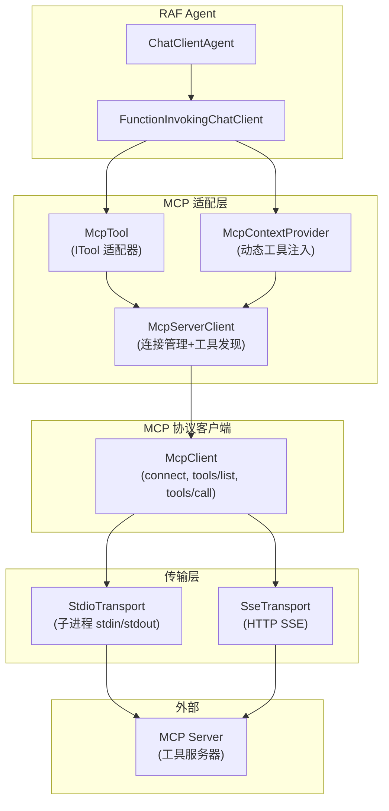

# 4.8 MCP 工具集成

MCP（Model Context Protocol，模型上下文协议）是一个开放协议，允许 AI Agent 通过标准化的 JSON-RPC 2.0 接口调用外部工具、访问资源和获取提示词。RAF 通过 `rust-agent-mcp` crate 提供了完整的 MCP 客户端实现，使 Agent 可以无缝集成任何兼容 MCP 的工具服务器。

## 架构概览



## 核心组件

### McpClient — MCP 协议客户端

`McpClient` 是 MCP 协议的核心实现，负责：

- **连接管理**：建立连接并完成 MCP `initialize`/`initialized` 握手
- **工具操作**：`tools/list`（列出工具）、`tools/call`（调用工具）
- **资源操作**：`resources/list`（列出资源）、`resources/read`（读取资源）
- **提示词操作**：`prompts/list`（列出提示词）、`prompts/get`（获取提示词）

```rust
use rust_agent_mcp::{McpClient, McpConnectionOptions};
use std::collections::HashMap;

// 通过 stdio 子进程连接 MCP 服务器
let config = McpConnectionOptions::stdio("mcp-filesystem-server", vec!["/work".into()]);
let client = McpClient::connect(config).await?;

// 列出可用工具
if let Some(tools) = client.list_tools(None).await? {
    for tool in &tools.tools {
        println!("Tool: {} — {}", tool.name, tool.description);
    }
}

// 调用工具
let mut args = HashMap::new();
args.insert("path".into(), serde_json::json!("/work/readme.md"));
let result = client.call("read_file", args).await?;
println!("Result: {:?}", result.content);
```

### McpTool — ITool 适配器

`McpTool` 将 MCP 工具适配为 RAF 的 `ITool` trait，使 MCP 工具可以被 `ToolRegistry` 注册、被 `FunctionInvokingChatClient` 调用，与其他内置工具无差别使用。

```rust
use rust_agent_mcp::McpTool;
use std::sync::Arc;

// 从 McpClient 创建 McpTool
let client = Arc::new(McpClient::connect(config).await?);
let tools = client.list_tools(None).await?.unwrap();

for tool_info in &tools.tools {
    let mcp_tool = McpTool::new(Arc::clone(&client), tool_info);
    registry.register(mcp_tool);
}
```

**工作原理：**
- `name()` → 返回 MCP 服务器的工具名称
- `description()` → 返回 MCP 服务器的工具描述
- `parameters()` → 返回 MCP 服务器的 `inputSchema`（JSON Schema）
- `execute(arguments)` → 调用 `McpClient::call()`，将结果包装为 `ToolResult`

### McpServerClient — 连接管理与工具发现

`McpServerClient` 封装 `McpClient` 并提供便捷的工具发现接口：

```rust
use rust_agent_mcp::{McpServerClient, McpConnectionOptions};

// 连接并发现所有工具
let config = McpConnectionOptions::stdio("my-mcp-server", vec![]);
let server = McpServerClient::connect(config).await?;

let tools = server.discover_tools().await?;
println!("Discovered {} tools from {}", tools.len(), server.server_name().unwrap_or("unknown"));
```

### McpContextProvider — 动态工具注入

`McpContextProvider` 实现 `IContextProvider`，在 Agent 每次调用时自动发现并注入 MCP 工具。工具列表会被缓存，避免重复发现。

```rust
use rust_agent_mcp::{McpContextProvider, McpServerClient, McpConnectionOptions};

let config = McpConnectionOptions::stdio("filesystem", vec!["/work"]);
let server = McpServerClient::connect(config).await?;

let agent = AgentBuilder::new("assistant")
    .chat_client(client)
    .instructions("You are a helpful coding assistant.")
    // 通过 ContextProvider 动态注入 MCP 工具
    .add_context_provider(McpContextProvider::new(server))
    .build()?;
```

## 传输层

MCP 支持两种传输方式，通过 `McpConnectionOptions` 选择。

### Stdio 传输（子进程）

最常用的方式，通过启动子进程并与其 stdin/stdout 通信：

```rust
// Go/Python/Node.js 实现的 MCP 服务器
let config = McpConnectionOptions::stdio(
    "python",                         // 可执行文件
    vec!["-m", "mcp_server"].into(),  // 参数
);
```

子进程的 stderr 会自动转发到 tracing 日志（`target: "mcp_server_stderr"`）。连接关闭时会 kill 子进程。

### SSE 传输（HTTP）

适合远程 MCP 服务器，通过 HTTP POST 发送请求，SSE 流接收响应：

```rust
let config = McpConnectionOptions::sse(
    "https://mcp.example.com/sse",    // SSE 端点
    "https://mcp.example.com/messages", // POST 端点
);
```

## Agent Builder 集成

RAF 为 `AgentBuilder` 提供了 `AgentBuilderMcpExt` 扩展 trait，提供流畅的 MCP 集成 API：

```rust
use rust_agent_decl::AgentBuilderMcpExt;
use rust_agent_mcp::McpConnectionOptions;

// 方式一：连接 MCP 服务器并注册所有工具
let agent = AgentBuilder::new("assistant")
    .chat_client(client)
    .with_mcp_server(McpConnectionOptions::stdio("mcp-server", vec![]))
    .await?
    .build()?;

// 方式二：注册单个 MCP 工具
let server = McpServerClient::connect(config).await?;
let agent = AgentBuilder::new("assistant")
    .chat_client(client)
    .with_mcp_tool(&server, "specific_tool_name")
    .await?
    .build()?;

// 方式三：使用 ContextProvider 动态注入
let agent = AgentBuilder::new("assistant")
    .chat_client(client)
    .with_mcp_server_provider(McpContextProvider::new(server))
    .build()?;
```

## 声明式配置

在 MAF 兼容的 YAML/JSON 声明文件中，可以声明 MCP 工具：

```yaml
kind: prompt
name: mcp-agent
model:
  id: deepseek-v3
  connection:
    kind: key
    api_key: $DEEPSEEK_API_KEY
instructions: You can use MCP tools to interact with external services.
tools:
  - kind: mcp
    name: filesystem_read
    server_url: "stdio://filesystem-server"
    tool_name: read_file
  - kind: mcp
    name: github_search
    server_url: "stdio://github-mcp-server"
    tool_name: search_repositories
```

通过 `DeclAgentBuilder` 解析（推荐）：

```rust
use rust_agent_decl::DeclAgentBuilder;
use rust_agent_mcp::{McpServerClient, McpConnectionOptions};

// MCP 服务器需在 ToolResolver 中注册 — 当前通过 with_tool 或扩展 ToolResolver 预注册
let agent = DeclAgentBuilder::from_file("agent.yaml")
    .build()
    .await?;
```

若需手动注册 MCP 服务器，仍可使用 `ToolResolver`：

```rust
use rust_agent_decl::resolver::tool_resolver::ToolResolver;
use rust_agent_mcp::{McpServerClient, McpConnectionOptions};

let mut resolver = ToolResolver::new();
resolver.register_mcp_server(
    "stdio://filesystem-server",
    McpServerClient::connect(McpConnectionOptions::stdio("mcp-server", vec![])).await?,
);
let tools = resolver.resolve_all(&agent_def.tools).await?;
```

### 工作流中的 MCP 调用

```yaml
kind: workflow
name: mcp-workflow
trigger:
  kind: manual
  actions:
    - kind: invoke_mcp_tool
      serverUrl: "stdio://filesystem-server"
      toolName: search_files
      arguments:
        pattern: "*.rs"
        path: "/project"
      output:
        result: search_results
```

## 多个 MCP 服务器

RAF 支持同时连接多个 MCP 服务器：

```rust
let filesystem = McpServerClient::connect(
    McpConnectionOptions::stdio("filesystem-server", vec!["/work"])
).await?;

let github = McpServerClient::connect(
    McpConnectionOptions::stdio("github-mcp-server", vec![])
).await?;

let agent = AgentBuilder::new("multi-server")
    .chat_client(client)
    .add_context_provider(
        McpContextProvider::new(filesystem)
            .add_server(github)
    )
    .build()?;
```

## 错误处理

MCP 工具执行失败时返回 `ToolResult::error()`：

```rust
// MCP 工具返回 is_error: true 时
// → ToolResult { ok: false, error: "MCP tool 'read_file' returned error: ..." }

// MCP 连接失败时
// → AgentError::ToolError("MCP tool 'read_file' call failed: Transport error: ...")

// 工具未找到时（声明式解析）
// → DeclError::Missing("MCP server '...' does not expose a tool named '...'")
```

## 关键要点

1. **McpClient** 是 MCP 协议的核心实现，支持 stdio 和 SSE 两种传输方式
2. **McpTool** 将任意 MCP 工具适配为 RAF 的 `ITool`，与内置工具无差别
3. **McpContextProvider** 通过 `IContextProvider` 机制动态注入 MCP 工具
4. **McpServerClient** 提供连接管理和便捷的工具发现 API
5. **AgentBuilderMcpExt** 提供流畅的 `with_mcp_server` / `with_mcp_tool` 构建 API
6. **声明式配置** 在 YAML/JSON 中声明 MCP 工具，通过 `ToolResolver` 解析
7. **多服务器支持** 同时连接多个 MCP 服务器，工具自动去重

## 下一步

- 阅读 [McpContextProvider 动态工具注入](../05-context-providers/overview.md) 了解 ContextProvider 机制
- 阅读 [第 10 章声明式配置](../10-macros-declarative/agent-schema.md) 了解 Workflow 中的 `invoke_mcp_tool` 动作
- 阅读 [AgentBuilder 构建器](../03-agent-engine/agent-builder.md) 了解 Agent 构建的更多方式
