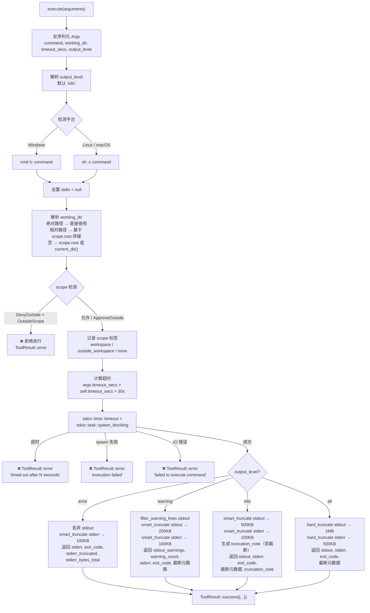

# 4.5 RunCommand 命令执行工具

`RunCommand` 是 RAF 中功能最丰富也最危险的内置工具。它允许 Agent 执行任意 shell 命令，并通过 `output_level` 单一参数控制输出粒度，同时提供超时控制、智能截断、工作区边界感知等多层安全防护。

---

## 设计理念

### 从参数爆炸到单参数控制

旧版 RunCommand 使用固定的 100KB 头部截断策略——所有输出一律截断头部，保留前 100KB。这让 LLM 陷入两难：截断可能丢掉关键的构建错误（通常在尾部），但不截断又可能撑爆 context window。

新版设计引入 **`output_level`**——一个参数解决所有问题：

| 设计原则 | 说明 |
|----------|------|
| **单参数** | 仅新增 `output_level`，不搞参数爆炸 |
| **尾部截断** | 错误摘要、构建结果、测试报告通常位于尾部，`smart_truncate` 保留尾部 |
| **被动引导** | `truncation_note` 告知 LLM 被截断了什么以及如何获取更多——LLM 无需预先配置截断策略 |
| **平台感知** | `description()` 在运行时动态告知 LLM 当前终端（`cmd /c` 或 `sh -c`），使 LLM 生成匹配平台的命令语法 |

---

## 参数定义

`RunCommand` 接受四个参数，其中仅 `command` 为必填。

| 参数 | 类型 | 必填 | 默认值 | 说明 |
|------|------|------|--------|------|
| `command` | `string` | 是 | — | 要执行的 shell 命令（支持管道、重定向、环境变量展开） |
| `working_dir` | `string` | 否 | `scope.root` 或 `current_dir()` | 命令执行的工作目录。绝对路径直接使用，相对路径基于 `base_dir` 拼接 |
| `timeout_secs` | `integer` | 否 | 见下方优先级 | 本次调用的超时秒数覆盖值 |
| `output_level` | `string` | 否 | `"info"` | 输出粒度控制：`"error"` / `"warning"` / `"info"` / `"all"` |

### 超时优先级（三层）

```
LLM 参数 args.timeout_secs   ← 最高优先级
        ↓ 若为 None
构造函数 self.timeout_secs    ← 次优先级
        ↓ 若为 None
DEFAULT_TIMEOUT_SECS (30s)   ← 最终兜底
```

### 结构体定义

`RunCommand` 不使用 `#[tool]` 宏，而是手动实现 `ITool` trait，以实现**平台感知的 `description()` 和 `parameters()`**——在运行时根据 `cfg!(windows)` / `cfg!(unix)` 动态告知 LLM 当前执行环境，使 LLM 能构建正确的命令语法。

```rust
pub struct RunCommand {
    pub scope: Option<Arc<WorkspaceScope>>,
    pub timeout_secs: Option<u64>,
}

impl ITool for RunCommand {
    fn name(&self) -> &str { "run_command" }

    fn description(&self) -> &str {
        if cfg!(windows) {
            // Windows 下告知 LLM 使用 cmd 语法
            "Executes a shell command via cmd /c on Windows. \
             Use cmd syntax: dir, del, type, set, &&, ||, >, <. \
             For PowerShell, prefix with powershell -Command \"...\"..."
        } else {
            // Unix 下告知 LLM 使用 POSIX shell 语法
            "Executes a shell command via sh -c on Unix (Linux/macOS). \
             Use POSIX shell syntax: ls, rm, grep, |, >, &&, $VAR. \
             For scripts, write the interpreter explicitly: python3 script.py..."
        }
    }
}
```

**平台感知信息差异**：

| 平台 | `description()` 告知 | `command` 参数 schema 告知 |
|------|---------------------|--------------------------|
| Windows | "via cmd /c" + cmd 语法提示 + PowerShell 前缀指引 | "via cmd /c" + `&&`/`>`/`2>&1` 语法 |
| Unix | "via sh -c" + POSIX 语法提示 + 解释器显式调用指引 | "via sh -c" + `$VAR` 展开 + 管道语法 |

`scope` 由 `WorkspaceContextProvider` 在注册工具时通过 `IScopeTool::create_scoped()` 自动注入，用户无需手动设置。

---

## `output_level` 行为对比

| 维度 | `error` | `warning` | `info`（默认） | `all` |
|------|---------|-----------|----------------|-------|
| **stdout** | 丢弃 | 仅保留含 `warn` 的行（大小写不敏感），尾部截断至 200KB | 尾部截断至 500KB | 头部截断至 1MB |
| **stderr** | 尾部截断至 100KB | 尾部截断至 100KB | 尾部截断至 100KB | 头部截断至 500KB |
| **截断策略** | `smart_truncate`（保留尾部） | `smart_truncate`（保留尾部） | `smart_truncate`（保留尾部） | `hard_truncate`（保留头部） |
| **truncation_note** | 无 | 无 | **有**（当发生截断时） | 无 |
| **warning_count** | 无 | **有** | 无 | 无 |
| **stdout_warnings** | 无 | **有** | 无 | 无 |
| **典型场景** | 快速检查命令是否出错 | CI/CD 构建日志中只关心警告和错误 | 日常使用，产出智能摘要 | 需要完整输出的调试场景 |

### 截断常量一览

```rust
const MAX_STDOUT_INFO: usize = 500 * 1024;    // info 模式 stdout — 500KB
const MAX_STDERR_INFO: usize = 100 * 1024;    // info 模式 stderr — 100KB
const MAX_STDOUT_ALL: usize  = 1_000_000;     // all 模式 stdout  — 1MB
const MAX_STDERR_ALL: usize  = 500 * 1024;    // all 模式 stderr  — 500KB
const MAX_ERROR: usize       = 100 * 1024;    // error/warning 模式单流 — 100KB
const MAX_WARNING_STDOUT: usize = 200 * 1024; // warning 模式过滤后 stdout — 200KB
```

---

## 智能截断算法

### `smart_truncate` — 保留尾部

错误摘要、构建结果、测试报告几乎总是在输出的末尾。因此对 `error` / `warning` / `info` 三个级别采用**尾部保留**策略：丢弃头部，保留尾部，并标注被省略的字节数。

```rust
/// 智能截断：保留尾部，因为错误摘要/构建结果通常在尾部。
/// 返回 (截断后文本, 是否截断, 原始总字节数)。
fn smart_truncate(data: &[u8], max: usize) -> (String, bool, usize) {
    let total = data.len();
    if total <= max {
        return (String::from_utf8_lossy(data).to_string(), false, total);
    }
    // 取尾部 max 字节
    let tail = &data[total - max..];
    // 在开头注入省略提示，告知 LLM 丢弃了多少内容
    let prefix = format!("...[omitted {} bytes]\n", total - max);
    (prefix + &String::from_utf8_lossy(tail), true, total)
}
```

**效果示例**——假设 stdout 共 800KB，`max = 500KB`：

```
...[omitted 3145728 bytes]
<此处为最后 500KB 的输出内容——正是构建错误和摘要所在的位置>
```

### `hard_truncate` — 保留头部

`all` 级别使用传统头部截断——因为用户明确要求"所有输出"，截断是不得已的最后手段，保留开头处的上下文更合理。

```rust
/// 硬截断（头部优先），用于非关键输出。
fn hard_truncate(data: &[u8], max: usize) -> (String, bool, usize) {
    let total = data.len();
    if total <= max {
        return (String::from_utf8_lossy(data).to_string(), false, total);
    }
    let head = String::from_utf8_lossy(&data[..max]).to_string();
    (format!("{}...[truncated, {} bytes total]", head, total), true, total)
}
```

### `filter_warning_lines` — 警告行过滤

`warning` 级别对 stdout 执行行级过滤，仅保留包含 `"warn"` 的行（大小写不敏感），然后再应用尾部截断。

```rust
/// 过滤包含 "warn" 或 "warning" 的行（大小写不敏感）。
fn filter_warning_lines(data: &[u8]) -> Vec<u8> {
    let text = String::from_utf8_lossy(data);
    let filtered: Vec<&str> = text
        .lines()
        .filter(|line| {
            let lower = line.to_lowercase();
            lower.contains("warn")
        })
        .collect();
    filtered.join("\n").into_bytes()
}
```

---

## 各 `output_level` 响应示例

### `error` 级别

仅返回 stderr，stdout 被丢弃。用于快速检查命令是否报错。

**场景**：`cargo build --release` 编译失败

```json
{
  "stderr": "error[E0308]: mismatched types\n  --> src/main.rs:15:9\n   |\n15 |     let x: u32 = \"hello\";\n   |            ---   ^^^^^^^ expected `u32`, found `&str`\n   |            |\n   |            expected due to this\n\nerror: aborting due to previous error\n",
  "exit_code": 101,
  "stderr_truncated": false,
  "stderr_bytes_total": 287,
  "scope": "workspace"
}
```

### `warning` 级别

stderr 完整 + stdout 中过滤出的警告行。适用于 CI 构建日志等场景。

**场景**：`cargo build` 有警告但编译成功

```json
{
  "stdout_warnings": "warning: unused variable: `x`\n  --> src/main.rs:10:9\n   |\n10 |     let x = 42;\n   |         ^ help: if this is intentional, prefix it with an underscore: `_x`\n\nwarning: function `unused_fn` is never used\n  --> src/lib.rs:5:4\n   |\n5  | fn unused_fn() {}\n   |    ^^^^^^^^^\n",
  "warning_count": 2,
  "stderr": "",
  "exit_code": 0,
  "stdout_truncated": false,
  "stdout_bytes_total": 356,
  "stderr_truncated": false,
  "stderr_bytes_total": 0,
  "scope": "workspace"
}
```

### `info` 级别（默认）

日常使用的智能摘要模式。关键特性：发生截断时附带 `truncation_note`，引导 LLM 获取完整输出。

**场景**：执行长构建命令，输出超限

```json
{
  "stdout": "...[omitted 3145728 bytes]\n   Compiling my-crate v0.1.0\n   Compiling dep-crate v0.5.0\nerror[E0425]: cannot find value `foo` in this scope\n  --> src/main.rs:20:13\n   |\n20 |     println!(\"{}\", foo);\n   |                    ^^^ not found in this scope\n\nerror: aborting due to previous error\n",
  "stderr": "",
  "exit_code": 101,
  "stdout_truncated": true,
  "stdout_bytes_total": 3657728,
  "stderr_truncated": false,
  "stderr_bytes_total": 0,
  "truncation_note": "Output was truncated. Use output_level=\"error\" for errors only (0 bytes stderr), or output_level=\"all\" for full output (up to 1MB).",
  "scope": "workspace"
}
```

**`truncation_note` 的设计意图**：这是一个**被动引导**字段。LLM 不需要提前知道输出有多大，也无需在调用前配置截断策略。看到 `truncation_note` 后，LLM 可以做出智能决策：

- "我只关心错误" → 下次用 `output_level: "error"`
- "我需要全部输出" → 下次用 `output_level: "all"`
- "信息已足够" → 不做额外操作

### `all` 级别

返回尽可能完整的输出。使用头部截断（`hard_truncate`），1MB stdout + 500KB stderr 硬上限。

**场景**：执行 `cat large_file.log` 查看完整日志

```json
{
  "stdout": "2026-06-18 10:00:01 INFO  Server starting on port 8080\n2026-06-18 10:00:02 INFO  Database connection pool initialized\n...[大量日志内容]...\n...[truncated, 2048576 bytes total]",
  "stderr": "",
  "exit_code": 0,
  "stdout_truncated": true,
  "stdout_bytes_total": 2048576,
  "stderr_truncated": false,
  "stderr_bytes_total": 0,
  "scope": "workspace"
}
```

### 响应字段速查

| 字段 | 类型 | 出现于 | 说明 |
|------|------|--------|------|
| `stdout` | `string` | info / all | 命令标准输出（可能截断） |
| `stderr` | `string` | 全部 | 命令标准错误输出（可能截断） |
| `exit_code` | `integer` | 全部 | 进程退出码；命令不存在时返回 -1 |
| `scope` | `string` | 全部 | `"workspace"` / `"outside_workspace"` / `"none"` |
| `stdout_truncated` | `boolean` | info / all / warning | stdout 是否被截断 |
| `stdout_bytes_total` | `integer` | info / all / warning | stdout 原始总字节数 |
| `stderr_truncated` | `boolean` | info / all / error / warning | stderr 是否被截断 |
| `stderr_bytes_total` | `integer` | info / all / error / warning | stderr 原始总字节数 |
| `truncation_note` | `string \| null` | **仅 info** | 截断时提供操作指引 |
| `warning_count` | `integer` | **仅 warning** | 过滤出的警告行数量 |
| `stdout_warnings` | `string` | **仅 warning** | 过滤后的警告行内容 |

---

## 完整执行流程



---

## 平台感知执行

RAF 根据编译目标自动选择正确的 shell：

```rust
let (program, shell_args) = if cfg!(windows) {
    ("cmd", vec!["/c".to_string(), args.command.clone()])
} else {
    ("sh", vec!["-c".to_string(), args.command.clone()])
};
```

| 平台 | Shell | 参数格式 | 说明 |
|------|-------|----------|------|
| Windows | `cmd` | `/c <command>` | 支持 cmd 内建命令（dir, type, mkdir 等） |
| Linux / macOS | `sh` | `-c <command>` | 支持 POSIX shell 全部特性 |

**重要提示**：因为命令通过 shell 执行，以下特性均可用：

- 管道（`|`）
- 重定向（`>`, `>>`, `<`, `2>&1`）
- 环境变量展开（`$PATH`, `%USERPROFILE%`）
- 条件链（`&&`, `||`）
- 命令替换（`` `command` `` 或 `$(command)`）

但 `stdin` 被显式设为 `Stdio::null()`，命令无法从标准输入读取任何数据。需要输入的命令（如 `read`、`sudo` 等交互式操作）将无法正常工作。

---

## Scope 感知与工作区安全

### 工作目录解析

```rust
fn resolve_working_dir(base_dir: &Path, path: &str) -> PathBuf {
    let p = Path::new(path);
    if p.is_absolute() {
        p.to_path_buf()           // 绝对路径直接使用
    } else if path.is_empty() || path == "." {
        base_dir.to_path_buf()    // 空或 "." 使用 base_dir
    } else {
        base_dir.join(p)          // 相对路径拼接
    }
}
```

`base_dir` 的确定优先级：
1. `scope.root`（若有 `WorkspaceScope`）
2. `std::env::current_dir()`（兜底）

### Scope 策略

`RunCommand` 在命令执行前对 `working_dir` 进行 scope 检测。检测结果通过 `ScopeStatus` 标签反映在响应的 `scope` 字段中：

- `"workspace"` — 工作目录在 scope 范围内
- `"outside_workspace"` — 工作目录在 scope 范围外
- `"none"` — 未配置 scope（无 WorkspaceScope）

两种安全策略：

| 策略 | 行为 |
|------|------|
| `ScopePolicy::DenyOutside` | `working_dir` 在 scope 外时**直接拒绝执行**，返回错误 |
| `ScopePolicy::ApproveOutside` | `working_dir` 在 scope 外时**标记为需要审批**，由 `ApprovalRequiredTool` 包装层处理 |
| 无策略（默认） | 不做任何限制，`scope` 字段仅作为信息标签 |

> **注意**：scope 检查**仅针对 working_dir**。命令参数中的路径（如 `cat /etc/hosts`）不受 scope 限制，但工作目录受限意味着相对路径引用仍受 scope 约束。

---

## 安全最佳实践

### 1. 生产环境必须使用审批包装

```rust
use rust_agent_core::ApprovalRequiredTool;

let run_cmd = ApprovalRequiredTool::new(Arc::new(RunCommand {
    scope: None,
    timeout_secs: Some(60),
}));
tool_registry.register_arc("run_command", Arc::new(run_cmd));
```

### 2. 设置合理的默认超时

避免 Agent 因等待长时间命令而永久阻塞。建议根据使用场景分层设置：

| 场景 | 推荐超时 |
|------|----------|
| 文件操作（ls, cat, grep） | 10-15 秒 |
| 构建命令（cargo build, npm install） | 300-600 秒 |
| 网络请求（curl, wget） | 60 秒 |
| 默认兜底 | 30 秒 |

### 3. 使用 ScopePolicy::DenyOutside 限制边界

```rust
let scope = WorkspaceScope::new(
    "/path/to/project",
    ScopePolicy::DenyOutside,
);
let run_cmd = RunCommand {
    scope: Some(Arc::new(scope)),
    timeout_secs: Some(30),
};
```

### 4. 结合 ApproveOutside 实现人机协同

```rust
let scope = WorkspaceScope::new(
    "/safe/directory",
    ScopePolicy::ApproveOutside,  // 越界时触发审批
);
```

### 5. 永远不要在生产环境中跳过 scope

无 scope 的 `RunCommand` 可以访问系统任意位置。即使测试环境，也建议注入至少一个宽松的 scope。

### 6. 注意：scope 不限制命令参数中的路径

`scope` 只控制 `working_dir`。命令本身仍然可以访问系统上的任何文件。例如：

```bash
# working_dir 在 scope 内，但命令读取了 scope 外的文件
cat /etc/passwd  # ⚠️ 不受 scope 限制
```

如需完整路径级别的沙箱，应配合操作系统级隔离（容器、chroot、seccomp 等）。

---

## 脚本执行：RunCommand 替代 `run_skill_script`

RAF 中不再有独立的 `run_skill_script` 工具。所有脚本执行统一收敛到 `RunCommand`。

### 执行脚本的推荐方式

**跨平台脚本**（推荐给 Agent 使用）：

```json
{
  "command": "python3 script.py --input data.json --output result.json",
  "working_dir": "/workspace/skills/my-skill",
  "output_level": "info"
}
```

**Shell 内联脚本**：

```json
{
  "command": "for f in *.log; do echo \"=== $f ===\"; tail -n 20 \"$f\"; done",
  "working_dir": "/var/log/myapp",
  "output_level": "warning",
  "timeout_secs": 60
}
```

**脚本文件直接执行**（Unix）：

```json
{
  "command": "./deploy.sh --env production --dry-run",
  "working_dir": "/workspace/scripts",
  "output_level": "all"
}
```

**Windows 批处理**：

```json
{
  "command": "build.bat release x64",
  "working_dir": "C:\\projects\\myapp",
  "output_level": "info"
}
```

### 脚本执行的 `output_level` 选型指南

| 脚本类型 | 推荐 `output_level` | 理由 |
|----------|---------------------|------|
| 部署脚本 | `"all"` | 需要完整输出用于审计和故障排查 |
| 构建脚本 | `"warning"` | 只关心警告和错误，忽略正常编译输出 |
| 测试脚本 | `"error"` | 快速判断是否有失败测试 |
| 数据分析脚本 | `"info"` | 获取摘要 + truncation_note 指导后续操作 |
| 一次性工具调用 | `"info"`（默认） | 平衡信息量与 context window 消耗 |

### 与旧版 `run_skill_script` 的对比

| 特性 | 旧 `run_skill_script` | 新 `RunCommand` |
|------|----------------------|-----------------|
| 脚本语言 | 特定于 Skill 配置 | 任意 shell 命令/脚本 |
| 输出控制 | 固定截断策略 | 4 级 `output_level` |
| 截断策略 | 头部截断 100KB | 智能尾部截断 + 引导 |
| 平台 | 未指定 | 自动检测 Windows/Unix |
| Scope | 未集成 | 完整 scope 感知 |
| 超时 | 可能缺失 | 三层优先级超时 |

---

## 关键要点

1. **单参数控制输出粒度** — `output_level` 替代参数爆炸，四个级别覆盖从"只看错误"到"完整输出"的全部场景
2. **智能尾部截断** — `smart_truncate` 保留尾部，因为错误和构建摘要总是在末尾，LLM 不会错过关键信息
3. **被动引导** — `truncation_note` 告知 LLM 发生了什么以及如何获取更多，无需预先规划输出大小
4. **平台感知描述** — `description()` 和 `parameters()` 在运行时根据 `cfg!(windows)` / `cfg!(unix)` 动态告知 LLM 当前终端类型和推荐语法，LLM 据此生成正确命令
5. **三层超时** — LLM 参数 > 构造预设 > 30 秒默认，灵活且安全
6. **命令成功 ≠ exit_code 0** — 即使命令返回非零退出码，工具本身也返回 `ToolResult::success`。`exit_code` 字段透传给 LLM 自行判断
7. **stdin 恒为 null** — 命令无法接收交互输入，防止 Agent 陷入等待
8. **scope 仅限 working_dir** — 命令参数中的路径不受 scope 约束，生产环境需配合操作系统级隔离
