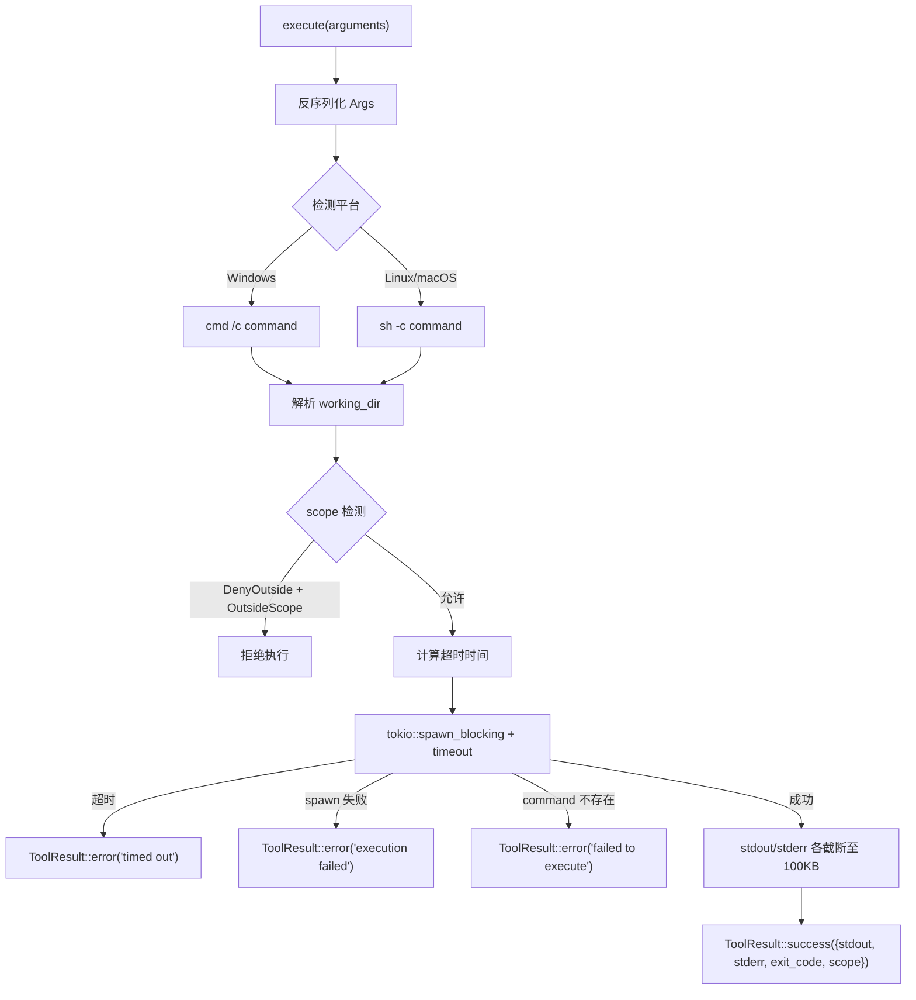

# 4.5 RunCommand 命令执行工具

`RunCommand` 是 RAF 中最强大也最危险的内置工具。它允许 Agent 执行任意 shell 命令，同时提供了超时控制、输出截断、工作区边界感知等多层安全防护。

## 结构定义

```rust
const MAX_OUTPUT_BYTES: usize = 100 * 1024;      // 100KB
const DEFAULT_TIMEOUT_SECS: u64 = 30;             // 30 秒

#[tool(description = "Executes a shell command and returns the output (stdout + stderr) and exit code.")]
pub struct RunCommand {
    pub scope: Option<Arc<WorkspaceScope>>,
    pub timeout_secs: Option<u64>,                 // 构造时设置默认超时
}
```

**设计要点：**

- `timeout_secs` 可在构造时预设默认值，也可由 LLM 在参数中覆盖（`args.timeout_secs` 优先）
- `scope` 由 `WorkspaceContextProvider` 在 `add_tool()` 时通过 `IScopeTool` 自动注入

## JSON Schema 参数

```json
{
  "type": "object",
  "properties": {
    "command": {
      "type": "string",
      "description": "The shell command to execute"
    },
    "working_dir": {
      "type": "string",
      "description": "Optional working directory for the command"
    },
    "timeout_secs": {
      "type": "integer",
      "description": "Optional per-call timeout override in seconds"
    }
  },
  "required": ["command"]
}
```

## 平台感知执行

RAF 自动检测操作系统并选择合适的 shell：

```rust
let (program, shell_args) = if cfg!(windows) {
    ("cmd", vec!["/c".to_string(), args.command.clone()])
} else {
    ("sh", vec!["-c".to_string(), args.command.clone()])
};
```

| 平台 | Shell | 参数格式 |
|------|-------|----------|
| Windows | `cmd` | `/c <command>` |
| Linux / macOS | `sh` | `-c <command>` |

**注意**：命令通过 shell 执行，因此支持管道、重定向、环境变量展开等 shell 特性。

## 工作目录解析

```rust
fn resolve_working_dir(base_dir: &Path, path: &str) -> PathBuf {
    let p = Path::new(path);
    if p.is_absolute() {
        p.to_path_buf()           // 绝对路径直接使用
    } else if path.is_empty() || path == "." {
        base_dir.to_path_buf()    // 空或 "." 使用 base_dir
    } else {
        base_dir.join(p)          // 相对路径拼接
    }
}
```

**优先级**：
1. 如果 `args.working_dir` 提供，使用它
2. 否则使用 `scope.root`（若有 scope）
3. 否则使用 `std::env::current_dir()`

## 超时控制

超时通过 `tokio::time::timeout` + `tokio::task::spawn_blocking` 实现，确保阻塞的命令执行不会饿死异步运行时：

```rust
let timeout_dur = Duration::from_secs(
    args.timeout_secs           // LLM 参数优先
        .or(self.timeout_secs)  // 构造时预设次之
        .unwrap_or(DEFAULT_TIMEOUT_SECS), // 默认 30 秒
);

match tokio::time::timeout(timeout_dur, tokio::task::spawn_blocking(move || cmd.output())).await {
    Err(_elapsed) => Ok(ToolResult::error("Command execution timed out")),
    // ...
}
```

**超时来源优先级**：`args.timeout_secs` > `self.timeout_secs` > `DEFAULT_TIMEOUT_SECS(30)`

## 输出截断

stdout 和 stderr 各自独立截断至 100KB：

```rust
fn truncate_bytes(data: &[u8], max: usize) -> String {
    let s = String::from_utf8_lossy(
        if data.len() <= max { data } else { &data[..max] }
    ).to_string();
    if data.len() > max {
        format!("{}...[truncated]", s)
    } else {
        s
    }
}
```

**设计考量**：100KB 是 stdio 和 stderr 各自的限制——一个命令可能产生最多 200KB 的总输出（stdout 100KB + stderr 100KB），足够 Agent 理解命令结果，同时防止 LLM context window 被大量输出撑爆。

## Scope 感知

`RunCommand` 对 `working_dir` 进行 scope 检测：

```rust
let scope_label = match self.scope.as_ref() {
    Some(scope) => {
        let scope_root = scope.root.as_path();
        match resolve_safe(&base_dir, cwd.to_string_lossy().as_ref(), Some(scope_root)) {
            Ok((_, status)) => {
                if scope.policy == ScopePolicy::DenyOutside
                    && matches!(status, ScopeStatus::OutsideScope)
                {
                    return Ok(ToolResult::error(
                        "Access denied: working directory is outside workspace boundary"
                    ));
                }
                status.to_label().to_string()
            }
            Err(_) => "none".to_string(),
        }
    }
    None => "none".to_string(),
};
```

- `DenyOutside` 策略下，`working_dir` 在 scope 外时直接拒绝
- scope 状态反映在响应的 `scope` 字段中

## 错误处理

`RunCommand` 处理四层错误：

```rust
match tokio::time::timeout(...).await {
    Err(_elapsed) =>
        // 超时
        ToolResult::error("Command execution timed out"),

    Ok(Err(join_err)) =>
        // spawn_blocking 本身失败（极罕见）
        ToolResult::error(format!("Command execution failed: {}", join_err)),

    Ok(Ok(Err(io_err))) =>
        // 命令不存在或无法启动
        ToolResult::error(format!("Failed to execute command: {}", io_err)),

    Ok(Ok(Ok(output))) => {
        // 命令成功执行——无论 exit_code 是否为 0
        // stdout 和 stderr 截断后返回
        ToolResult::success(serde_json::json!({
            "stdout": stdout,
            "stderr": stderr,
            "exit_code": exit_code,
            "scope": scope_label,
        }))
    }
}
```

**关键设计**：命令执行完（即使 `exit_code != 0`）也返回 `ToolResult::success`——因为工具成功执行了。`exit_code` 字段让 LLM 自行判断命令是否达到了预期效果。

## 成功响应示例

```json
{
  "stdout": "total 16\ndrwxr-xr-x  4 user  staff   128 Jun 18 10:30 src\n",
  "stderr": "",
  "exit_code": 0,
  "scope": "workspace"
}
```

```json
{
  "stdout": "",
  "stderr": "cargo: error: no such subcommand: buidl\n\n\tDid you mean build?\n",
  "exit_code": 101,
  "scope": "workspace"
}
```

**注意**：`stdin` 被显式设为 `Stdio::null()`，Agent 不能向命令发送交互输入。

## 完整执行流程



## 安全建议

1. **生产环境必须使用审批**：`ApprovalRequiredTool::new(Arc::new(RunCommand {...}))`
2. **设置合理的默认超时**：避免 Agent 因等待长时间命令而阻塞
3. **使用 `ScopePolicy::DenyOutside`**：限制命令只能在工作区目录内执行
4. **结合 `ScopePolicy::ApproveOutside`**：工作区外的命令需要用户审批

## 关键要点

1. **平台感知**——自动选择 `cmd`（Windows）或 `sh`（Unix），无需 LLM 关心平台差异
2. **多层超时**——构造时默认 > LLM 参数覆盖 > 框架默认 30 秒
3. **输出截断**——stdout 和 stderr 各 100KB，防止 context window 溢出
4. **exit_code 透传**——即使命令失败也返回 success，让 LLM 自行判断结果
5. **scope 检查仅针对 working_dir**——命令本身可以访问未在 scope 内的资源（通过路径参数），但工作目录受限
