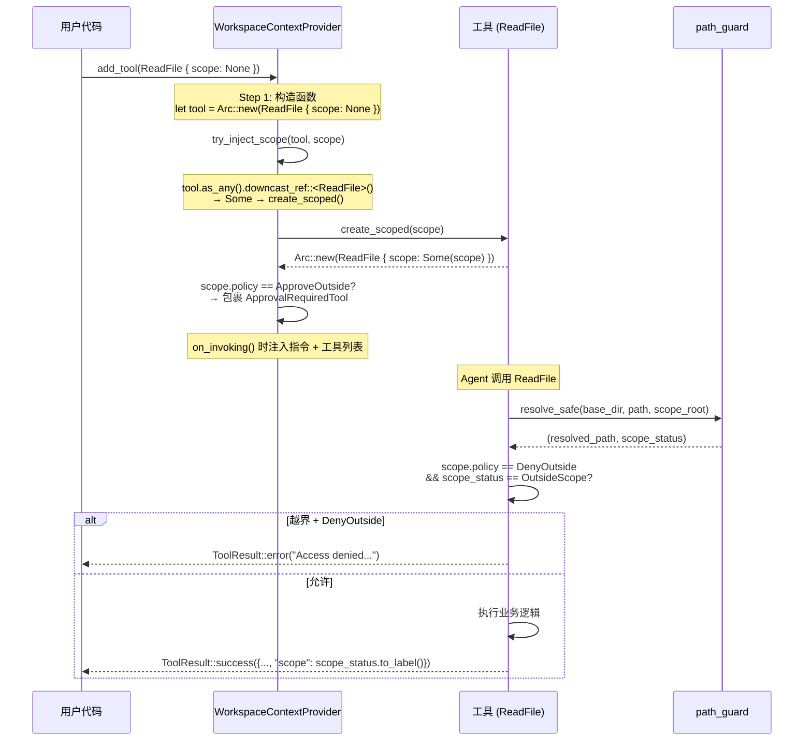

# 4.7 IScopeTool 工作区感知

`IScopeTool` 是 RAF 工作区管理的核心接口，使工具能够感知当前工作区边界，在工具内部执行越界检测。它配合 `WorkspaceContextProvider` 实现全自动的 scope 注入和审批策略执行。

## IScopeTool trait

```rust
/// 可感知工作区范围的工具接口。
///
/// 实现此 trait 的工具由 `WorkspaceContextProvider` 在 `add_tool()` 时
/// 自动注入 `WorkspaceScope`，无需工具构造函数传参。
pub trait IScopeTool: ITool {
    /// 使用指定工作区范围创建工具的新实例。
    ///
    /// 新实例从 `scope.root` 获取工作目录，从 `scope.policy` 获取越界策略。
    fn create_scoped(&self, scope: Arc<WorkspaceScope>) -> Arc<dyn ITool>;
}
```

**关键设计：**

- `IScopeTool` 是 `ITool` 的超 trait（`IScopeTool: ITool`）
- `create_scoped()` 接收 `WorkspaceScope`，返回注入 scope 后的新实例
- 工具不需要在构造时知道 scope——完全由 `WorkspaceContextProvider` 注入

## WorkspaceScope 与 ScopePolicy

```rust
/// 工作区跨范围访问策略
#[derive(Debug, Clone, Copy, PartialEq, Eq, Serialize, Deserialize)]
pub enum ScopePolicy {
    /// 开发模式——不作任何限制
    AllowAll,
    /// 生产模式——跨范围操作需人机协同审批
    ApproveOutside,
    /// 受限模式——禁止任何跨范围访问
    DenyOutside,
}

/// 工作区范围定义
#[derive(Debug, Clone, Serialize, Deserialize)]
pub struct WorkspaceScope {
    /// 规范化的根路径
    pub root: PathBuf,
    /// 可读名称，注入 system prompt
    pub name: String,
    /// 越界处理策略
    pub policy: ScopePolicy,
    /// 扩展属性——路径白名单、命令白名单、环境变量等
    pub properties: HashMap<String, serde_json::Value>,
}
```

**三种策略行为：**

| 策略 | 工作区内操作 | 工作区外操作 | 典型场景 |
|------|------------|------------|----------|
| `AllowAll` | 正常执行 | 正常执行（scope 标签标记为 `outside_workspace`） | 本地开发 |
| `ApproveOutside` | 正常执行 | 触发审批事件（`ToolApprovalRequest`） | 协作审查 |
| `DenyOutside` | 正常执行 | 工具内部直接拒绝（`"Access denied"`） | 受限沙箱 |

## 工具内部的 DenyOutside 检查

每个内置文件系统工具在 `call()` 方法中都包含 scope 检查逻辑：

```rust
// 标准模式（以 ReadFile 为例）
if let Some(ref scope) = self.scope {
    if scope.policy == ScopePolicy::DenyOutside
        && matches!(scope_status, ScopeStatus::OutsideScope)
    {
        return Ok(ToolResult::error(
            "Access denied: path is outside workspace boundary",
        ));
    }
}
```

**检查时机**：在路径解析（`resolve_safe`）之后、业务逻辑之前。这确保即使路径通过了目录穿越防护，scope 越界也能被拦截。

## Scope 标签响应

每个工具的 JSON 响应中都包含 `"scope"` 字段，通过 `path_guard` 模块的 `ScopeStatus` 确定：

```rust
impl ScopeStatus {
    pub fn to_label(&self) -> &str {
        match self {
            ScopeStatus::InScope => "workspace",
            ScopeStatus::OutsideScope => "outside_workspace",
            ScopeStatus::NotApplicable => "none",
        }
    }
}
```

这个标签让 LLM 了解每次操作的工作区上下文，帮助模型判断是否需要调整路径或请求审批。

## WorkspaceContextProvider 的注入机制

`WorkspaceContextProvider` 在 `add_tool()` 时自动处理 scope 注入和审批包裹：

```rust
pub fn add_tool(mut self, tool: impl ITool + 'static) -> Self {
    let mut tool: Arc<dyn ITool> = Arc::new(tool);

    // Step 1: scope 注入（检测 IScopeTool 实现）
    if let Some(scoped) = try_inject_scope(&tool, Arc::clone(&self.scope)) {
        tool = scoped;
    }

    // Step 2: 审批包裹（按策略）
    if self.scope.policy == ScopePolicy::ApproveOutside {
        tool = Arc::new(ApprovalRequiredTool::new(tool));
    }

    self.tools.push(tool);
    self
}
```

### try_inject_scope 的下转型机制

`try_inject_scope()` 使用 `AsAny` 超 trait 进行运行时下转型：

```rust
fn try_inject_scope(tool: &Arc<dyn ITool>, scope: Arc<WorkspaceScope>) -> Option<Arc<dyn ITool>> {
    let any = tool.as_any();

    if any.downcast_ref::<ReadFile>().is_some() {
        let dummy = ReadFile { scope: None };
        return Some(dummy.create_scoped(scope));
    }
    if any.downcast_ref::<WriteFile>().is_some() {
        let dummy = WriteFile { scope: None };
        return Some(dummy.create_scoped(scope));
    }
    // ... 所有 10 个文件系统工具 + RunCommand ...
    None
}
```

**为什么需要"已知类型列表"？**

Rust trait object 的 `downcast_ref` 需要编译期知道目标类型。`try_inject_scope` 无法直接检测 `dyn IScopeTool`（因为 trait object 不支持对超 trait 的 downcast），所以使用穷举已知工具类型的方式。对于自定义工具，目前需要手动注入 scope 或在 `WorkspaceContextProvider` 中添加新的下转型分支。

## 完整集成流程



## 自定义工具实现 IScopeTool

如果你的工具需要工作区感知：

```rust
use std::sync::Arc;
use rust_agent_core::{IScopeTool, ITool, WorkspaceScope, ScopePolicy, ToolResult};
use rust_agent_macros::tool;

#[tool(description = "Reads a configuration file and returns parsed contents")]
pub struct MyConfigTool {
    pub scope: Option<Arc<WorkspaceScope>>,
}

impl IScopeTool for MyConfigTool {
    fn create_scoped(&self, scope: Arc<WorkspaceScope>) -> Arc<dyn ITool> {
        Arc::new(MyConfigTool { scope: Some(scope) })
    }
}

impl MyConfigTool {
    async fn call(&self, arguments: serde_json::Value) -> Result<ToolResult> {
        // 1. 解析 base_dir
        let base_dir = self.scope.as_ref()
            .map(|s| s.root.clone())
            .unwrap_or_else(|| std::env::current_dir().unwrap_or_default());

        // 2. 路径解析 + scope 检测
        let (resolved, scope_status) = path_guard::resolve_safe(&base_dir, &path, scope_root)?;

        // 3. DenyOutside 检查
        if let Some(ref scope) = self.scope {
            if scope.policy == ScopePolicy::DenyOutside
                && matches!(scope_status, ScopeStatus::OutsideScope)
            {
                return Ok(ToolResult::error("Access denied: path is outside workspace boundary"));
            }
        }

        // 4. 业务逻辑
        // ...

        // 5. 返回结果（含 scope 标签）
        Ok(ToolResult::success(serde_json::json!({
            "config": parsed,
            "scope": scope_status.to_label(),
        })))
    }
}
```

## 关键要点

1. **`IScopeTool` 靠 `AsAny` 下转型实现注入**——`WorkspaceContextProvider` 通过 `downcast_ref` 检测具体工具类型
2. **`DenyOutside` 在工具内部拦截**——最快失败，不需要框架层额外检查
3. **`ApproveOutside` 在框架层封装**——通过 `ApprovalRequiredTool` 包裹，由 `FunctionInvokingChatClient` 发出审批事件
4. **`scope` 标签是 LLM 的元信息**——帮助模型理解每次操作的边界上下文
5. **自定义工具参考内置工具模式**——`scope: Option<Arc<WorkspaceScope>>` + `IScopeTool` + scope check 三步
