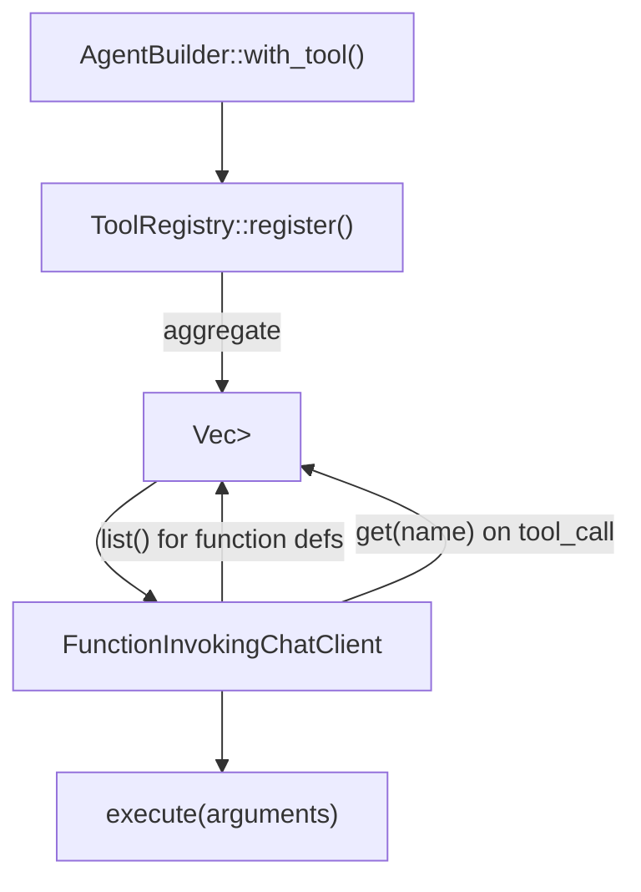

# 4.2 ToolRegistry 工具注册表

`ToolRegistry` 是 RAF 工具系统的中央注册中心。它管理工具的生命周期（注册、查找、列表），是 AgentBuilder 和 FunctionInvokingChatClient 之间的桥梁。

## 数据结构

```rust
/// ToolRegistry — 管理工具注册和查找，遵循 MAF 模式。
pub struct ToolRegistry {
    tools: HashMap<String, Arc<dyn ITool>>,
}
```

**设计要点：**

- 使用 `HashMap<String, Arc<dyn ITool>>`——键是工具名称（`ITool::name()`），值是多所有权智能指针，支持跨组件共享
- `Arc<dyn ITool>` 是 trait object，通过虚表调用，允许注册任意实现了 `ITool` 的类型
- 名称是唯一键：后注册的工具会覆盖同名的先注册工具

## 完整 API

```rust
impl ToolRegistry {
    /// 创建空的工具注册表
    pub fn new() -> Self {
        Self { tools: HashMap::new() }
    }

    /// 注册具体类型的工具（自动包装为 Arc）
    pub fn register(&mut self, tool: impl ITool + 'static) {
        self.tools.insert(tool.name().to_string(), Arc::new(tool));
    }

    /// 注册已经包装为 Arc 的工具
    pub fn register_arc(&mut self, tool: Arc<dyn ITool>) {
        self.tools.insert(tool.name().to_string(), tool);
    }

    /// 根据名称查找工具
    pub fn get(&self, name: &str) -> Option<&Arc<dyn ITool>> {
        self.tools.get(name)
    }

    /// 获取所有已注册工具的列表
    pub fn list(&self) -> Vec<&Arc<dyn ITool>> {
        self.tools.values().collect()
    }

    /// 返回已注册工具的数量
    pub fn len(&self) -> usize {
        self.tools.len()
    }

    /// 检查注册表是否为空
    pub fn is_empty(&self) -> bool {
        self.tools.is_empty()
    }
}

impl Default for ToolRegistry {
    fn default() -> Self {
        Self::new()
    }
}
```

### 方法详解

| 方法 | 签名 | 说明 |
|------|------|------|
| `register()` | `fn register(&mut self, tool: impl ITool + 'static)` | 接收任何具体类型的工具，内部用 `Arc::new()` 包装。`+ 'static` 约束确保类型不包含非静态引用。 |

**为什么有两个注册方法？**

- `register()`：用于注册具体类型（编译期已知大小），如 `registry.register(ReadFile { scope: None })`
- `register_arc()`：用于注册已包装的工具，如 `registry.register_arc(approval_tool)`（当工具已通过装饰器处理）

两者最终都维护 `HashMap<String, Arc<dyn ITool>>`，仅在参数类型上不同。

## 使用示例

### 基本注册与查找

```rust
use rust_agent_core::{ToolRegistry, ToolResult};

// 创建注册表
let mut registry = ToolRegistry::new();

// 注册内置工具
registry.register(ReadFile { scope: None });
registry.register(WriteFile { scope: None });
registry.register(RunCommand { scope: None, timeout_secs: Some(60) });

assert_eq!(registry.len(), 3);
assert!(!registry.is_empty());

// 按名称查找
let read_tool = registry.get("ReadFile").expect("ReadFile should be registered");
assert_eq!(read_tool.name(), "ReadFile");

// 列出所有工具
for tool in registry.list() {
    println!("Tool: {} — {}", tool.name(), tool.description());
}
```

### AgentBuilder 集成

在 AgentBuilder 中，`with_tool()` 内部调用 `ToolRegistry::register()`：

```rust
AgentBuilder::new()
    .with_tool(ReadFile { scope: None })
    .with_tool(WriteFile { scope: None })
    .with_tool(RunCommand { scope: None, timeout_secs: None })
    .build()?;
```

### 审批工具注册

审批包装后的工具通过 `register_arc()` 注册：

```rust
let mut registry = ToolRegistry::new();

// 直接注册（自动执行）
registry.register(RunCommand {
    scope: None,
    timeout_secs: None,
});

// 审批包装后注册（需人工确认）
let approved = Arc::new(ApprovalRequiredTool::new(Arc::new(RunCommand {
    scope: None,
    timeout_secs: None,
})));
registry.register_arc(approved);
```

## 在 Agent 运行流程中的位置



1. **构建阶段**：`AgentBuilder` 将所有 `with_tool()` 调用的工具注册到 `ToolRegistry`
2. **每次 run()**：`FunctionInvokingChatClient` 遍历注册表生成 function definitions 发送给 LLM
3. **工具调用时**：LLM 返回 `tool_calls` 后，框架通过 `get(tool_call.name)` 查找对应工具并调用 `execute()`

## 线程安全

`ToolRegistry` 使用 `HashMap<String, Arc<dyn ITool>>`：

- `Arc` 提供多所有权，允许多个组件同时持有工具引用
- `ITool: Send + Sync` 约束确保工具可以安全地跨线程共享
- `execute()` 内部自行管理可变状态（如需），框架不做额外同步

## 关键要点

1. **名称是唯一键**——同一名称的工具后注册会覆盖先注册的，确保工具名全局唯一
2. **Arc trait object 模式**——通过虚表实现多态，所有注册工具对框架是同质的 `Arc<dyn ITool>`
3. **两个注册方法满足不同场景**——具体类型用 `register()`，已包装类型用 `register_arc()`
4. **O(1) 查找**——HashMap 保证按名称查找的高效性
