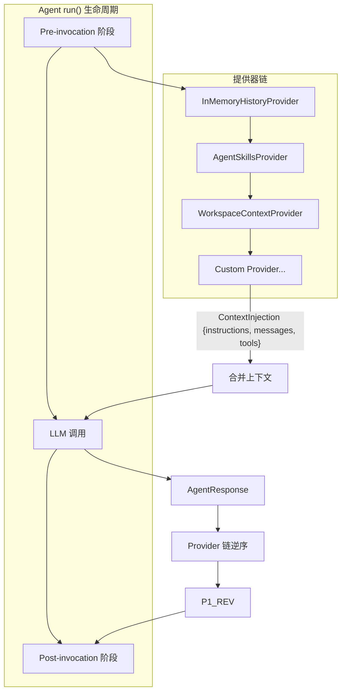

# 第 5 章：上下文提供器

上下文提供器（Context Provider）是 RAF 中 Agent 调用生命周期的核心扩展点。每个提供器在 Agent 每次 `run()` 调用前后被触发，可以注入系统指令、历史消息、动态工具，甚至完全替换累积的消息列表（用于压缩/摘要）。

## 本章目录

| 小节 | 标题 | 核心内容 |
|------|------|----------|
| [5.1](overview.md) | IContextProvider 概述 | trait 定义、ContextInjection 载体、提供器链顺序执行、replace_messages 压缩语义 |
| [5.2](history-provider.md) | InMemoryHistoryProvider 历史管理 | on_invoking 加载历史、on_invoked 持久化 user 消息、消息计数优化 |
| [5.3](skills-provider.md) | AgentSkillsProvider 技能注入 | AgentSkill 结构、目录扫描、advertise 文本、三个技能工具注入 |
| [5.4](custom-provider.md) | 自定义上下文提供器 | 构建自定义 Provider、用户画像示例、数据库查询注入示例 |

## 架构概览

## 提供器链的运作方式

RAF 中，多个 `IContextProvider` 按注册顺序执行：

1. **Pre-invocation（on_invoking）**：每个提供器返回 `ContextInjection`，框架收集并合并
2. **LLM 调用**：合并后的指令、消息、工具被注入 Agent 上下文
3. **Post-invocation（on_invoked）**：每个提供器在 LLM 响应后执行，可持久化状态、记录日志

**提供器顺序很重要**——后面的提供器可以通过 `replace_messages = true` 替换前面累积的消息列表，实现压缩策略。

## 推荐阅读顺序

- **首次接触提供器**：5.1（概览）→ 5.2（历史管理）→ 5.4（自定义）
- **使用技能系统**：5.1 → 5.3 → 明确技能目录结构
- **构建自定义管道**：5.1 → 5.4 → 参考内置提供器源码

---

## 上一步

← [第 4 章：工具系统](../04-tool-system/INDEX.md)

## 下一步

阅读完本章后，建议继续阅读 **[会话管理](../06-sessions/isession.md)** 以掌握多轮对话状态管理，了解 ISession、SessionStore 和 Provider 状态持久化。
