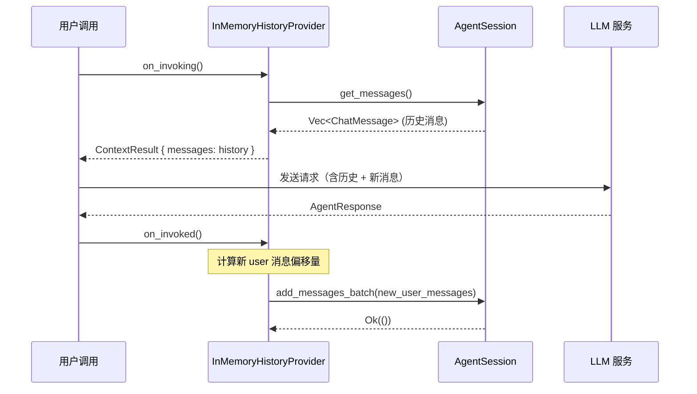

# 5.2 InMemoryHistoryProvider 历史管理

`InMemoryHistoryProvider` 是 RAF 最基础的上下文提供器，负责在 Agent 每次 `run()` 时从 Session 加载对话历史，并在调用完成后将新消息持久化回去。

## 结构定义

```rust
/// 内存对话历史上下文提供器
///
/// 对标 MAF 的 `InMemoryHistoryProvider`，职责：
/// - on_invoking: 从 Session 加载历史消息，注入到消息列表中
/// - on_invoked: 将本轮新消息原子批量持久化到 Session
///
/// 使用 `session.get_message_count()` 实时获取消息计数，不再在
/// `provider_state` 中维护 `last_message_count`，消除计数不同步风险。
pub struct InMemoryHistoryProvider {
    /// 是否在 on_invoking 阶段加载历史消息（默认 true）
    load_messages: bool,
}
```

## on_invoking：加载历史

```rust
async fn on_invoking(
    &self,
    _agent: &dyn IAgent,
    session: &dyn ISession,
    _messages: &[ChatMessage],
    _options: &AgentRunOptions,
) -> Result<ContextResult> {
    let mut injection = ContextResult::default();

    if self.load_messages {
        let history = session.get_messages().await.unwrap_or_default();
        injection.messages = history;
    }

    Ok(injection)
}
```

**行为：**

- `load_messages == true`（默认）：从 Session 加载全部历史消息，注入到消息列表中
- `load_messages == false`：不加载历史，相当于每次都是全新对话（用于无状态 Agent 或测试）

## on_invoked：持久化新消息

```rust
async fn on_invoked(
    &self,
    _agent: &dyn IAgent,
    session: &dyn ISession,
    request_messages: &[ChatMessage],
    _response: Option<&AgentResponse>,
    _error: Option<&AgentError>,
) -> Result<()> {
    // ChatClientAgent Phase 3 已负责持久化 assistant 消息（含工具调用和工具结果），
    // 此处只需持久化 user 消息。
    let existing_count = session.get_message_count();
    let system_count = request_messages
        .iter()
        .filter(|m| m.role == MessageRole::System)
        .count();

    let mut new_messages = Vec::new();
    let new_start = system_count.saturating_add(existing_count);
    if new_start < request_messages.len() {
        for msg in &request_messages[new_start..] {
            // Only persist user messages; assistant/tool messages are handled by Phase 3
            if msg.role == MessageRole::User {
                new_messages.push(msg.clone());
            }
        }
    }

    // 原子批量写入
    if !new_messages.is_empty() {
        if let Err(e) = session.add_messages_batch(&new_messages).await {
            tracing::warn!(error = %e, count = new_messages.len(),
                "Failed to persist messages to session");
        }
    }

    Ok(())
}
```

### 消息持久化的精细控制

`on_invoked` 的持久化逻辑经过精心设计，考虑了 Agent 运行的三阶段模型：

| 消息类型 | 谁负责持久化 | 原因 |
|----------|-------------|------|
| User 消息 | `InMemoryHistoryProvider.on_invoked()` | 请求消息中的 user 部分是新增的对话输入 |
| System 消息 | 不持久化 | 每次由提供器动态注入，不需要存储 |
| Assistant 消息 | `ChatClientAgent` Phase 3 | 含 tool_calls，是 LLM 响应的完整记录 |
| Tool Result 消息 | `ChatClientAgent` Phase 3 | 工具调用结果，框架自动记录 |

**去重逻辑**：通过 `existing_count + system_count` 计算已持久化消息的偏移量，只追加尚未持久化的新 user 消息。

## 使用方式

### 基础使用

```rust
use rust_agent_framework::context_providers::InMemoryHistoryProvider;

let provider = InMemoryHistoryProvider::new();

let agent = AgentBuilder::new()
    .with_context_provider(Arc::new(provider))
    .build()?;
```

### 禁用历史加载

某些场景（如单元测试、无状态 Agent）可能不需要加载历史：

```rust
let provider = InMemoryHistoryProvider::new()
    .with_load_messages(false);
```

## 与 Session 的配合



## use_load_messages 的用途

`with_load_messages(false)` 的典型场景：

1. **单元测试**：每次 run() 是独立调用，不需要跨调用保持状态
2. **无状态 Agent**：Agent 不需要记忆之前的对话
3. **手动控制历史**：通过自定义提供器或直接操作 Session 管理历史

## 关键要点

1. **历史加载是可选的**——`load_messages` 字段控制是否加载，默认 true
2. **消息持久化有明确的分工**——user 消息由 HistoryProvider 处理，assistant/tool 消息由 ChatClientAgent 处理
3. **使用 `get_message_count()` 实时计数**——不再在 `provider_state` 中维护计数，消除不同步风险
4. **原子批量写入**——`add_messages_batch()` 确保消息一次性追加，避免竞态
5. **持久化失败不阻断流程**——写入失败通过 `tracing::warn!` 记录，不会抛错误导致 Agent 调用失败
