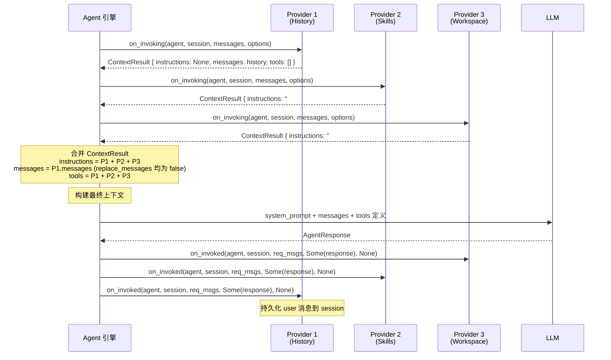
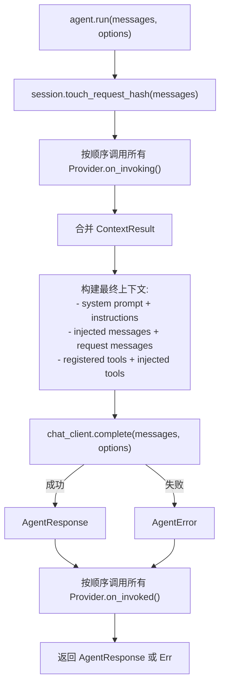

# 5.1 IContextProvider 概述

`IContextProvider` 是 RAF 最强大的扩展机制。它让开发者在 Agent 的每次 `run()` 调用前后插入自定义逻辑——注入指令、历史消息、动态工具，甚至压缩上下文。

## IContextProvider trait 定义

```rust
/// 上下文提供器 trait — Agent 调用生命周期的核心扩展点
///
/// 对标 MAF 的 `AIContextProvider` 抽象类。
/// Provider 可按注册顺序执行，靠后的 Provider 可设置 `replace_messages = true`
/// 来替换前面 Provider 累积的消息。这天然支持压缩策略（截断/摘要等）。
#[async_trait]
pub trait IContextProvider: Send + Sync {
    fn name(&self) -> &str;

    async fn on_invoking(
        &self,
        agent: &dyn IAgent,
        session: &dyn ISession,
        messages: &[ChatMessage],
        options: &AgentRunOptions,
    ) -> Result<ContextResult>;

    async fn on_invoked(
        &self,
        agent: &dyn IAgent,
        session: &dyn ISession,
        request_messages: &[ChatMessage],
        response: Option<&AgentResponse>,
        error: Option<&AgentError>,
    ) -> Result<()>;
}
```

### 方法详解

| 方法 | 调用时机 | 传入参数 | 用途 |
|------|---------|----------|------|
| `on_invoking()` | LLM 调用**之前** | Agent、Session、当前消息列表、运行选项 | 返回 `ContextResult` 注入上下文 |
| `on_invoked()` | LLM 调用**之后**（无论成功或失败） | Agent、Session、请求消息、响应或错误 | 持久化状态、日志记录、清理 |

**`on_invoked()` 的 `error` 参数**：当 LLM 调用抛出 `AgentError` 时，`response` 为 `None`，`error` 为 `Some(err)`。这使得提供器可以记录失败、回滚状态。

## ContextResult 载体

```rust
/// 上下文注入载体 — Provider 在 Pre-invocation 阶段返回的上下文增强内容
#[derive(Default)]
pub struct ContextResult {
    /// 追加到 system prompt 的指令文本
    pub instructions: Option<String>,
    /// 注入到消息列表的消息
    pub messages: Vec<ChatMessage>,
    /// 本次调用可用的动态工具
    pub tools: Vec<Arc<dyn ITool>>,
    /// 若为 true，则替换已累积的消息；默认 false（追加）
    pub replace_messages: bool,
}
```

| 字段 | 类型 | 含义 | 典型使用方 |
|------|------|------|-----------|
| `instructions` | `Option<String>` | 追加到 system prompt 的指令，多个提供器的指令用换行拼接 | WorkspaceContextProvider、AgentSkillsProvider |
| `messages` | `Vec<ChatMessage>` | 注入的消息列表，追加到 LLM 消息历史之前 | InMemoryHistoryProvider |
| `tools` | `Vec<Arc<dyn ITool>>` | 动态注册的工具，与 AgentBuilder 注册的工具合并 | AgentSkillsProvider（load_skill / read_skill_resource） |
| `replace_messages` | `bool` | 设为 `true` 时，当前提供器的 messages 替换之前所有提供器累积的消息 | 压缩策略提供器 |

## 提供器链：顺序执行与合并



## replace_messages：消息替换语义

正常模式下，所有提供器的 `messages` 字段被**追加**到累积列表中。但当某个提供器设置 `replace_messages = true` 时：

1. 框架丢弃之前所有提供器累积的 messages
2. 使用当前提供器的 messages 作为新的消息列表
3. 后续提供器在此基础上继续追加

**典型场景：上下文压缩**

```rust
struct CompressionProvider {
    strategy: Box<dyn ICompressionStrategy>,
}

impl IContextProvider for CompressionProvider {
    fn name(&self) -> &str { "CompressionProvider" }

    async fn on_invoking(&self, agent: &dyn IAgent, session: &dyn ISession, ...) -> Result<ContextResult> {
        // 加载完整历史
        let history = session.get_messages().await?;

        // 压缩（保留最近 N 条 + 摘要）
        let compressed = self.strategy.compress(&history);

        Ok(ContextResult {
            messages: compressed,
            replace_messages: true,  // ← 替换前面的历史消息
            ..Default::default()
        })
    }

    async fn on_invoked(&self, ...) -> Result<()> { Ok(()) }
}
```

**提供器注册顺序决定了压缩优先级**：将 `CompressionProvider` 放在提供器链靠后位置，它就能压缩前面所有提供器累积的消息。

## 完整的 Agent run() 生命周期中提供器的位置



## 关键要点

1. **提供器按注册顺序执行**——前面的提供器先注入，后面的提供器可以覆盖（通过 `replace_messages`）
2. **`ContextResult.tools` 是动态工具**——与 `AgentBuilder::with_tool()` 注册的工具合并
3. **`instructions` 用换行拼接**——多个提供器的指令在 system prompt 中连续显示
4. **`on_invoked` 总被调用**——无论 LLM 调用成功或失败，`error` 参数区分两种情况
5. **提供器链天然支持压缩**——靠后的提供器设置 `replace_messages = true` 即可替换前面的消息
