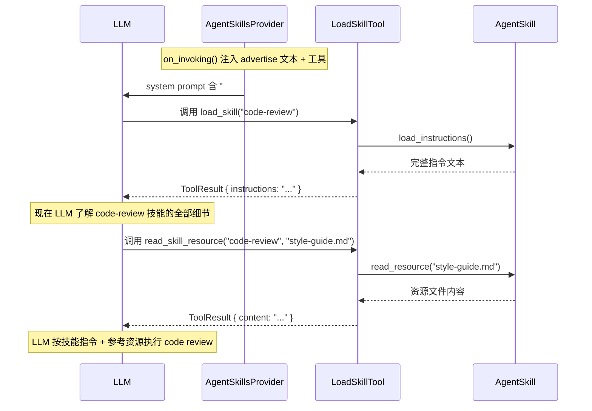

# 5.3 AgentSkillsProvider 技能注入

`AgentSkillsProvider` 实现 RAF 的 Agent 技能系统——它将可复用的技能包（Skills）注入 Agent 的 system prompt 和工具列表，使 Agent 能动态加载和使用外部知识。

## AgentSkill 技能结构

```rust
/// AgentSkill — 一个技能对象，持有元数据 + 技能目录路径
///
/// 可对接多种来源：本地目录、数据库、远程 API 等。
pub struct AgentSkill {
    pub metadata: SkillMetadata,
    pub(crate) root_dir: Option<PathBuf>,       // 技能根目录（from_dir 时设置）
    instructions: Option<String>,                // 自定义指令内容（dynamic 时设置）
    resources: HashMap<String, Vec<u8>>,         // 自定义资源内容表
}

/// 技能元信息（从 SKILL.md frontmatter 解析）
pub struct SkillMetadata {
    pub name: String,                            // 技能名称
    pub description: String,                     // 技能描述
    pub license: Option<String>,                 // 许可协议
    pub compatibility: Option<String>,           // 兼容性信息
    pub metadata: HashMap<String, String>,       // 扩展元数据
}
```

### 技能加载方式

| 方法 | 说明 | 适用场景 |
|------|------|----------|
| `AgentSkill::from_dir(path)` | 从磁盘目录加载，解析 SKILL.md frontmatter | 文件系统中的技能包 |
| `AgentSkill::dynamic(metadata, instructions)` | 动态创建，指定元数据和指令文本 | 数据库/远程 API 加载的技能 |
| `with_resource(path, content)` | 添加内联资源（仅 dynamic 技能） | 不依赖文件系统的资源 |

### SKILL.md 文件格式

```markdown
---
name: code-review
description: Review code for quality, bugs, and best practices.
license: MIT
compatibility: all
metadata:
  author: team-qa
  version: "1.2"
---

# Code Review Skill

## Instructions

1. Read the code carefully.
2. Check for:
   - Logic errors
   - Security vulnerabilities
   - Performance issues
3. Provide specific line references in feedback.
```

- `---` 之间的 YAML frontmatter 解析为 `SkillMetadata`
- `---` 之后的内容是技能指令，通过 `load_skill` 工具返回给 LLM

### 标准技能目录结构

```
skills/
└── code-review/
    ├── SKILL.md          # 技能元数据 + 指令（必须）
    ├── references/        # 参考文档（可选）
    │   └── style-guide.md
    ├── assets/            # 资源文件（可选）
    │   └── template.html
    └── scripts/           # 可执行脚本（可选）
        └── lint.sh
```

`has_resources()` 检查 `references/` 和 `assets/` 目录是否存在；`has_scripts()` 检查 `scripts/` 目录是否非空。

## AgentSkillsProvider

```rust
/// AgentSkillsProvider — IContextProvider 实现
///
/// 注入：
///   1. advertise 文本（技能名称 + 描述 + 路径指引）
///   2. load_skill / read_skill_resource / run_skill_script 工具（按需）
pub struct AgentSkillsProvider {
    pub skills: Vec<AgentSkill>,
    script_runner: Option<Arc<dyn AgentSkillScriptRunner>>,
}
```

### 扫描模式

自动发现目录下所有含 `SKILL.md` 的子目录：

```rust
/// 批量扫描目录，自动发现所有含 SKILL.md 的子目录。
pub fn scan(root: impl AsRef<Path>) -> Result<Self> {
    let mut provider = Self::new();
    let root = root.as_ref();

    for entry in std::fs::read_dir(root)? {
        let path = entry.path();
        if path.is_dir() && path.join("SKILL.md").exists() {
            let skill = AgentSkill::from_dir(&path)?;
            provider = provider.with_skill(skill);
        }
    }

    Ok(provider)
}

/// 从多个目录扫描。
pub fn scan_dirs(roots: &[impl AsRef<Path>]) -> Result<Self> {
    let mut all_skills = Vec::new();
    for root in roots {
        let provider = Self::scan(root)?;
        all_skills.extend(provider.skills);
    }
    Ok(Self { skills: all_skills, script_runner: None })
}
```

## IContextProvider 实现

```rust
#[async_trait]
impl IContextProvider for AgentSkillsProvider {
    fn name(&self) -> &str { "AgentSkillsProvider" }

    async fn on_invoking(
        &self, _agent: &dyn IAgent, _session: &dyn ISession,
        _messages: &[ChatMessage], _options: &AgentRunOptions,
    ) -> Result<ContextResult> {
        Ok(ContextResult {
            instructions: Some(self.build_advertise()),
            tools: self.build_tools(),
            ..Default::default()
        })
    }

    async fn on_invoked(&self, ...) -> Result<()> { Ok(()) }
}
```

### advertise 文本

`build_advertise()` 生成注入 system prompt 的文本：

```
## Available Skills

Use load_skill(name) to get full instructions for any skill listed below.

- **code-review**: Review code for quality, bugs, and best practices.
  Resources: use read_skill_resource("code-review", "<path>") to read reference documents.
- **deploy**: Automated deployment to staging environments.
  Scripts: use run_skill_script("deploy", "<path>") to execute bundled scripts.
```

### 动态工具注入

`build_tools()` 根据技能内容注入工具：

```rust
pub fn build_tools(&self) -> Vec<Arc<dyn ITool>> {
    let mut tools = vec![self.create_load_skill_tool()];  // 始终注入

    let has_resources = self.skills.iter().any(|s| s.has_resources());
    if has_resources {
        tools.push(self.create_read_resource_tool());
    }

    let has_scripts = self.skills.iter().any(|s| s.has_scripts());
    if has_scripts && self.script_runner.is_some() {
        tools.push(self.create_run_skill_tool());
    }

    tools
}
```

**三个技能工具：**

| 工具 | 名称 | 触发条件 | 功能 |
|------|------|----------|------|
| `load_skill` | LoadSkillTool | 始终注入 | 根据 skill_name 加载技能完整指令 |
| `read_skill_resource` | ReadSkillResourceTool | 至少一个技能有 resources | 读取技能的资源文件 |
| `run_skill_script` | RunSkillScriptTool | 至少一个技能有 scripts 且配置了 runner | 执行技能目录中的脚本 |

## 完整使用示例

```rust
use std::sync::Arc;
use rust_agent_core::{AgentBuilder, WorkspaceScope};
use rust_agent_framework::context_providers::{
    AgentSkillsProvider,
    agent_skill::{AgentSkill, SkillMetadata},
};

// ── 方式一：目录扫描 ──
let skills_provider = AgentSkillsProvider::scan("./skills")?;

// ── 方式二：动态创建 ──
let custom_skill = AgentSkill::dynamic(
    SkillMetadata {
        name: "db-query".into(),
        description: "查询数据库并返回结果".into(),
        ..Default::default()
    },
    "# Database Query Skill\n\n## Instructions\n...",
)
.with_resource("schema.sql", "CREATE TABLE users (...);");

let provider = AgentSkillsProvider::new()
    .with_skill(custom_skill)
    .with_skills(skills_provider.skills); // 合并扫描结果

// ── 注册到 Agent ──
let agent = AgentBuilder::new()
    .with_context_provider(Arc::new(provider))
    .build()?;

// ── 运行 Agent ──
// LLM 会在 system prompt 中看到 "## Available Skills" 列表，
// 并拥有 load_skill / read_skill_resource 工具。
// LLM 可以先调用 load_skill("db-query") 加载完整指令，
// 然后按指令执行数据库查询。
```

## load_skill 工具的执行

当 LLM 调用 `load_skill("code-review")` 时：

```rust
impl LoadSkillTool {
    async fn call(&self, arguments: Value) -> Result<ToolResult> {
        #[derive(Deserialize)]
        struct Args { skill_name: String }

        let args: Args = serde_json::from_value(arguments)?;

        let skill = self.skills.iter()
            .find(|s| s.metadata.name == args.skill_name)
            .ok_or_else(|| AgentError::ToolError(
                format!("Skill '{}' not found", args.skill_name)
            ))?;

        let instructions = skill.load_instructions()?;

        Ok(ToolResult::success(serde_json::json!({
            "skill_name": args.skill_name,
            "instructions": instructions,
        })))
    }
}
```

返回的技能完整指令作为 tool result 注入 LLM 对话，模型据此"学会"如何使用该技能。

## 技能调用流程



## 关键要点

1. **技能是惰性加载的**——LLM 先看到摘要（advertise），需要时才通过 `load_skill` 加载完整指令
2. **`scan()` 实现自动发现**——只需将技能包放入指定目录，无需手动注册
3. **`dynamic()` 支持非文件来源**——数据库、远程 API、内存创建的技能同样可用
4. **工具按需注入**——只有存在 resources 时才注入 `read_skill_resource`，只有存在 scripts 且配置 runner 时才注入 `run_skill_script`
5. **技能指令是纯文本上下文**——加载后以 tool result 形式注入 LLM 对话，与普通消息无异
