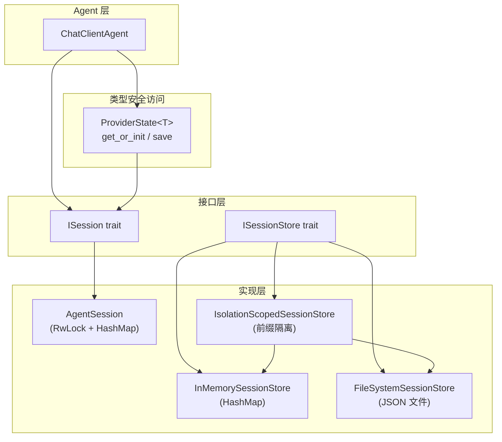

# 第 6 章：会话管理

会话（Session）是 RAF 中多轮对话的状态载体。它管理消息历史、提供跨调用的状态持久化、通过 TTL 控制会话生命周期，并支持多种存储后端（内存、文件系统、多租户隔离）。

## 本章目录

| 小节 | 标题 | 核心内容 |
|------|------|----------|
| [6.1](isession.md) | ISession 会话接口 | 完整 API：消息管理、序列化/反序列化、KV 缓存追踪、TTL 方法 |
| [6.2](agent-session.md) | AgentSession 默认实现 | RwLock 保护的历史、ProviderStateStore、UUID 生成、request_hash 追踪 |
| [6.3](session-stores.md) | 会话存储后端 | 三种存储：InMemorySessionStore、FileSystemSessionStore、IsolationScopedSessionStore |
| [6.4](provider-state.md) | ProviderState 状态持久化 | 类型安全的 Provider 状态访问器、WorkspaceState 示例 |

## 架构概览

## 核心概念

- **ISession**：会话的抽象接口，定义消息管理、元数据和状态存储的契约
- **AgentSession**：默认内存实现，使用 `RwLock` 保护并发访问
- **ISessionStore**：持久化存储接口，支持多种后端
- **ProviderState&lt;T&gt;**：类型安全的 Provider 状态访问器
- **SessionTTLOptions**：基于空闲时间和存活时间的会话过期配置

## 推荐阅读顺序

- **首次了解会话**：按 6.1 → 6.2 顺序阅读，理解接口和默认实现
- **选择存储方案**：阅读 6.3，根据部署需求选择合适后端
- **Provider 开发**：重点阅读 6.4，了解如何在提供器中持久化状态

---

## 上一步

← [第 5 章：上下文提供器](../05-context-providers/INDEX.md)

## 下一步

阅读完本章后，建议继续阅读 **[人机协同与审批](../07-hitl-approval/hitl-overview.md)** 以引入人机协同审批机制，确保 Agent 在敏感操作前获得人工授权。
