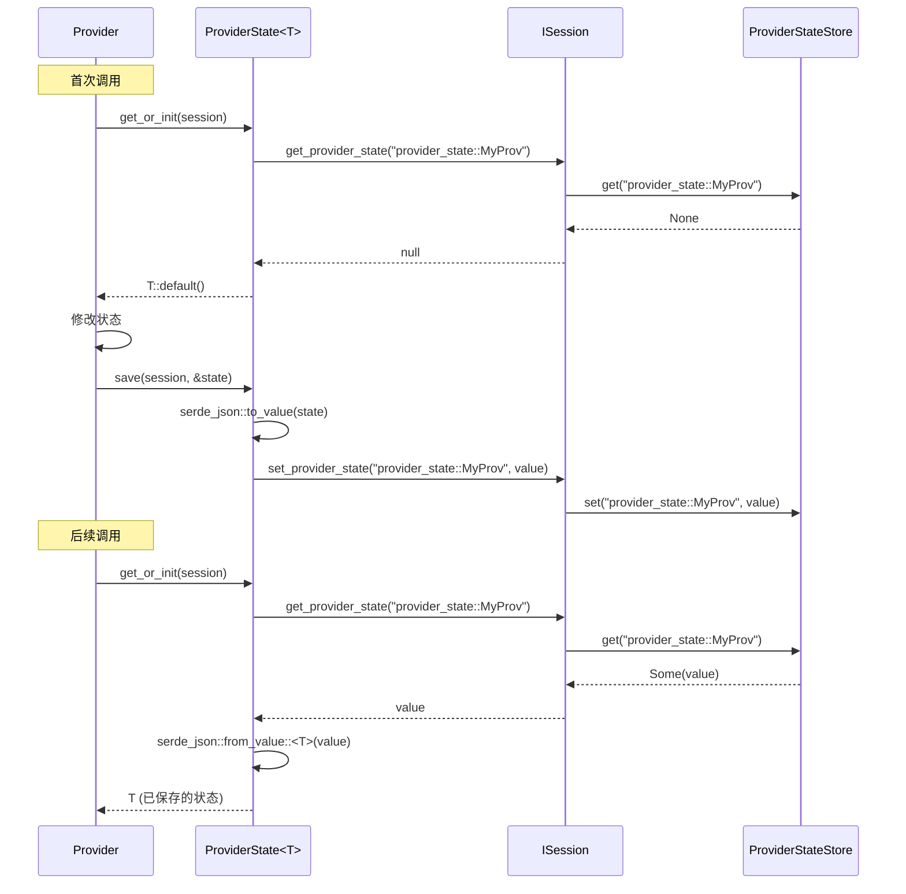

# 6.4 ProviderState 状态持久化

`ProviderState<T>` 是 RAF 为上下文提供器设计的类型安全状态访问器。它封装了 `ISession::get_provider_state()` 和 `set_provider_state()` 的原始 JSON 操作，提供编译期类型检查、自动序列化/反序列化和便捷的 `get_or_init()` 模式。

## ProviderState 结构

```rust
/// 类型安全的 Provider 状态访问器
///
/// 为 Provider 提供类型安全的 Session 状态读写能力，
/// 避免手动序列化/反序列化和 key 拼写错误。
pub struct ProviderState<T: Serialize + DeserializeOwned + Default> {
    key: String,
    _marker: PhantomData<T>,
}

impl<T: Serialize + DeserializeOwned + Default> ProviderState<T> {
    /// 创建指定 Provider 的类型安全状态访问器
    pub fn new(provider_name: &str) -> Self {
        Self {
            key: format!("provider_state::{}", provider_name),
            _marker: PhantomData,
        }
    }

    /// 获取或初始化 Provider 状态
    ///
    /// 如果 Session 中存在该 Provider 的状态，反序列化返回；
    /// 否则返回 T 的默认值。
    pub fn get_or_init(&self, session: &dyn ISession) -> T {
        session
            .get_provider_state(&self.key)
            .ok()
            .and_then(|v| serde_json::from_value::<T>(v).ok())
            .unwrap_or_default()
    }

    /// 保存 Provider 状态到 Session
    pub fn save(&self, session: &dyn ISession, state: &T) -> Result<()> {
        let value = serde_json::to_value(state)
            .map_err(|e| AgentError::Serialize(e.to_string()))?;
        session.set_provider_state(&self.key, value)
    }
}
```

**类型约束**：

- `Serialize + DeserializeOwned`：状态必须可以被 JSON 序列化/反序列化
- `Default`：`get_or_init()` 在状态不存在时返回默认值

**key 格式**：`provider_state::<ProviderName>`，确保不同 Provider 的状态不会互相覆盖。

## 使用模式

### 基本模式

```rust
use rust_agent_core::ProviderState;
use serde::{Serialize, Deserialize};

// 1. 定义状态类型
#[derive(Default, Serialize, Deserialize)]
struct MyState {
    call_count: u64,
    last_result_summary: String,
}

// 2. 创建访问器
let state_key = ProviderState::<MyState>::new("MyProvider");

// 3. 在 on_invoking 中读取
let mut state = state_key.get_or_init(session);
state.call_count += 1;

// 4. 修改后保存
state_key.save(session, &state)?;
```

### 完整示例：计数器 Provider

```rust
use async_trait::async_trait;
use rust_agent_core::{
    AgentResponse, AgentRunOptions, ChatMessage, ContextResult,
    IAgent, IContextProvider, ISession, ProviderState, Result,
};
use serde::{Deserialize, Serialize};

/// 计数器状态
#[derive(Debug, Default, Serialize, Deserialize)]
struct CounterState {
    invocation_count: u64,
    total_tokens_since_start: u64,
}

/// 记录调用次数的提供器
pub struct CounterProvider;

#[async_trait]
impl IContextProvider for CounterProvider {
    fn name(&self) -> &str { "CounterProvider" }

    async fn on_invoking(
        &self,
        _agent: &dyn IAgent,
        session: &dyn ISession,
        _messages: &[ChatMessage],
        _options: &AgentRunOptions,
    ) -> Result<ContextResult> {
        let state_key = ProviderState::<CounterState>::new("CounterProvider");

        // 加载或初始化状态
        let mut state = state_key.get_or_init(session);
        state.invocation_count += 1;

        // 保存更新后的状态
        state_key.save(session, &state)?;

        Ok(ContextResult {
            instructions: Some(format!(
                "[系统] 这是本次会话的第 {} 次调用。",
                state.invocation_count
            )),
            ..Default::default()
        })
    }

    async fn on_invoked(
        &self,
        _agent: &dyn IAgent,
        session: &dyn ISession,
        _request_messages: &[ChatMessage],
        response: Option<&AgentResponse>,
        _error: Option<&AgentError>,
    ) -> Result<()> {
        // 累计 token 用量
        if let Some(resp) = response {
            if let Some(ref result) = resp.result {
                if let Some(ref usage) = result.usage {
                    let state_key = ProviderState::<CounterState>::new("CounterProvider");
                    let mut state = state_key.get_or_init(session);
                    state.total_tokens_since_start += usage.total_tokens;
                    state_key.save(session, &state)?;
                }
            }
        }
        Ok(())
    }
}
```

### 实际案例：WorkspaceState

RAF 的 `WorkspaceContextProvider` 使用 `ProviderState` 持久化工作区配置：

```rust
#[derive(Default, Serialize, Deserialize)]
struct WorkspaceState {
    scope_name: String,
    scope_root: String,
    policy: String,
}

// 在 on_invoking 中
let state = ProviderState::<WorkspaceState>::new("WorkspaceContextProvider");
let ws = state.get_or_init(session);
if ws.scope_name.is_empty() {
    // 首次调用：保存工作区配置
    let _ = state.save(
        session,
        &WorkspaceState {
            scope_name: self.scope.name.clone(),
            scope_root: self.scope.root.to_string_lossy().to_string(),
            policy: format!("{:?}", self.scope.policy),
        },
    );
}
```

这样，即使 Agent 在多次 `run()` 调用之间重启（结合 `FileSystemSessionStore`），工作区配置也能从 Session 中恢复。

## 与直接调用 ISession 的对比

**不使用 ProviderState（原始方式）：**

```rust
// 读取 — 容易出错
let raw = session.get_provider_state("provider_state::MyProvider")?;
let state: MyState = if let Some(v) = raw.as_object() {
    serde_json::from_value(raw)?
} else {
    MyState::default()
};

// 写入 — key 容易拼错
session.set_provider_state(
    "provider_state::MyProvider",
    serde_json::to_value(&state)?
)?;
```

**使用 ProviderState（推荐方式）：**

```rust
// 一行读取
let state = ProviderState::<MyState>::new("MyProvider")
    .get_or_init(session);

// 一行写入
ProviderState::<MyState>::new("MyProvider")
    .save(session, &state)?;
```

**优势**：

| 特性 | 原始方式 | ProviderState |
|------|----------|---------------|
| 类型安全 | ❌ 运行时错误 | ✅ 编译期检查 |
| Key 一致性 | ❌ 易拼错 | ✅ 自动生成 |
| 默认值 | ❌ 手动处理 | ✅ `get_or_init()` |
| 代码量 | 5–8 行 | 1–2 行 |

## 状态生命周期



## 注意事项

1. **`get_or_init()` 不自动保存**——如果状态是 `T::default()` 且你希望它持久化，需要显式调用 `save()`
2. **反序列化失败降级为默认值**——如果会话中存储的状态 JSON 与 `T` 不匹配，`get_or_init()` 返回 `T::default()` 而不报错
3. **key 是全局唯一的**——`"provider_state::"` 前缀确保不会与框架其他内部 key 冲突
4. **状态随会话存储**——使用 `InMemorySessionStore` 时状态不持久化；使用 `FileSystemSessionStore` 时状态随会话 JSON 文件持久化

## 关键要点

1. **`ProviderState<T>` 消除样板代码**——类型安全的单行存取器替代手写 JSON 操作
2. **`get_or_init()` 是最常用模式**——首次返回默认值，后续返回已保存状态
3. **key 自动生成**——`format!("provider_state::{}", provider_name)` 确保唯一性
4. **反序列化失败降级**——状态格式变更时不会导致 Agent 调用失败
5. **WorkspaceContextProvider 是最佳实践案例**——首次调用保存配置，后续调用跳过
