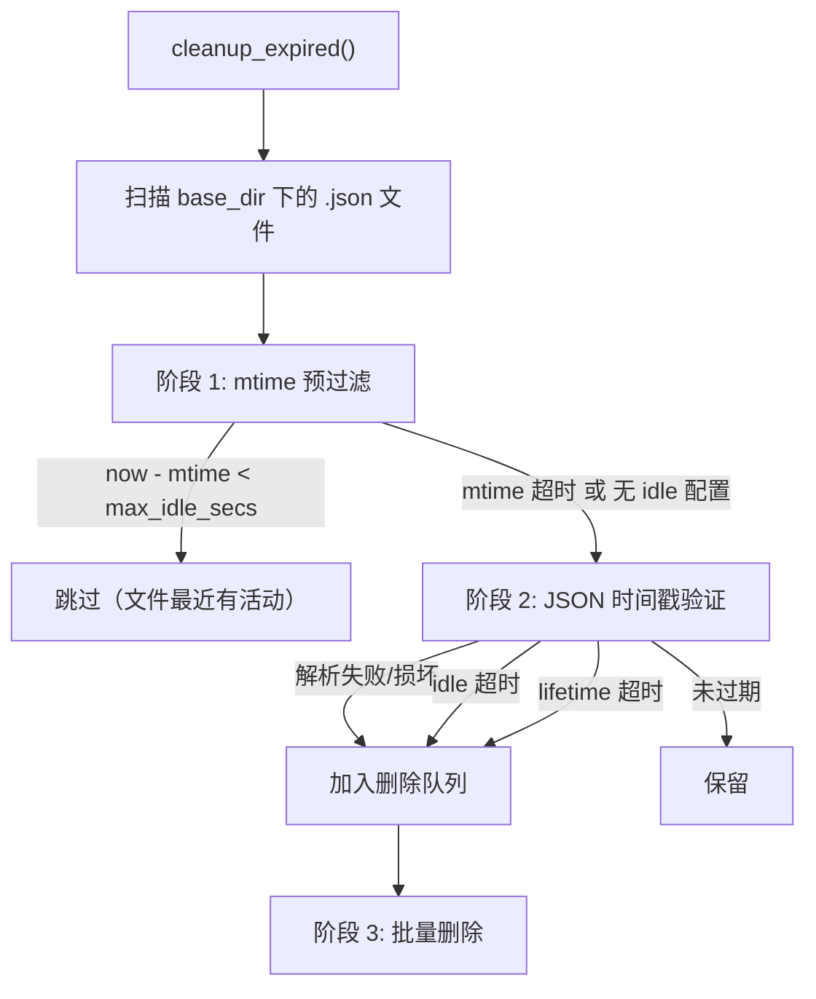
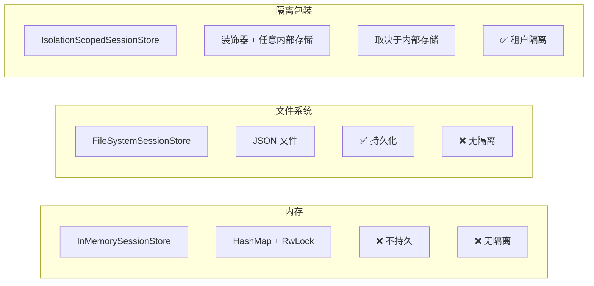

# 6.3 会话存储后端

RAF 提供三种会话存储实现，覆盖从开发测试到生产部署的多种场景。所有实现均遵循 `ISessionStore` trait。

## ISessionStore trait

```rust
/// 会话持久化存储接口。
///
/// 抽象会话数据的存储后端，支持跨请求和跨重启的会话恢复。
#[async_trait]
pub trait ISessionStore: Send + Sync {
    /// 将会话保存到存储中。如果已存在相同 ID 的会话，则会被覆盖。
    async fn save_session(&self, session: &dyn ISession) -> Result<()>;

    /// 根据 ID 获取会话。如果指定 ID 的会话不存在，返回 None。
    async fn get_session(&self, session_id: &str) -> Result<Option<Arc<dyn ISession>>>;

    /// 根据 ID 删除会话。如果会话不存在，不会引发错误。
    async fn delete_session(&self, session_id: &str) -> Result<()>;

    /// 清理过期的会话。返回已移除的会话数量。
    /// 实现应检查 ISession::last_active_at() 与配置的 TTL 选项。
    async fn cleanup_expired(&self) -> Result<usize>;
}
```

## 实现一：InMemorySessionStore

基于 `HashMap` 的内存存储。进程退出时会话数据丢失。

```rust
/// 基于 HashMap 的内存会话存储。
///
/// 进程退出时会话丢失。适用于开发、测试和短期应用。
///
/// ## TTL 清理
///
/// 使用 with_ttl() 构造时，cleanup_expired() 将驱逐超过
/// max_idle_secs 或 max_lifetime_secs 的会话。
pub struct InMemorySessionStore {
    sessions: RwLock<HashMap<String, Arc<dyn ISession>>>,
    ttl: Option<SessionTTLOptions>,
}
```

### 使用示例

```rust
use rust_agent_core::{AgentSession, InMemorySessionStore, ISessionStore, SessionTTLOptions};

// 无 TTL 的内存存储
let store = InMemorySessionStore::new();

// 创建并保存会话
let session = AgentSession::new();
store.save_session(&session).await?;

// 查找会话
let found = store.get_session(session.session_id()).await?;
assert!(found.is_some());

// 带 TTL 的内存存储（30 分钟空闲超时）
let ttl = SessionTTLOptions {
    max_idle_secs: Some(1800),
    max_lifetime_secs: None,
    cleanup_interval_secs: 3600,
};
let store_with_ttl = InMemorySessionStore::new().with_ttl(ttl);

// 定期清理过期会话
let removed = store_with_ttl.cleanup_expired().await?;
println!("Removed {} expired sessions", removed);
```

### TTL 清理逻辑

```rust
async fn cleanup_expired(&self) -> Result<usize> {
    let ttl = match &self.ttl {
        Some(t) => t,
        None => return Ok(0), // 无 TTL 配置则不清理
    };

    let now = chrono::Utc::now();
    let mut sessions = self.sessions.write().await;
    let mut to_remove = Vec::new();

    for (id, session) in sessions.iter() {
        let last_active = session.last_active_at();
        let created = session.created_at();

        // 空闲超时检查
        if let Some(max_idle) = ttl.max_idle_secs {
            let idle_duration = now - last_active;
            if idle_duration.num_seconds() > max_idle as i64 {
                to_remove.push(id.clone());
                continue;
            }
        }

        // 存活时间超时检查
        if let Some(max_lifetime) = ttl.max_lifetime_secs {
            let lifetime_duration = now - created;
            if lifetime_duration.num_seconds() > max_lifetime as i64 {
                to_remove.push(id.clone());
            }
        }
    }

    let removed = to_remove.len();
    for id in to_remove {
        sessions.remove(&id);
    }

    if removed > 0 {
        tracing::info!(removed, "Expired session eviction completed");
    }
    Ok(removed)
}
```

**适用场景**：开发环境、单元测试、短生命周期的 Agent 实例。

---

## 实现二：FileSystemSessionStore

将每个会话保存为独立 JSON 文件。重启后会话数据持久保留。

```rust
/// 文件系统会话存储。
///
/// 每个会话作为 JSON 文件存储在配置目录中。文件名为 {session_id}.json。
///
/// 适用于需要重启持久化但无需数据库的单实例生产部署。
pub struct FileSystemSessionStore {
    base_dir: PathBuf,
    ttl: Option<SessionTTLOptions>,
}
```

### 使用示例

```rust
use rust_agent_core::{AgentSession, FileSystemSessionStore, ISessionStore, SessionTTLOptions};

let store = FileSystemSessionStore::new("./data/sessions");

// 保存会话 → ./data/sessions/{uuid}.json
let session = AgentSession::new();
store.save_session(&session).await?;

// 恢复会话
let restored = store.get_session(session.session_id()).await?;

// 删除会话
store.delete_session(session.session_id()).await?;
```

### 文件格式

会话序列化为 `SessionSnapshot` JSON：

```json
{
  "session_id": "a1b2c3d4-...",
  "metadata": {
    "created_at": "2026-06-18T10:00:00Z",
    "updated_at": "2026-06-18T10:30:00Z",
    "message_count": 42,
    "last_request_hash": null
  },
  "messages": [...],
  "provider_states": { "states": {} },
  "last_active_at": "2026-06-18T10:30:00Z"
}
```

### cleanup_expired：mtime 优化

`FileSystemSessionStore` 的 `cleanup_expired()` 使用三阶段算法：



**mtime 优化原理**：

- `agent.run()` 调用前后通常执行 `save_session()`，更新文件 `mtime`
- 如果 `now - mtime < max_idle_secs`，说明会话在空闲窗口内肯定有活动
- 可以直接跳过 JSON 反序列化（O(1) 文件元数据 vs O(n) JSON 解析）

**注意**：mtime 仅用于 idle 检查，不能用于 lifetime 检查——新创建的会话也可能超出 lifetime。

**已知限制**：

- 多实例共享文件系统时有 TOCTOU 竞态风险（无文件锁）
- 超大目录（10w+ 文件）存在性能瓶颈
- 生产环境多实例部署建议使用数据库后端

---

## 实现三：IsolationScopedSessionStore

多租户会话隔离的装饰器，在前缀会话 ID 前添加隔离键。

```rust
/// 多租户会话隔离的隔离键提供器。
#[async_trait]
pub trait IIsolationKeyProvider: Send + Sync {
    async fn get_isolation_key(&self) -> Result<String>;
}

/// 隔离作用域的会话存储装饰器。
///
/// 包装内部 ISessionStore，将会话 ID 前添加隔离键，
/// 确保不同租户无法访问彼此的会话。
pub struct IsolationScopedSessionStore {
    inner: Arc<dyn ISessionStore>,
    key_provider: Arc<dyn IIsolationKeyProvider>,
}

impl IsolationScopedSessionStore {
    async fn scoped_id(&self, session_id: &str) -> Result<String> {
        let key = self.key_provider.get_isolation_key().await?;
        Ok(format!("{}::{}", key, session_id))
    }
}
```

### 使用示例

```rust
use rust_agent_core::{
    InMemorySessionStore, ISessionStore, AgentSession,
    IsolationScopedSessionStore, FixedIsolationKeyProvider,
};
use std::sync::Arc;

// 基础存储
let inner = Arc::new(InMemorySessionStore::new());

// 固定隔离键（适用于单租户或简单场景）
let key_provider = Arc::new(FixedIsolationKeyProvider::new("tenant-123"));

// 包装为隔离存储
let store = IsolationScopedSessionStore::new(inner, key_provider);

// 操作时，会话 ID "abc" 变为 "tenant-123::abc"
let session = AgentSession::with_id("abc");
store.save_session(&session).await?;

// 查找时自动添加前缀
let found = store.get_session("abc").await?;   // 查找 "tenant-123::abc"
let gone = store.get_session("abc").await?;     // 不同的隔离键会得到 None
```

### 自定义隔离键提供器

对于从 JWT token、请求头等动态获取租户 ID 的场景：

```rust
struct RequestScopedKeyProvider {
    // 例如从请求上下文中获取
}

#[async_trait]
impl IIsolationKeyProvider for RequestScopedKeyProvider {
    async fn get_isolation_key(&self) -> Result<String> {
        // 从当前请求上下文获取租户 ID
        let tenant_id = current_tenant_id().await?;
        Ok(tenant_id)
    }
}
```

## 三种存储对比



| 特性 | InMemory | FileSystem | IsolationScoped |
|------|----------|------------|-----------------|
| 持久化 | ❌ 进程退出丢失 | ✅ JSON 文件 | 取决于内部 |
| TTL 清理 | ✅ idle + lifetime | ✅ idle（mtime 优化）+ lifetime | 委托内部 |
| 多租户隔离 | ❌ | ❌ | ✅ 前缀隔离 |
| 性能 | ⚡ 最快 | 🐢 磁盘 I/O | 取决于内部 |
| 适用场景 | 开发/测试/短生命周期 | 单实例生产/重启持久化 | 多租户 SaaS |

## 关键要点

1. **`InMemorySessionStore` 是开发首选**——简单、零配置、性能最佳
2. **`FileSystemSessionStore` 的 mtime 优化**——通过文件元数据跳过昂贵的 JSON 解析
3. **`IsolationScopedSessionStore` 是装饰器**——可包裹任何 `ISessionStore` 实现
4. **TTL 是可选的**——所有存储默认不清理过期会话，通过 `with_ttl()` 启用
5. **`cleanup_expired()` 幂等**——可以安全地重复调用
