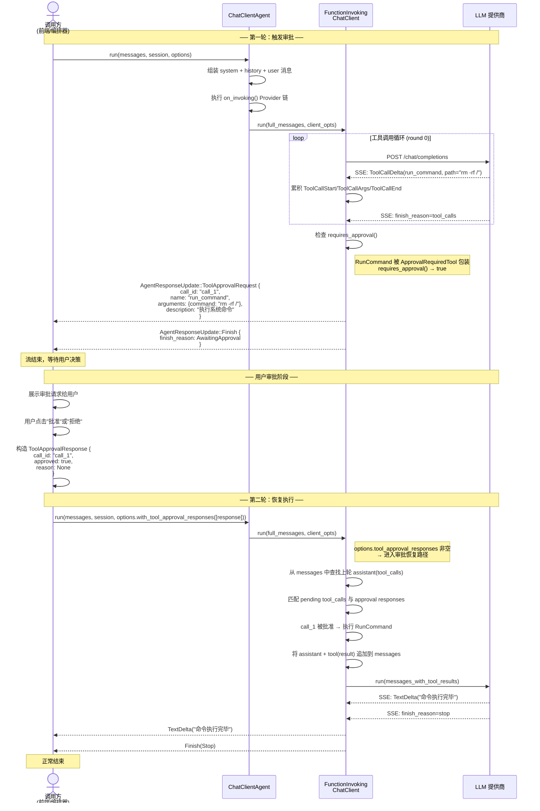

# 7.2 审批流完整链路

## 概述

审批流程涉及四个参与者：**调用方（Caller）**、**ChatClientAgent**、**FunctionInvokingChatClient（装饰器）** 和 **LLM 提供商**。当一个或多个工具调用需要审批时，装饰器会发出 `ToolApprovalRequest` 事件，然后用 `FinishReason::AwaitingApproval` 结束流。调用方收集审批响应后，通过新的 `agent.run()` 调用恢复执行。

## 完整时序图



## 关键代码路径

### 1. 审批检测

审批检测位于 `FunctionInvokingChatClient` 内部流消费的 spawned task 中：

```rust
// crates/framework/src/chat_client_decorators/function_invoking.rs

// ── Approval gate: if any tool requires approval, pause and wait ──
let any_requires_approval = tool_calls.iter().any(|tc| {
    tools_for_execution
        .iter()
        .any(|t| t.name() == tc.name && t.requires_approval())
});

if any_requires_approval {
    for tc in &tool_calls {
        let tool = tools_for_execution.iter().find(|t| t.name() == tc.name);
        let desc = tool.map(|t| t.description().to_string()).unwrap_or_default();
        let args: serde_json::Value =
            serde_json::from_str(&tc.arguments).unwrap_or(serde_json::Value::Null);

        // 发出 ToolApprovalRequest
        tx.send(Ok(AgentResponseUpdate::ToolApprovalRequest {
            call_id: tc.id.clone(),
            name: tc.name.clone(),
            arguments: args,
            description: desc,
        })).await;
    }

    // 持久化 assistant(tool_calls) 消息
    let mut next_messages = Vec::new();
    next_messages.push(ChatMessage {
        role: MessageRole::Assistant,
        content: text_delta.clone(),
        tool_calls: Some(/* tool_calls → ToolCall 列表 */),
        // ...
    });
    msg_tx.send(next_messages).await;

    // 结束流 — 等待调用方审批后恢复
    tx.send(Ok(AgentResponseUpdate::Finish {
        finish_reason: FinishReason::AwaitingApproval,
        usage: None,
    })).await;
    return;
}
```

### 2. 审批恢复

当调用方带着 `tool_approval_responses` 重新调用 `run()` 时，`LoopState::Looping` 分支首先检查是否有待处理的审批响应：

```rust
LoopState::Looping { messages, round, options } => {
    // 恢复入口：处理审批响应
    if !options.tool_approval_responses.is_empty() {
        let approval_map: HashMap<&str, &ToolApprovalResponse> = options
            .tool_approval_responses
            .iter()
            .map(|r| (r.call_id.as_str(), r))
            .collect();

        // 从最后一条 assistant 消息中提取 pending tool_calls
        let pending: Vec<ToolCall> = messages
            .iter()
            .rev()
            .find(|m| m.role == MessageRole::Assistant && m.tool_calls.is_some())
            .and_then(|m| m.tool_calls.clone())
            .unwrap_or_default();

        let mut next_messages = messages.clone();
        for tc in &pending {
            let approved = approval_map
                .get(tc.id.as_str())
                .map(|r| r.approved)
                .unwrap_or(false);

            if approved {
                // 执行工具，追加 tool(result) 消息
                let result = /* execute tool */;
                next_messages.push(ChatMessage::tool(result, &tc.id));
            } else {
                // 追加拒绝消息
                let reason = approval_map
                    .get(tc.id.as_str())
                    .and_then(|r| r.reason.as_deref())
                    .unwrap_or("User denied");
                next_messages.push(ChatMessage::tool(
                    format!("Rejected: {}", reason),
                    &tc.id,
                ));
            }
        }

        // 清空 approval_responses，继续循环
        let mut opts = options.clone();
        opts.tool_approval_responses.clear();
        return Some((Ok(/* ... */), LoopState::Looping {
            messages: next_messages,
            round: round + 1,
            options: opts,
        }));
    }
    // ... 正常循环逻辑 ...
}
```

### 3. 流消费者体验

`FunctionInvokingChatClient::run()` 返回的最终流会过滤掉内部的 `Finish(ToolCalls)` 信号，因此外部消费者看到的结束原因只有 `Stop`、`AwaitingApproval` 或 `MaxRounds`：

```rust
// 过滤内部 ToolCalls Finish 信号
let stream: BoxStream<'static, Result<AgentResponseUpdate>> = Box::pin(
    stream.filter(|r| {
        let keep = !matches!(r, Ok(AgentResponseUpdate::Finish {
            finish_reason: FinishReason::ToolCalls, ..
        }));
        async move { keep }
    }),
);
```

## 多工具并行审批

当 LLM 一次返回多个工具调用（`parallel_tool_calls: true`），且其中包含审批工具时，审批流程会并行处理：

```
LLM 返回：ToolCallStart(echo, call_1) + ToolCallStart(run_command, call_2)
                                      ↑ 需审批

装饰器发出：
  → ToolApprovalRequest { call_id: "call_2", name: "run_command", ... }
  → Finish(AwaitingApproval)

调用方收集审批后重新调用：
  → 批准 run_command → 执行
  → call_1 (echo) 在消息上下文中已被保留，下一轮 LLM 可决定是否继续

注意：审批暂停只影响被标记为 requires_approval() 的工具。
未被 ApprovalRequiredTool 包装的工具在审批恢复后保持
在消息上下文中，但不会在审批恢复时自动执行——它们等待
LLM 在下一轮中重新发出工具调用。
```

## 归纳

审批流的核心是**暂停-收集-恢复**三步：

1. **暂停**：`FunctionInvokingChatClient` 检测到需要审批的工具调用时，发出 `ToolApprovalRequest` 事件并结束流，同时将 `assistant(tool_calls)` 消息通过 `msg_tx` 通道传递回循环状态。
2. **收集**：调用方（前端/编排器）从流中收集 `ToolApprovalRequest` 事件，向用户展示，收集决策，构造 `ToolApprovalResponse` 列表。
3. **恢复**：调用方将 `tool_approval_responses` 放入 `AgentRunOptions` 重新调用 `agent.run()`。`FunctionInvokingChatClient` 在循环开始时检测到待处理响应，执行批准的工具（追加 `tool(result)` 消息），拒绝的工具追加拒绝消息，然后继续下一轮 LLM 调用。
