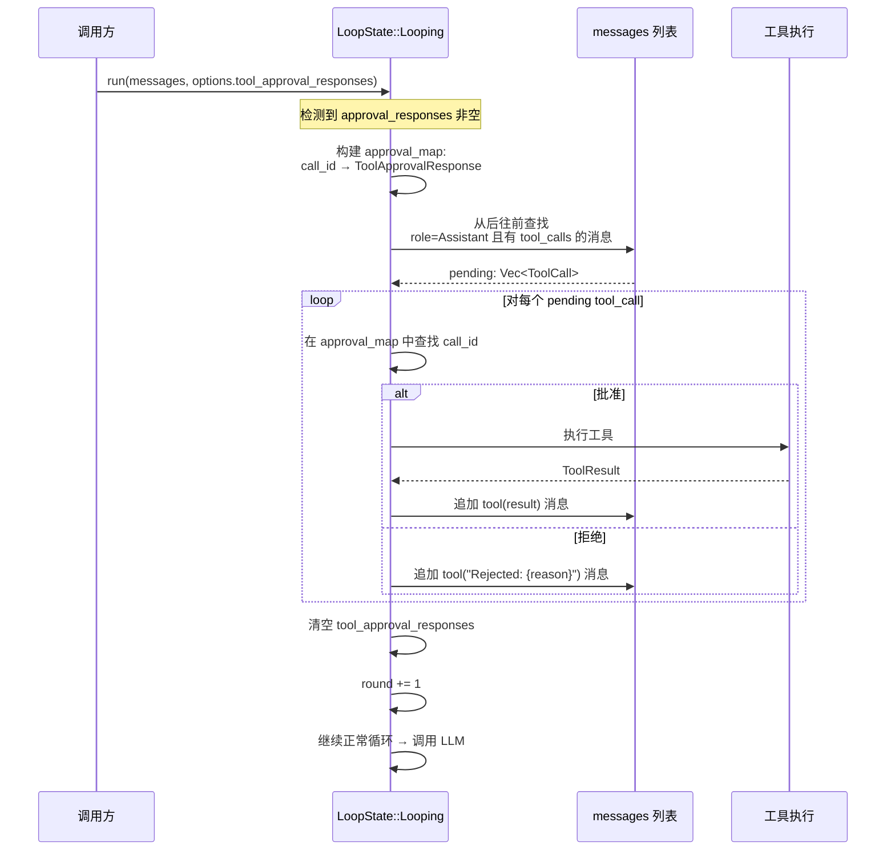

# 7.4 中断恢复与取消机制

## 概述

当 Agent 因 `FinishReason::AwaitingApproval` 暂停后，调用方需要一种机制来恢复执行。RAF 通过**消息上下文重建**实现状态恢复：审批暂停时 `FunctionInvokingChatClient` 已将 `assistant(tool_calls)` 消息保存在循环状态中，恢复时从消息历史中提取待处理工具调用，匹配审批响应，然后继续执行。

同时，为了支持用户主动取消长时间运行或不需要继续的操作，RAF 提供了基于 `Arc<AtomicBool>` 的取消机制，零外部依赖。

## 审批恢复：消息重建

### 暂停时保存的消息格式

当审批触发时，`FunctionInvokingChatClient` 构造一条 `Assistant` 角色的消息并通过 `msg_tx` 通道传递：

```rust
// crates/framework/src/decorators/invoke.rs

let assistant_tool_msg = ChatMessage {
    role: MessageRole::Assistant,
    content: text_delta.clone(),      // 该轮 LLM 输出的文本内容
    name: None,
    tool_calls: Some(
        tool_calls.iter().map(|tc| ToolCall {
            id: tc.id.clone(),
            name: tc.name.clone(),
            arguments: serde_json::Value::String(tc.arguments.clone()),
        }).collect(),
    ),
    tool_call_id: None,
    source: None,
};
next_messages.push(assistant_tool_msg);
msg_tx.send(next_messages).await;
```

这条消息会被 `LoopState::Streaming` 状态接收并合并到 `LoopState::Looping.messages` 中，成为下一轮循环的上下文。

### 恢复时消息重建流程



### 恢复代码实现详解

```rust
LoopState::Looping { messages, round, options } => {
    // ── 审批恢复入口 ──
    if !options.tool_approval_responses.is_empty() {
        // 1. 构建快速查找映射
        let approval_map: HashMap<&str, &ToolApprovalResponse> =
            options.tool_approval_responses
                .iter()
                .map(|r| (r.call_id.as_str(), r))
                .collect();

        // 2. 从消息历史中提取 pending tool_calls
        //    从后往前找第一条 role=Assistant 且有 tool_calls 的消息
        let pending: Vec<ToolCall> = messages
            .iter()
            .rev()
            .find(|m| m.role == MessageRole::Assistant && m.tool_calls.is_some())
            .and_then(|m| m.tool_calls.clone())
            .unwrap_or_default();

        // 3. 为每个 pending tool_call 处理审批结果
        let mut next_messages = messages.clone();
        for tc in &pending {
            let approved = approval_map
                .get(tc.id.as_str())
                .map(|r| r.approved)
                .unwrap_or(false);

            if approved {
                // 参数标准化：LLM 的参数可能以 String(json_str) 形式存储
                let args = match &tc.arguments {
                    serde_json::Value::String(s) => {
                        serde_json::from_str(s).unwrap_or(serde_json::Value::Null)
                    }
                    other => other.clone(),
                };

                // 执行工具
                let result = match tools.iter().find(|t| t.name() == tc.name) {
                    Some(tool) => match tool.execute(args).await {
                        Ok(output) => serde_json::to_string(&output)
                            .unwrap_or_else(|e| format!(r#"{{"ok":false,"error":"{}"}}"#, e)),
                        Err(e) => serde_json::json!({
                            "ok": false,
                            "error": format!("Framework error: {}", e),
                            "data": null
                        }).to_string(),
                    },
                    None => format!("Tool '{}' not found", tc.name),
                };

                // 追加 tool(result) 消息
                next_messages.push(ChatMessage {
                    role: MessageRole::Tool,
                    content: result,
                    name: Some(tc.name.clone()),
                    tool_call_id: Some(tc.id.clone()),
                    ..Default::default()
                });
            } else {
                // 拒绝：追加拒绝消息
                let reason = approval_map
                    .get(tc.id.as_str())
                    .and_then(|r| r.reason.as_deref())
                    .unwrap_or("User denied");
                next_messages.push(ChatMessage {
                    role: MessageRole::Tool,
                    content: format!("Rejected: {}", reason),
                    name: Some(tc.name.clone()),
                    tool_call_id: Some(tc.id.clone()),
                    ..Default::default()
                });
            }
        }

        // 4. 清理审批响应，进入下一轮循环
        let mut opts = options.clone();
        opts.tool_approval_responses.clear();

        return Some((Ok(AgentResponseUpdate::TextDelta { delta: String::new() }),
            LoopState::Looping {
                messages: next_messages,
                round: round + 1,
                options: opts,
            }));
    }
    // ... 正常循环逻辑 ...
}
```

### 恢复后的 LLM 对话上下文

恢复后，LLM 收到的消息序列如下：

```
[system] "你是文件管理助手..."
[user] "帮我删除 /tmp/logs"
[assistant, tool_calls=[run_command(call_1)]]
[tool, tool_call_id=call_1] {"ok":true,"data":{"stdout":"已删除","stderr":""}}
```

或（拒绝时）：

```
[system] "你是文件管理助手..."
[user] "帮我删除 /tmp/logs"
[assistant, tool_calls=[run_command(call_1)]]
[tool, tool_call_id=call_1] "Rejected: 需要先确认目录内容"
```

LLM 看到 tool 角色的消息后，会根据内容（成功结果或拒绝原因）生成后续回复。

## 取消机制

### 设计：Arc<AtomicBool>

RAF 使用 `Arc<AtomicBool>` 实现取消，无需额外的取消 token 库：

```rust
// crates/core/src/run_options.rs

pub struct AgentRunOptions {
    // ...
    /// 取消标志。调用方持有克隆并将其设为 true
    /// 以在下一个工具循环迭代时中断 Agent
    #[serde(skip)]
    pub cancelled: Option<Arc<AtomicBool>>,
}
```

### 取消检查位置

取消检查位于 `FunctionInvokingChatClient` 的 `LoopState::Looping` 分支，在**每个循环迭代开始时**执行。这确保了在任意轮次之间都能响应取消请求：

```rust
LoopState::Looping { messages, round, options } => {
    // ── 取消检查（在任何其他逻辑之前）──
    if let Some(ref flag) = options.cancelled {
        if flag.load(Ordering::Relaxed) {
            tracing::info!(round, "Agent run cancelled");
            let err_update = AgentResponseUpdate::Error {
                message: "Agent run cancelled".into(),
            };
            return Some((Ok(err_update), LoopState::Done));
        }
    }
    // ... 审批恢复或正常循环逻辑 ...
}
```

**重要**：取消检查在审批恢复检查**之前**执行。这意味着即使有待处理的审批响应，调用方也可以通过设置取消标志来提前终止执行。

### 使用方式

```rust
use std::sync::Arc;
use std::sync::atomic::AtomicBool;

// 创建取消标志
let cancel_flag = Arc::new(AtomicBool::new(false));

// 在 Agent 调用中传递
let options = AgentRunOptions::new()
    .with_cancelled(cancel_flag.clone());

let stream = agent.run(messages, session, Some(options)).await?;

// 在另一个线程/异步任务中取消
tokio::spawn(async move {
    tokio::time::sleep(Duration::from_secs(30)).await;
    cancel_flag.store(true, Ordering::Relaxed);
});
```

### 取消后的流行为

取消后，流会发出一个 `AgentResponseUpdate::Error` 事件，然后进入 `LoopState::Done` 状态，流结束：

```
...之前的流内容...
AgentResponseUpdate::Error {
    message: "Agent run cancelled"
}
[流结束]
```

### 取消与审批的关系

```
优先级：取消 > 审批恢复 > 正常循环

LoopState::Looping {
    1. if cancelled → Error + Done    ← 最高优先级
    2. if approval_responses → 恢复   ← 次优先级
    3. if round >= max_rounds → MaxRounds + Done
    4. 调用 LLM → 正常循环
}
```

这意味着即使用户已提交审批响应，调用方仍可以通过设置取消标志来终止执行。这对于"审批超时"或"用户在等待期间改变了主意"等场景非常有用。

### 取消的传播路径

```
调用方设置 cancel_flag.store(true)
    ↓
AgentRunOptions.cancelled
    ↓ AgentRunOptions::to_chat_client_run_options()
ChatClientRunOptions.cancelled
    ↓ ChatClientAgent.run() → IChatClient.run()
FunctionInvokingChatClient.run() → LoopState::Looping
    ↓ 每轮迭代检查
cancel_flag.load(Ordering::Relaxed) == true
    ↓
发送 Error 事件 + Done
```

### 取消的局限性

- **不是中断式的**：取消检查只在循环迭代边界发生，不会中断正在进行的 LLM HTTP 请求。如果 LLM 响应非常慢，取消可能需要等待当前请求完成。
- **不保证立即停止**：如果 Agent 在工具执行中（`join_all` 等待所有工具完成），取消信号需要等到所有工具执行完毕、进入下一轮迭代时才会生效。
- **不影响已发送的网络请求**：当前 `reqwest` 请求没有主动 abort。这是已知限制，未来可能通过 `reqwest::RequestBuilder::timeout()` 或请求取消 token 改进。

## 完整示例：审批 + 取消

```rust
use std::sync::Arc;
use std::sync::atomic::{AtomicBool, Ordering};
use tokio::time::{timeout, Duration};

async fn run_with_approval_and_cancel() {
    let session = /* ... */;
    let agent = /* 构建带 ApprovalRequiredTool 的 Agent */;

    let cancel_flag = Arc::new(AtomicBool::new(false));

    // 发送第一条消息
    let options = AgentRunOptions::new()
        .with_cancelled(cancel_flag.clone());

    let mut stream = agent.run(
        vec![ChatMessage::user("删除所有临时文件")],
        Some(session.clone()),
        Some(options),
    ).await.unwrap();

    // 消费流，检测审批请求
    let mut call_id = None;
    while let Some(chunk) = stream.next().await {
        match chunk.unwrap() {
            r if r.finish_reason == Some(FinishReason::AwaitingApproval) => break,
            r => { /* 处理中间内容 */ }
        }
    }

    // 模拟用户 30 秒超时
    let timeout_result = timeout(Duration::from_secs(30), async {
        // 实际应用中：等待用户 UI 输入
        tokio::time::sleep(Duration::from_secs(5)).await;
        ToolApprovalResponse {
            call_id: call_id.unwrap(),
            approved: true,
            reason: None,
        }
    }).await;

    match timeout_result {
        Ok(response) => {
            // 用户批准 → 恢复执行
            let resume_options = AgentRunOptions::new()
                .with_tool_approval_responses(vec![response])
                .with_cancelled(cancel_flag.clone());

            let mut stream = agent.run(
                vec![ChatMessage::user("继续")],
                Some(session.clone()),
                Some(resume_options),
            ).await.unwrap();

            while let Some(chunk) = stream.next().await {
                // 消费恢复后的结果
            }
        }
        Err(_) => {
            // 超时 → 取消
            cancel_flag.store(true, Ordering::Relaxed);
        }
    }
}
```

## 归纳

| 机制 | 核心类型 | 检查时机 | 行为 |
|------|---------|---------|------|
| 审批恢复 | `ToolApprovalResponse` + `AgentRunOptions.tool_approval_responses` | 循环迭代开始（审批恢复检测优先于正常 LLM 调用） | 从消息历史重建 pending tool_calls，执行批准的工具，拒绝的工具追加拒绝消息 |
| 取消 | `Arc<AtomicBool>` + `AgentRunOptions.cancelled` | 循环迭代开始（最高优先级） | 发出 `Error("Agent run cancelled")` 事件，进入 Done 状态 |

两种机制共同确保了 Agent 在需要人工介入的场景下既有灵活的控制能力（审批），又有安全的终止能力（取消）。
