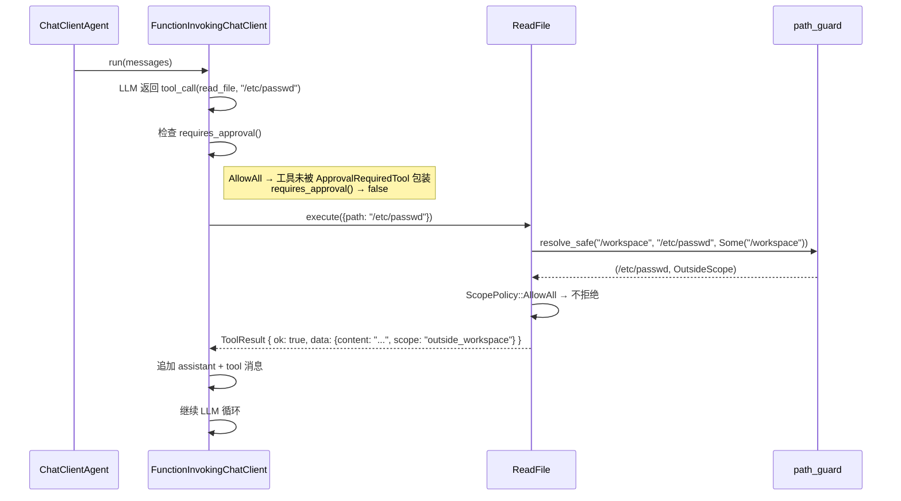
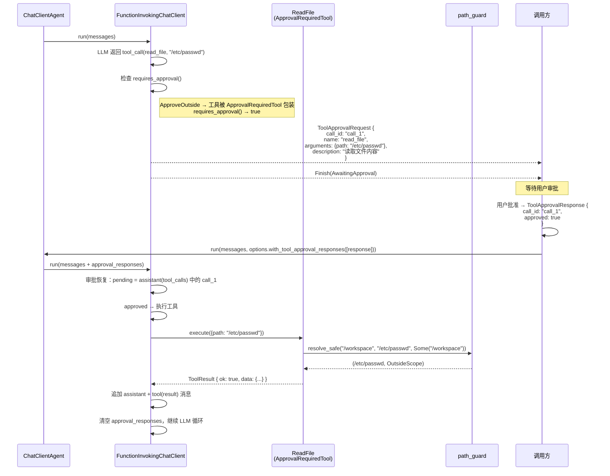
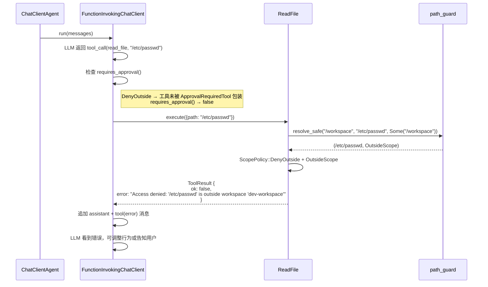
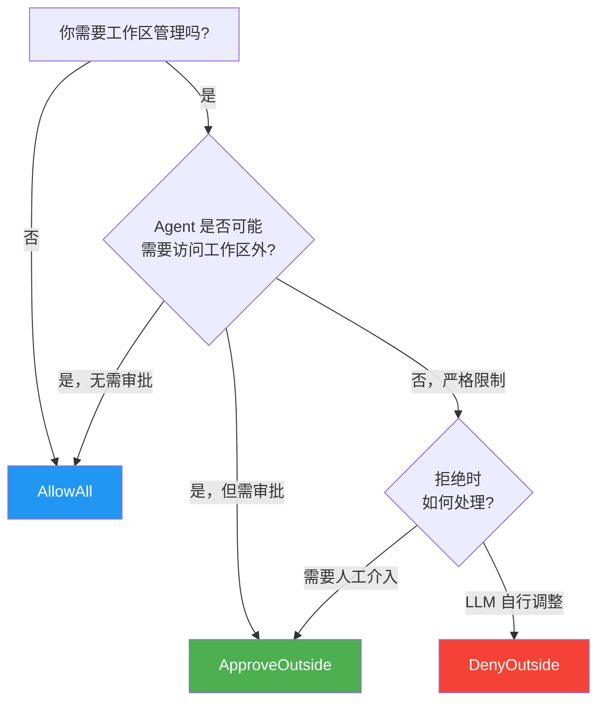

# 8.4 跨范围审批集成

## 概述

跨范围审批是工作区管理与 HITL 审批机制的集成点。当一个操作的目标路径不在 `WorkspaceScope.root` 内时，根据 `ScopePolicy` 的不同，Agent 可能直接拒绝、自动执行、或触发审批。本章通过端到端示例展示不同策略下的行为差异。

## 策略行为矩阵

```
                    路径在 scope 内          路径在 scope 外
ScopePolicy        ─────────────────────  ──────────────────────────
AllowAll           自动执行               自动执行
ApproveOutside     自动执行               触发审批（ApprovalRequiredTool）
DenyOutside        自动执行               工具级拒绝（ToolResult::error）
```

## 端到端示例：read_file("/etc/passwd")

假设工作区设置为 `/workspace`，Agent 被要求读取 `/etc/passwd`。以下追踪三种策略下的完整代码路径。

### 场景：工作区设置

```rust
// 工作区根路径：/workspace
// 目标路径：/etc/passwd（绝对路径，显然不在 /workspace 下）

let scope = WorkspaceScope::new("/workspace", "dev-workspace")
    .with_policy(/* AllowAll | ApproveOutside | DenyOutside */);
```

### 策略 1: AllowAll



**关键代码路径**：工具中 `ScopePolicy::AllowAll` 检查通过，直接执行。

```rust
// 工具内部（伪代码）
let (resolved, scope_status) = resolve_safe(base_dir, path, scope_root)?;
// AllowAll → 不拦截，直接执行
let content = std::fs::read_to_string(&resolved)?;
Ok(ToolResult::success(json!({
    "scope": scope_status.to_label(),  // "outside_workspace"
    "content": content,
})))
```

### 策略 2: ApproveOutside（推荐）



**关键**：在 `ApproveOutside` 策略下，审批发生在两个层面：

1. **Provider 层**：`WorkspaceContextProvider::add_tool()` 将工具包装为 `ApprovalRequiredTool`
2. **执行层**：`FunctionInvokingChatClient` 检测到 `requires_approval() == true`，触发审批流程

工具本身不感知审批 —— 它只负责执行业务逻辑和返回 `ScopeStatus`。审批决策完全由 HITL 基础设施处理。

### 策略 3: DenyOutside



**工具级拒绝代码**：

```rust
// 伪代码：工具内部的 DenyOutside 检查
if let Some(scope) = &self.scope {
    if scope.policy == ScopePolicy::DenyOutside 
       && matches!(scope_status, ScopeStatus::OutsideScope) 
    {
        return Ok(ToolResult::error(format!(
            "Access denied: '{}' is outside workspace '{}'",
            path, scope.name
        )));
    }
}
// 否则继续执行
```

注意：`DenyOutside` 在工具级别直接返回错误，不做审批。这不同于 `ApproveOutside` 策略，后者通过 `ApprovalRequiredTool` 在工具执行前（Provider 层）就先触发审批。

## 策略选择指南



### AllowAll 适用场景

- 本地开发环境
- Agent 仅在受信任的 Docker 容器内运行
- 工作区概念本身不适用（如纯对话 Agent）

### ApproveOutside 适用场景（推荐默认）

- 生产环境
- 需要审计的 CI/CD 流程
- 用户直接交互的 Agent 应用
- 需要渐进式信任建立的场景

### DenyOutside 适用场景

- 高度受控的沙箱环境
- 自动化测试 Agent
- 代码审查 Agent（只读操作）
- 安全敏感的操作场景

## 路径白名单

通过 `WorkspaceScope.properties`，可以实现更细粒度的控制：

```rust
let scope = WorkspaceScope::new("/workspace", "controlled")
    .with_policy(ScopePolicy::DenyOutside)
    .with_property("path_allowlist", serde_json::json!([
        "/etc/hostname",     // 允许读取
        "/usr/share/zoneinfo", // 允许读取
    ]));
```

工具可以在执行逻辑中检查 `path_allowlist`：

```rust
// 伪代码：白名单检查
if scope_status == ScopeStatus::OutsideScope {
    let allowlist: Vec<String> = scope.properties
        .get("path_allowlist")
        .and_then(|v| serde_json::from_value(v.clone()).ok())
        .unwrap_or_default();

    if !allowlist.iter().any(|allowed| resolved.starts_with(allowed)) {
        if scope.policy == ScopePolicy::DenyOutside {
            return Ok(ToolResult::error("Access denied"));
        }
    }
}
```

## 归纳

跨范围审批将工作区管理（第 8 章）与 HITL 审批（第 7 章）无缝集成：

| 策略 | 级别 | 机制 | 用户感知 |
|------|------|------|---------|
| `AllowAll` | — | 无限制 | 透明 |
| `ApproveOutside` | Provider 层 | `ApprovalRequiredTool` 包装 → HITL 审批 | 审批提示 |
| `DenyOutside` | 工具层 | `ToolResult::error` 拒绝 | 错误消息（LLM 看到并调整） |

选择策略时，核心考量是：**你希望 Agent 在执行越界操作时，是自动执行（AllowAll）、需要审批（ApproveOutside），还是彻底禁止（DenyOutside）？**
