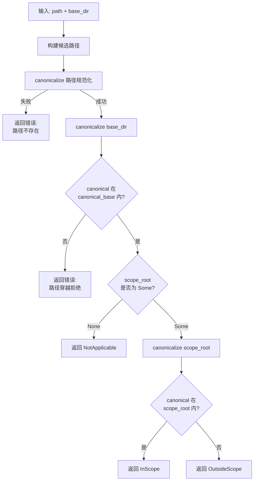

# 8.3 路径守卫与跨范围检测

## 概述

`path_guard.rs` 是 RAF 文件系统安全的基础设施。所有文件系统工具（`ReadFile`、`WriteFile`、`EditFile`、`RemovePath` 等）在执行前都必须通过 `resolve_safe()` 或 `resolve_safe_new()` 解析用户提供的路径。这两个函数同时完成三项职责：

1. **路径规范化**：将相对路径和绝对路径解析为规范化的 `PathBuf`
2. **目录穿越防护**：防止 `../` 逃逸出基础目录
3. **工作区范围检测**：判断规范化后的路径是否在 `WorkspaceScope.root` 内

```rust
// crates/framework/src/tools/path_guard.rs

/// 将用户提供的路径相对于基础目录解析，含目录穿越防护。
pub(crate) fn resolve_safe(
    base_dir: &Path,
    path: &str,
    scope_root: Option<&Path>,
) -> Result<(PathBuf, ScopeStatus), AgentError>;

/// resolve_safe 的变体，允许路径尚不存在（用于写操作）。
pub(crate) fn resolve_safe_new(
    base_dir: &Path,
    path: &str,
    scope_root: Option<&Path>,
) -> Result<(PathBuf, ScopeStatus), AgentError>;
```

## ScopeStatus 枚举

```rust
/// 工具内部用 scope 检测结果
#[derive(Debug, Clone)]
pub(crate) enum ScopeStatus {
    /// 路径在工作区范围内
    InScope,
    /// 路径在工作区范围外
    OutsideScope,
    /// 无 scope 设置，无需判断
    NotApplicable,
}

impl ScopeStatus {
    /// 转为 JSON 响应中的 "scope" 标签值
    pub fn to_label(&self) -> &str {
        match self {
            ScopeStatus::InScope => "workspace",
            ScopeStatus::OutsideScope => "outside_workspace",
            ScopeStatus::NotApplicable => "none",
        }
    }
}
```

## resolve_safe() — 读操作路径解析

`resolve_safe()` 用于需要路径已存在的操作（如 `ReadFile`、`ListFiles`、`InspectFile`）：

```rust
pub(crate) fn resolve_safe(
    base_dir: &Path,
    path: &str,
    scope_root: Option<&Path>,
) -> Result<(PathBuf, ScopeStatus), AgentError> {
    // 1. 构建候选路径
    let candidate = if Path::new(path).is_absolute() {
        PathBuf::from(path)          // 绝对路径直接使用
    } else if path.is_empty() || path == "." {
        base_dir.to_path_buf()       // 空路径 = base_dir
    } else {
        base_dir.join(path)          // 相对路径拼接
    };

    // 2. 规范化路径（解析符号链接、相对组件）
    let canonical = candidate.canonicalize().map_err(|e| {
        AgentError::ToolError(format!(
            "Path does not exist or cannot be resolved: {}", e
        ))
    })?;

    // 3. 目录穿越检测
    let canonical_base = base_dir
        .canonicalize()
        .unwrap_or_else(|_| base_dir.to_path_buf());

    if !canonical.starts_with(&canonical_base) {
        return Err(AgentError::ToolError("Path traversal denied".into()));
    }

    // 4. Scope 检测
    let scope_status = match scope_root {
        Some(root) => {
            let canonical_root = root
                .canonicalize()
                .unwrap_or_else(|_| root.to_path_buf());
            if canonical.starts_with(&canonical_root) {
                ScopeStatus::InScope
            } else {
                ScopeStatus::OutsideScope
            }
        }
        None => ScopeStatus::NotApplicable,
    };

    Ok((canonical, scope_status))
}
```

### 流程图



## resolve_safe_new() — 写操作路径解析

`resolve_safe_new()` 用于路径可能尚不存在的操作（如 `WriteFile`、`MakeDirectory`、`MoveFile` 的源和目标）：

```rust
pub(crate) fn resolve_safe_new(
    base_dir: &Path,
    path: &str,
    scope_root: Option<&Path>,
) -> Result<(PathBuf, ScopeStatus), AgentError> {
    let candidate = /* 同 resolve_safe 的候选构建 */;

    // 手动处理 ".." 穿越（canonicalize 对不存在的路径无效）
    let mut normalized = PathBuf::new();
    for component in candidate.components() {
        match component {
            std::path::Component::ParentDir => {
                if !normalized.pop() {
                    return Err(AgentError::ToolError("Path traversal denied".into()));
                }
            }
            other => normalized.push(other),
        }
    }

    // 尝试 canonicalize — 如果路径不存在，向上查找祖先
    if let Ok(canon) = normalized.canonicalize() {
        // 路径存在：直接验证
        if !canon.starts_with(&canonical_base) {
            return Err(AgentError::ToolError("Path traversal denied".into()));
        }
        let scope_status = match &canonical_scope_root {
            Some(root) if canon.starts_with(root) => ScopeStatus::InScope,
            Some(_) => ScopeStatus::OutsideScope,
            None => ScopeStatus::NotApplicable,
        };
        return Ok((canon, scope_status));
    }

    // 路径不存在：向上遍历祖先直到找到存在的一个
    let mut current = normalized.as_path();
    loop {
        match current.canonicalize() {
            Ok(canon) => {
                if !canon.starts_with(&canonical_base) {
                    return Err(AgentError::ToolError("Path traversal denied".into()));
                }
                let scope_status = match &canonical_scope_root {
                    Some(root) if normalized.starts_with(root) => ScopeStatus::InScope,
                    Some(_) => ScopeStatus::OutsideScope,
                    None => ScopeStatus::NotApplicable,
                };
                return Ok((normalized, scope_status));
            }
            Err(_) => match current.parent() {
                Some(parent) => current = parent,
                None => return Err(AgentError::ToolError(
                    "Path resolution failed: no existing ancestor found".into(),
                )),
            },
        }
    }
}
```

### 写操作祖先查找

当目标路径尚不存在时（例如 `WriteFile("/workspace/newdir/file.txt")` 但 `newdir/` 不存在），`resolve_safe_new()` 会沿着目录树向上遍历祖先：

```
Path: /workspace/a/b/c/new_file.txt
                    ↑ 不存在
祖先查找：/workspace/a/b/c → 不存在
         /workspace/a/b   → 存在！
         验证 /workspace/a/b 是否在 base_dir 内 → 是
         验证 /workspace/a/b/c/new_file.txt 是否在 scope_root 内 → 用 starts_with 判断
```

## 目录穿越防护

两个函数都内置了目录穿越防护。以下攻击向量会被拦截：

```rust
// 向量 1：../ 逃逸
resolve_safe(Path::new("/workspace"), "../etc/passwd", None)
// → Error: Path traversal denied

// 向量 2：符号链接逃逸
// 假设 /workspace/link → /etc
resolve_safe(Path::new("/workspace"), "link/passwd", None)
// → 规范化后为 /etc/passwd，不在 /workspace 内 → Error

// 向量 3：绝对路径绕过
resolve_safe(Path::new("/workspace"), "/etc/passwd", None)
// → 绝对路径直接使用，规范化后不在 base_dir 内 → Error
```

## 工具中的使用模式

所有文件系统工具在 `execute()` 方法中遵循统一的使用模式：

```rust
// ReadFile 示例
async fn execute(&self, arguments: serde_json::Value) -> Result<ToolResult> {
    let path = arguments["path"].as_str().unwrap_or("");
    let base_dir = self.scope.as_ref()
        .map(|s| s.root.as_path())
        .unwrap_or_else(|| Path::new("."));

    let (resolved, scope_status) = resolve_safe(
        base_dir,
        path,
        self.scope.as_ref().map(|s| s.root.as_path()),
    )?;

    // 根据 ScopePolicy 决定是否拒绝
    if let Some(scope) = &self.scope {
        if scope.policy == ScopePolicy::DenyOutside 
           && matches!(scope_status, ScopeStatus::OutsideScope) 
        {
            return Ok(ToolResult::error(format!(
                "Access denied: '{}' is outside workspace '{}'",
                path, scope.name
            )));
        }
    }

    // 执行操作...
    let content = std::fs::read_to_string(&resolved)?;
    Ok(ToolResult::success(serde_json::json!({
        "path": resolved.display().to_string(),
        "scope": scope_status.to_label(),
        "content": content,
    })))
}
```

## ScopeStatus 在工具响应中的体现

工具的 JSON 响应中始终包含 `scope` 字段：

```json
// 工作区内操作
{
    "path": "/workspace/src/main.rs",
    "scope": "workspace",
    "content": "fn main() { ... }"
}

// 工作区外操作
{
    "path": "/etc/hosts",
    "scope": "outside_workspace",
    "content": "127.0.0.1 localhost"
}
```

`scope` 字段有两种用途：
1. **LLM 感知**：LLM 能看到操作是否越界，据此调整后续行为
2. **日志审计**：生产环境可以通过 `scope` 字段追踪 Agent 的越界行为

## 归纳

`path_guard.rs` 通过两个核心函数提供了三层防护：

| 层级 | 机制 | 实现方式 |
|------|------|---------|
| 路径规范化 | 解析符号链接、相对路径 | `Path::canonicalize()` |
| 目录穿越防护 | 验证规范化路径在 base_dir 内 | `canonical.starts_with(canonical_base)` |
| 工作区范围检测 | 判断路径是否在 WorkspaceScope.root 内 | `canonical.starts_with(canonical_root)` |

对于不存在的路径（写操作），`resolve_safe_new()` 通过祖先查找和手动 `..` 处理来保证安全性，确保即使目标路径尚未创建也不会被用于路径穿越攻击。
