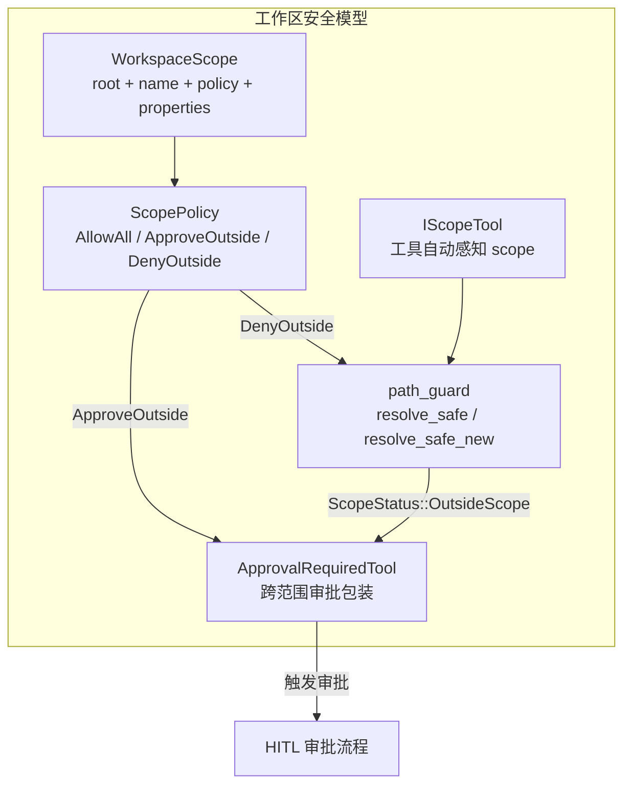

# 8.1 WorkspaceScope 工作区范围

## 概述

`WorkspaceScope` 是 RAF 工作区管理的核心数据结构。它定义了 Agent 的**操作边界**——Agent 可以在哪些路径下自由读写文件、执行命令，在哪些路径下需要审批或被禁止。

```rust
// crates/core/src/workspace.rs

pub struct WorkspaceScope {
    /// 规范化的根路径
    pub root: PathBuf,
    /// 可读名称，注入 system prompt
    pub name: String,
    /// 越界处理策略
    pub policy: ScopePolicy,
    /// 扩展属性——路径白名单、命令白名单、环境变量等
    pub properties: HashMap<String, serde_json::Value>,
}
```

## 为什么需要工作区管理

### 安全问题

Agent 通常被赋予文件系统访问和命令执行能力。如果不加限制，恶意或错误的提示词可能导致：

- 读取敏感文件（`/etc/passwd`、`.env`、SSH 私钥）
- 覆盖或删除关键系统文件
- 执行危险的系统命令（`rm -rf /`、`curl | sh`）
- 在工作区外创建或修改文件

### RAF 的方案

RAF 通过三层防护实现工作区安全：

```
Layer 1: WorkspaceScope 定义边界
         ↓
Layer 2: path_guard.rs 在工具执行时检测越界
         ↓
Layer 3: ScopePolicy + ApprovalRequiredTool 处理越界
```



## ScopePolicy 三种策略

`ScopePolicy` 是一个枚举，定义了三种越界处理策略：

```rust
pub enum ScopePolicy {
    /// 开发模式——不作任何限制
    AllowAll,
    /// 生产模式——跨范围操作需人机协同审批
    ApproveOutside,
    /// 受限模式——禁止任何跨范围访问
    DenyOutside,
}
```

### 策略对比

| 策略 | 工作区内操作 | 跨范围读操作 | 跨范围写/删除操作 | 适用场景 |
|------|-------------|-------------|------------------|---------|
| `AllowAll` | 直接执行 | 直接执行 | 直接执行 | 本地开发、受信任环境 |
| `ApproveOutside` | 直接执行 | 需审批 | 需审批 | 生产环境、需要审计 |
| `DenyOutside` | 直接执行 | 工具级拒绝 | 工具级拒绝 | 沙箱环境、CI/CD |

### AllowAll

不限制 Agent 的操作范围。工具在工作区内外的操作都直接执行。适用于开发环境和完全受信任的场景。

```rust
let scope = WorkspaceScope::new("/project", "dev-workspace")
    .with_policy(ScopePolicy::AllowAll);
```

### ApproveOutside

Agent 在工作区内的操作直接执行，工作区外的操作触发审批流程。这是推荐的**生产环境默认策略**。

```rust
let scope = WorkspaceScope::new("/var/app", "production-app")
    .with_policy(ScopePolicy::ApproveOutside);

// 搭配 WorkspaceContextProvider，工具被自动包装为 ApprovalRequiredTool
let provider = WorkspaceContextProvider::new(Arc::new(scope))
    .add_tool(ReadFile { scope: None })
    .add_tool(WriteFile { scope: None });
```

### DenyOutside

严格限制。Agent 只能在定义的工作区范围内操作，任何越界尝试在工具级别被拒绝。适用于高度受控的沙箱环境。

```rust
let scope = WorkspaceScope::new("/sandbox", "restricted-sandbox")
    .with_policy(ScopePolicy::DenyOutside);
```

## 扩展属性

`WorkspaceScope.properties` 是一个 `HashMap<String, serde_json::Value>`，支持存储任意扩展属性：

```rust
let scope = WorkspaceScope::new("/project", "my-project")
    .with_policy(ScopePolicy::ApproveOutside)
    .with_property("allowed_commands", serde_json::json!(["ls", "cat", "grep"]))
    .with_property("max_file_size_mb", serde_json::json!(10))
    .with_property("environment", serde_json::json!({
        "NODE_ENV": "production",
        "PATH": "/usr/local/bin:/usr/bin"
    }));
```

这些属性可以在 `RunCommand` 等工具中读取，用于实现命令白名单、文件大小限制等功能。

## IScopeTool：工作区感知工具

`IScopeTool` 是一个 trait，扩展了 `ITool`，使工具能够接受 `WorkspaceScope` 的注入：

```rust
pub trait IScopeTool: ITool {
    /// 使用指定工作区范围创建工具的新实例。
    fn create_scoped(&self, scope: Arc<WorkspaceScope>) -> Arc<dyn ITool>;
}
```

### 为什么需要 IScopeTool

- **关注点分离**：工具不需要在构造函数中关心工作区范围，`WorkspaceContextProvider` 自动注入。
- **编译期保证**：通过 Rust 的 trait 系统，只有实现了 `IScopeTool` 的工具才能被工作区上下文提供器管理。
- **运行时多态**：返回 `Arc<dyn ITool>` 允许工具注入 scope 后仍可通过统一的 `ITool` 接口使用。

### RAF 内置的 IScopeTool 实现

所有文件系统工具和 `RunCommand` 都实现了 `IScopeTool`：

| 工具 | scope 用途 |
|------|-----------|
| `ReadFile` | 读取路径安全校验 |
| `WriteFile` | 写入路径安全校验 |
| `EditFile` | 编辑路径安全校验 |
| `ListFiles` | 列出目录安全校验 |
| `InspectFile` | 文件检查安全校验 |
| `MakeDirectory` | 创建目录安全校验 |
| `RemovePath` | 删除路径安全校验 |
| `MoveFile` | 移动路径安全校验（源 + 目标） |
| `FindFiles` | 搜索路径安全校验 |
| `SearchFile` | 内容搜索路径安全校验 |
| `RunCommand` | 命令执行 + 路径上下文 |

## 配置示例

### 开发环境

```rust
let scope = WorkspaceScope::new(".", "local-dev")
    .with_policy(ScopePolicy::AllowAll);
```

### 生产环境（单应用）

```rust
let scope = WorkspaceScope::new("/opt/myapp", "myapp-prod")
    .with_policy(ScopePolicy::ApproveOutside)
    .with_property("allowed_commands", serde_json::json!([
        "ls", "cat", "head", "tail", "wc", "grep", "find",
        "node", "npm", "git"
    ]));
```

### 沙箱环境

```rust
let scope = WorkspaceScope::new("/tmp/agent-sandbox-42", "sandbox-42")
    .with_policy(ScopePolicy::DenyOutside)
    .with_property("max_file_size_mb", 5)
    .with_property("max_files", 100);
```

## 在 system prompt 中的表现

`WorkspaceContextProvider::build_instructions()` 将工作区信息注入 system prompt：

```
## 工作区
 名称: my-project
 根路径: /home/user/project
 越界策略: 跨范围审批（工作区外的操作需用户审批后方可执行）

 - 相对路径在工作区内解析
 - 绝对路径若在工作区外，工具返回中 scope 字段会标明 outside_workspace
 - 每个工具返回均包含 scope 字段以标明操作范围
```

这告知 LLM 其操作边界，帮助它做出合理的路径选择。
