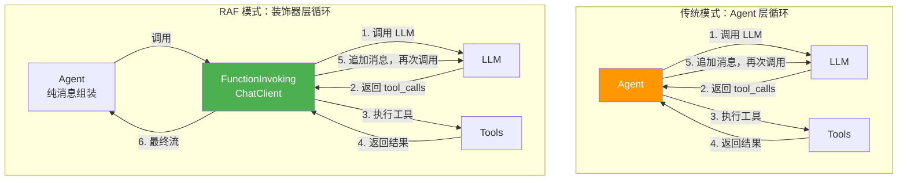

# 9.1 装饰器模式与管道架构

## 概述

RAF 的 ChatClient 管道采用**装饰器模式（Decorator Pattern）** 构建。`IChatClient` 作为统一接口，`DelegatingChatClient` 作为装饰器基类，`ChatClientBuilder` 按注册顺序组装装饰器链。这个设计将横切关注点（工具调用、审批、持久化）从 Agent 层解耦到管道层，实现了高度可复用的模块化架构。

## 为什么选择装饰器模式

### 传统的 Agent 层工具循环

在早期的 Agent 框架中，工具调用循环通常在 Agent 层实现：

```
传统模式：
  Agent.run()
    → 组装消息
    → 调用 LLM
    → 收到 tool_calls
    → 执行工具
    → 追加结果到消息
    → 再次调用 LLM
    → ... 循环直到停止
```

**问题**：
- 工具循环逻辑与 Agent 逻辑紧密耦合
- 难以在不同的 LLM 提供商之间复用
- 添加新功能（如审批、持久化）需要修改 Agent 代码
- 难以进行单元测试（需要 mock 整个 Agent）

### RAF 的装饰器模式

RAF 将工具调用循环下沉到 `IChatClient` 装饰器层：

```
RAF 模式：
  Agent.run()
    → 组装消息（纯组装，不关心工具）
    → IChatClient.run(messages)
      → FunctionInvokingChatClient.run()
        → 调用 inner client → LLM 响应
        → 如果有 tool_calls → 执行工具 → 循环
        → 返回最终流
```

**优势**：
- **关注点分离**：Agent 负责"调度"，装饰器负责"执行"
- **可组合性**：通过 `ChatClientBuilder` 自由组合装饰器
- **可测试性**：可以单独 mock `IChatClient` 来测试装饰器行为
- **提供商无关**：同一个 `FunctionInvokingChatClient` 可以包裹任何 `IChatClient` 实现

## IChatClient — 统一接口

```rust
// crates/core/src/chat_client.rs

#[async_trait]
pub trait IChatClient: Send + Sync {
    /// 执行聊天补全，产生更新增量的流式响应
    async fn run(
        &self,
        messages: &[ChatMessage],
        options: ChatClientRunOptions,
    ) -> Result<BoxStream<'static, Result<AgentResponseUpdate>>>;

    /// 返回此客户端使用的模型标识符
    fn model_id(&self) -> &str;

    /// 返回模型元数据，描述能力边界
    fn model_metadata(&self) -> Option<&ModelMetadata> {
        None
    }

    /// 返回装饰器链中的内部客户端
    fn inner_client(&self) -> Option<&Arc<dyn IChatClient>> {
        None
    }
}
```

`IChatClient` 的 `run()` 方法签名是统一的关键：
- **输入**：`&[ChatMessage]`（消息列表）和 `ChatClientRunOptions`（运行选项）
- **输出**：`BoxStream<'static, Result<AgentResponseUpdate>>`（流式响应）

这个签名使得任何 `IChatClient` 实现都可以被另一个 `IChatClient` 包装，形成装饰器链。

## DelegatingChatClient — 装饰器基类

```rust
// crates/core/src/chat_client.rs

pub struct DelegatingChatClient {
    inner: Arc<dyn IChatClient>,
}

impl DelegatingChatClient {
    pub fn new(inner: Arc<dyn IChatClient>) -> Self {
        Self { inner }
    }

    pub fn inner(&self) -> &Arc<dyn IChatClient> {
        &self.inner
    }
}

#[async_trait]
impl IChatClient for DelegatingChatClient {
    async fn run(
        &self,
        messages: &[ChatMessage],
        options: ChatClientRunOptions,
    ) -> Result<BoxStream<'static, Result<AgentResponseUpdate>>> {
        self.inner.run(messages, options).await
    }

    fn model_id(&self) -> &str {
        self.inner.model_id()
    }

    fn model_metadata(&self) -> Option<&ModelMetadata> {
        self.inner.model_metadata()
    }

    fn inner_client(&self) -> Option<&Arc<dyn IChatClient>> {
        Some(&self.inner)
    }
}
```

`DelegatingChatClient` 提供了**透传（passthrough）** 的默认行为：所有方法直接委托给 `inner`。自定义装饰器（如 `FunctionInvokingChatClient`）重写需要拦截的方法。

### 自定义装饰器示例

```rust
struct LoggingDecorator {
    inner: Arc<dyn IChatClient>,
}

#[async_trait]
impl IChatClient for LoggingDecorator {
    async fn run(
        &self,
        messages: &[ChatMessage],
        options: ChatClientRunOptions,
    ) -> Result<BoxStream<'static, Result<AgentResponseUpdate>>> {
        tracing::info!(
            msg_count = messages.len(),
            model = self.inner.model_id(),
            "ChatClient::run called"
        );
        self.inner.run(messages, options).await
    }

    fn model_id(&self) -> &str {
        self.inner.model_id()
    }
}
```

## ChatClientBuilder — 管道构建器

`ChatClientBuilder` 是组装装饰器链的工厂：

```rust
// crates/core/src/chat_client.rs

pub struct ChatClientBuilder {
    decorators: Vec<Box<dyn Fn(Arc<dyn IChatClient>) -> Arc<dyn IChatClient> + Send + Sync>>,
    leaf: Option<Arc<dyn IChatClient>>,
}

impl ChatClientBuilder {
    pub fn new() -> Self { /* ... */ }

    /// 设置叶子 ChatClient（实际的 LLM 服务客户端）
    pub fn leaf(mut self, client: Arc<dyn IChatClient>) -> Self {
        self.leaf = Some(client);
        self
    }

    /// 添加装饰器工厂
    /// 装饰器按注册顺序包装：先注册的装饰器在最外层
    pub fn use_decorator(
        mut self,
        factory: Box<dyn Fn(Arc<dyn IChatClient>) -> Arc<dyn IChatClient> + Send + Sync>,
    ) -> Self {
        self.decorators.push(factory);
        self
    }

    /// 构建管道
    pub fn build(self) -> Result<Arc<dyn IChatClient>> {
        let mut client = self.leaf.ok_or_else(|| {
            AgentError::ConfigError("leaf IChatClient is required".into())
        })?;
        for factory in self.decorators {
            client = factory(client);
        }
        Ok(client)
    }
}
```

## 管道组装示意

```mermaid
graph LR
    subgraph "ChatClientBuilder.build()"
        direction LR
        A[leaf: DeepSeekChatClient] --> B[factory[0]: PerServiceCallPersisting]
        B --> C[factory[1]: FunctionInvokingChatClient]
    end

    subgraph "运行时调用链"
        direction RL
        D[Agent.run()] -->|IChatClient::run| C
        C -->|IChatClient::run| B
        B -->|IChatClient::run| A
    end

    style C fill:#4CAF50,color:white
    style A fill:#2196F3,color:white
```

注册顺序决定了包装顺序：
- **先注册的装饰器在最外层**（最先被调用）
- **叶子客户端在最内层**（最后被调用）

```rust
let pipeline = ChatClientBuilder::new()
    .leaf(Arc::new(DeepSeekChatClient::new(llm_options)?))
    .use_decorator(Box::new(|inner| {
        Arc::new(PerServiceCallPersistingChatClient::new(inner, session))
    }))
    .use_decorator(Box::new(|inner| {
        Arc::new(FunctionInvokingChatClient::new(inner, tools))
    }))
    .build()?;

// 运行时调用顺序：
// Agent → FunctionInvoking → PerServiceCallPersisting → DeepSeek → HTTP
```

## 架构对比：RAF vs Agent 层工具循环



## 使用示例：完整管道构建

```rust
use std::sync::Arc;
use rust_agent_core::{ChatClientBuilder, ChatClientRunOptions, IChatClient};
use rust_agent_client::{DeepSeekChatClient, ChatClientOptions};
use rust_agent_framework::FunctionInvokingChatClient;

// 1. 创建叶子客户端
let llm_options = ChatClientOptions::deepseek(
    "deepseek-chat",
    std::env::var("DEEPSEEK_API_KEY").unwrap(),
);
let leaf = DeepSeekChatClient::new(llm_options).unwrap();

// 2. 注册工具
let tools: Vec<Arc<dyn ITool>> = vec![
    Arc::new(ReadFile { scope: None }),
    Arc::new(WriteFile { scope: None }),
];

// 3. 构建管道
let pipeline = ChatClientBuilder::new()
    .leaf(Arc::new(leaf))
    .use_decorator(Box::new(move |inner| {
        Arc::new(FunctionInvokingChatClient::new(inner, tools.clone())
            .with_max_rounds(5))
    }))
    .build()
    .unwrap();

// 4. 使用管道 — 装饰器透明地处理工具调用
let stream = pipeline.run(
    &[ChatMessage::user("读取 Cargo.toml 的内容")],
    ChatClientRunOptions::default(),
).await.unwrap();
```

## inner_client() 链式访问

`inner_client()` 方法允许在运行时穿透装饰器链，访问内部客户端：

```rust
// 获取最内层的叶子客户端
fn get_leaf_client(client: &Arc<dyn IChatClient>) -> &Arc<dyn IChatClient> {
    let mut current = client;
    while let Some(inner) = current.inner_client() {
        current = inner;
    }
    current
}
```

这在 `SkillMemoryContextProvider` 等场景中至关重要——它需要访问原始 API 客户端来创建子 Agent（如 `MemoryAgent`）。

## 归纳

装饰器模式为 RAF 带来了以下架构收益：

| 收益 | 实现方式 |
|------|---------|
| 关注点分离 | Agent 负责调度，装饰器负责执行 |
| 可组合性 | `ChatClientBuilder` 按序组装任意装饰器链 |
| 可测试性 | 每个装饰器可独立测试，只需 mock 内部 `IChatClient` |
| 提供商无关 | 任何实现 `IChatClient` 的提供商都可被装饰 |
| 横切关注点 | 工具调用、审批、持久化作为独立装饰器实现 |

这个设计直接参照了 MAF (Microsoft Agent Framework) 的 `FunctionInvokingChatClient` + `DelegatingChatClient` 模式，但使用 Rust 的 trait 系统和 `Arc<dyn>` 替代了 C# 的接口继承，保留了 Rust 生态的惯用表达。
