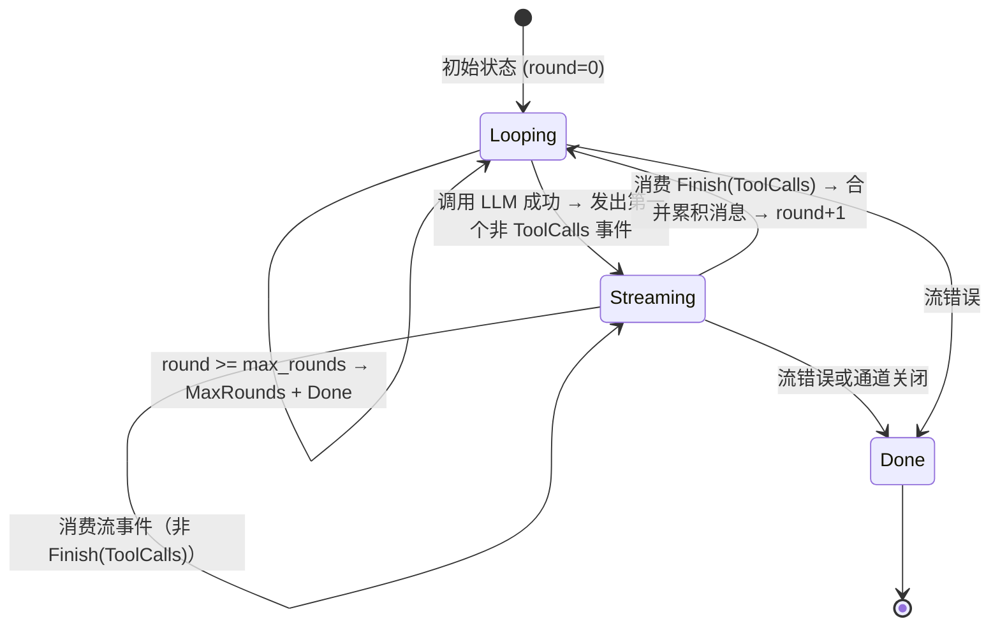

# 9.2 FunctionInvokingChatClient 工具调用循环

## 概述

`FunctionInvokingChatClient` 是 RAF 中最核心的装饰器。它实现了完整的工具调用循环——消费 LLM 的流式响应，检测工具调用，执行工具，将结果注入对话，然后循环调用 LLM 直到没有更多工具调用或达到轮次上限。

```rust
// crates/framework/src/chat_client_decorators/function_invoking.rs

pub struct FunctionInvokingChatClient {
    inner: Arc<dyn IChatClient>,
    tools: Vec<Arc<dyn ITool>>,
    max_rounds: usize,  // 默认 10
}
```

## 状态机设计

`FunctionInvokingChatClient` 使用 `LoopState` 枚举管理工具调用循环的状态转换：

```rust
enum LoopState {
    Looping {
        messages: Vec<ChatMessage>,
        round: usize,
        options: ChatClientRunOptions,
    },
    Streaming {
        rx: mpsc::Receiver<Result<AgentResponseUpdate>>,
        on_done: Box<LoopState>,         // 流结束后的目标状态
        msg_rx: Option<mpsc::Receiver<Vec<ChatMessage>>>,  // 累积消息通道
    },
    Done,
}
```



## 核心循环实现

`FunctionInvokingChatClient::run()` 使用 `futures_util::stream::unfold` 实现异步状态机：

```rust
#[async_trait]
impl IChatClient for FunctionInvokingChatClient {
    async fn run(
        &self,
        messages: &[ChatMessage],
        options: ChatClientRunOptions,
    ) -> Result<BoxStream<'static, Result<AgentResponseUpdate>>> {
        let initial_state = LoopState::Looping {
            messages: messages.to_vec(),
            round: 0,
            options,
        };

        let stream = futures_util::stream::unfold(
            initial_state,
            move |state| {
                let inner = Arc::clone(&self.inner);
                let tools = Arc::clone(&self.tools);

                async move {
                    match state {
                        LoopState::Done => None,
                        LoopState::Streaming { .. } => { /* 消费流 */ }
                        LoopState::Looping { messages, round, options } => {
                            // ── 1. 取消检查 ──
                            if let Some(ref flag) = options.cancelled {
                                if flag.load(Ordering::Relaxed) {
                                    return Some((Ok(Error("cancelled")), Done));
                                }
                            }

                            // ── 2. 审批恢复 ──
                            if !options.tool_approval_responses.is_empty() {
                                // 重建消息 + 执行/拒绝工具
                            }

                            // ── 3. 轮次检查 ──
                            if round >= max_rounds {
                                return Some((Ok(Finish(MaxRounds)), Done));
                            }

                            // ── 4. 调用 LLM ──
                            let stream = inner.run(&messages, options).await?;

                            // ── 5. 创建通道，spawn 流消费任务 ──
                            let (tx, rx) = mpsc::channel(256);
                            let (msg_tx, msg_rx) = mpsc::channel(1);
                            tokio::spawn(async move {
                                // 在 spawned task 中消费 LLM 流
                            });

                            // ── 6. 返回第一个事件 ──
                            match rx.recv().await {
                                Some(Ok(update)) => {
                                    // 如果是 ToolCalls → Looping(round+1)
                                    // 否则 → Streaming(rx, on_done)
                                }
                                // ...
                            }
                        }
                    }
                }
            },
        );

        // 过滤内部 ToolCalls Finish 信号
        let stream = Box::pin(stream.filter(|r| {
            let keep = !matches!(r, Ok(Finish { finish_reason: ToolCalls, .. }));
            async move { keep }
        }));

        Ok(stream)
    }
}
```

## Spawned Task：流消费

每次 LLM 调用返回后，`FunctionInvokingChatClient` 在 `tokio::spawn` 中启动一个异步任务来消费 LLM 的流：

```mermaid
graph TD
    A[LLM 流到达] --> B{Spawned Task}
    B --> C[消费 SSE 事件]
    C --> D{事件类型?}
    D -->|ToolCallStart| E[创建 AccumulatedToolCall]
    D -->|ToolCallArgs| F[追加参数片段到当前调用]
    D -->|ToolCallEnd| G[完成当前调用，加入 tool_calls 列表]
    D -->|TextDelta| H[转发文本增量]
    D -->|Finish| I[延迟处理]
    D -->|其他| J[直接转发]

    E --> K[通过 tx 发送事件给主循环]
    F --> K
    G --> K
    H --> K
    J --> K

    K --> L{流结束?}
    L -->|否| C
    L -->|是| M{has_tool_calls?}

    M -->|否| N[发送 Finish(Stop) → 结束]
    M -->|是| O{any_requires_approval?}

    O -->|是| P[发送 ToolApprovalRequest 事件]
    P --> Q[保存 assistant(tool_calls) 到 msg_tx]
    Q --> R[发送 Finish(AwaitingApproval)]

    O -->|否| S[并行执行工具 join_all]
    S --> T[保存 assistant + tool(result) 到 msg_tx]
    T --> U[发送 ToolCalled 事件]
    U --> V[发送 Finish(ToolCalls)]
```

### AccumulatedToolCall

流消费过程中，工具调用参数通过 `AccumulatedToolCall` 进行累积：

```rust
#[derive(Clone, Default)]
struct AccumulatedToolCall {
    id: String,       // 工具调用 ID
    name: String,     // 工具名称
    arguments: String, // 累积的 JSON 参数字符串
}
```

### 工具调用累积过程

```
ToolCallStart { id: "call_1", name: "read_file" }
  → AccumulatedToolCall { id: "call_1", name: "read_file", arguments: "" }

ToolCallArgs { id: "call_1", args_delta: "{\"path\": \"" }
  → AccumulatedToolCall { ..., arguments: "{\"path\": \"" }

ToolCallArgs { id: "call_1", args_delta: "/etc/hosts\"}" }
  → AccumulatedToolCall { ..., arguments: "{\"path\": \"/etc/hosts\"}" }

ToolCallEnd { id: "call_1" }
  → tool_calls.push(AccumulatedToolCall { ... })
```

## 工具执行流程

### 1. Schema 验证

工具执行前，参数会经过 `validate_against_schema()` 验证：

```rust
fn validate_against_schema(
    args: &serde_json::Value,
    schema: &serde_json::Value,
) -> std::result::Result<(), String> {
    // 1. 参数必须是 JSON 对象
    let obj = match args {
        serde_json::Value::Object(o) => o,
        other => return Err("Expected a JSON object...".into()),
    };

    // 2. 所有 required 字段必须存在
    if let Some(required) = schema.get("required").and_then(|r| r.as_array()) {
        for field in required {
            if !obj.contains_key(field.as_str().unwrap_or("")) {
                errors.push(format!("Missing required field: {}", field));
            }
        }
    }

    // 3. 每个字段的值类型必须与 schema 中声明的类型兼容
    if let Some(properties) = schema.get("properties").and_then(|p| p.as_object()) {
        for (field_name, field_value) in obj {
            let expected_type = properties[field_name]
                .get("type")
                .and_then(|t| t.as_str());
            // 检查 string/number/boolean/object/array 类型匹配
        }
    }
}
```

### 2. 并行工具执行

所有工具调用通过 `futures_util::future::join_all` 并行执行：

```rust
let tool_futures: Vec<_> = tool_calls.iter().map(|tc| {
    async move {
        // 参数解析
        let args_value = serde_json::from_str(&tc.arguments)?;

        // Schema 验证
        if let Some(tool) = tools.iter().find(|t| t.name() == tc.name) {
            validate_against_schema(&args_value, &tool.parameters())?;
        }

        // 执行工具
        match tools.iter().find(|t| t.name() == tc.name) {
            Some(tool) => tool.execute(args_value).await,
            None => /* "Tool not found" error */,
        }
    }
}).collect();

let results = futures_util::future::join_all(tool_futures).await;
```

### 3. 消息累积

每个工具执行后，`assistant(tool_calls)` 和 `tool(result)` 消息对被添加到下一轮的消息列表中：

```rust
// assistant 消息
next_messages.push(ChatMessage {
    role: MessageRole::Assistant,
    content: text_delta.clone(),
    tool_calls: Some(tool_calls.iter().map(|tc| ToolCall { ... }).collect()),
    ...
});

// tool(result) 消息（每组一个）
for (i, result) in results.iter().enumerate() {
    next_messages.push(ChatMessage {
        role: MessageRole::Tool,
        content: result.result.unwrap_or(/* error */),
        name: Some(tool_calls[i].name.clone()),
        tool_call_id: Some(tool_calls[i].id.clone()),
        ...
    });
}
```

## Provider Tools 合并

`FunctionInvokingChatClient` 支持将 ContextProvider 注入的工具与静态注册的工具合并：

```rust
// 合并 provider 工具与静态工具（去重）
let mut combined: Vec<Arc<dyn ITool>> = (*tools).clone();
let mut seen: HashSet<String> = combined
    .iter().map(|t| t.name().to_string()).collect();

for pt in &options.provider_tools {
    if seen.contains(pt.name()) {
        // ApprovalRequiredTool 替换非审批版本
        if pt.requires_approval() {
            combined.retain(|t| t.name() != pt.name());
            combined.push(Arc::clone(pt));
        }
    } else {
        seen.insert(pt.name().to_string());
        combined.push(Arc::clone(pt));
    }
}
```

## max_rounds 限制

为防止无限循环，`FunctionInvokingChatClient` 有最大轮次限制（默认 10）：

```rust
if round >= max_rounds {
    return Some((Ok(AgentResponseUpdate::Finish {
        finish_reason: FinishReason::MaxRounds,
        usage: None,
    }), LoopState::Done));
}
```

## 流过滤

`FunctionInvokingChatClient` 返回的最终流过滤了内部的 `Finish(ToolCalls)` 信号，因为外部消费者不需要知道内部循环的轮次边界：

```rust
let stream: BoxStream<'static, Result<AgentResponseUpdate>> = Box::pin(
    stream.filter(|r| {
        let keep = !matches!(r, Ok(AgentResponseUpdate::Finish {
            finish_reason: FinishReason::ToolCalls, ..
        }));
        async move { keep }
    }),
);
```

外部消费者看到的结束原因只有 `Stop`、`AwaitingApproval` 或 `MaxRounds`。

## 归纳

`FunctionInvokingChatClient` 通过状态机 + spawned task 的设计实现了完整的工具调用循环：

| 组件 | 职责 |
|------|------|
| `LoopState` 枚举 | 管理状态转换：`Looping → Streaming → Looping → ... → Done` |
| `unfold` 流 | 异步状态机驱动整个循环 |
| `mpsc::channel` | 连接 spawned task（流消费）和主循环 |
| Spawned task | 消费 LLM 流，累积工具调用，执行工具或发出审批请求 |
| `validate_against_schema()` | 工具执行前的参数校验 |
| `join_all` | 并行执行多个工具调用 |
| 流过滤 | 隐藏内部 `Finish(ToolCalls)`，保持外部 API 简洁 |

这个设计确保了尽管内部有多轮 LLM 调用和工具执行，外部调用者始终看到的是一个单一的、连续的流。
