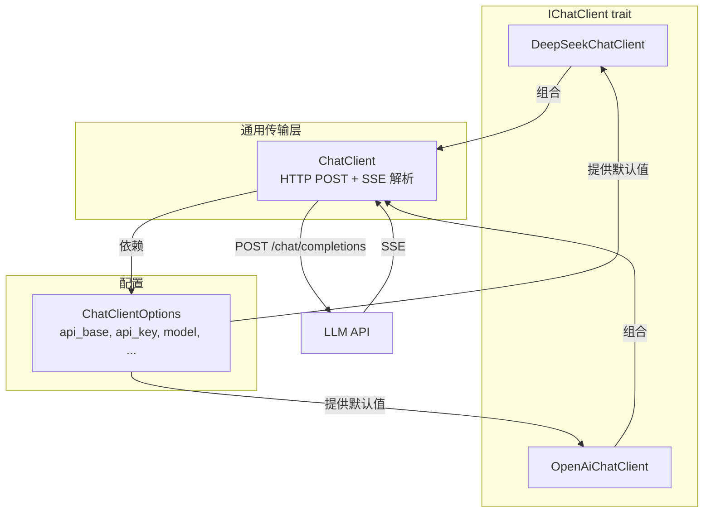

# 9.3 LLM 提供商（OpenAI / DeepSeek）

## 概述

RAFT 的 LLM 提供商层采用分层架构：通用 `ChatClient` 负责 HTTP 传输和 SSE 流解析，提供商标识的包装类型（`DeepSeekChatClient`、`OpenAiChatClient`）添加特定于提供商的逻辑（如用量格式、思考模式）。这种设计使得添加新的 LLM 提供商只需实现一个薄包装，无需重复 HTTP/SSE 传输逻辑。



## ChatClient — 通用传输引擎

`ChatClient` 是所有 LLM 提供商的共享传输基础。它负责：

1. 构建符合 OpenAI 兼容格式的请求体
2. 发送 HTTP POST 请求
3. 解析 SSE (Server-Sent Events) 流

```rust
// crates/client/src/chat_client.rs

pub struct ChatClient {
    http: reqwest::Client,
    options: ChatClientOptions,
}

impl ChatClient {
    pub fn new(options: ChatClientOptions) -> Result<Self> {
        let timeout = Duration::from_secs(options.timeout_secs.unwrap_or(60));
        let http = reqwest::Client::builder()
            .timeout(timeout)
            .build()
            .map_err(|e| AgentError::ConfigError(format!("...")))?;

        Ok(Self { http, options })
    }

    /// 核心流式调用：向 {api_base}/chat/completions 发送 POST 请求，解析 SSE
    pub async fn chat_stream(
        &self,
        messages: &[ChatMessage],
        run_options: &ChatClientRunOptions,
        usage_format: UsageFormat,  // ← 提供商特定的用量解析方式
    ) -> Result<BoxStream<'static, Result<AgentResponseUpdate>>> {
        let url = format!("{}/chat/completions", self.options.api_base.trim_end_matches('/'));
        let body = self.build_request_body(messages, run_options);

        let response = self.http
            .post(&url)
            .header("Authorization", format!("Bearer {}", self.options.api_key))
            .header("Content-Type", "application/json")
            .json(&body)
            .send()
            .await?;

        let byte_stream = response.bytes_stream();
        let sse = SseStream::new(byte_stream, usage_format);
        Ok(Box::pin(sse))
    }
}
```

### build_request_body — 请求体构造

```rust
fn build_request_body(&self, messages: &[ChatMessage], run_options: &ChatClientRunOptions) -> serde_json::Value {
    let msgs: Vec<serde_json::Value> = messages.iter().map(|m| {
        let mut obj = serde_json::json!({
            "role": /* System/User/Assistant/Tool */,
            "content": m.content,
        });
        // 序列化 tool_calls（带 id + function.name + function.arguments）
        // 序列化 tool_call_id（tool 角色消息）
        obj
    }).collect();

    let mut body = serde_json::json!({
        "model": self.options.model,
        "messages": msgs,
        "stream": true,
        "stream_options": { "include_usage": true },
    });

    // 覆盖参数：run_options > client defaults
    // 合并 extra_body
    // 添加 tools 定义
    // 设置 parallel_tool_calls

    body
}
```

## ChatClientOptions — 客户端配置

```rust
// crates/client/src/options.rs

#[derive(Debug, Clone, Serialize, Deserialize)]
pub struct ChatClientOptions {
    pub api_base: String,
    #[serde(skip)]
    pub api_key: String,
    pub model: String,
    pub max_tokens: Option<u32>,
    pub temperature: Option<f32>,
    pub top_p: Option<f32>,
    pub stop: Option<Vec<String>>,
    #[serde(skip)]
    pub extra_headers: HashMap<String, String>,
    pub timeout_secs: Option<u64>,
    #[serde(skip)]
    pub model_metadata: Option<ModelMetadata>,
}
```

### 预置工厂方法

```rust
impl ChatClientOptions {
    /// OpenAI 风格：api_base = "https://api.openai.com/v1"
    pub fn openai(model: impl Into<String>, api_key: impl Into<String>) -> Self {
        Self {
            api_base: "https://api.openai.com/v1".into(),
            api_key: api_key.into(),
            model: model.into(),
            ..Default::default()
        }
    }

    /// DeepSeek 风格：api_base = "https://api.deepseek.com"（无 /v1 前缀）
    pub fn deepseek(model: impl Into<String>, api_key: impl Into<String>) -> Self {
        Self {
            api_base: "https://api.deepseek.com".into(),
            api_key: api_key.into(),
            model: model.into(),
            ..Default::default()
        }
    }
}
```

注意 `api_base` 的差异：
- **OpenAI**：`https://api.openai.com/v1`（带 `/v1` 前缀）
- **DeepSeek**：`https://api.deepseek.com`（无额外前缀）

`chat_stream()` 内部统一拼接 `/chat/completions`：
- OpenAI 请求 → `https://api.openai.com/v1/chat/completions`
- DeepSeek 请求 → `https://api.deepseek.com/chat/completions`

## DeepSeekChatClient

```rust
// crates/client/src/deepseek_client.rs

pub struct DeepSeekChatClient {
    inner: ChatClient,
}

impl DeepSeekChatClient {
    pub fn new(options: ChatClientOptions) -> Result<Self> {
        Ok(Self { inner: ChatClient::new(options)? })
    }

    /// 列出可用的 DeepSeek 模型
    pub async fn list_models(&self) -> Result<Vec<ModelListEntry>> {
        // GET {api_base}/models → { "object": "list", "data": [...] }
    }
}

#[async_trait]
impl IChatClient for DeepSeekChatClient {
    async fn run(
        &self,
        messages: &[ChatMessage],
        options: ChatClientRunOptions,
    ) -> Result<BoxStream<'static, Result<AgentResponseUpdate>>> {
        // 使用 DeepSeek 特定的数据格式
        self.inner.chat_stream(messages, &options, UsageFormat::DeepSeek).await
    }

    fn model_id(&self) -> &str {
        self.inner.model_id()
    }
}
```

### DeepSeek 特有功能

| 特性 | 说明 |
|------|------|
| 思考模式 | 通过 `extra_body: {"thinking": {"type": "enabled"}}` 启用 |
| 推理内容 | 在 SSE 增量中同时返回 `content` 和 `reasoning_content` |
| 缓存 Token | 在用量数据顶层返回 `prompt_cache_hit_tokens` 和 `prompt_cache_miss_tokens` |
| 基础 URL | `https://api.deepseek.com`（无 `/v1` 前缀） |

## OpenAiChatClient

```rust
// crates/client/src/openai_client.rs

pub struct OpenAiChatClient {
    inner: ChatClient,
}

#[async_trait]
impl IChatClient for OpenAiChatClient {
    async fn run(
        &self,
        messages: &[ChatMessage],
        options: ChatClientRunOptions,
    ) -> Result<BoxStream<'static, Result<AgentResponseUpdate>>> {
        // 使用 OpenAI 特定的数据格式
        self.inner.chat_stream(messages, &options, UsageFormat::OpenAI).await
    }

    fn model_id(&self) -> &str {
        self.inner.model_id()
    }
}
```

### OpenAI 特有功能

| 特性 | 说明 |
|------|------|
| 缓存 Token | 嵌套结构：`prompt_tokens_details.cached_tokens` |
| 推理 Token | `completion_tokens_details.reasoning_tokens` |
| 推理努力 | `reasoning_effort: "high" \| "max"` |

## UsageFormat — 提供商标识的 Token 统计

不同 LLM 提供商在 SSE 流中返回的 Token 用量数据格式不同。RAF 通过 `UsageFormat` 枚举和提供商特定的反序列化结构体处理这种差异：

```rust
// crates/client/src/usage.rs

pub enum UsageFormat {
    /// OpenAI: prompt_tokens_details.cached_tokens, completion_tokens_details.reasoning_tokens
    OpenAI,
    /// DeepSeek: prompt_cache_hit_tokens / prompt_cache_miss_tokens 在顶层
    DeepSeek,
}

impl UsageFormat {
    pub fn parse(&self, raw: &serde_json::Value) -> Option<Usage> {
        match self {
            UsageFormat::OpenAI => {
                serde_json::from_value::<OpenAIUsage>(raw.clone())
                    .ok().map(|u| u.into_usage())
            }
            UsageFormat::DeepSeek => {
                serde_json::from_value::<DeepSeekUsage>(raw.clone())
                    .ok().map(|u| u.into_usage())
            }
        }
    }
}
```

### OpenAI 用量格式

```json
{
    "prompt_tokens": 1000,
    "completion_tokens": 500,
    "total_tokens": 1500,
    "prompt_tokens_details": {
        "cached_tokens": 800
    },
    "completion_tokens_details": {
        "reasoning_tokens": 120
    }
}
```

映射到 `Usage`：
- `prompt_cache_hit_tokens` ← `prompt_tokens_details.cached_tokens`
- `prompt_cache_miss_tokens` ← `None`（OpenAI 不报告未命中缓存）
- `reasoning_tokens` ← `completion_tokens_details.reasoning_tokens`

### DeepSeek 用量格式

```json
{
    "prompt_tokens": 1000,
    "completion_tokens": 500,
    "total_tokens": 1500,
    "prompt_cache_hit_tokens": 700,
    "prompt_cache_miss_tokens": 300
}
```

映射到 `Usage`：
- `prompt_cache_hit_tokens` ← 顶层字段直接映射
- `prompt_cache_miss_tokens` ← 顶层字段直接映射
- `reasoning_tokens` ← `completion_tokens_details.reasoning_tokens`（若存在）

### 缓存命中率计算

`Usage::cache_hit_ratio()` 根据提供商自动选择合适的计算公式：

```rust
// crates/core/src/types.rs

impl Usage {
    pub fn cache_hit_ratio(&self) -> f64 {
        let hit = self.prompt_cache_hit_tokens.unwrap_or(0) as f64;
        if hit == 0.0 { return 0.0; }

        if let Some(miss) = self.prompt_cache_miss_tokens {
            // DeepSeek: hit / (hit + miss)
            let total = hit + miss as f64;
            if total > 0.0 { return hit / total; }
        }

        // OpenAI: hit / prompt_tokens
        let prompt = self.prompt_tokens as f64;
        if prompt > 0.0 { hit / prompt } else { 0.0 }
    }
}
```

## SSE 传输解析

SSE 流解析由 `SseStream` 负责：

```rust
// crates/client/src/transport.rs

pub struct SseStream<S> {
    inner: S,        // reqwest 字节流
    buffer: Vec<u8>, // 行缓冲
    pending: std::vec::IntoIter<AgentResponseUpdate>, // 待发送事件
    done: bool,
    usage_format: UsageFormat,
}
```

`SseStream` 实现了 `futures_core::Stream` trait：

1. 从内部字节流读取数据
2. 按换行符分割
3. 解析 `data:` 行
4. 反序列化 JSON 为 `SseChunk`
5. 通过 `map_chunk()` 转换为 `AgentResponseUpdate` 事件

```rust
fn map_chunk(sse: SseChunk, usage_format: UsageFormat) -> Vec<AgentResponseUpdate> {
    // 1. 响应元数据（首个携带 id/model 的 chunk）
    // → AgentResponseUpdate::ResponseMetadata

    // 2. 文本增量
    // → AgentResponseUpdate::TextDelta

    // 3. 推理内容（DeepSeek thinking）
    // → AgentResponseUpdate::ReasoningDelta

    // 4. 工具调用增量
    // → AgentResponseUpdate::ToolCallDelta { index, id, name, arguments_delta }

    // 5. 完成原因 + 用量
    // → AgentResponseUpdate::Finish { finish_reason, usage }

    // 6. 仅用量事件（无完成原因）
    // → AgentResponseUpdate::Usage { usage }
}
```

## 接入新的 LLM 提供商

添加新的 LLM 提供商只需要三个步骤：

### 步骤 1：创建提供商包装

```rust
// crates/client/src/anthropic_client.rs

pub struct AnthropicChatClient {
    inner: ChatClient,
}

impl AnthropicChatClient {
    pub fn new(options: ChatClientOptions) -> Result<Self> {
        Ok(Self { inner: ChatClient::new(options)? })
    }
}

#[async_trait]
impl IChatClient for AnthropicChatClient {
    async fn run(
        &self,
        messages: &[ChatMessage],
        options: ChatClientRunOptions,
    ) -> Result<BoxStream<'static, Result<AgentResponseUpdate>>> {
        self.inner.chat_stream(messages, &options, UsageFormat::Anthropic).await
    }

    fn model_id(&self) -> &str {
        self.inner.model_id()
    }
}
```

### 步骤 2：添加 UsageFormat 变体

```rust
// crates/client/src/usage.rs

pub enum UsageFormat {
    OpenAI,
    DeepSeek,
    Anthropic,  // ← 新增
}

impl UsageFormat {
    pub fn parse(&self, raw: &serde_json::Value) -> Option<Usage> {
        match self {
            // ... 现有分支 ...
            UsageFormat::Anthropic => {
                serde_json::from_value::<AnthropicUsage>(raw.clone())
                    .ok().map(|u| u.into_usage())
            }
        }
    }
}

// 添加 Anthropic 用量解析结构体
#[derive(Deserialize)]
struct AnthropicUsage {
    pub input_tokens: u32,
    pub output_tokens: u32,
    // ...
}

impl AnthropicUsage {
    fn into_usage(self) -> Usage {
        Usage {
            prompt_tokens: self.input_tokens,
            completion_tokens: self.output_tokens,
            total_tokens: self.input_tokens + self.output_tokens,
            // ...
        }
    }
}
```

### 步骤 3：添加工厂方法

```rust
impl ChatClientOptions {
    pub fn anthropic(model: impl Into<String>, api_key: impl Into<String>) -> Self {
        Self {
            api_base: "https://api.anthropic.com/v1".into(),
            api_key: api_key.into(),
            model: model.into(),
            ..Default::default()
        }
    }
}
```

## 使用示例

### DeepSeek

```rust
use rust_agent_client::{DeepSeekChatClient, ChatClientOptions};

let options = ChatClientOptions::deepseek(
    "deepseek-chat",
    std::env::var("DEEPSEEK_API_KEY").unwrap(),
);

// 启用思考模式
let run_options = ChatClientRunOptions::default()
    .with_extra_body("thinking", serde_json::json!({"type": "enabled"}));

let client = DeepSeekChatClient::new(options)?;
let stream = client.run(&messages, run_options).await?;
```

### OpenAI

```rust
use rust_agent_client::{OpenAiChatClient, ChatClientOptions};

let options = ChatClientOptions::openai(
    "gpt-4o",
    std::env::var("OPENAI_API_KEY").unwrap(),
);

// 设置推理努力
let run_options = ChatClientRunOptions::default()
    .with_extra_body("reasoning_effort", serde_json::json!("high"));

let client = OpenAiChatClient::new(options)?;
let stream = client.run(&messages, run_options).await?;
```

### 自定义兼容端点

任何兼容 OpenAI API 格式的服务都可以通过 `ChatClientOptions` 接入：

```rust
let options = ChatClientOptions {
    api_base: "https://my-custom-llm.example.com/v1".into(),
    api_key: "my-api-key".into(),
    model: "my-model".into(),
    ..ChatClientOptions::default()
};

// 可以直接使用通用 ChatClient（不需要包装类型）
let client = ChatClient::new(options)?;

// ChatClient 直接实现了 IChatClient，使用 UsageFormat::OpenAI
let stream: BoxStream<Result<AgentResponseUpdate>> = client.run(&messages, default()).await?;
```

## 归纳

RAF 的 LLM 提供商层通过分层设计实现了最大化的代码复用：

| 层级 | 类型 | 职责 |
|------|------|------|
| 配置层 | `ChatClientOptions` | 静态的客户端参数（api_base, api_key, model） |
| 传输层 | `ChatClient` | HTTP POST + SSE 流解析 + 请求体构建 |
| 提供商层 | `DeepSeekChatClient` / `OpenAiChatClient` | 提供商标识的行为（用量格式、特有功能） |
| 格式层 | `UsageFormat` | 提供商标识的 Token 统计解析 |
| 流层 | `SseStream` | 底层的 SSE 字节流 → AgentResponseUpdate 转换 |

添加新提供商只需实现薄包装类型 + 添加 `UsageFormat` 变体，无需重复 HTTP/SSE 传输逻辑。

## 本地推理

除 HTTP API 外，RAF 通过独立 crate **`rust-agent-llama`** 支持本机 GGUF 推理（基于 [llama-gguf](https://crates.io/crates/llama-gguf)）。无需 API Key。详见 **[9.5 本地模型推理](local-inference.md)**。
