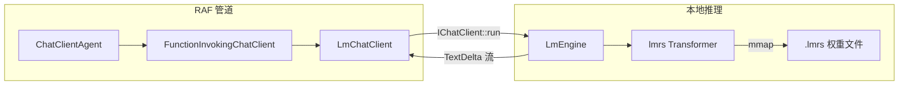
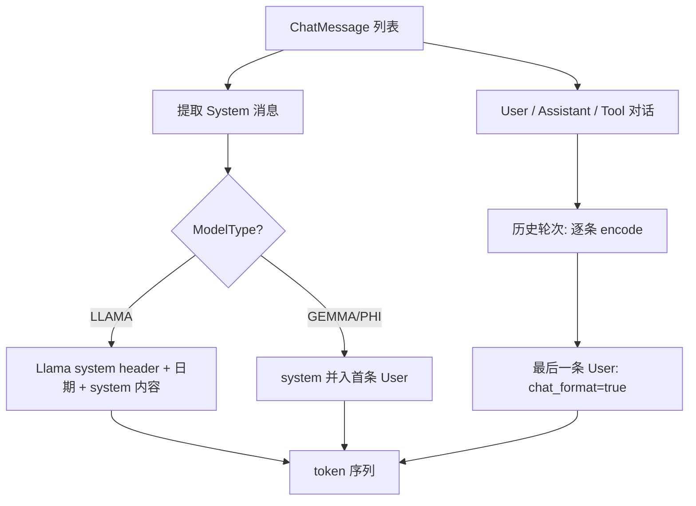

# 9.5 本地模型推理（lm.rs）

## 概述

除云端 API（OpenAI、DeepSeek 等）外，RAF 通过独立 crate **`rust-agent-lm`** 支持在**本机 CPU** 上运行语言模型。底层基于开源项目 [lm.rs](https://github.com/samuel-vitorino/lm.rs)——纯 Rust 实现、无 ML 框架依赖、通过 mmap 加载量化权重。



与 HTTP 提供商的关键差异：

| 维度 | 云端 API (`rust-agent-client`) | 本地推理 (`rust-agent-lm`) |
|------|-------------------------------|---------------------------|
| 认证 | API Key | 无需认证 |
| 传输 | HTTP + SSE | 进程内 token 循环 |
| 延迟 | 网络 RTT + 推理 | 仅推理（CPU） |
| 工具调用 | 原生支持 | **暂不支持** |
| 上下文 | 依模型（32K–256K） | 有效上限 **8192 token** |
| 部署 | 需联网 | 完全离线 |

---

## 支持的模型

lm.rs 当前支持以下模型族（需 **LMRS 格式**权重）：

| 模型族 | 代表型号 | `--type` 转换参数 |
|--------|----------|-------------------|
| **Gemma 2** | 2B IT、9B IT | `GEMMA` |
| **Llama 3.2** | 1B IT、3B IT | `LLAMA` |
| **Phi 3.5** | Mini IT、Vision IT（文本） | `PHI` |

> Vision 多模态推理在 lm.rs 中已实现，但 `rust-agent-lm` **尚未接入**图像输入。

### 推荐入门组合

| 用途 | 模型 | 理由 |
|------|------|------|
| 最快体验 | Llama 3.2 1B IT **Q8_0** | ~1.3 GB，16 核 CPU ~50 tok/s |
| 质量与速度平衡 | Gemma 2 2B IT Q8_0 | ~2.7 GB，~24 tok/s |
| 更强能力 | Llama 3.2 3B IT Q8_0 | ~3.3 GB，~19 tok/s |

完整列表与下载链接：[Hugging Face lmrs 合集](https://huggingface.co/collections/samuel-vitorino/lmrs-66c7da8a50ce52b61bee70b7)。

---

## 准备模型文件

本地推理需要**两个文件**，且必须来自同一原始模型：

1. **`.lmrs`** — 量化后的模型权重
2. **`tokenizer.bin`** — lm.rs 专有 tokenizer

### 方式一：直接下载（推荐）

```text
# 示例目录结构
~/models/llama-3.2-1b/
├── llama-3.2-1b-it-q8_0.lmrs
└── tokenizer.bin
```

步骤：

1. 访问 [lmrs Hugging Face 合集](https://huggingface.co/collections/samuel-vitorino/lmrs-66c7da8a50ce52b61bee70b7)
2. 进入目标模型页面（如 `Llama-3.2-1B-Instruct-Q8_0-lmrs`）
3. 下载 `.lmrs` 文件和 `tokenizer.bin`
4. 记录本地绝对路径，供配置使用

### 方式二：从官方权重自行转换

若 Hugging Face 上没有对应 LMRS 包，或需要自定义量化，使用 lm.rs 仓库脚本：

```bash
git clone https://github.com/samuel-vitorino/lm.rs
cd lm.rs
pip install -r requirements.txt
```

#### 转换模型权重

从模型发布页下载 `config.json` 和 `.safetensors` 文件后：

```bash
python export.py \
  --files model-00001-of-00001.safetensors \
  --config config.json \
  --save-path ./output/model.lmrs \
  --type LLAMA
```

常用参数：

| 参数 | 说明 |
|------|------|
| `--type GEMMA\|LLAMA\|PHI` | 模型架构类型（必填） |
| `--quantize` | 启用量化 |
| `--quantize-type Q8_0` | Q8_0（推荐）或 Q4_0 |
| `--vision-config` | 多模态模型需额外 CLIP config |

#### 转换 tokenizer

```bash
python tokenizer.py \
  --model-id meta-llama/Llama-3.2-1B-Instruct \
  --tokenizer-type LLAMA
```

输出默认为当前目录下的 `tokenizer.bin`。

### 文件格式验证

- `.lmrs` 文件头 4 字节为 ASCII `lmrs`（`0x6c 0x6d 0x72 0x73`）
- 首次加载时 lm.rs 会向 stdout 打印 `LMRS version` 和 `Model type`（正常现象）
- 权重与 tokenizer **不可混用**不同模型的文件

### 量化格式选择

| 格式 | 体积 | 质量 | 建议 |
|------|------|------|------|
| **Q8_0** | 约为 fp16 的 1/4 | 接近原始 | **首选** |
| Q4_0 | 更小 | 仍在改进 | 资源极度受限时 |
| 无量化 | 最大 | 最好 | 仅实验，RAF 文档不推荐 |

---

## 编译与性能

lm.rs 大量使用 SIMD（`wide` crate）和 rayon 并行，**强烈建议**针对本机 CPU 编译：

```bash
# Linux / macOS
RUSTFLAGS="-C target-cpu=native" cargo build --release -p rust-agent-lm

# Windows PowerShell
$env:RUSTFLAGS="-C target-cpu=native"
cargo build --release -p rust-agent-lm
```

参考性能（16 核 AMD Epyc，来自 lm.rs 官方）：

| 模型 | 速度 |
|------|------|
| Llama 3.2 1B IT Q8_0 | ~50 tok/s |
| Llama 3.2 3B IT Q8_0 | ~19 tok/s |
| Gemma 2 2B IT Q8_0 | ~24 tok/s |
| Gemma 2 9B IT Q8_0 | ~8 tok/s |
| Phi 3.5 Mini IT Q8_0 | ~18 tok/s |

---

## 编程式使用

### 添加依赖

```toml
[dependencies]
rust-agent-core = { path = "crates/core" }
rust-agent-lm = { path = "crates/lm" }
rust-agent-framework = { path = "crates/framework" }  # 若需完整 Agent
tokio = { version = "1", features = ["full"] }
futures-util = "0.3"
```

### 最小示例

```rust
use futures_util::StreamExt;
use rust_agent_core::{
    collect_agent_response, ChatClientRunOptions, ChatMessage, IChatClient,
};
use rust_agent_lm::{LmChatClient, LmChatClientOptions};

#[tokio::main]
async fn main() -> rust_agent_core::Result<()> {
    let client = LmChatClient::new(
        LmChatClientOptions::new(
            "/path/to/model.lmrs",
            "/path/to/tokenizer.bin",
            "llama-3.2-1b-it",
        )
        .with_temperature(0.7)
        .with_max_tokens(256),
    )?;

    let messages = vec![
        ChatMessage::system("你是一个简洁的助手。"),
        ChatMessage::user("Rust 的所有权机制是什么？"),
    ];

    let stream = client.run(&messages, ChatClientRunOptions::default()).await?;
    let response = collect_agent_response(stream).await?;

    println!("回复: {}", response.text);
    if let Some(usage) = response.usage {
        println!(
            "tokens: prompt={}, completion={}",
            usage.prompt_tokens, usage.completion_tokens
        );
    }
    Ok(())
}
```

### 接入 ChatClient 管道

```rust
use std::sync::Arc;
use rust_agent_core::ChatClientBuilder;
use rust_agent_lm::{LmChatClient, LmChatClientOptions};

let leaf = Arc::new(LmChatClient::new(options)?);

let client = ChatClientBuilder::new()
    .leaf(leaf)
    // 可叠加装饰器；注意本地模型不支持工具调用循环
    .build()?;
```

### 配置项参考

[`LmChatClientOptions`](../../crates/lm/src/options.rs)：

| 字段 | 默认 | 说明 |
|------|------|------|
| `model_path` | — | `.lmrs` 权重路径 |
| `tokenizer_path` | — | `tokenizer.bin` 路径 |
| `model_id` | — | 逻辑名称（日志/元数据） |
| `temperature` | `0.7` | `0.0` = greedy 采样 |
| `top_p` | `0.9` | Nucleus sampling |
| `max_tokens` | `512` | 最大生成 token |
| `seed` | 随机 | 固定种子可复现 |

单次调用可通过 [`ChatClientRunOptions`](../../crates/core/src/chat_client.rs) 覆盖 `temperature`、`top_p`、`max_tokens`。`cancelled` 标志可在生成循环中被检测并提前结束。

---

## 声明式配置

### 启用 feature

`rust-agent-decl` 对本地模型的支持为**可选 feature**：

```toml
[dependencies]
rust-agent-decl = { path = "crates/decl", features = ["lm"] }
```

未启用 `lm` feature 时，`provider: lm` 会返回明确错误提示。

### YAML 示例

```yaml
kind: prompt
name: offline-helper
description: 完全离线的本地助手
instructions: |
  你是一个有帮助的助手。回答简洁准确。
model:
  id: llama-3.2-1b-it
  provider: lm              # 别名: local
  connection:
    kind: anonymous
    endpoint: /home/user/models/llama-3.2-1b-it-q8_0.lmrs
  options:
    kind: chat
    temperature: 0.7
    max_output_tokens: 256
    top_p: 0.9
    seed: 42
    tokenizer_path: /home/user/models/tokenizer.bin
```

### 字段映射

| 声明式字段 | 映射到 |
|-----------|--------|
| `connection.endpoint` | `LmChatClientOptions.model_path` |
| `options.tokenizer_path` | `LmChatClientOptions.tokenizer_path` |
| `options.temperature` | `temperature` |
| `options.max_output_tokens` | `max_tokens` |
| `options.top_p` | `top_p` |
| `options.seed` | `seed` |
| `model.id` | `model_id` |

`connection` **不需要** `api_key`。`provider` 可写 `lm` 或 `local`。

---

## 消息与 Chat Template

`rust-agent-lm` 将 RAF 的 [`ChatMessage`](../../crates/core/src/message.rs) 历史转换为 lm.rs token 序列（[`prompt.rs`](../../crates/lm/src/prompt.rs)）：



各模型族的 chat template（由 lm.rs tokenizer 实现）：

| 模型族 | System 处理 | User 消息包装 |
|--------|------------|---------------|
| **Llama 3.2** | 独立 system block + 当前日期 | `[128006, 882, ...]` 用户模板 |
| **Gemma 2** | 并入首条 user 前缀 | `bos, 106, 1645, 108` + 文本 |
| **Phi 3.5** | 并入首条 user 前缀 | `bos, 32010, 29871, 13` + 文本 |

**Tool 消息**被格式化为纯文本：`Tool result ({id}): {content}`，不参与原生 function calling。

---

## 推理流程

每次 `IChatClient::run()` 调用：

1. **消息 → token**：`build_prompt_tokens()` 生成 prompt token 序列
2. **长度检查**：超过 8192 token 则返回错误
3. **spawn_blocking**：在阻塞线程池执行 CPU 推理
4. **Prefill**：逐 token 前向传播，在最后 prompt token 处采样首个输出 token
5. **Decode 循环**：逐 token 生成，发送 `TextDelta`；遇 EOS 或 `max_tokens` 结束
6. **收尾**：发送 `Usage` 和 `Finish` 事件

```rust
// 流式事件顺序（简化）
AgentResponseUpdate::ResponseMetadata { model: Some("llama-3.2-1b-it"), .. }
AgentResponseUpdate::TextDelta { delta: "Rust" }
AgentResponseUpdate::TextDelta { delta: " 是" }
// ...
AgentResponseUpdate::Usage { usage: Usage { prompt_tokens, completion_tokens, .. } }
AgentResponseUpdate::Finish { finish_reason: Stop, usage: Some(..) }
```

停止条件：

- 遇到 tokenizer `eos` token
- Gemma 额外停止 token `107`
- 达到 `max_tokens` → `FinishReason::Length`
- 用户取消（`cancelled` 标志）→ `FinishReason::Other("cancelled")`

---

## 与 Agent 管道集成注意事项

### 工具调用

本地模型**不支持** OpenAI 风格的 function calling。若 Agent 配置了工具：

- `FunctionInvokingChatClient` 仍会将 tool schema 注入 `ChatClientRunOptions.tools`
- `LmChatClient` 会**忽略** tools 并记录 warn 日志
- 不适合需要多轮工具调用的 Agent；适合纯文本对话或流程调试

### 上下文压缩

`ModelMetadata` 默认按 `model_id` 推断上下文窗口。本地模型有效上限为 **8192 token**，建议在 Agent 配置中启用压缩策略，或控制 `instructions` 与历史长度。

### 每次 run 重建 KV Cache

与云端 API（无状态 HTTP）不同，lm.rs 推理有 KV cache，但 RAF 实现选择**每次 `run()` 完整重放历史**，保证多轮对话正确性。长历史会导致 prefill 变慢——这是当前设计的已知权衡。

---

## 故障排查

| 现象 | 可能原因 | 处理 |
|------|----------|------|
| `Model not in lm.rs format` | 文件不是 LMRS 格式 | 重新下载或转换；勿直接使用 `.gguf` / `.safetensors` |
| `Tokenizer file not found` | 路径错误 | 检查 `tokenizer_path`；使用绝对路径 |
| `prompt length N exceeds model seq_len 8192` | 上下文过长 | 减少历史、缩短 system prompt、启用压缩 |
| 输出乱码 / 重复 | tokenizer 与权重不匹配 | 确保两者来自同一模型导出 |
| 速度极慢 | debug 构建或未 native 编译 | `RUSTFLAGS="-C target-cpu=native" cargo build --release` |
| 首次加载打印 LMRS version | lm.rs 正常行为 | 可忽略；不影响 RAF 功能 |
| `lm feature required` | decl 未启用 feature | `features = ["lm"]` |

---

## Crate 结构

```
crates/lm/
├── Cargo.toml
├── README.md
└── src/
    ├── lib.rs           # 公共导出
    ├── options.rs       # LmChatClientOptions
    ├── engine.rs        # LmEngine：mmap + 生成循环
    ├── prompt.rs        # ChatMessage → tokens
    └── chat_client.rs   # LmChatClient: IChatClient
```

依赖关系：`rust-agent-lm` → `rust-agent-core` + `lmrs`（git）+ `memmap2`。

---

## 归纳

| 步骤 | 动作 |
|------|------|
| 1 | 从 HF 下载或自行转换 `.lmrs` + `tokenizer.bin` |
| 2 | `RUSTFLAGS="-C target-cpu=native"` release 编译 |
| 3 | 代码：`LmChatClient::new(LmChatClientOptions::new(...))` |
| 4 | 或声明式：`provider: lm` + `endpoint: 模型路径` + `features = ["lm"]` |
| 5 | 接入 `ChatClientBuilder` 管道，作为叶子 `IChatClient` |

本地推理适合**离线开发、隐私场景和流程验证**；生产环境或强工具能力仍建议使用云端 API。参见 [9.3 LLM 提供商](llm-providers.md) 了解 HTTP 提供商接入方式。
