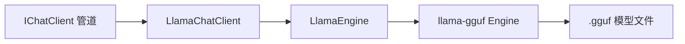

# 9.5 本地模型推理（GGUF / rust-agent-llama）

除云端 API 外，RAF 通过 **`rust-agent-llama`** 在本机加载 **GGUF** 格式模型进行推理。底层基于 [llama-gguf](https://crates.io/crates/llama-gguf)（Rust 版 llama.cpp 推理引擎）。

## 架构



| 维度 | 云端 API (`rust-agent-client`) | 本地推理 (`rust-agent-llama`) |
|------|-------------------------------|------------------------------|
| 认证 | API Key | 无 |
| 模型格式 | — | GGUF（Q4/Q5/Q8/K-quants 等） |
| 网络 | 需要 | 不需要 |
| Tool calling | 支持 | 暂不支持（忽略并 warn） |

## 获取模型

从 [Hugging Face](https://huggingface.co/models?library=gguf) 等源下载 `.gguf` 量化模型即可，tokenizer 通常内嵌在 GGUF 元数据中。

示例：

```
models/
└── llama-3.2-1b-instruct-q4_k_m.gguf
```

## 代码用法

```toml
[dependencies]
rust-agent-llama = { path = "crates/llama" }
```

```rust
use rust_agent_llama::{LlamaChatClient, LlamaChatClientOptions};

let client = LlamaChatClient::new(LlamaChatClientOptions::new(
    "/path/to/model.gguf",
    "llama-3.2-1b-it",
))?;
```

作为 `ChatClientBuilder` 叶子节点：

```rust
use std::sync::Arc;
use rust_agent_llama::{LlamaChatClient, LlamaChatClientOptions};

let leaf = Arc::new(LlamaChatClient::new(options)?);
```

## 配置项

[`LlamaChatClientOptions`](../../crates/llama/src/options.rs)：

| 字段 | 说明 |
|------|------|
| `model_path` | `.gguf` 文件路径 |
| `tokenizer_path` | 可选外部 tokenizer（一般省略） |
| `temperature` / `top_p` / `max_tokens` / `seed` | 采样与生成参数 |
| `use_gpu` | 是否尝试 GPU 后端 |
| `max_context_len` | 上下文长度覆盖 |

## 声明式配置

```toml
[dependencies]
rust-agent-decl = { path = "crates/decl", features = ["llama"] }
```

```yaml
model:
  id: llama-3.2-1b-it
  provider: llama   # 亦支持 gguf / lm / local
  connection:
    endpoint: /path/to/model.gguf
  options:
    temperature: 0.7
    max_output_tokens: 512
```

| 声明字段 | 映射 |
|----------|------|
| `connection.endpoint` | `LlamaChatClientOptions.model_path` |
| `options.tokenizer_path` | 可选 `tokenizer_path` |
| `options.extra.use_gpu` | `use_gpu` |

未启用 `llama` feature 时，本地 provider 会返回明确错误。

## Prompt 格式化

[`prompt.rs`](../../crates/llama/src/prompt.rs) 将 `ChatMessage` 历史转为 llama-gguf 可识别的 chat template 字符串（自动检测 Llama2 / ChatML 等）。

## 构建

```bash
cargo build --release -p rust-agent-llama
```

`llama-gguf` 默认仅启用 `cpu` feature，避免 ONNX/protobuf 编译依赖。需要 GPU 时在依赖中启用对应 feature（`cuda` / `metal` / `vulkan` 等）。

## Crate 结构

```
crates/llama/
├── Cargo.toml
└── src/
    ├── lib.rs
    ├── options.rs       # LlamaChatClientOptions
    ├── engine.rs        # LlamaEngine：加载与流式生成
    ├── prompt.rs        # ChatMessage → prompt
    └── chat_client.rs   # LlamaChatClient: IChatClient
```

依赖：`rust-agent-llama` → `rust-agent-core` + `llama-gguf`。

## 快速检查清单

| 步骤 | 操作 |
|------|------|
| 1 | 准备 `.gguf` 模型文件 |
| 2 | `cargo build -p rust-agent-llama` |
| 3 | `LlamaChatClient::new(LlamaChatClientOptions::new(...))` |
| 4 | 或声明式：`provider: llama` + `features = ["llama"]` |
