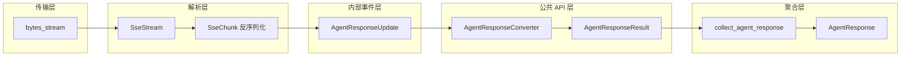

# 9.4 流式处理与中间件

## 概述

RAF 的流式处理链路将 LLM 的 SSE 字节流逐层转换为结构化的 `AgentResponseResult`，为下游消费者（前端 UI、编排引擎、日志系统）提供丰富的事件驱动 API。本章追踪从 HTTP 字节到最终 `AgentResponseResult` 的完整转换链路，并详解中间各层的数据结构和处理逻辑。

## 流式处理全链路

```
LLM API (HTTP/SSE)
    │
    ▼
SseStream (字节 → SseChunk → AgentResponseUpdate)
    │
    ▼
FunctionInvokingChatClient (消费 AgentResponseUpdate 流，工具循环)
    │
    ▼
AgentResponseConverter (AgentResponseUpdate → AgentResponseResult)
    │
    ▼
ChatClientAgent (输出 AgentResponseResult 流)
    │
    ▼
collect_agent_response() (聚合流 → AgentResponse)
```



## 第一层：SseStream — SSE 字节 → AgentResponseUpdate

`SseStream` 是流式处理的最底层。它实现了 `futures_core::Stream` trait，将 `reqwest` 的 HTTP 字节流转换为 `AgentResponseUpdate` 事件：

```rust
// crates/client/src/transport.rs

impl<S> Stream for SseStream<S>
where
    S: Stream<Item = reqwest::Result<Bytes>> + Send + Unpin + 'static,
{
    type Item = Result<AgentResponseUpdate, AgentError>;

    fn poll_next(mut self: Pin<&mut Self>, cx: &mut Context<'_>) -> Poll<Option<Self::Item>> {
        // 1. 优先从 pending 队列返回事件（一个 chunk 可能产生多个事件）
        if let Some(update) = self.pending.next() {
            return Poll::Ready(Some(Ok(update)));
        }

        loop {
            // 2. 从缓冲中提取完整行（按 \n 分割）
            if let Some(pos) = self.buffer.iter().position(|&b| b == b'\n') {
                let line = /* drain buffer */;
                let trimmed = line.trim();

                // 3. 解析 "data: " 行
                if let Some(data) = trimmed.strip_prefix("data: ") {
                    if data == "[DONE]" {
                        self.done = true;
                        return Poll::Ready(None);
                    }

                    // 4. 反序列化 JSON → SseChunk → Vec<AgentResponseUpdate>
                    match serde_json::from_str::<SseChunk>(data) {
                        Ok(chunk) => {
                            let mut events = map_chunk(chunk, self.usage_format);
                            // 返回第一个事件，其余排队
                            let first = events.remove(0);
                            self.pending = events.into_iter();
                            return Poll::Ready(Some(Ok(first)));
                        }
                        Err(e) => return Poll::Ready(Some(Err(/* parse error */))),
                    }
                }
                continue;
            }

            // 5. 需要更多数据 → 从 inner stream 读取
            match Pin::new(&mut self.inner).poll_next(cx) {
                Poll::Ready(Some(Ok(bytes))) => {
                    self.buffer.extend_from_slice(&bytes);
                    continue;
                }
                // ...
            }
        }
    }
}
```

### SseChunk 结构

```rust
#[derive(Debug, Deserialize)]
struct SseChunk {
    id: Option<String>,
    object: Option<String>,
    model: Option<String>,
    choices: Vec<SseChoice>,
    usage: Option<serde_json::Value>,
}

#[derive(Debug, Deserialize)]
struct SseChoice {
    finish_reason: Option<String>,
    delta: SseDelta,
}

#[derive(Debug, Deserialize, Default)]
struct SseDelta {
    content: Option<String>,            // 文本增量
    reasoning_content: Option<String>,  // 推理内容增量（DeepSeek）
    tool_calls: Option<Vec<SseToolCall>>, // 工具调用增量
}
```

### map_chunk() — SseChunk → Vec<AgentResponseUpdate>

```rust
fn map_chunk(sse: SseChunk, usage_format: UsageFormat) -> Vec<AgentResponseUpdate> {
    let mut events = Vec::new();

    // 响应元数据（首个 chunk 通常携带 id/model）
    if sse.id.is_some() || sse.model.is_some() {
        events.push(AgentResponseUpdate::ResponseMetadata {
            id: sse.id.clone(),
            model: sse.model.clone(),
        });
    }

    for choice in &sse.choices {
        // 文本增量
        if let Some(ref content) = choice.delta.content {
            if !content.is_empty() {
                events.push(AgentResponseUpdate::TextDelta { delta: content.clone() });
            }
        }

        // 推理增量
        if let Some(ref reasoning) = choice.delta.reasoning_content {
            if !reasoning.is_empty() {
                events.push(AgentResponseUpdate::ReasoningDelta { delta: reasoning.clone() });
            }
        }

        // 工具调用增量
        if let Some(ref tool_calls) = choice.delta.tool_calls {
            for tc in tool_calls {
                events.push(AgentResponseUpdate::ToolCallDelta {
                    index: tc.index,
                    id: tc.id.clone(),
                    name: tc.function.as_ref().and_then(|f| f.name.clone()),
                    arguments_delta: tc.function.as_ref()
                        .and_then(|f| f.arguments.clone())
                        .unwrap_or_default(),
                });
            }
        }

        // 完成原因 + 用量
        if let Some(ref reason) = choice.finish_reason {
            let finish_reason = match reason.as_str() {
                "stop" => FinishReason::Stop,
                "length" => FinishReason::Length,
                "tool_calls" => FinishReason::ToolCalls,
                "content_filter" => FinishReason::ContentFilter,
                other => FinishReason::Other(other.to_string()),
            };
            let usage = sse.usage.as_ref().and_then(|v| usage_format.parse(v));
            events.push(AgentResponseUpdate::Finish { finish_reason, usage });
        }
    }

    events
}
```

## 第二层：AgentResponseUpdate 枚举

`AgentResponseUpdate` 是内部事件类型。它是 SSE 解析的直接产物，由装饰器消费：

```rust
// crates/core/src/message.rs

#[derive(Debug, Clone)]
pub enum AgentResponseUpdate {
    TextDelta { delta: String },
    ReasoningDelta { delta: String },
    /// 旧版工具调用增量 — 分解为 ToolCallStart/ToolCallArgs/ToolCallEnd
    ToolCallDelta { index: usize, id: Option<String>, name: Option<String>, arguments_delta: String },
    /// 新工具调用开始
    ToolCallStart { id: String, name: String },
    /// 工具调用参数增量
    ToolCallArgs { id: String, args_delta: String },
    /// 工具调用参数完毕
    ToolCallEnd { id: String },
    /// 工具执行结果
    ToolCalled { id: String, result: Option<String>, error: Option<String> },
    /// 工具调用需要审批
    ToolApprovalRequest { call_id: String, name: String, arguments: serde_json::Value, description: String },
    Usage { usage: Usage },
    Finish { finish_reason: FinishReason, usage: Option<Usage> },
    Error { message: String },
    ResponseMetadata { id: Option<String>, model: Option<String> },
}
```

## 第三层：AgentResponseConverter — AgentResponseUpdate → AgentResponseResult

`AgentResponseConverter` 将内部的 `AgentResponseUpdate` 转换为公共 API 的 `AgentResponseResult`。它同时处理旧版 `ToolCallDelta` 到新版生命周期事件（`ToolCallStart`/`ToolCallArgs`/`ToolCallEnd`）的分解：

```rust
// crates/framework/src/converter.rs

pub struct AgentResponseConverter {
    agent_id: AgentId,
    model_id: Option<String>,
    executor_id: String,
    properties: HashMap<String, serde_json::Value>,
    // 内部状态（合并后的单一映射）
    tool_states: HashMap<String, ToolCallState>,   // call_id → 累加器 + 结束标记 + 解析器
    index_to_call_id: HashMap<usize, String>,       // 旧版 ToolCallDelta 索引映射
    response_id: Option<String>,
    response_model: Option<String>,
}

/// 每个工具调用的聚合状态。
#[derive(Default)]
struct ToolCallState {
    acc: ToolCallAccumulator,       // 名称 + 参数累积 + start 去重
    ended: bool,                    // 防止重复 ToolCallEnd
    parser: StreamingArgsParser,    // 实时 JSON 解析
}

impl AgentResponseConverter {
    /// 消费单个 AgentResponseUpdate，生成 Content 和 Event 向量
    pub fn consume(&mut self, update: AgentResponseUpdate) -> ConvertOutput;

    /// 生成带有 finish_reason 的最终 AgentResponseResult
    pub fn finalize(&mut self, finish_reason: Option<FinishReason>, usage: Option<Usage>) -> AgentResponseResult;
}
```

### consume() 映射关系

| AgentResponseUpdate | Content 变体（可多个） |
|---------------------|----------------------|
| `TextDelta` | `Content::Text` |
| `ReasoningDelta` | `Content::Reasoning` |
| `ToolCallStart` | `Content::ToolCallStart` |
| `ToolCallArgs` | `Content::ToolCallArgs` + 可选的 `ToolCallArgsParsed` / `ToolCallArgsProgress` |
| `ToolCallEnd` | `Content::ToolCallEnd` |
| `ToolCallDelta` | 分解为 `ToolCallStart` + `ToolCallArgs`（+ 解析进度） |
| `ToolCalled` | `Content::ToolCalled` |
| `ToolApprovalRequest` | `Content::Text`（格式化为 `[Approval required: XXX]`） |
| `Usage` | `Content::Usage` |
| `Finish` | 无直接 Content（finish_reason 在 finalize 中处理） |
| `Error` | `Content::Error` |
| `ResponseMetadata` | 不产生 Content（更新内部 response_id/model） |

### 工具调用生命周期转换

```
LLM SSE 流（旧版格式）:
  ToolCallDelta { index: 0, name: "read_file", arguments_delta: "{\"pa" }
  ToolCallDelta { index: 0, arguments_delta: "th\": \"/etc/hosts\"}" }

AgentResponseConverter 分解:
  Content::ToolCallStart { call_id: "__tc_0", name: "read_file" }
  Content::ToolCallArgs  { call_id: "__tc_0", args_delta: "{\"pa" }
  Content::ToolCallArgs  { call_id: "__tc_0", args_delta: "th\": \"/etc/hosts\"}" }

finalize() 中:
  Content::ToolCallEnd   { call_id: "__tc_0" }          // 自动补充
  Content::ToolCalling   { call_id: "__tc_0", ... }     // 完整汇总
```

## 第四层：AgentResponseResult — 公共 API

```rust
// crates/core/src/message.rs

#[derive(Debug, Clone, Serialize, Deserialize)]
pub struct AgentResponseResult {
    pub id: Option<String>,
    pub model: Option<String>,
    pub finish_reason: Option<FinishReason>,
    pub contents: Vec<Content>,
    pub events: Vec<Event>,
}
```

### Content 枚举 — 12 个变体

```rust
// crates/core/src/message.rs

pub enum Content {
    Text(TextContent),                         // 文本增量
    Reasoning(ReasoningContent),               // 推理文本增量
    Uri(UriContent),                          // URI 资源
    ToolCallStart(ToolCallStartContent),       // ① 工具调用开始
    ToolCallArgs(ToolCallArgsContent),         // ② 参数增量
    ToolCallArgsParsed(ToolCallArgsParsedContent),   // ②b 参数已解析
    ToolCallArgsProgress(ToolCallArgsProgressContent), // ②c 参数接收中
    ToolCallEnd(ToolCallEndContent),           // ③ 参数完毕
    ToolCalling(ToolCallingContent),           // ④ 完整调用（可直接执行）
    ToolCalled(ToolCalledContent),             // ⑤ 执行结果
    Usage(UsageContent),                      // 用量统计
    Error(ErrorContent),                      // 错误
}
```

工具调用生命周期（5 阶段）：

```
ToolCallStart → ToolCallArgs(×N) → ToolCallEnd → ToolCalling → ToolCalled
    ①开始         ②参数流式到达       ③参数完毕     ④完整调用       ⑤执行结果
```

- ①~③ 是**流式阶段**：SSE 数据到达时实时发出，UI 可据此展示进度
- ④ 是**汇总阶段**：流结束时一次性发出，携带完整解析的参数结构体
- ⑤ 是**执行阶段**：工具执行完成后发出，携带结果或错误

### FinishReason 枚举

```rust
// crates/core/src/types.rs

pub enum FinishReason {
    Stop,              // 正常结束
    Length,            // 达到长度限制
    ToolCalls,         // 包含工具调用（内部使用，对消费者过滤）
    ContentFilter,     // 被内容过滤器拦截
    AwaitingApproval,  // 审批暂停
    MaxRounds,         // 达到最大轮次
    Other(String),     // 其他
}
```

## 第五层：collect_agent_response() — 流聚合

`collect_agent_response()` 将完整的 `AgentResponseResult` 流聚合为单个 `AgentResponse`：

```rust
// crates/core/src/stream.rs

pub async fn collect_agent_response(
    mut stream: BoxStream<'static, Result<AgentResponseResult>>,
) -> Result<AgentResponse> {
    let mut text = String::new();
    let mut reasoning_text = String::new();
    let mut tool_calls: Vec<ToolCall> = Vec::new();
    let mut finish_reason = None;
    let mut usage = None;
    // ...

    while let Some(result) = stream.next().await {
        let chunk = result?;

        for content in chunk.contents {
            match content {
                Content::Text(c) => text.push_str(&c.delta),
                Content::Reasoning(c) => reasoning_text.push_str(&c.delta),
                Content::ToolCalling(c) => {
                    tool_calls.push(ToolCall {
                        id: c.call_id,
                        name: c.name,
                        arguments: c.arguments,
                    });
                }
                Content::Usage(c) => usage = Some(c.usage),
                _ => {}
            }
        }

        if chunk.finish_reason.is_some() {
            finish_reason = chunk.finish_reason;
        }
    }

    Ok(AgentResponse { text, tool_calls, finish_reason, usage, ... })
}
```

## 在 ChatClientAgent 中的集成

```rust
// crates/framework/src/chat_client_agent.rs

// Phase 2: LLM 调用
let stream = self.chat_client.run(&full_messages, client_opts).await?;
let converter = AgentResponseConverter::new(agent_id, executor_id, &run_options);

let converted = futures_util::stream::unfold(
    (stream, converter, None::<FinishReason>, None::<Usage>, false),
    |(mut stream, mut converter, mut pf, mut pu, done)| async move {
        if done { return None; }
        loop {
            match stream.next().await {
                Some(Ok(update)) => {
                    // 捕获 FinishReason 和 Usage
                    if let AgentResponseUpdate::Finish { ref finish_reason, ref usage } = update {
                        pf = Some(finish_reason.clone());
                        if usage.is_some() { pu = usage.clone(); }
                    }

                    // 转换并输出
                    let output = converter.consume(update);
                    if !output.contents.is_empty() || !output.events.is_empty() {
                        return Some((Ok(AgentResponseResult {
                            // ...
                            contents: output.contents,
                            events: output.events,
                        }), (stream, converter, pf, pu, false)));
                    }
                }
                Some(Err(e)) => return Some((Err(e), ...)),
                None => {
                    // 流结束：生成最终 AgentResponseResult
                    let fr = converter.finalize(pf.clone(), pu.clone());
                    return Some((Ok(fr), (stream, converter, pf, pu, true)));
                }
            }
        }
    },
);
```

## 完整数据流示例

以下展示 Agent 读取文件时的完整数据流：

```
HTTP SSE:
  data: {"id":"resp_1","model":"deepseek-chat","choices":[{"delta":{"content":"我来"}}]}
  data: {"choices":[{"delta":{"content":"读取文件"}}]}
  data: {"choices":[{"finish_reason":"stop"}],"usage":{...}}

SseStream → AgentResponseUpdate:
  ResponseMetadata { id: "resp_1", model: "deepseek-chat" }
  TextDelta { delta: "我来" }
  TextDelta { delta: "读取文件" }
  Finish { finish_reason: Stop, usage: {...} }

AgentResponseConverter → AgentResponseResult:
  { contents: [
      Content::Text { delta: "我来" },
      Content::Text { delta: "读取文件" },
      Content::Usage { ... },
    ],
    finish_reason: Some(Stop),
  }

collect_agent_response → AgentResponse:
  { text: "我来读取文件", tool_calls: [], finish_reason: Some(Stop), ... }
```

## 归纳

RAF 的流式处理链路通过 5 层转换实现了从原始字节到结构化 API 的完整映射：

| 层 | 输入 → 输出 | 关键类型 |
|----|-----------|---------|
| 1. SSE 传输 | HTTP bytes → AgentResponseUpdate | `SseStream`, `SseChunk` |
| 2. 工具循环 | AgentResponseUpdate 消费/转发 | `FunctionInvokingChatClient` |
| 3. 内容转换 | AgentResponseUpdate → Content/Event | `AgentResponseConverter` |
| 4. 结果输出 | Content/Event → AgentResponseResult | `AgentResponseResult` |
| 5. 流聚合 | AgentResponseResult 流 → AgentResponse | `collect_agent_response()` |

工具调用的 5 阶段生命周期（`Start → Args → End → Calling → Called`）提供了丰富的进度反馈，使 UI 能够实时展示工具调用状态，同时保持向后兼容的 `ToolCallDelta` 旧版格式支持。
