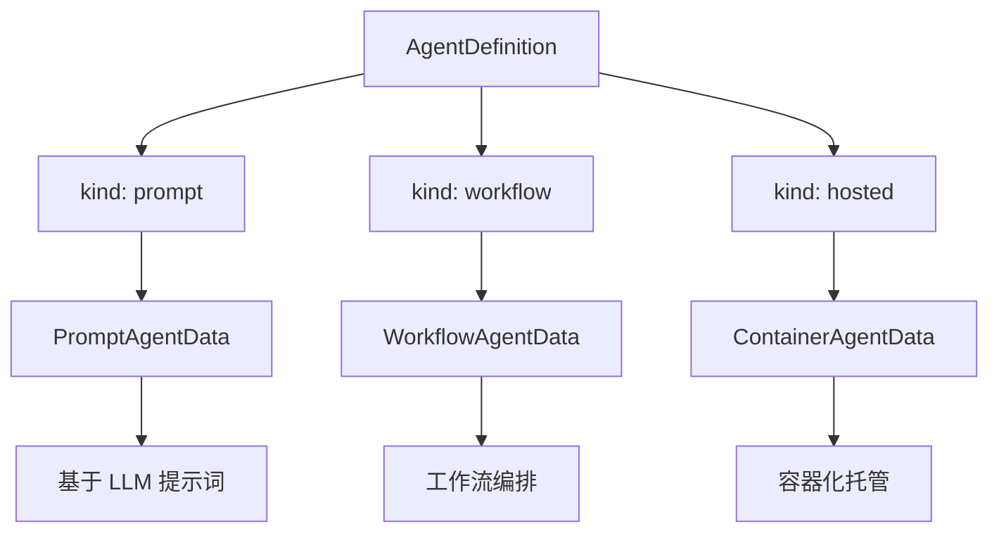

# 10.4 AgentSchema v1.0 规范

RAF 的声明式 Agent 系统遵循 Microsoft Agent Framework (MAF) AgentSchema v1.0 规范，支持完整的 Agent 类型体系、模型配置、工具绑定和模板引擎。

## Agent 类型体系

AgentSchema v1.0 定义了三种 Agent 类型，通过 `kind` 字段区分：



### 类型对比

| 特性 | Prompt | Workflow | Container |
|------|--------|----------|-----------|
| 核心能力 | LLM 推理 + 工具调用 | 图驱动多 Agent 编排 | 外部容器托管 |
| 需要 LLM 模型 | ✅ 必需 | ❌ 可选 | ❌ 不适用 |
| 工具支持 | ✅ 完整 | ✅ 通过节点 | ❌ |
| 子 Agent | ✅ 支持 | 通过图定义 | ❌ |
| 实现状态 | ✅ 已实现 | ✅ 已实现 | ⚠️ 仅解析（需外部托管部署） |

## Prompt Agent 规范

### 结构定义

```rust
pub struct PromptAgentData {
    pub model: Model,                          // 必需：AI 模型配置
    pub tools: Vec<ToolDecl>,                  // 可选：工具声明列表
    pub template: Option<Template>,            // 可选：提示词模板
    pub instructions: String,                  // 可选：系统指令
    pub additional_instructions: Option<String>, // 可选：附加指令
    pub max_tool_rounds: usize,                // 最大工具调用轮数（默认 10）
    pub sub_agents: Vec<AgentDefinition>,      // 可选：子 Agent 声明
    pub contexts: Vec<ContextProviderDecl>,    // 可选：声明式上下文提供器
    pub compression: Option<CompressionDecl>,  // 可选：压缩策略（框架扩展）
    pub token_counter: Option<TokenCounterDecl>, // 可选：Token 计数器
    pub sandbox: HashMap<String, Value>,       // 可选：代码沙箱默认配置
}
```

### contexts 字段实现状态

`contexts` 中的 `kind` 值映射到 `IContextProvider::kind()` 返回值。各 provider 在声明式路径下的实现状态：

| kind | 运行时 Provider | 声明式路径实现状态 |
|------|----------------|:---:|
| `memory` | `SkillMemoryContextProvider` | ✅ 已实现（仅 `name: "skill-memory"`） |
| `skills` | `AgentSkillsProvider` | ✅ 已实现（通过 `scan()` 扫描目录） |
| `workspace` | `WorkspaceContextProvider` | ✅ 已实现（`root` + `policy` 配置） |
| `mcp` | `McpContextProvider` | ⚠️ 需代码注入（需异步连接，通过 `with_context()` 注入） |
| `knowledge` | `rust_agent_rag::RagContextProvider` | ✅ 已实现（需 decl `rag` feature） |
| `wiki` | `rust_agent_wiki::WikiContextProvider` | ✅ 已实现（需 decl `wiki` feature） |

`history`（对话历史管理）由 `AgentBuilder` 内置自动注入 `InMemoryHistoryProvider`，无需在 `contexts` 中声明。

### Model 配置

```rust
pub struct Model {
    pub id: String,                    // 模型 ID（如 "agnes-2.0-flash"）
    pub connection: Connection,        // 连接配置
    pub options: Option<ModelOptions>, // 可选：模型参数
}
```

### Connection 连接定义

支持两种认证模式：

```rust
pub enum AuthenticationMode {
    Key,          // API Key 认证
    EntraId,      // Entra ID 认证
}

pub struct Connection {
    pub kind: ConnectionKind,                 // 连接类型
    pub api_key: Option<String>,              // API Key（支持 $ENV_VAR）
    pub auth_mode: Option<AuthenticationMode>, // 认证模式
    pub base_url: Option<String>,             // 自定义 API 端点
}
```

`api_key` 字段支持 `$ENV_VAR` 语法，运行时从环境变量中读取实际密钥。

### ToolDecl 工具声明

支持 7 种 MAF 标准工具类型：

```rust
pub enum ToolDecl {
    Function { name, description, parameters, bindings },
    WebSearch,
    FileSearch { vector_store_ids, max_results },
    CodeInterpreter,
    Mcp { server_url, tool_name },
    OpenApi { spec_url, operation_id },
    Custom { name, config },
}
```

### Template 模板引擎

```rust
pub struct Template {
    pub format: TemplateFormat,       // "mustache" 或 "plain"
    pub content: Option<String>,      // 模板内容
    pub source_path: Option<String>,  // 模板文件路径
}
```

## Workflow Agent 规范

### 结构定义

```rust
pub struct WorkflowAgentData {
    pub trigger: WorkflowTrigger,       // 触发条件
    pub actions: Vec<ActionDecl>,       // 动作序列
    pub participants: Vec<AgentRef>,    // 参与者
    pub conditions: Vec<ConditionBranch>, // 条件分支
}
```

### ActionDecl 动作声明

```rust
pub enum ActionDecl {
    SendActivity(SendActivityPayload),  // 发送消息
    Question(QuestionPayload),          // 向用户提问
    AgentInput(AgentInput),             // Agent 输入
    AgentOutput(AgentOutput),           // Agent 输出
    ToolOutput(ToolOutput),             // 工具输出
    HttpBody(HttpBody),                 // HTTP 响应体
    MessagePayload(MessagePayload),     // 消息负载
    ExternalLoop(ExternalLoop),         // 外部循环
}
```

## Container Agent 规范

容器 Agent 用于声明托管在外部运行时的 Agent：

```rust
pub struct ContainerAgentData {
    pub protocol_versions: Vec<ProtocolVersionRecord>,  // 协议版本
    pub resources: ContainerResources,                   // 资源需求
    pub code_configuration: Option<CodeConfiguration>,   // 代码配置
}

pub struct ContainerResources {
    pub cpu: Option<String>,      // CPU 需求
    pub memory: Option<String>,   // 内存需求
    pub gpu: Option<String>,      // GPU 需求
}
```

## PropertySchema 属性模式

用于定义输入/输出模式：

```rust
pub struct PropertySchema {
    pub properties: Vec<Property>,
    pub strict: bool,
    pub examples: Vec<HashMap<String, serde_json::Value>>,
}

pub struct Property {
    pub name: String,
    pub kind: PropertyType,     // String | Integer | Float | Boolean | Array | Object
    pub description: String,
    pub required: bool,
    pub default: Option<serde_json::Value>,
    pub enum_values: Vec<serde_json::Value>,
}
```

## 完整 JSON 示例

以下是一个完整的、符合 AgentSchema v1.0 规范的生产级 Agent 配置：

```json
{
    "kind": "prompt",
    "name": "enterprise-coding-assistant",
    "displayName": "企业级编程助手",
    "description": "具备代码生成、审查、测试和部署能力的全栈智能体",
    "metadata": {
        "author": "team-platform",
        "version": "1.2.0",
        "tags": ["coding", "enterprise", "rust"]
    },
    "inputSchema": {
        "strict": false,
        "properties": [
            {
                "name": "task",
                "kind": "string",
                "description": "用户请求的任务描述",
                "required": true
            },
            {
                "name": "language",
                "kind": "string",
                "description": "目标编程语言",
                "required": false,
                "enumValues": ["rust", "python", "typescript", "go"]
            }
        ]
    },
    "outputSchema": {
        "strict": true,
        "properties": [
            {
                "name": "code",
                "kind": "string",
                "description": "生成的代码",
                "required": true
            },
            {
                "name": "explanation",
                "kind": "string",
                "description": "代码说明",
                "required": true
            }
        ]
    },
    "model": {
        "id": "agnes-2.0-flash",
        "connection": {
            "kind": "key",
            "api_key": "$AGNES_API_KEY",
            "auth_mode": "key",
            "endpoint": "https://apihub.agnes-ai.com/v1"
        },
        "options": {
            "temperature": 0.3,
            "maxTokens": 8192,
            "topP": 0.95,
            "frequencyPenalty": 0.1
        }
    },
    "instructions": "你是企业级软件工程师。遵循以下原则：\n1. 代码必须经过充分测试\n2. 遵循 SOLID 原则\n3. 提供详细文档\n4. 优先使用标准库",
    "additionalInstructions": "当前项目使用 Rust 2021 edition。",
    "template": {
        "format": "mustache",
        "content": "## 任务\n{{task}}\n\n## 约束\n- 语言：{{language}}\n- 编码风格：{{code_style}}\n\n请生成代码。"
    },
    "tools": [
        {
            "kind": "function",
            "name": "read_file",
            "description": "读取文件内容",
            "parameters": {
                "properties": [
                    {
                        "name": "path",
                        "kind": "string",
                        "description": "文件路径",
                        "required": true
                    }
                ]
            }
        },
        {
            "kind": "function",
            "name": "write_file",
            "description": "写入文件"
        },
        {
            "kind": "function",
            "name": "run_command",
            "description": "执行系统命令"
        },
        {
            "kind": "web_search"
        }
    ],
    "maxToolRounds": 20,
    "subAgents": [
        {
            "kind": "prompt",
            "name": "code-reviewer",
            "displayName": "代码审查员",
            "description": "专注于代码质量审查",
            "model": {
                "id": "agnes-2.0-flash",
                "connection": {
                    "kind": "key",
                    "api_key": "$AGNES_API_KEY"
                }
            },
            "instructions": "你是资深代码审查员。关注安全漏洞、性能问题和代码异味。",
            "tools": [
                {
                    "kind": "function",
                    "name": "read_file",
                    "description": "读取待审查文件"
                }
            ],
            "maxToolRounds": 5
        },
        {
            "kind": "prompt",
            "name": "test-generator",
            "displayName": "测试生成器",
            "description": "自动生成单元测试和集成测试",
            "model": {
                "id": "agnes-2.0-flash",
                "connection": {
                    "kind": "key",
                    "api_key": "$AGNES_API_KEY"
                }
            },
            "instructions": "你专门生成高质量的测试代码。覆盖边界条件和异常路径。",
            "tools": [
                {
                    "kind": "function",
                    "name": "write_file",
                    "description": "写入测试文件"
                }
            ],
            "maxToolRounds": 10
        }
    ]
}
```

## AgentManifest 部署包

`AgentManifest` 在上述 Agent 定义之上包装了部署元信息：

```json
{
    "name": "coding-suite",
    "displayName": "编程套件",
    "description": "完整的编程辅助智能体套件",
    "metadata": {
        "deploy_target": "production",
        "min_memory_mb": 512
    },
    "template": {
        "kind": "prompt",
        "name": "coding-assistant",
        "model": { "id": "agnes-2.0-flash", "connection": { "kind": "key", "api_key": "$AGNES_API_KEY" } },
        "instructions": "..."
    },
    "parameters": {
        "properties": [
            { "name": "skill_level", "kind": "string", "description": "技能等级", "required": true, "enumValues": ["junior", "senior", "expert"] }
        ]
    },
    "resources": [
        { "name": "primary-model", "kind": "model", "id": "agnes-2.0-flash" },
        { "name": "filesystem-tools", "kind": "tool", "id": "builtin.filesystem" }
    ]
}
```

## 序列化兼容性

RAF 的 AgentSchema 实现保证了与 MAF 的双向兼容：

- **读取**：可以直接解析 MAF 客户端生成的 YAML/JSON 文件
- **写入**：RAF 序列化的配置可以被 MAF 客户端消费
- **字段映射**：`displayName`、`inputSchema`、`outputSchema`、`maxToolRounds` 等与 MAF 保持一致的命名（camelCase 序列化）

## 模板渲染

当配置了 `template` 时，`instructions` 字段会经过模板引擎渲染。支持 Mustache 格式：

```json
{
    "template": {
        "format": "mustache",
        "content": "你是一名{{role}}。\n\n任务：{{task}}\n\n注意事项：\n{{#constraints}}\n- {{.}}\n{{/constraints}}"
    }
}
```

运行时通过 `inputSchema` 提供的参数替换模板变量，生成最终的指令文本。
