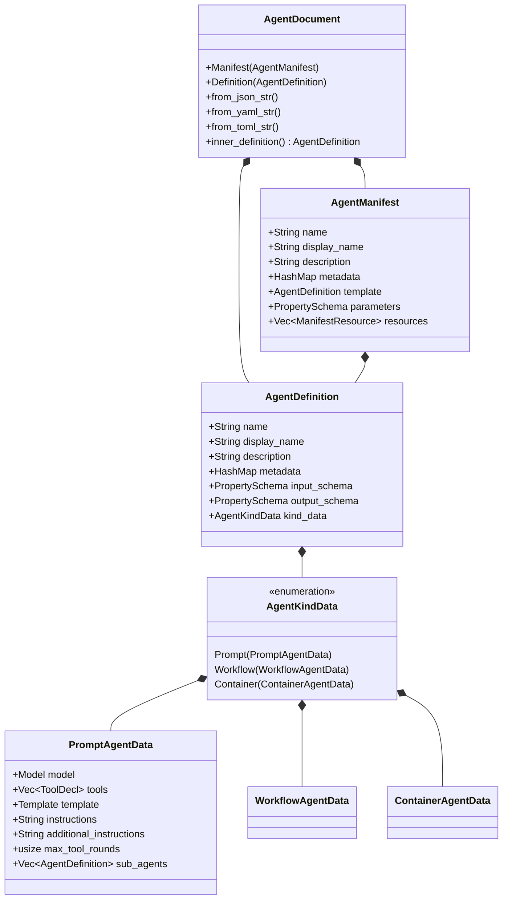
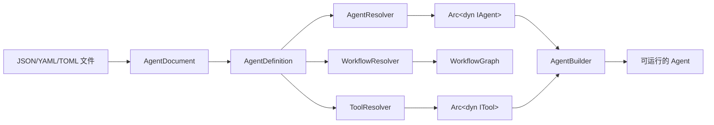

# 10.3 声明式 Agent/Workflow 配置

`rust-agent-decl` crate 提供了基于 JSON、YAML 和 TOML 格式的声明式 Agent 与 Workflow 定义系统，与 Microsoft Agent Framework (MAF) AgentSchema v1.0 完全兼容。

## 核心类型体系



### AgentDocument — 顶层文档类型

`AgentDocument` 是一个 `#[serde(untagged)]` 枚举，可以接受两种形式：

- **Manifest**：完整的部署清单，包含模板和参数
- **Definition**：裸 Agent 定义，无 Manifest 包装

```rust
pub enum AgentDocument {
    Manifest(AgentManifest),
    Definition(AgentDefinition),
}
```

解析时，先检测是否存在 `template` 字段来判断是否为 Manifest，否则回退为 Definition。

### AgentDefinition — Agent 统一定义

`AgentDefinition` 是所有 Agent 类型的统一载体，通过 `kind` 字段区分具体类型：

- `"prompt"` → `PromptAgentData`：基于 LLM 提示词的智能体
- `"workflow"` → `WorkflowAgentData`：工作流编排智能体
- `"hosted"` → `ContainerAgentData`：托管/容器化智能体

### PromptAgentData — 提示词 Agent

这是最常用的 Agent 类型，包含：

- **model**：LLM 模型配置（Model 结构体，包含 id、connection、options）
- **tools**：工具声明列表（ToolDecl，支持 7 种 MAF 工具类型）
- **template**：提示词模板配置（Template 结构体）
- **instructions**：系统指令文本
- **max_tool_rounds**：最大工具调用轮数（默认 10）

## 多格式支持

通过 Cargo feature flags 控制格式支持：

```toml
[dependencies]
rust-agent-decl = { version = "0.1", features = ["json", "yaml", "toml"] }
```

| Feature | 格式 | 依赖 |
|---------|------|------|
| `json` (默认) | JSON | serde_json |
| `yaml` | YAML | serde_yaml |
| `toml` | TOML | toml |
| `powerfx` | PowerFx 表达式 | powerfx |
| `mustache` | Mustache 模板 | mustache |

### 解析示例

**JSON 格式**：

```rust
use rust_agent_decl::AgentDocument;

let doc = AgentDocument::from_json_file("agents/coding-agent.json")?;
let def = doc.inner_definition();
```

**YAML 格式**（需启用 `yaml` feature）：

```rust
let yaml = r#"
kind: prompt
name: coding-agent
model:
  id: deepseek-v4-flash
  connection:
    kind: key
    api_key: $DEEPSEEK_API_KEY
instructions: 你是一个资深软件工程师。
tools:
  - kind: function
    name: read_file
    description: 读取文件内容
"#;

let doc = AgentDocument::from_yaml_str(yaml)?;
```

**TOML 格式**（需启用 `toml` feature）：

```rust
let doc = AgentDocument::from_toml_file("agents/agent.toml")?;
```

## ToolResolver — 工具解析器

`ToolResolver` 负责将声明式工具定义解析为运行时的 `Arc<dyn ITool>` 实例。

### 支持的 7 种 MAF 工具类型

| 工具类型 | 状态 | 说明 |
|---------|------|------|
| `function` | ✅ 已实现 | 内置框架工具（read_file, write_file, run_command 等） |
| `web_search` | ✅ 已实现 | WebSearch/WebFetch |
| `custom` | ✅ 需注册工厂 | 通过 `register_factory()` 注册的自定义工具 |
| `code_interpreter` | ❌ 未实现 | 需要沙箱执行环境 |
| `mcp` | ❌ 未实现 | 需要 MCP 客户端集成 |
| `openapi` | ❌ 未实现 | 需要 OpenAPI 规范解析 + HTTP 客户端 |
| `file_search` | ❌ 未实现 | 需要向量存储集成 |

### 使用示例

```rust
use rust_agent_decl::{ToolResolver, ToolDecl};

let mut resolver = ToolResolver::new();

// 注册自定义工具工厂
resolver.register_factory("my_tool", |config| {
    // 从配置创建自定义工具
    let param = config.get("param").and_then(|v| v.as_str());
    Ok(Arc::new(MyCustomTool::new(param)))
});

// 解析工具声明
let tools = resolver.resolve_all(&agent_def.tools).await?;
```

## 便捷函数

### `quick_agent()` — 一行加载 Agent

从配置文件快速构建一个可运行的 Agent：

```rust
use rust_agent_decl::quick_agent;

let agent: Arc<dyn IAgent> = quick_agent("agents/my-agent.json").await?;
// agent 现在可以运行
let stream = agent.run(messages, session, options).await?;
```

### `quick_workflow()` — 一行加载 Workflow

从配置文件快速构建 Workflow 图：

```rust
use rust_agent_decl::quick_workflow;

let graph = quick_workflow("workflows/pipeline.json").await?;
// graph 现在可以被 WorkflowEngine 执行
```

### AgentResolver — 高级解析

需要更多控制时使用 `AgentResolver`：

```rust
let mut resolver = AgentResolver::new();

// 注册自定义工具
resolver.register_tool_factory("custom_processor", |config| {
    // ...
});

// 解析 Agent 定义
let agent = resolver.resolve(&agent_def).await?;

// 跨定义引用（通过名称查找之前解析的 Agent）
let sub_agent = resolver.get_agent("helper_agent");
```

## 完整的声明式配置示例

### JSON 配置

```json
{
    "kind": "prompt",
    "name": "coding-assistant",
    "description": "代码助手智能体",
    "model": {
        "id": "deepseek-v4-flash",
        "connection": {
            "kind": "key",
            "api_key": "$DEEPSEEK_API_KEY"
        },
        "options": {
            "temperature": 0.3,
            "maxTokens": 4096
        }
    },
    "instructions": "你是资深软件工程师，专注于代码生成和审查。",
    "tools": [
        {
            "kind": "function",
            "name": "read_file",
            "description": "读取文件内容"
        },
        {
            "kind": "function",
            "name": "write_file",
            "description": "写入文件内容"
        },
        {
            "kind": "function",
            "name": "run_command",
            "description": "执行 Shell 命令"
        },
        {
            "kind": "web_search"
        }
    ],
    "maxToolRounds": 15,
    "subAgents": [
        {
            "kind": "prompt",
            "name": "code-reviewer",
            "model": {
                "id": "deepseek-v4-flash",
                "connection": {
                    "kind": "key",
                    "api_key": "$DEEPSEEK_API_KEY"
                }
            },
            "instructions": "你是代码审查专家。",
            "tools": []
        }
    ]
}
```

### 通过 AgentDocument 加载

```rust
use rust_agent_decl::{AgentDocument, AgentResolver};

async fn bootstrap() -> anyhow::Result<Arc<dyn IAgent>> {
    let doc = AgentDocument::from_json_file("config/agent.json")?;
    let def = doc.inner_definition();
    let mut resolver = AgentResolver::new();
    resolver.resolve(def).await.map_err(Into::into)
}
```

## 架构设计



声明式配置系统的设计使得 RF 框架既能通过 Rust 代码进行强类型配置，也能通过外部配置文件实现热加载和动态部署。
