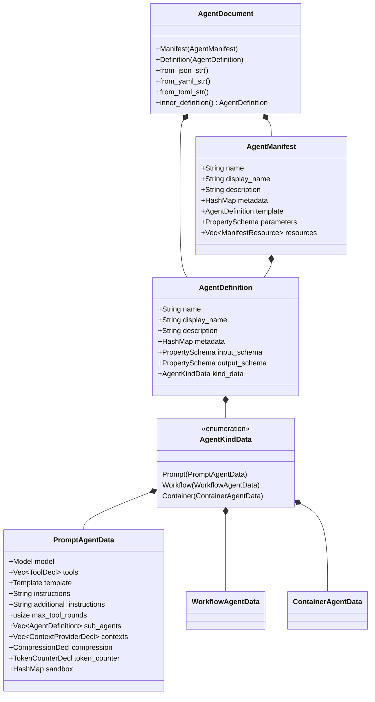
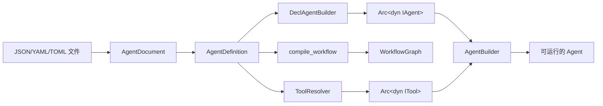

# 10.3 声明式 Agent/Workflow 配置

`rust-agent-decl` crate 提供了基于 JSON、YAML 和 TOML 格式的声明式 Agent 与 Workflow 定义系统，与 Microsoft Agent Framework (MAF) AgentSchema v1.0 完全兼容。

## 核心类型体系



### AgentDocument — 顶层文档类型

`AgentDocument` 是一个 `#[serde(untagged)]` 枚举，可以接受两种形式：

- **Manifest**：完整的部署清单，包含模板和参数
- **Definition**：裸 Agent 定义，无 Manifest 包装

```rust
pub enum AgentDocument {
    Manifest(AgentManifest),
    Definition(AgentDefinition),
}
```

解析时，先检测是否存在 `template` 字段来判断是否为 Manifest，否则回退为 Definition。

### AgentDefinition — Agent 统一定义

`AgentDefinition` 是所有 Agent 类型的统一载体，通过 `kind` 字段区分具体类型：

- `"prompt"` → `PromptAgentData`：基于 LLM 提示词的智能体
- `"workflow"` → `WorkflowAgentData`：工作流编排智能体
- `"hosted"` → `ContainerAgentData`：托管/容器化智能体

### PromptAgentData — 提示词 Agent

这是最常用的 Agent 类型，包含：

- **model**：LLM 模型配置（Model 结构体，包含 id、connection、options）
- **tools**：工具声明列表（ToolDecl，支持 7 种 MAF 工具类型）
- **template**：提示词模板配置（Template 结构体）
- **instructions**：系统指令文本
- **max_tool_rounds**：最大工具调用轮数（默认 10）
- **contexts**：声明式上下文提供器（memory/skills/workspace/knowledge/wiki 等）
- **compression** / **tokenCounter**：消息压缩策略（框架扩展，见 [3.5 压缩策略](../03-agent-engine/compression-strategies.md)）
- **sandbox**：Agent 级代码沙箱默认（`kind: code` 工具继承）

## 多格式支持

通过 Cargo feature flags 控制格式支持：

```toml
[dependencies]
rust-agent-decl = { version = "0.1", features = ["json", "yaml", "toml"] }
```

| Feature | 格式 | 依赖 |
|---------|------|------|
| `json` (默认) | JSON | serde_json |
| `yaml` | YAML | serde_yaml |
| `toml` | TOML | toml |
| `rhai` | Rhai 工作流/条件表达式 | rust-agent-rhai |
| `web` | Web 搜索工具 | rust-agent-websearch |
| `rag` | RAG 知识库上下文 | rust-agent-rag |
| `wiki` | Wiki 知识库上下文 | rust-agent-wiki |
| `openapi` | OpenAPI HTTP 工具 | rust-agent-openapi |
| `openapi-validate` | OpenAPI 响应 JSON Schema 校验 | rust-agent-openapi/validate |
| `sandbox` | 内置 code_interpreter 沙箱 | rust-agent-sandbox |
| `sandbox-docker` | Docker/Podman 沙箱后端 | rust-agent-sandbox/docker |
| `sandbox-wasm` | WASM 沙箱后端 | rust-agent-sandbox/wasm |
| `mustache` | Mustache 模板 | mustache |

### 代码沙箱（`kind: code` / `ExecuteCode`）

```yaml
# Agent 工具
tools:
  - kind: code
    name: code_interpreter
    config:
      backend: docker    # process | container | docker | podman | wasm
      timeout_secs: 60
      memory_limit: 512m
      cpus: "1.0"
      pids_limit: 128
      default_language: python

# Workflow 级默认 + ExecuteCode 动作
sandbox:
  backend: process
  timeout_secs: 30
trigger:
  kind: OnConversationStart
  id: start
  actions:
    - kind: ExecuteCode
      code: print("hello")
      language: python
      output:
        result: Local.stdout
```

### 解析示例

**JSON 格式**：

```rust
use rust_agent_decl::AgentDocument;

let doc = AgentDocument::from_json_file("agents/coding-agent.json")?;
let def = doc.inner_definition();
```

**YAML 格式**（需启用 `yaml` feature）：

```rust
let yaml = r#"
kind: prompt
name: coding-agent
model:
  id: agnes-2.0-flash
  connection:
    kind: key
    api_key: $AGNES_API_KEY
instructions: 你是一个资深软件工程师。
tools:
  - kind: function
    name: read_file
    description: 读取文件内容
"#;

let doc = AgentDocument::from_yaml_str(yaml)?;
```

**TOML 格式**（需启用 `toml` feature）：

```rust
let doc = AgentDocument::from_toml_file("agents/agent.toml")?;
```

## ToolResolver — 工具解析器

`ToolResolver` 负责将声明式工具定义解析为运行时的 `Arc<dyn ITool>` 实例。

### 支持的 MAF 工具类型（ToolResolver）

| 工具类型 | 状态 | 说明 |
|---------|------|------|
| `function` / `file` / `shell` / `web` | ✅ 已实现 | 内置框架工具 |
| `code` | ✅ 已实现 | `code_interpreter`（需 `sandbox` feature，见 [13.9 代码沙箱](../13-extensions/sandbox.md)） |
| `custom` | ✅ 需注册工厂 | `with_tool()` / `register_factory()` |
| `mcp` | ✅ 已实现 | `rust-agent-mcp`，需预先 `register_mcp_server()` |
| `openapi` | ✅ 已实现 | OpenAPI 3.x → HTTP 工具（需 `openapi` feature，见 [13.10](../13-extensions/openapi.md)） |
| `file_search` | ❌ 未实现 | 需向量存储集成 |

### 使用示例

```rust
use rust_agent_decl::{ToolResolver, ToolDecl};

let mut resolver = ToolResolver::new();

// 注册自定义工具工厂
resolver.register_factory("my_tool", |config| {
    // 从配置创建自定义工具
    let param = config.get("param").and_then(|v| v.as_str());
    Ok(Arc::new(MyCustomTool::new(param)))
});

// 解析工具声明
let tools = resolver.resolve_all(&agent_def.tools).await?;
```

### MCP 工具解析

对于 `kind: mcp` 类型的工具声明，需要先注册 MCP 服务器：

```rust
use rust_agent_mcp::{McpServerClient, McpConnectionOptions};

// 连接并注册 MCP 服务器
let server = McpServerClient::connect(
    McpConnectionOptions::stdio("mcp-filesystem-server", vec!["/work"]),
).await?;
resolver.register_mcp_server("stdio://filesystem-server", server);

// 现在 YAML 中声明的 mcp 工具可以正常解析
// tools:
//   - kind: mcp
//     name: read_file
//     server_url: "stdio://filesystem-server"
//     tool_name: read_file
let tools = resolver.resolve_all(&agent_def.tools).await?;
```

## kind 字段溯源：声明式与运行时的双向映射

声明式配置中的 `kind` 字段并非凭空定义，而是与 RAF 运行时的 trait 方法**双向绑定**：

### tools 节点的 kind 映射

`tools` 列表中每个工具的 `kind` 值**来源于 `ITool::kind()` 的返回值**。由 `#[tool(kind = "xxx")]` 宏属性在编译期注入：

| YAML/JSON `kind` | `ITool::kind()` 返回值 | 来源 | 说明 |
|---|---|---|---|
| `function` | `"function"` | `#[tool(kind = "function")]` | 用户注册的函数工具，**description 必须在 YAML 中提供** |
| `custom` | `"custom"` | `#[tool(kind = "custom")]` | 工厂注册的自定义工具，**description 必须在 YAML 中提供** |
| `web` | `"web"` | `#[tool(kind = "web")]` | 网络搜索/抓取工具，description 由宏内置 |
| `file` | `"file"` | `#[tool(kind = "file")]` | 文件系统工具（11 个），description 由宏内置 |
| `shell` | `"shell"` | `#[tool(kind = "shell")]` | Shell 命令执行，description 由宏内置 |
| `skills` | `"skills"` | `#[tool(kind = "skills")]` | 技能加载和资源工具，description 由宏内置 |
| `code` | `"code"` | `#[tool(kind = "code")]` | 代码解释器/沙箱，description 由宏内置 |
| `mcp` | `"mcp"` | MCP 工具实现 | MCP 远程工具，description 由 MCP 服务器提供 |
| `openapi` | `"openapi"` | OpenAPI 工具实现 | OpenAPI 规范工具 |

### 关键规则：何时需要写 description

| 工具类别 | `description` 字段 | 原因 |
|---|---|---|
| `web` / `file` / `shell` / `skills` / `code` | **无需配置** | `#[tool]` 宏在编译期硬编码了 description，`ToolResolver` 创建的实例自带描述 |
| `function` / `custom` | **必须在 YAML 中提供** | 这两个类别由用户定义，没有内建描述 |
| `mcp` | **无需配置** | 描述由远程 MCP 服务器的 `tools/list` 响应提供 |

```yaml
# 正确：内置工具只需 name，description 由代码内建
tools:
  - kind: file
    name: read_file            # ✅ 无需 description
  - kind: web
    name: web_search           # ✅ 无需 description

# 正确：自定义工具必须提供 description
tools:
  - kind: function
    name: echo
    description: 将输入文本原样返回   # ✅ 必须提供
  - kind: custom
    name: weather_lookup
    description: 查询指定城市的天气   # ✅ 必须提供
```

### contexts 节点的 kind 映射

`contexts` 列表中每个提供器的 `kind` 值**来源于 `IContextProvider::kind()` 的返回值**：

| YAML/JSON `kind` | `IContextProvider::kind()` 返回值 | 运行时 Provider |
|---|---|---|
| `memory` | `"memory"` | `SkillMemoryContextProvider` |
| `skills` | `"skills"` | `AgentSkillsProvider` |
| `mcp` | `"mcp"` | MCP Context Provider |
| `workspace` | `"workspace"` | `WorkspaceContextProvider` |
| `knowledge` | `"knowledge"` | RAG Knowledge Provider |
| `wiki` | `"wiki"` | Wiki Knowledge Provider |

> **注意**：`history`（对话历史管理）由 `AgentBuilder` 内置自动注入 `InMemoryHistoryProvider`（kind = `"history"`），无需在 `contexts` 中声明。`websearch` 属于工具（`tools → kind: web`），不在此处配置。

### 扩展自定义 kind

如果你实现了 `IContextProvider` 并覆写了 `kind()` 返回自定义值，可以在 YAML 中通过 `with_context()` 注入：

```rust
struct MyCustomProvider;

impl IContextProvider for MyCustomProvider {
    fn kind(&self) -> &str { "my_custom_kind" }  // 自定义 kind
    // ...
}

// 声明式构建时注入
let agent = DeclAgentBuilder::new()
    .from_yaml_file("agent.yaml")
    .with_context(Arc::new(MyCustomProvider))
    .build().await?;
```

## 便捷函数

### `DeclAgentBuilder` — 推荐入口

从 YAML/JSON/TOML 加载并构建 Agent，支持运行时覆盖、命名连接注册和沙箱默认：

```rust
use rust_agent_decl::DeclAgentBuilder;

let agent = DeclAgentBuilder::new()
    .from_yaml_file("agents/my-agent.yaml")
    .with_api_key(&std::env::var("OPENAI_API_KEY")?)
    .with_connection("shared-openai", /* Connection */)
    .build()
    .await?;
```

等价的一行快捷方式：

```rust
let agent = DeclAgentBuilder::quick("agents/my-agent.yaml").await?;
```

> **`AgentResolver` / `quick_agent()`** 仍可用但已标记 `deprecated`，新代码请使用 `DeclAgentBuilder`。

## 完整的声明式配置示例

### JSON 配置

```json
{
    "kind": "prompt",
    "name": "coding-assistant",
    "description": "代码助手智能体",
    "model": {
        "id": "agnes-2.0-flash",
        "connection": {
            "kind": "key",
            "api_key": "$AGNES_API_KEY"
        },
        "options": {
            "temperature": 0.3,
            "maxTokens": 4096
        }
    },
    "instructions": "你是资深软件工程师，专注于代码生成和审查。",
    "tools": [
        {
            "kind": "function",
            "name": "read_file",
            "description": "读取文件内容"
        },
        {
            "kind": "function",
            "name": "write_file",
            "description": "写入文件内容"
        },
        {
            "kind": "function",
            "name": "run_command",
            "description": "执行 Shell 命令"
        },
        {
            "kind": "web_search"
        }
    ],
    "maxToolRounds": 15,
    "subAgents": [
        {
            "kind": "prompt",
            "name": "code-reviewer",
            "model": {
                "id": "agnes-2.0-flash",
                "connection": {
                    "kind": "key",
                    "api_key": "$AGNES_API_KEY"
                }
            },
            "instructions": "你是代码审查专家。",
            "tools": []
        }
    ]
}
```

### 通过 DeclAgentBuilder 加载

```rust
use rust_agent_decl::{AgentDocument, DeclAgentBuilder};

async fn bootstrap() -> anyhow::Result<Arc<dyn IAgent>> {
    DeclAgentBuilder::from_file("config/agent.json")
        .build()
        .await
        .map_err(Into::into)
}
```

## 架构设计



声明式配置系统的设计使得 RF 框架既能通过 Rust 代码进行强类型配置，也能通过外部配置文件实现热加载和动态部署。
