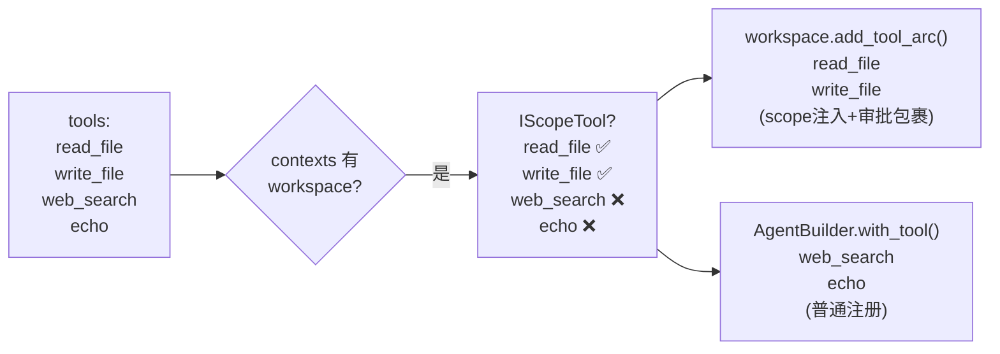
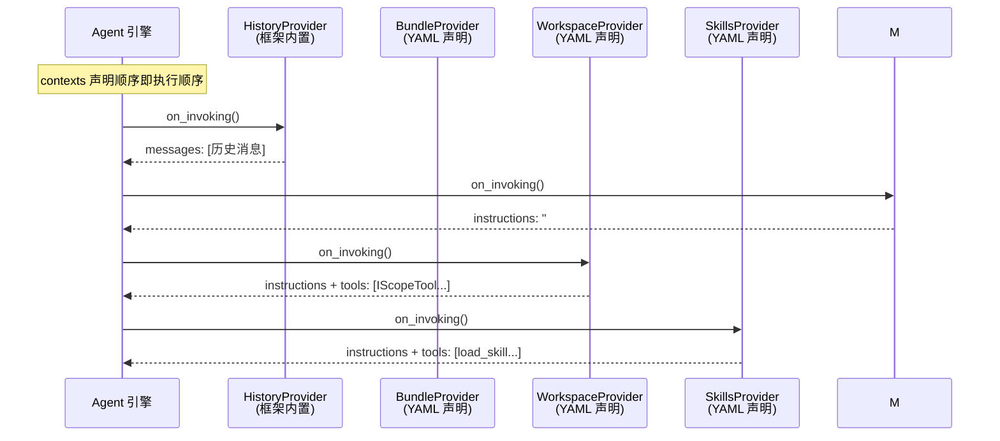

# 声明式配置中的组件联动规则

## 概述

RAF 框架中多个组件之间存在自动联动关系。理解这些规则对于正确编写声明式配置至关重要——否则配置看似正确，实际行为却与预期不符。

本文涵盖 `DeclAgentBuilder` 路径下所有已知的联动规则，说明各组件的注册顺序、路由策略和交互行为。

---

## 规则 0：Decl 扩展模式（按需启用 feature）

`rust-agent-decl` 核心仅链接 `core` + `client` + `framework` + `workflow`。可选集成通过 Cargo feature 启用，**调用方只引入所需扩展**：

```toml
# 宿主服务 — 最小依赖
rust-agent-decl = { path = "../decl" }

# CLI 全功能
rust-agent-decl = { path = "../decl", features = ["yaml", "web", "mcp", "sandbox", "openapi"] }
```

| 声明 | 所需 feature | 构建入口 |
|------|-------------|---------|
| `kind: web` 工具 | `web` | `ToolResolver` |
| `kind: mcp` 工具/上下文 | `mcp` | `ToolResolver` + `AgentBuilderMcpExt` |
| `kind: knowledge` | `rag` | `ext::context::build_provider_from_decl` |
| `kind: wiki` | `wiki` | `ext::context::build_provider_from_decl` |
| `kind: code` | `sandbox` | `sandbox_factory` |
| `kind: bundle` / `skills` / `workspace` | （内置） | `ext::context` |

代码注入扩展使用 `DeclAgentBuilder::with_context()` 或 `AgentBuilderMcpExt`（需 `mcp` feature），无需修改 decl 核心。

---

## 规则 1：Workspace + IScopeTool 工具自动路由

### 规则说明

当 `contexts` 中包含 `kind: workspace` 时，`DeclAgentBuilder` 会自动筛选 `tools` 中实现了 `IScopeTool` 的工具，将其路由到 `WorkspaceContextProvider::add_tool_arc()` 注册，而非直接注册到 `AgentBuilder`。

### 触发条件

```yaml
contexts:
  - kind: workspace
    name: my-workspace
    config:
      root: /project
      policy: approve               # 任意 policy 值均触发路由
```

### 路由行为



### 什么是 IScopeTool

以下 11 个内置工具实现了 `IScopeTool` trait，会被 workspace 自动接管：

| 工具 | scope 用途 |
|------|-----------|
| `read_file` | 读取路径安全校验 |
| `write_file` | 写入路径安全校验 |
| `edit_file` | 编辑路径安全校验 |
| `list_files` | 列出目录安全校验 |
| `inspect_file` | 文件检查安全校验 |
| `make_directory` | 创建目录安全校验 |
| `remove_path` | 删除路径安全校验 |
| `move_file` | 移动路径安全校验（源 + 目标） |
| `find_files` | 搜索路径安全校验 |
| `search_file` | 内容搜索路径安全校验 |
| `run_command` | 命令执行 + 路径上下文 |

其他工具（`web_search`、`web_fetch`、`function`、`custom`、`mcp`、`openapi`）不实现 `IScopeTool`，不受 workspace 约束。

### add_tool_arc 的两步处理

每个被路由到 workspace 的工具会经历两步处理：

```rust
// 框架内部 — WorkspaceContextProvider::add_tool_arc()
pub fn add_tool_arc(&mut self, tool: Arc<dyn ITool>) {
    let mut tool = tool;

    // Step 1: scope 注入
    // 通过 AsAny 下转型调用 create_scoped()，将 WorkspaceScope 绑定到工具
    if let Some(scoped) = try_inject_scope(&tool, Arc::clone(&self.scope)) {
        tool = scoped;  // 现在 tool 能感知工作区边界
    }

    // Step 2: 审批包裹（取决于 ScopePolicy）
    if self.scope.policy == ScopePolicy::ApproveOutside {
        tool = Arc::new(ApprovalRequiredTool::new(tool));
        // 现在 tool 在执行前会触发 HITL 审批
    }

    self.tools.push(tool);
}
```

### ScopePolicy 路由结果

| YAML policy 值 | ScopePolicy | 工具获得的能力 |
|---|---|---|
| `read` / `allow` / `allow_all` | `AllowAll` | scope 感知 + 无限制执行 |
| `approve` / `ask` / `approve_outside` | `ApproveOutside` | scope 感知 + 越界触发审批 |
| `deny` / `restrict` / `deny_outside` | `DenyOutside` | scope 感知 + 越界工具级拒绝 |

### 手动覆盖（混合模式）

如果需要将某个 IScopeTool 工具排除在 workspace 管理之外，使用 `with_tool()` 代码注入：

```rust
let agent = DeclAgentBuilder::new()
    .from_yaml_file("agent.yaml")        // YAML 只声明 web 工具
    .with_tool("my_scoped_tool", |_| {   // 代码注入不受 workspace 路由影响
        Ok(Arc::new(RunCommand::default()))
    })
    .build()
    .await?;
```

---

## 规则 2：Skills + LoadSkillTool / ReadSkillResourceTool

### 规则说明

`AgentSkillsProvider` 作为 `IContextProvider`，在其 `on_invoking()` 方法中通过 `ContextResult.tools` 注入 `load_skill` 和 `read_skill_resource` 两个工具。这两个工具不需要在 YAML 的 `tools` 段中声明。

### 自动注入的工具

```rust
// AgentSkillsProvider::build_tools() 内部
pub fn build_tools(&self) -> Vec<Arc<dyn ITool>> {
    let mut tools = vec![
        self.create_load_skill_tool(),       // 加载技能
    ];
    // 仅当技能目录包含 references/ 或 assets/ 子目录时才注入
    if self.skills.iter().any(|s| s.has_resources()) {
        tools.push(self.create_read_resource_tool());  // 读取资源
    }
    tools
}
```

### 配置示例

```yaml
contexts:
  - kind: skills
    name: code-review
    config:
      directory: skills/code-review

tools:
  - kind: file
    name: read_file
  # load_skill 和 read_skill_resource 不需要声明——
  # AgentSkillsProvider 会在运行时自动注入
```

### 与 workspace 的交互

```yaml
contexts:
  - kind: workspace
    name: project
    config:
      root: .
      policy: approve
  - kind: skills
    name: code-review
    config:
      directory: skills/code-review

tools:
  - kind: file
    name: read_file          # IScopeTool → workspace 管理
  - kind: file
    name: write_file         # IScopeTool → workspace 管理
  # load_skill + read_skill_resource → AgentSkillsProvider 自动注入
  # 它们不实现 IScopeTool，不受 workspace 影响
```

> **要点**：Skills 注入的工具不会经过 `WorkspaceContextProvider::add_tool_arc()`，因为它们在 Provider 执行时才动态创建。如果你需要在 workspace 中约束技能工具的行为，应在 `SKILL.md` 中明确指令。

---

## 规则 3：Memory Context + History Provider 的隐式注册

### 规则说明

`InMemoryHistoryProvider`（kind = `"history"`）由 `AgentBuilder` **内置自动注入**，无需在 `contexts` 中声明。它的 `on_invoking()` 将 Session 中的历史消息注入到消息列表。

```rust
// AgentBuilder::new() 默认行为
context_providers: vec![
    Arc::new(InMemoryHistoryProvider::new())  // 始终存在
]
```

### OKF 知识包（bundle）是独立组件

`BundleProvider`（`kind: bundle`, `name: knowledge-bundle`）**需要显式声明**，负责跨会话的 OKF 持久知识包存储与 Curator 整理。

```yaml
contexts:
  - kind: bundle
    name: knowledge-bundle
    config:
      directory: logs/knowledge-bundle
      consolidationInterval: 3
  # history 由框架自动注入，无需声明
```

### Provider 执行顺序



> **要点**：`contexts` 数组中的声明顺序即 Provider 执行顺序。靠后的 Provider 可以通过 `replace_messages = true` 覆盖前面的消息。

---

## 规则 4：FunctionInvokingChatClient 自动包裹

### 规则说明

`AgentBuilder::build()` 在检测到有工具注册时，**自动**将传
入的 `IChatClient` 包裹在 `FunctionInvokingChatClient` 装饰器中：

```rust
// AgentBuilder::build() 内部
let pipeline_client = if !self.tools.is_empty() {
    ChatClientBuilder::new()
        .leaf(leaf)
        .use_decorator(Box::new(move |inner| {
            Arc::new(FunctionInvokingChatClient::new(inner, tools.clone())
                .with_max_rounds(max_rounds))
        }))
        .build()?
} else {
    leaf  // 无工具时不包裹
};
```

### 影响

- 如果 YAML 中 `tools` 不为空，Agent 会自动获得工具调用循环能力
- `maxToolRounds` 控制最大调用轮数（默认 10）
- `FunctionInvokingChatClient` 在每次工具调用前检查 `requires_approval()`

---

## 规则 5：ApprovalRequiredTool 的识别与触发

### 规则说明

`FunctionInvokingChatClient` 在执行工具前检测 `tool.requires_approval()`：

```rust
// FunctionInvokingChatClient 内部的执行流程
if tool.requires_approval() {
    // 暂停流，发出 ToolApprovalRequest 事件
    yield AgentResponseUpdate::ToolApprovalRequest { call_id, name, arguments, ... };
    return FinishReason::AwaitingApproval;
} else {
    // 自动执行
    let result = tool.execute(arguments).await;
    yield AgentResponseUpdate::ToolCalled(result);
}
```

### 哪些工具会触发审批

| 场景 | requires_approval() |
|------|:---:|
| 普通 `ITool` 实例 | `false` |
| `ApprovalRequiredTool` 包裹 | `true` |
| Workspace 中 `policy: approve` 的 IScopeTool | `true` |
| Workspace 中 `policy: read` 的 IScopeTool | `false` |
| Workspace 中 `policy: deny` 的 IScopeTool | `false`（工具级拒绝） |

### 与 DenyOutside 的区别

`ApproveOutside` 和 `DenyOutside` 行为不同，不要混淆：

| 策略 | 拒绝层面 | 方式 |
|------|---------|------|
| `ApproveOutside` | Provider 层 | `ApprovalRequiredTool` 触发审批流，用户可以批准或拒绝 |
| `DenyOutside` | 工具层 | `resolve_safe()` 返回 `OutsideScope` 后工具直接 `return ToolResult::error(...)` |

---

## 规则 6：ToolResolver 的 name-expansion（名称展开）

### 规则说明

当 `ToolDecl` 的 `name` 字段为 `None`（不指定名称）时，`ToolResolver` 自动将该分类下的**全部工具**注册：

```yaml
tools:
  - kind: web           # name 未指定 → 注册 web_search + web_fetch 全部
  - kind: file          # name 未指定 → 注册全部 11 个文件工具
```

### 展开结果

```rust
// ToolResolver::resolve_category() — kind: web
vec![
    Arc::new(WebSearch),
    Arc::new(WebFetch),
]

// ToolResolver::resolve_category() — kind: file
vec![
    Arc::new(ReadFile::default()),
    Arc::new(WriteFile::default()),
    Arc::new(EditFile::default()),
    Arc::new(ListFiles::default()),
    Arc::new(InspectFile::default()),
    Arc::new(MakeDirectory::default()),
    Arc::new(RemovePath::default()),
    Arc::new(MoveFile::default()),
    Arc::new(FindFiles::default()),
    Arc::new(SearchFile::default()),
    Arc::new(RunCommand::default()),
]
```

### 与 workspace 路由的交互

name-expansion 发生在 tool resolution 阶段，之后 workspace 的路由规则对展开后的全部工具生效：

```yaml
contexts:
  - kind: workspace
    name: proj
    config: { root: ., policy: approve }

tools:
  - kind: file        # 无 name → 展开为 11 个工具
```

展开和路由结果：

| 步骤 | 结果 |
|------|------|
| ToolResolver 展开 | 11 个 `Arc<dyn ITool>` |
| partition_scope_tools | 全部 11 个都是 IScopeTool → `scope_tools` |
| workspace.add_tool_arc | 全部 11 个获得 scope 注入 + 审批包裹 |

---

## 规则 7：压缩策略的消息替换

### 规则说明

Provider 链中靠后的 Provider 可通过 `ContextResult::replace_messages = true` **替换**前面 Provider 累积的消息列表：

```rust
// 压缩 Provider 示例
async fn on_invoking(&self, agent: &dyn IAgent, session: &dyn ISession, ...) -> Result<ContextResult> {
    let history = session.get_messages().await?;
    let compressed = self.strategy.compress(&history);

    Ok(ContextResult {
        messages: compressed,        // 用压缩后的消息替换
        replace_messages: true,      // ← 替换前面所有累积的消息
        ..Default::default()
    })
}
```

### Provider 顺序影响

```yaml
contexts:
  - kind: bundle          # 1. 先注入知识包摘要
    name: knowledge-bundle
  - kind: workspace       # 2. 注入工作区边界
  - kind: skills          # 3. 注入技能工具
    # 若要压缩，应将 CompressionProvider 放在靠后位置
```

---

## 规则汇总速查表

| 规则 | 触发条件 | 行为 | 影响 |
|------|---------|------|------|
| **IScopeTool 路由** | `contexts` 含 `workspace` | 11 个 IScopeTool 走 `workspace.add_tool_arc()` | scope 注入 + 审批包裹 |
| **Skills 工具注入** | `contexts` 含 `skills` | 运行时动态注入 `load_skill` + `read_skill_resource` | 无需在 `tools` 中声明 |
| **History 自动注册** | 所有 Agent | `AgentBuilder` 内置 `InMemoryHistoryProvider` | 始终存在，无需声明 |
| **FunctionInvokingChatClient** | `tools` 不为空 | 自动包裹 ChatClient | 工具调用循环 |
| **name-expansion** | `tools` 中某 `kind` 无 `name` | `ToolResolver` 展开为全部同类工具 | 一行注册多个工具 |
| **压缩替换** | Provider 设 `replace_messages = true` | 丢弃前面的消息 | 控制 token 预算 |
| **Provider 顺序** | `contexts` 数组顺序 | 即 on_invoking() 执行顺序 | 后执行的 Provider 可覆盖前面 |
| **Bundle 持久化** | `contexts` 含 `bundle` | `BundleProvider` + Curator 在对话后整理知识包 | `consolidationInterval` 次对话触发一次 |

---

## 下一步

- 了解 workspace + tools 的完整联动教程 → [8.5 声明式工作区配置与工具联动](../08-workspace-management/declarative-workspace.md)
- 查阅所有可配置字段的完整参考 → [10.5 配置字段完全参考](../10-macros-declarative/config-reference.md)
- 了解声明式 Agent 的实战教程 → [10.6 声明式 Agent 配置实战教程](../10-macros-declarative/declarative-tutorial.md)
