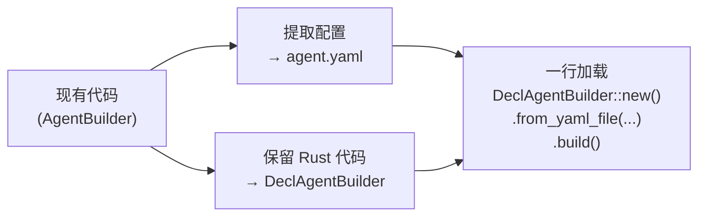

# 附录：AgentBuilder 到 DeclAgentBuilder 迁移指南

本文档提供从手写 `AgentBuilder` 代码到声明式 `DeclAgentBuilder` 配置的迁移对照。适合已经用 `AgentBuilder` 构建了 Agent，希望将其配置外部化以便于维护和部署的场景。

## 迁移步骤概览



## 详细对照

### 模型配置

**AgentBuilder（手写）**：

```rust
use rust_agent_client::OpenAiChatClient;

let client = OpenAiChatClient::from_key(
    &std::env::var("AGNES_API_KEY").unwrap(),
    "agnes-2.0-flash",
)?;

let agent = AgentBuilder::new("my-agent")
    .chat_client(client)
    .instructions("你是一个助手。")
    .build()?;
```

**DeclAgentBuilder（声明式 YAML）**：

```yaml
# agent.yaml
kind: prompt
name: my-agent
model:
  id: agnes-2.0-flash
  provider: openai
  connection:
    kind: key
    api_key: $AGNES_API_KEY
    endpoint: https://apihub.agnes-ai.com/v1
instructions: 你是一个助手。
```

```rust
let agent = DeclAgentBuilder::new()
    .from_yaml_file("agent.yaml")
    .build()
    .await?;
```

### 工具注册：内置工具

**AgentBuilder**：

```rust
use rust_agent_framework::tools::{ReadFile, WriteFile, RunCommand};

let agent = AgentBuilder::new("file-agent")
    .chat_client(client)
    .with_tool(ReadFile { scope: None })
    .with_tool(WriteFile { scope: None })
    .with_tool(RunCommand { scope: None, timeout_secs: Some(30) })
    .build()?;
```

**DeclAgentBuilder**：

```yaml
tools:
  - kind: file
    name: read_file
  - kind: file
    name: write_file
  - kind: file
    name: run_command
```

### 工具注册：自定义工具

**AgentBuilder**：

```rust
#[tool(description = "Echoes back the input text")]
struct Echo;

impl Echo {
    async fn call(&self, arguments: serde_json::Value) -> Result<ToolResult> {
        // ...
    }
}

let agent = AgentBuilder::new("echo-agent")
    .chat_client(client)
    .with_tool(Echo)
    .build()?;
```

**DeclAgentBuilder**：

```yaml
tools:
  - kind: function
    name: echo
    description: Echoes back the input text
```

```rust
let agent = DeclAgentBuilder::new()
    .from_yaml_file("agent.yaml")
    .with_tool("echo", |_| Ok(Arc::new(Echo)))
    .build()
    .await?;
```

### 工作区管理

**AgentBuilder**：

```rust
use rust_agent_core::{WorkspaceScope, ScopePolicy};

let scope = Arc::new(WorkspaceScope::new("/project", "my-project")
    .with_policy(ScopePolicy::ApproveOutside));

let workspace = WorkspaceContextProvider::new(scope)
    .add_tool(ReadFile::default())
    .add_tool(WriteFile::default())
    .add_tool(RunCommand::default());

let agent = AgentBuilder::new("workspace-agent")
    .chat_client(client)
    .add_context_provider(workspace)
    .build()?;
```

**DeclAgentBuilder**：

```yaml
contexts:
  - kind: workspace
    name: my-project
    config:
      root: /project
      policy: approve

tools:
  - kind: file
    name: read_file
  - kind: file
    name: write_file
  - kind: file
    name: run_command
```

### 上下文提供器

**AgentBuilder**：

```rust
use rust_agent_framework::context_providers::AgentSkillsProvider;

let skills = AgentSkillsProvider::scan("skills/code-review")?;

let agent = AgentBuilder::new("skills-agent")
    .chat_client(client)
    .add_context_provider(skills)
    .build()?;
```

**DeclAgentBuilder**：

```yaml
contexts:
  - kind: skills
    name: code-review
    config:
      directory: skills/code-review
```

### 压缩策略 & Token 计数

**AgentBuilder**：

```rust
let agent = AgentBuilder::new("agent")
    .chat_client(client)
    .with_compression_strategy(Arc::new(SlidingWindowStrategy::new(20)))
    .with_token_counter(Arc::new(EstimateCounter))
    .build()?;
```

**DeclAgentBuilder**：

压缩策略和 Token 计数器目前需通过混合模式注入（`with_context()` 传入自定义 Provider 实现压缩，或直接使用 `AgentBuilder` 构建后再手动设置）。声明式纯 YAML 支持将在后续版本中添加。

### 复合示例：多 Provider 合并

**AgentBuilder**：

```rust
let scope = Arc::new(WorkspaceScope::new("/project", "prod")
    .with_policy(ScopePolicy::ApproveOutside));

let skills = AgentSkillsProvider::scan("skills/code-review")?;
let workspace = WorkspaceContextProvider::new(scope)
    .add_tool(ReadFile::default());

let agent = AgentBuilder::new("full-agent")
    .chat_client(client)
    .add_context_provider(skills)          // 顺序 1
    .add_context_provider(workspace)       // 顺序 2
    .build()?;
```

**DeclAgentBuilder**：

```yaml
contexts:
  - kind: skills
    name: code-review
    config:
      directory: skills/code-review
  - kind: workspace
    name: prod
    config:
      root: /project
      policy: approve
```

> 声明式 `contexts` 数组中的顺序即 Provider 执行顺序。YAML 先声明的先执行。

### 运行模型切换

**AgentBuilder**：

```rust
// 切换模型需要重建 ChatClient 和 AgentBuilder
let client = OpenAiChatClient::from_key(&key, "agnes-2.0-flash")?;
let agent = AgentBuilder::new("agent")
    .chat_client(client)
    .build()?;
```

**DeclAgentBuilder**：

```rust
// 覆盖 YAML 中的模型，无需修改配置文件
let agent = DeclAgentBuilder::new()
    .from_yaml_file("agent.yaml")
    .with_model("agnes-2.0-flash")
    .build()
    .await?;
```

## 混合模式：YAML + 代码注入

不是所有配置都能/应放在 YAML 中。以下场景更适合混合模式：

```rust
let agent = DeclAgentBuilder::new()
    .from_yaml_file("agent.yaml")          // YAML 基础配置
    .with_api_key(&env_key)                 // 运行时注入 API Key
    .with_model("agnes-2.0-flash")        // 运行时切换模型
    .with_context(Arc::new(custom_prov))    // 注入 YAML 不支持的 Provider
    .with_tool("my_tool", factory)          // 注册自定义工具工厂
    .max_tool_rounds(20)                    // 覆盖 YAML 中的 maxToolRounds
    .build()
    .await?;
```

**优先级规则**：`DeclAgentBuilder` 的运行时覆盖（`with_*` 方法）优先于 YAML 中的值。

## 常见迁移陷阱

| 陷阱 | 说明 | 解决方案 |
|------|------|---------|
| `function` 工具忘记 description | YAML 中内置工具无需 description，但 `function` 必须提供 | 添加 `description: ...` |
| `maxToolRounds` 大小写 | YAML 用 camelCase，TOML 用 snake_case | JSON: `maxToolRounds` / TOML: `max_tool_rounds` |
| ctx 种类不生效 | `mcp`/`knowledge`/`wiki` 在声明式路径需代码注入 | 使用 `with_context()` |
| YAML 缩进错误 | YAML 对缩进敏感 | 使用 yamllint 检查 |
| `$ENV_VAR` 未解析 | 运行时未设置环境变量 | 用 `with_api_key()` 覆盖 |
