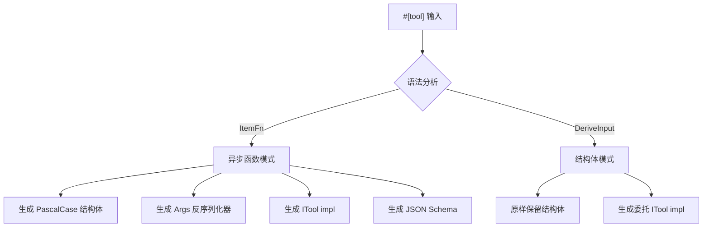

# 10.1 `#[tool]` 属性宏详解

`#[tool]` 是 RAF 框架提供的 proc-macro 属性宏，用于自动生成 `ITool` trait 的实现代码，让开发者可以专注于业务逻辑而无需手动编写 JSON Schema、参数反序列化器或样板 trait 实现。

## 架构概览

`#[tool]` 宏支持两种使用模式：



## 异步函数模式

将 `#[tool]` 应用到一个 `async fn` 上，宏会自动：

1. 将函数名转换为 PascalCase 作为工具结构体名
2. 为每个参数生成 `#[derive(Deserialize)]` 的反序列化结构体
3. 从参数类型和 `#[param]` 属性中提取 JSON Schema
4. 生成完整的 `ITool` trait 实现

### 基础示例

```rust
use rust_agent_macros::tool;

#[tool(description = "将两个数字相加")]
async fn add(
    #[param(desc = "第一个加数")] a: i64,
    #[param(desc = "第二个加数")] b: i64,
) -> rust_agent_core::ToolResult {
    rust_agent_core::ToolResult::success(serde_json::json!({
        "result": a + b
    }))
}
```

上述代码经过宏展开后生成：

```rust
// ── 参数反序列化结构体 ──
#[derive(serde::Deserialize)]
#[allow(non_snake_case)]
#[doc(hidden)]
struct AddArgs {
    pub a: i64,
    pub b: i64,
}

// ── PascalCase 工具结构体 ──
pub struct Add;

impl Add {
    pub async fn call(&self, a: i64, b: i64) -> rust_agent_core::ToolResult {
        // ... 用户代码体 ...
    }
}

// ── ITool 实现 ──
#[async_trait::async_trait]
impl rust_agent_core::ITool for Add {
    fn name(&self) -> &str {
        "add"  // 原始函数名
    }

    fn description(&self) -> &str {
        "将两个数字相加"
    }

    fn parameters(&self) -> serde_json::Value {
        // 自动生成的 JSON Schema
        let mut props = serde_json::Map::new();
        // ... 类型映射代码 ...
    }

    async fn execute(
        &self,
        arguments: serde_json::Value,
    ) -> rust_agent_core::Result<rust_agent_core::ToolResult> {
        let args: AddArgs = serde_json::from_value(arguments)
            .map_err(|e| rust_agent_core::AgentError::ToolError(
                format!("Argument deserialization failed: {}", e)
            ))?;
        Ok(self.call(args.a, args.b).await)
    }
}
```

### 生成规则

| 原始元素 | 生成结果 | 说明 |
|----------|---------|------|
| 函数名 `snake_case` | 结构体名 `PascalCase` | 例如 `read_file` → `ReadFile` |
| 参数 `name: Type` | `Args` 结构体字段 | 自动 `#[derive(Deserialize)]` |
| `#[param(desc = "...")]` | Schema `description` 字段 | 注入到 JSON Schema 属性中 |
| `Option<T>` 参数 | 可选参数（非 required） | `is_option_type` 检测 |
| 返回 `ToolResult` | `ITool::execute` 返回值 | 自动包装 |

### 带可选参数的工具

```rust
#[tool(description = "搜索文件系统中的文件")]
async fn search_file(
    #[param(desc = "搜索模式（glob）")] pattern: String,
    #[param(desc = "搜索起始目录")] directory: Option<String>,
    #[param(desc = "是否递归搜索")] recursive: Option<bool>,
) -> rust_agent_core::ToolResult {
    let dir = directory.unwrap_or_else(|| ".".to_string());
    let rec = recursive.unwrap_or(true);
    // ... 搜索逻辑 ...
    rust_agent_core::ToolResult::success(serde_json::json!({"matches": []}))
}
```

生成的 JSON Schema 中 `directory` 和 `recursive` 因为类型是 `Option<T>` 而不会出现在 `required` 数组中。

## 结构体模式

当 `#[tool]` 应用在结构体上时，宏假设结构体已经手动实现了 `call(&self, arguments: serde_json::Value) -> Result<ToolResult>` 方法，宏只负责生成委托的 `ITool` 实现。

### 示例

```rust
use std::sync::Arc;
use rust_agent_core::WorkspaceScope;

#[tool(description = "读取本地文件系统中的文件内容")]
pub struct ReadFile {
    scope: Option<Arc<WorkspaceScope>>,
}

impl ReadFile {
    pub async fn call(
        &self,
        arguments: serde_json::Value,
    ) -> rust_agent_core::Result<rust_agent_core::ToolResult> {
        // 手动实现参数解析和执行逻辑
        let path = arguments["path"].as_str()
            .ok_or_else(|| rust_agent_core::AgentError::ToolError("Missing path".into()))?;
        // ... 范围感知的文件读取逻辑 ...
        Ok(rust_agent_core::ToolResult::success(
            serde_json::json!({"content": "..."})
        ))
    }
}
```

宏展开生成：

```rust
#[async_trait::async_trait]
impl rust_agent_core::ITool for ReadFile {
    fn name(&self) -> &str {
        stringify!(ReadFile)  // "ReadFile"
    }

    fn description(&self) -> &str {
        "读取本地文件系统中的文件内容"
    }

    fn parameters(&self) -> serde_json::Value {
        serde_json::json!({"type": "object", "properties": {}})
    }

    async fn execute(
        &self,
        arguments: serde_json::Value,
    ) -> rust_agent_core::Result<rust_agent_core::ToolResult> {
        self.call(arguments).await
    }
}
```

结构体模式适用于需要更复杂参数校验、自定义 Schema 生成或持有内部状态（如 `WorkspaceScope`）的场景。

## 内部实现细节

### `parse_description` — 描述解析

从 `#[tool(description = "...")]` 属性中提取描述字符串。也支持 `desc` 作为 `description` 的简写别名。

```rust
fn parse_description(attr: TokenStream) -> String {
    // 解析 Meta::NameValue，检查 path 是否为 "description" 或 "desc"
    // 提取 Lit::Str 的值
}
```

### `expand_tool_fn` — 函数模式展开

核心生成逻辑分为以下步骤：

1. **命名生成**：函数名 `snake_case` → `PascalCase`（`to_pascal_case`）
2. **参数提取**：遍历 `func.sig.inputs`，提取每个参数的标识符、类型、属性和是否 Optional
3. **Schema 生成**：遍历参数生成 JSON Schema properties 代码
4. **Required 检测**：非 Option 类型的参数加入 `required` 数组
5. **Args 结构体**：为参数自动派生 `Deserialize`
6. **代码拼接**：组合以上部分成完整的 TokenStream

### `expand_tool_struct` — 结构体模式展开

更简单：保留原始结构体定义，仅添加 `ITool` trait 实现，将 `execute` 委托给 `self.call(arguments)`。

### `extract_param_desc` — 参数描述提取

从参数的 `#[param(desc = "...")]` 或 `#[param(description = "...")]` 属性中提取描述文本，注入到 JSON Schema 的 `description` 字段。

### `is_option_type` — 可选类型检测

通过检查类型路径的最后一个段是否为 `Option` 来判断参数是否可选：

```rust
fn is_option_type(ty: &syn::Type) -> bool {
    if let syn::Type::Path(type_path) = ty {
        type_path.path.segments.last()
            .map(|s| s.ident == "Option")
            .unwrap_or(false)
    } else {
        false
    }
}
```

检测结果为 `true` 的参数不会出现在 `required` 数组中。

### `rust_type_to_schema_tokens` — 类型到 Schema 转换

处理三种情况：

1. `Option<T>` — 提取内部类型，按 `T` 生成 Schema
2. `Vec<T>` — 生成 `{"type": "array", "items": <T schema>}`
3. 基本类型 — `String` → `"string"`、`i64` → `"integer"`、`f64` → `"number"`、`bool` → `"boolean"`

详细映射表请参阅 [10.2 类型映射](macro-type-mapping.md)。

## 在 Agent 中使用

```rust
use rust_agent_framework::AgentBuilder;

let agent = AgentBuilder::new("calculator")
    .chat_client(client)
    .instructions("你是一个计算助手。")
    .with_tool(Add)      // 直接传入 PascalCase 结构体实例
    .with_tool(Multiply)
    .build()?;
```

每个通过 `#[tool]` 宏定义的工具都是一个实现了 `ITool` 的零大小类型（ZST），可以直接实例化并注册到 Agent 中。
