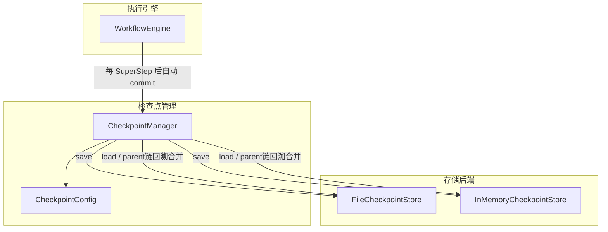
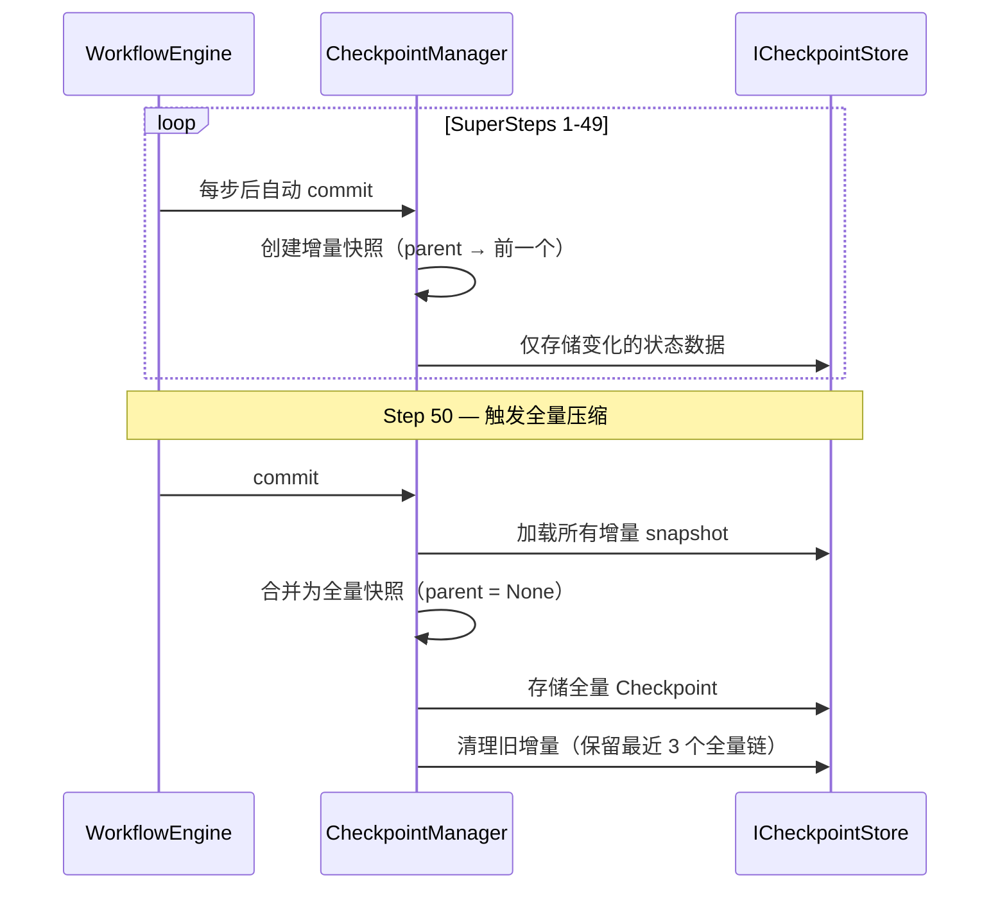

# 11.9 检查点与断点续传

RAF 的检查点（Checkpoint）系统在每轮 SuperStep 完成后自动保存工作流执行状态，支持故障恢复后从断点继续执行。增量/全量混合策略保证了持久化效率和恢复正确性。

## 检查点架构



## 核心类型

### Checkpoint — 检查点数据

```rust
pub struct Checkpoint {
    pub step_number: i32,                               // 步骤编号（-1 = 初始）
    pub graph_fingerprint: String,                      // 拓扑指纹（恢复时校验）
    pub state_data: HashMap<String, serde_json::Value>,  // 状态数据
    pub edge_state_data: HashMap<String, serde_json::Value>, // 边状态（FanIn 栅栏等）
    pub pending_messages: Vec<SerializableMessageEnvelope>,  // 未处理消息
    pub parent_checkpoint_id: Option<String>,           // 父检查点（None = 全量快照）
    pub is_full_snapshot: bool,
    pub created_at: DateTime<Utc>,
}
```

### CheckpointConfig — 检查点配置

```rust
pub struct CheckpointConfig {
    pub full_snapshot_interval: u32,  // 全量快照间隔（默认 50）
    pub max_checkpoints: usize,       // 最大保留数（默认 100）
    pub enabled: bool,                // 是否启用（默认 true）
}
```

### CheckpointInfo — 轻量元数据

```rust
pub struct CheckpointInfo {
    pub checkpoint_id: String,
    pub session_id: String,
    pub step_number: i32,
    pub parent_checkpoint_id: Option<String>,
    pub is_full_snapshot: bool,
    pub byte_size: u64,
    pub created_at: DateTime<Utc>,
}
```

## 增量 + 全量混合策略



- **增量快照**：仅记录变化的状态数据，轻量高效
- **全量快照**：包含完整状态，压缩 parent 链

恢复时从最新检查点沿 parent 链回溯到最近全量快照，合并所有层级的状态。

## 存储后端

### InMemoryCheckpointStore

开发和测试环境：

```rust
use rust_agent_workflow::{InMemoryCheckpointStore, CheckpointManager};

let store = Arc::new(InMemoryCheckpointStore::new());
let cp = Arc::new(CheckpointManager::with_default_config(store));
```

### FileCheckpointStore

生产环境持久化，使用原子写入（temp file + rename）：

```rust
use rust_agent_workflow::{FileCheckpointStore, CheckpointManager};

let store = Arc::new(FileCheckpointStore::new("./checkpoints"));
let cp = Arc::new(CheckpointManager::with_default_config(store));
```

目录结构：

```
./checkpoints/
  {session_id}/
    {checkpoint_id}.json       ← 完整检查点数据
    {session_id}_index.json    ← 元数据索引
```

## 循环状态的持久化

循环配置（`LoopOptions`）中的迭代计数作为流程变量存储在 `state_map` 中，自动序列化到 checkpoint。恢复后从断点继续迭代。

```rust
// 循环迭代变量格式
let loop_var = loop_options.loop_variable
    .unwrap_or_else(|| format!("__loop_{}", node_id));

// 在 state_map 中以 JSON 值存储：json!(current_iteration)
// 恢复时引擎读取该值，从对应迭代继续
```

## 使用示例

### 启用检查点的工作流

```rust
use rust_agent_workflow::{
    WorkflowBuilder, WorkflowEngine,
    CheckpointConfig, CheckpointManager, FileCheckpointStore,
};

let graph = WorkflowBuilder::new()
    .add_agent_node("analyze", analyzer)
    .add_agent_node("report", reporter)
    .set_start("analyze")
    .add_edge("analyze", "report")
    .with_output_from("report")
    .build()?;

let store = Arc::new(FileCheckpointStore::new("./checkpoints"));
let manager = Arc::new(CheckpointManager::with_default_config(store));

let engine = WorkflowEngine::new(graph)
    .with_checkpoint_manager(manager);

let session: Arc<dyn ISession> = Arc::new(AgentSession::with_id("workflow-1"));
let (events, outputs) = engine.run(Arc::new(input_messages), Some(session)).await?;
```

### 从检查点恢复

```rust
let session_id = "workflow-1";

// 加载完整状态
let (latest_checkpoint, merged_state) = manager
    .load_full_state(session_id)
    .await?
    .expect("检查点存在");

// 验证拓扑指纹
if latest_checkpoint.graph_fingerprint != current_fingerprint {
    return Err(anyhow!("图结构已变更，无法恢复"));
}

// 重建引擎，从检查点恢复
// 引擎自动恢复 state_map、edge_states 和 pending_messages
```

## ScopeKey — 状态隔离

检查点状态按 `(node_id, scope_name)` 隔离：

```rust
pub struct ScopeKey {
    pub node_id: String,
    pub scope_name: Option<String>,  // None = 私有, Some = 共享
}

// 私有作用域：向特定节点可见
ScopeKey::private("node_a");

// 共享作用域：多个节点可读写
ScopeKey::shared("node_a", "shared_context");

// 序列化为字符串键
// 私有: "node_id"
// 共享: "node_id::scope_name"
```

## 配置最佳实践

### 生产环境

```rust
let config = CheckpointConfig {
    full_snapshot_interval: 20,
    max_checkpoints: 200,
    enabled: true,
};
```

### 开发/测试

```rust
let store = Arc::new(InMemoryCheckpointStore::new());
// 或禁用检查点
let config = CheckpointConfig::disabled();
```

### 高性能场景

```rust
let config = CheckpointConfig {
    full_snapshot_interval: 100,  // 更大间隔，减少压缩开销
    max_checkpoints: 50,
    enabled: true,
};
```

## 注意事项

1. **图指纹校验**：恢复时校验拓扑指纹，图结构变更则拒绝恢复
2. **多 Session 隔离**：不同 Session 的检查点完全独立
3. **atomic_write**：`FileCheckpointStore` 使用 temp + rename 确保写崩溃安全
4. **自动清理**：超出 `max_checkpoints` 时自动删除最旧的检查点
5. **循环兼容**：循环迭代状态通过 `state_map` 序列化，恢复后正确继续
